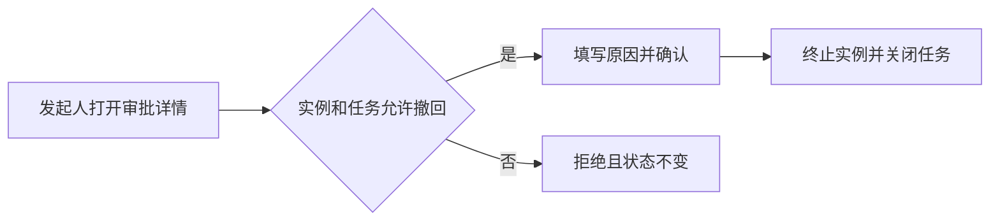

# 审批发起人撤回申请

## 业务与用户故事

已提交审批需要线下联系管理员终止，发起人无法及时纠正误提交。公司需要减少人工干预；审批管理员需要保留审计；发起人需要在尚未处理时自行撤回。本次只支持第一个审批任务处理前撤回。

1. BR-001 发起人可撤回本人尚未被处理的审批实例，撤回后实例终止且保留原因和操作者。
2. US-001 -> BR-001：前置为实例处于审批中且所有任务未处理；发起人在详情页填写原因并确认撤回；系统将实例置为已撤回并关闭任务；非发起人或已有任务处理时拒绝且状态不变。

## 系统满足方式

1. SR-001 -> US-001：详情接口对满足条件的发起人返回可撤回动作；撤回命令在同一事务内校验实例、任务和操作者，写入撤回原因与审计事件后终止实例；冲突返回 `WORKFLOW_WITHDRAW_CONFLICT`。

## 名称术语与适用图

- 系统/模块/功能：审批中心 / 流程实例模块 / 撤回申请；无简称。
- 业务术语：撤回指发起人在首个任务处理前主动终止实例，不等同于审批人退回。

## 参考规范与代码

- 规范：`rules/backend/03-api.md@1.4.0`；采用：命令接口和错误响应。
- 代码：`mango-workflow-core/.../ProcessInstanceService.java@4c91b27`；采用：扩展实例终止事务和审计写入。

## 技术设计与变更字典

1. TD-001 -> SR-001：在 core 增加撤回领域方法，数据库条件更新同时约束实例状态和未处理任务数；API 只接收实例 ID 与原因，操作者从登录上下文取得；前端根据服务端动作集展示入口。
- 变更字典：实例状态新增 `WITHDRAWN=40`；错误码新增 `WORKFLOW_WITHDRAW_CONFLICT`；审计事件新增 `PROCESS_WITHDRAWN`。

## 实施与验证

1. TASK-001 -> TD-001：修改实例领域服务、状态枚举、错误码、详情动作集和撤回按钮；完成标准是同一规则由后端强制，前端不重复推断权限。
2. VAL-001 -> SR-001：执行 core 并发测试和详情页定向浏览器用例；断言合法撤回关闭任务并留审计，审批人与发起人并发操作只成功一个；失败则停止交付并保留原状态。
- 回滚与风险：回滚代码并隐藏入口；已产生的 `WITHDRAWN` 数据保留只读展示。剩余风险是旧版消费者需把未知终态按已结束处理。
