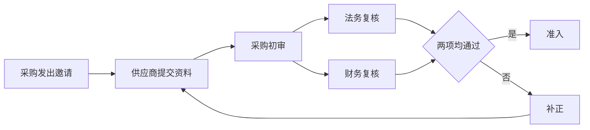
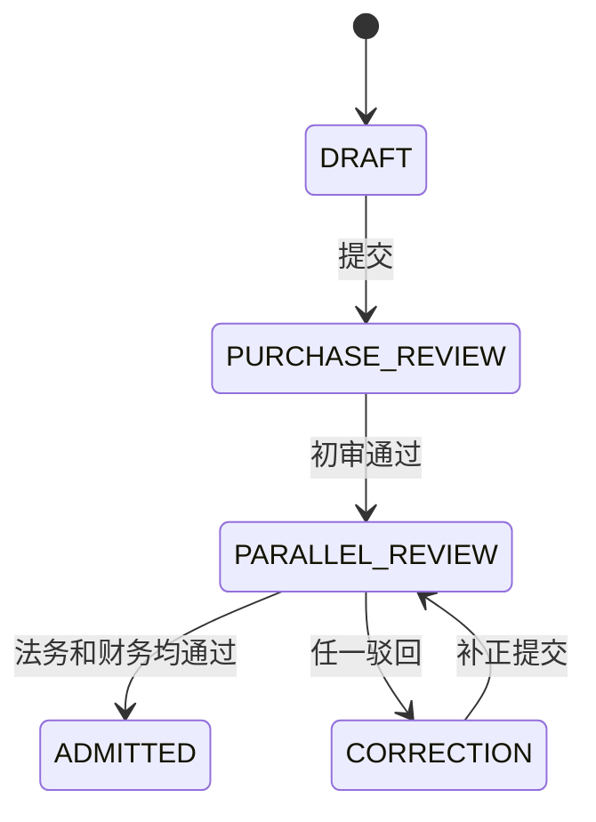

# 供应商准入系统系统需求规格

## 名称与术语

| 类型 | 标准名称 | 简称 | 定义或职责 |
|---|---|---|---|
| 系统 | 供应商准入系统 | SAS | 管理邀请、资料、审核和准入状态 |
| 模块 | 供应商申请模块 | 无 | 供应商资料提交与补正 |
| 功能 | 供应商资料提交 | 无 | 校验邀请和资料后形成申请 |
| 术语 | 补正 | 无 | 供应商按驳回意见修改资料后重新提交 |

## 系统满足方式

1. SR-001 -> US-001：采购专员创建邀请后，系统生成 7 天有效的一次性链接；供应商填写主体、联系人、证照和银行资料并提交；系统校验必填、证照有效期和邀请状态，成功后锁定本版资料并进入采购初审，失败时指出字段且不创建审核任务。
2. SR-002 -> US-002：采购通过后，系统同时创建法务和财务任务并按字段控制可见范围；两项均通过时进入准入确认，任一驳回时申请进入补正并保存意见；补正只重开受影响任务。

## 系统流程与状态数据

## 系统边界

- 本系统：邀请、资料版本、字段校验、任务、状态、权限可见范围和审计。
- 人工或外部系统：审核人判断材料真实性；企业信息核验服务返回主体存续状态，不代替审核决定。
- 权限、数据和可见范围：供应商只见本人申请；采购见全部业务资料；法务不可见银行账号；财务只见主体摘要和银行资料。

## 验收与技术引用

1. VAL-001 -> SR-001：使用有效、过期和已使用邀请提交资料；断言只有有效邀请生成单一申请和采购任务，错误响应定位字段。
2. VAL-002 -> SR-002：分别执行双通过、法务驳回、财务驳回和补正；断言状态、任务、字段可见范围及审计与规则一致。
3. TD-001 -> SR-001：技术设计承接邀请令牌、资料版本和提交原子性。
4. TD-002 -> SR-002：技术设计承接并行任务、字段权限和状态汇聚。

## 参考依据

- 规范：`供应商准入管理办法@2026.2`；采用：角色、材料和状态结果。
- 代码：`mango-workflow-core/.../ParallelTaskService.java@5d71a0c`；采用：并行任务与汇聚行为参考。
