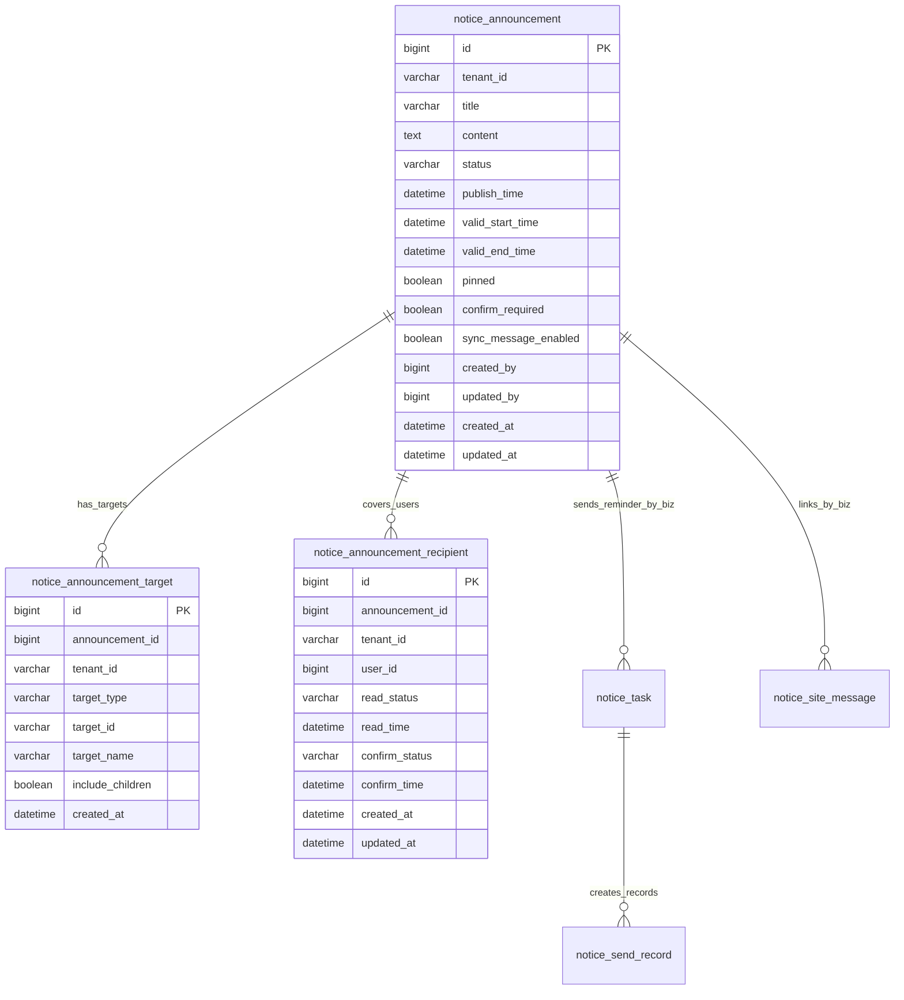
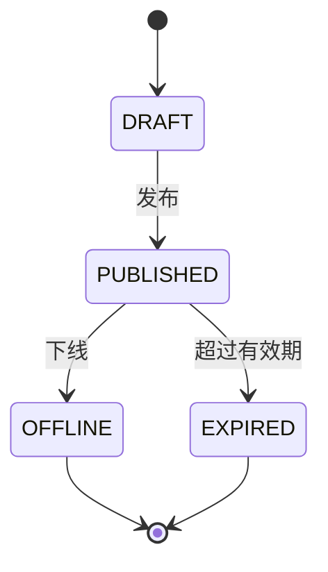
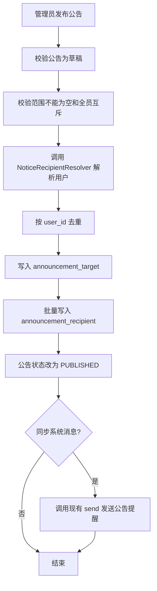
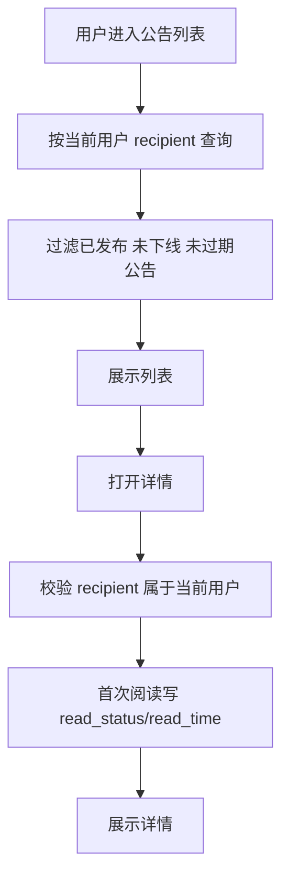
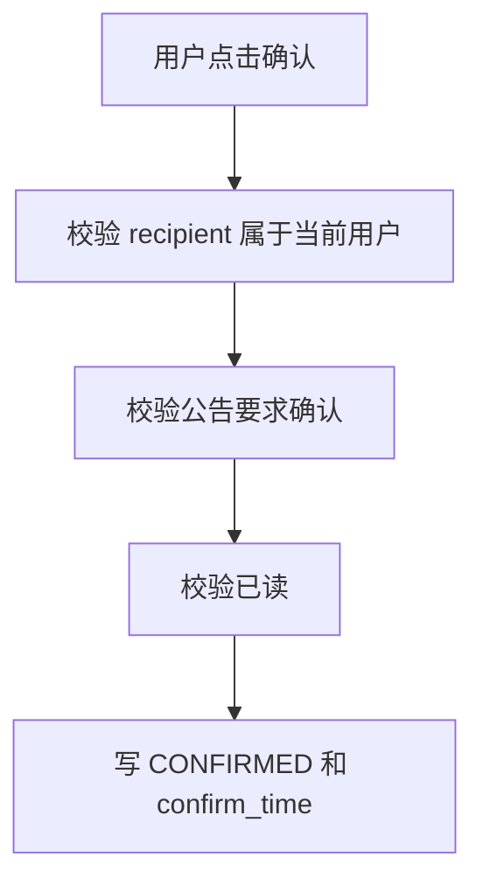

# Issue #260 通知中心公告能力详细设计

文档状态：草案
关联 Issue：<https://github.com/HardyDou/mango/issues/260>
日期：2026-06-26

## 0. 设计前检查

| 项 | 结论 |
|---|---|
| AI 动作 | WRITE |
| PRD/需求来源 | Issue #260、用户确认的 80% 主链路、实施计划 `2026-06-26-issue-260-notice-center-announcement-plan.md` |
| 阻断缺口 | 无 |
| 进入开发 | 本文和交付台账通过审阅后进入开发 |

## 1. 设计目标与范围

在现有 `mango-notice` 通知中心内新增通知公告能力，不新增独立“系统通知”模块。

本次设计覆盖：

- 管理端公告管理。
- 用户端公告列表、详情、阅读、确认。
- 全员、组织、角色、指定用户发布。
- 发布范围解析为用户级接收记录。
- 阅读、确认、统计基于用户级接收记录。
- 公告提醒复用现有系统消息发送能力。
- 通知中心菜单新增公告管理。

不覆盖：

- 追加发布范围。
- 岗位、外部用户、动态人群。
- 公告正文版本管理。
- 未读或未确认名单导出。
- 公告独立外部渠道推送。
- 全员公告异步分批或懒生成优化。

## 2. 设计输入

| 输入 | 来源 | 说明 |
|---|---|---|
| Issue #260 | GitHub Issue | 管理端/用户端边界、系统消息与公告关系。 |
| 实施计划 | `mango-docs/plans/2026-06-26-issue-260-notice-center-announcement-plan.md` | 任务拆分和约束。 |
| 现有通知中心 | `mango/mango-platform/mango-notice/**` | 复用系统消息、任务、记录、模板资源能力。 |
| 前端通知包 | `mango-ui/packages/notice/**` | 新增页面、API、类型和页面注册。 |
| PMO 规范 | `mango-pmo/rules/**` | 分层、API、数据库、菜单、前端和验收约束。 |

## 3. 影响模块与边界

| 模块/包/页面 | 路径或标识 | 改动类型 | 职责层 | 依赖方向 | 是否公共能力 |
|---|---|---|---|---|---|
| notice API | `mango-notice-api` | 新增 | 后端契约 | starter/core 依赖 api | 是 |
| notice core | `mango-notice-core` | 新增 | 后端业务和持久化 | core 依赖 api，并复用 notice 内部公共解析服务 | 是 |
| notice starter | `mango-notice-starter` | 新增/修改 | Controller、自动装配、资源声明 | starter 依赖 api/core | 是 |
| notice 菜单资源 | `notice-common-menu.json` | 修改 | Resource Registry | 后端初始化菜单 | 是 |
| notice 前端包 | `mango-ui/packages/notice` | 新增/修改 | 页面、API、类型 | package 内部 | 是 |
| README | notice 后端/前端 README | 修改 | 能力说明 | 文档 | 是 |

## 4. 关键对象

| 对象 | 对象ID口径 | 唯一性 | 租户/归属 | 核心属性 | 关联对象 | 生命周期 | 关键约束 |
|---|---|---|---|---|---|---|---|
| 公告 | `announcementId` | 全局唯一 ID | `tenant_id` | 标题、正文、状态、有效期、置顶、确认要求、同步提醒 | 发布范围、接收记录 | 草稿、已发布、已下线、已过期计算态 | 已发布正文不可改；已下线用户不可见。 |
| 发布范围 | `targetId` | 公告内多条 | `tenant_id` | 类型、目标 ID、目标名称、是否含下级 | 公告 | 随公告发布固化 | 只表示选择规则，不参与统计。 |
| 公告接收记录 | `recipientId` | `announcement_id + user_id` 唯一 | `tenant_id` | 用户、阅读状态、确认状态、时间 | 公告、用户 | 未读、已读、已确认 | 用户可见、阅读、确认、统计唯一依据。 |
| 公告提醒消息 | 现有系统消息 | 由现有消息体系保证 | `tenant_id` | `bizType`、`bizId`、标题、摘要 | 公告、发送任务、发送记录 | 沿用系统消息 | 只做提醒和跳转，不承载公告正文和确认。 |

## 5. 对象关系

关系规则：

- `notice_announcement_target` 保存管理员选择的范围，用于回显和审计。
- `notice_announcement_recipient` 保存范围解析后的用户快照，用于可见性、阅读、确认和统计。
- 同一公告同一用户只允许一条接收记录。
- `notice_task`、`notice_send_record`、`notice_site_message` 不新增字段，通过 `bizType = notice.announcement.published` 和 `bizId = announcementId` 关联公告。

## 6. 状态机

### 6.1 公告状态

| 状态 | 持久化值 | 含义 | 允许动作 | 禁止动作 |
|---|---|---|---|---|
| 草稿 | `DRAFT` | 未发布，用户不可见 | 编辑、发布、删除 | 用户查看、阅读、确认 |
| 已发布 | `PUBLISHED` | 对覆盖用户可见 | 下线、统计、用户阅读确认 | 修改正文、改写发布范围 |
| 已下线 | `OFFLINE` | 管理员停止展示 | 查看统计 | 用户有效列表展示、用户确认 |
| 已过期 | 计算态 | `valid_end_time < now` | 查看统计 | 用户有效列表展示、用户确认 |

### 6.2 接收记录状态

| 状态 | 字段 | 含义 | 允许动作 |
|---|---|---|---|
| 未读 | `read_status = UNREAD` | 用户未打开详情 | 阅读 |
| 已读 | `read_status = READ` | 用户已打开详情 | 确认、再次查看 |
| 无需确认 | `confirm_status = NOT_REQUIRED` | 公告不要求确认 | 无 |
| 待确认 | `confirm_status = PENDING` | 公告要求确认但未确认 | 确认 |
| 已确认 | `confirm_status = CONFIRMED` | 用户已确认 | 再次查看 |

## 7. 数据设计

### 7.1 `notice_announcement`

| 字段 | 说明 |
|---|---|
| `id` | 主键。 |
| `tenant_id` | 租户 ID。 |
| `title` | 公告标题。 |
| `content` | 公告正文。 |
| `status` | `DRAFT`、`PUBLISHED`、`OFFLINE`。 |
| `publish_time` | 发布时间。 |
| `valid_start_time` | 有效开始时间。 |
| `valid_end_time` | 有效结束时间。 |
| `pinned` | 是否置顶。 |
| `confirm_required` | 是否要求确认。 |
| `sync_message_enabled` | 是否同步系统消息提醒。 |
| `created_by`、`updated_by` | 创建人、更新人。 |
| `created_at`、`updated_at` | 创建时间、更新时间。 |

索引：

- `(tenant_id, status, valid_end_time)`
- `(tenant_id, pinned, publish_time)`
- `(tenant_id, created_at)`

### 7.2 `notice_announcement_target`

| 字段 | 说明 |
|---|---|
| `id` | 主键。 |
| `announcement_id` | 公告 ID。 |
| `tenant_id` | 租户 ID。 |
| `target_type` | `ALL`、`ORG`、`ROLE`、`USER`。 |
| `target_id` | 目标 ID；全员可为空。 |
| `target_name` | 目标名称快照。 |
| `include_children` | 组织是否包含下级。 |
| `created_at` | 创建时间。 |

索引：

- `(tenant_id, announcement_id)`
- `(tenant_id, target_type, target_id)`

### 7.3 `notice_announcement_recipient`

| 字段 | 说明 |
|---|---|
| `id` | 主键。 |
| `announcement_id` | 公告 ID。 |
| `tenant_id` | 租户 ID。 |
| `user_id` | 覆盖用户 ID。 |
| `read_status` | `UNREAD`、`READ`。 |
| `read_time` | 首次阅读时间。 |
| `confirm_status` | `NOT_REQUIRED`、`PENDING`、`CONFIRMED`。 |
| `confirm_time` | 确认时间。 |
| `created_at`、`updated_at` | 创建时间、更新时间。 |

约束与索引：

- 唯一约束：`announcement_id + user_id`。
- 索引：`(tenant_id, user_id, read_status)`。
- 索引：`(tenant_id, user_id, confirm_status)`。
- 索引：`(tenant_id, announcement_id, read_status)`。
- 索引：`(tenant_id, announcement_id, confirm_status)`。

Migration 文件名使用当前 notice migration 最大版本 + 1；当前基线下一版本为 `V15__notice_announcement.sql`。

## 8. 发布范围解析设计

### 8.1 解析入口

公告发布复用 `NoticeRecipientResolver`，不再新增公告专属 provider。

职责：

- 全员：分页读取启用用户。
- 组织、角色、指定用户：复用系统消息目标解析能力，调用身份服务目标用户接口。
- 发布前按 `userId` 去重，保证同一公告同一用户只生成一条接收记录。

返回用户必须满足：

- 启用。

### 8.2 边界

- `mango-notice-core` 不直接跨域查表。
- 公告服务只关心解析后的用户集合，不保存组织、角色的实时关系。
- 已发布公告的接收记录是快照，后续组织、角色变化不反向影响已发布公告。

## 9. 接口设计

新增 `NoticeAnnouncementApi`，Controller 实现该 API。方法分为管理端和用户端。

### 9.1 管理端

| 方法 | 入参 | 返回 | 说明 |
|---|---|---|---|
| `createAnnouncement` | `SaveNoticeAnnouncementCommand` | `NoticeAnnouncementVO` | 创建草稿。 |
| `updateAnnouncement` | `SaveNoticeAnnouncementCommand` | `NoticeAnnouncementVO` | 编辑草稿，命令内带公告 ID。 |
| `publishAnnouncement` | `PublishNoticeAnnouncementCommand` | `Boolean` | 发布公告，命令内带公告 ID。 |
| `offlineAnnouncement` | `NoticeAnnouncementIdQuery` | `Boolean` | 下线公告。 |
| `pageAnnouncements` | `NoticeAnnouncementPageQuery` | `PageResult<NoticeAnnouncementVO>` | 管理端分页。 |
| `getAnnouncement` | `NoticeAnnouncementIdQuery` | `NoticeAnnouncementVO` | 管理端详情。 |
| `getAnnouncementStats` | `NoticeAnnouncementIdQuery` | `NoticeAnnouncementStatsVO` | 阅读确认统计。 |

管理端权限：

- 查看：`notice:announcement:view`
- 创建：`notice:announcement:create`
- 编辑：`notice:announcement:edit`
- 发布：`notice:announcement:publish`
- 下线：`notice:announcement:offline`

### 9.2 用户端

| 方法 | 入参 | 返回 | 说明 |
|---|---|---|---|
| `pageMyAnnouncements` | `MyNoticeAnnouncementPageQuery` | `PageResult<NoticeAnnouncementVO>` | 当前用户公告列表。 |
| `getMyAnnouncement` | `NoticeAnnouncementIdQuery` | `NoticeAnnouncementVO` | 当前用户公告详情，并记录阅读。 |
| `confirmMyAnnouncement` | `NoticeAnnouncementIdQuery` | `Boolean` | 当前用户确认公告。 |

用户端权限：

- 需要登录。
- 只能访问当前用户自己的 `notice_announcement_recipient`。
- 不能通过公告 ID 查看未覆盖自己的公告。

## 10. 关键流程

### 10.1 发布公告

事务边界：

- 公告状态、范围、接收记录和提醒发送调用在发布事务内执行。
- 提醒复用现有通知发送入口；提醒失败按现有通知异常和发送记录治理。

### 10.2 用户查看公告

### 10.3 用户确认公告

## 11. 系统消息提醒设计

公告提醒使用现有通知消息体系。

| 项 | 设计 |
|---|---|
| 业务编码 | `notice.announcement.published` |
| 业务 ID | `announcementId` |
| 接收人 | 公告覆盖用户去重集合 |
| 标题 | 公告标题 |
| 内容 | 公告摘要和查看提示 |
| 跳转 | 前端通过 `bizType + bizId` 识别并跳转公告详情 |
| 渠道 | 复用现有消息配置和渠道配置 |
| 失败治理 | 复用发送记录和失败重试 |

实现口径：

- 首期使用 `SendNoticeCommand` 直接传入标题和内容，走现有 SITE 系统消息通道。
- 不新增公告专属外部渠道；短信、邮件、企微、钉钉、飞书等能力由现有系统消息渠道扩展承接。

## 12. 页面与菜单

### 12.1 管理端公告管理

| 项 | 设计 |
|---|---|
| 菜单 | 通知中心 / 公告管理 |
| 页面 key | `notice/announcement/index` |
| 页面路径 | `views/announcement/index.vue` |
| 能力 | 列表、创建草稿、编辑草稿、发布、下线、统计 |

### 12.2 用户公告

| 项 | 设计 |
|---|---|
| 菜单 | 消息中心 / 公告 |
| 页面 key | `notice/announcement-user/index` |
| 页面路径 | `/message-center/announcement`，复用 `views/announcement-user/index.vue` |
| 能力 | 有效公告列表、详情、阅读、确认 |

菜单口径：

- 管理端左侧 `通知中心` 只展示管理和配置能力：公告管理、消息配置、发送任务、渠道配置、发送记录、失败重试。
- 用户侧新增一级入口 `消息中心`，展示 `我的消息`、`公告`；路径分别为 `/message-center/site-message` 和 `/message-center/announcement`。
- `接收设置` 保留页面 key 和隐藏路由，只从我的消息按钮或个人设置入口进入，不作为 `消息中心` 主菜单展示。
- `通知中心` 根路由默认跳转 `公告管理`，不能跳转用户侧 `我的消息`。

### 12.3 我的消息跳转

| 项 | 设计 |
|---|---|
| 识别条件 | `bizType = notice.announcement.published` 且存在 `bizId` |
| 行为 | 跳转用户公告详情 |
| 约束 | 阅读和确认写公告接收记录，不写系统消息状态替代公告状态 |

## 13. 前端复用判断

本次不新增 package 公共导出组件。

页面内组件：

- 发布范围选择优先复用 `@mango/system` 的 `ParticipantSelector`，沿用发送任务页面已有接收对象选择模式。
- 全员开关由公告发布表单私有实现；选择全员时禁用或清空 `ParticipantSelector` 中的组织、角色、指定用户。
- `AnnouncementStatusTag`：公告状态展示。
- `AnnouncementStatSummary`：公告统计展示。

组件放在公告页面目录。后续如出现跨页面复用，再按前端规范下沉和导出。

## 14. 权限与租户

| 能力 | 权限边界 | 租户边界 | 数据权限 |
|---|---|---|---|
| 管理端公告列表/详情/统计 | `notice:announcement:view` | 只查询当前租户公告 | 管理权限控制 |
| 创建草稿 | `notice:announcement:create` | 当前租户 | 创建人为当前用户 |
| 编辑草稿 | `notice:announcement:edit` | 当前租户 | 只能编辑草稿 |
| 发布公告 | `notice:announcement:publish` | 当前租户 | 范围解析只取当前租户用户 |
| 下线公告 | `notice:announcement:offline` | 当前租户 | 只下线当前租户公告 |
| 用户公告列表/详情/确认 | 登录用户 | 当前租户 | 只能访问当前用户自己的接收记录 |

## 15. 开发任务映射

| DEV ID | 任务 | 后端 | 前端 | 数据 | 测试 |
|---|---|---|---|---|---|
| DEV-001 | 数据模型 | entity、mapper、convert | 无 | 三张表和索引 | migration 验证 |
| DEV-002 | API 契约 | `NoticeAnnouncementApi`、Command、Query、VO、枚举 | 类型同步 | 无 | 编译 |
| DEV-003 | 范围解析 | `NoticeRecipientResolver` 复用、公告去重 | 无 | 无 | service 单测 |
| DEV-004 | 管理端公告 | Controller、Service、Mapper | `views/announcement/index.vue` | 公告、范围、接收记录 | service/controller/页面 |
| DEV-005 | 用户公告 | Controller、Service、Mapper | `views/announcement-user/index.vue` | 接收记录 | service/E2E |
| DEV-006 | 系统消息提醒 | send 集成 | 我的消息跳转 | 复用现有表 | service/前端跳转 |
| DEV-007 | 菜单资源 | `notice-common-menu.json` | page registry | Resource Registry | 菜单 smoke |
| DEV-008 | README | 后端 README | 前端 README | 无 | README 审计 |

## 16. 验收映射

| 验收项 | 设计交付物 | 验证方式 |
|---|---|---|
| 管理端新增公告管理 | 菜单资源、页面 key、管理页 | 菜单截图、页面打开、console/network 检查 |
| 发布范围支持全员/组织/角色/用户 | `NoticeRecipientResolver`、发布服务、表单 | 单测、页面操作 |
| 范围最终落到人且去重 | recipient 唯一约束、resolver | 单测、数据库断言 |
| 用户只能看自己的公告 | 用户端接口、recipient 查询 | service 测试、页面验收 |
| 阅读和确认 | recipient 状态更新 | 单测、页面验收 |
| 统计 | stat VO、统计查询 | 单测、管理页验收 |
| 系统消息提醒 | send 集成、我的消息跳转 | 发送记录、消息跳转验收 |
| 不新增系统通知模块 | 菜单资源 | 菜单树检查 |

## 17. 风险与取舍

| 风险 | 处理 |
|---|---|
| 全员公告写入接收记录较多 | 首期同步展开；验收记录覆盖用户数量；超出性能范围登记新 Issue。 |
| 提醒发送失败 | 复用现有通知发送异常、发送记录和失败重试治理。 |
| 目标用户解析依赖身份服务 | 通过 `NoticeRecipientResolver` 隔离，core 不跨域查表。 |
| 已发布正文不可修改 | 管理员下线后重新发布。 |

## 18. 自检

| 检查项 | 结果 |
|---|---|
| 是否写清影响模块 | PASS |
| 是否写清接口变化 | PASS |
| 是否写清数据变化 | PASS |
| 是否写清菜单/页面/权限变化 | PASS |
| 是否写清测试范围 | PASS |
| 是否避免 Entity 暴露到 API | PASS |
| 是否避免跨域 Mapper | PASS |
| 是否明确系统消息复用边界 | PASS |
