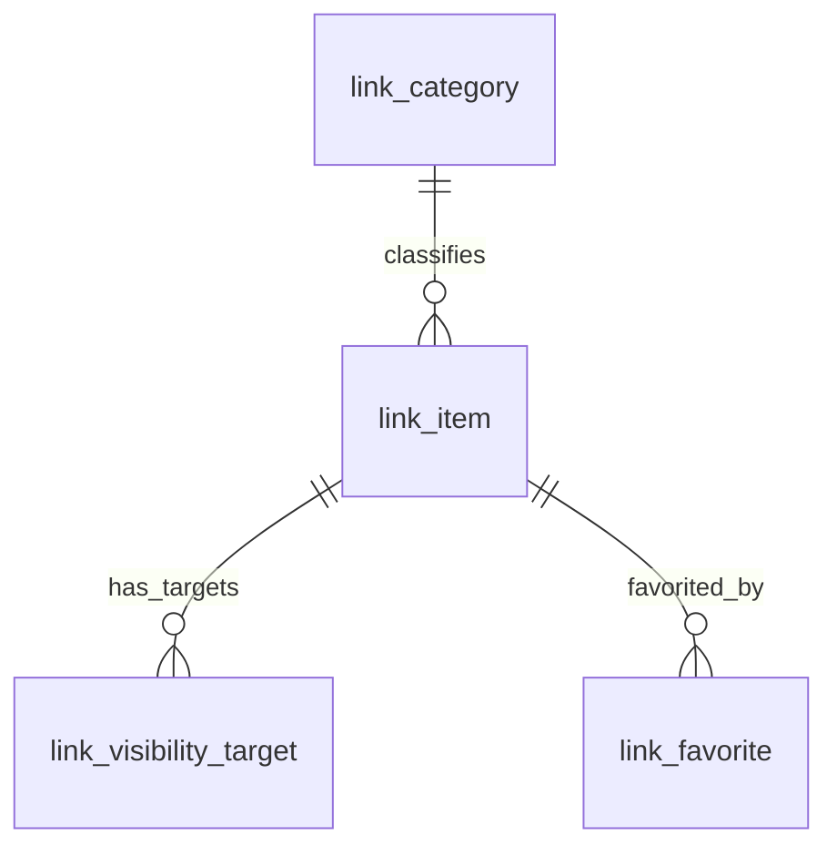
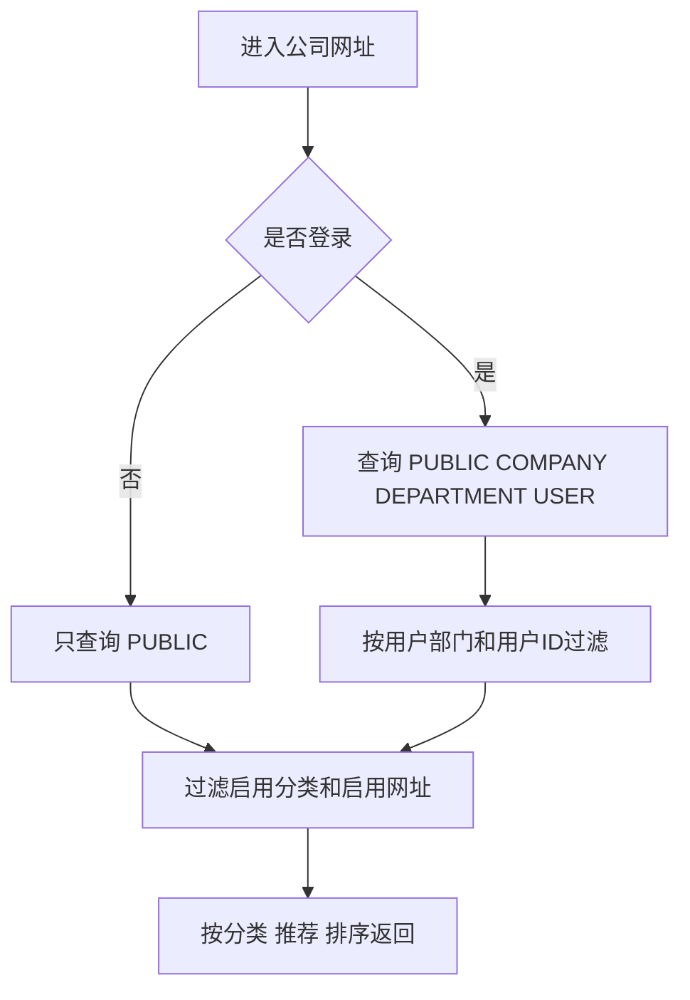

# 网址导航详细设计

文档状态：草案
日期：2026-06-30
需求文档：`mango-docs/designs/2026-06-30-url-navigation-requirements.md`

## 0. 设计前检查

| 项 | 结论 |
|---|---|
| AI 动作 | WRITE |
| PRD 覆盖 | 覆盖 BO-001 到 BO-004、BF-001 到 BF-006、BR-001 到 BR-013、PG-001 到 PG-005、AC-001 到 AC-023 |
| 阻断缺口 | 无阻断缺口 |
| 进入开发 | 本文和执行计划确认后进入开发 |

## 1. 设计目标与范围

设计目标：在 Mango 平台能力中新增网址导航能力，支持用户侧查找、打开、收藏网址，支持后台维护网址分类和网址列表。

本次设计覆盖：

- 后端新增网址导航业务能力。
- 前端新增用户侧 `网址导航` 页面组。
- 前端新增后台 `平台能力 / 网址管理` 页面组。
- 新增网址分类、网址、可见目标、收藏记录持久化对象。
- 新增公开、公司内、指定部门、指定用户、个人五类可见范围判断。
- 新增 Open API，只读访问公开网址。
- 新增菜单、页面、按钮权限资源。
- 新增 API、组件/E2E 测试候选项和验收映射。

本次设计不覆盖：

- 小组对象和小组成员管理。
- 多级分类 tree。
- 访问统计、健康检查、快照归档、浏览器插件。
- 后台默认查看个人网址。

## 2. 设计输入

| 输入 | 来源 | 说明 |
|---|---|---|
| PRD | `2026-06-30-url-navigation-requirements.md` | 菜单、功能、可见范围、验收项 |
| 用户确认 | 当前会话 | 后台菜单使用 `平台能力 / 网址管理 / 网址分类、网址列表` |
| 当前模块结构 | `mango/mango-platform/**` | 平台能力按 api/core/starter 分层 |
| 当前前端结构 | `mango-ui/packages/**` | 前端包按能力拆分 |
| 菜单资源现状 | `META-INF/mango/resources/*-common-menu.json` | 平台能力使用资源声明初始化菜单 |

## 3. 影响模块与改动边界

| 模块/包/页面 | 路径或标识 | 改动类型 | 职责层 | 依赖方向 | 是否公共能力 | 对应 PRD ID |
|---|---|---|---|---|---|---|
| 网址 API | `mango/mango-platform/mango-link/mango-link-api` | 新增 | 后端契约 | starter/core 依赖 api | 是 | BF-001 到 BF-006 |
| 网址 Core | `mango/mango-platform/mango-link/mango-link-core` | 新增 | 后端业务和持久化 | core 依赖 api、组织/用户能力 | 是 | BO-001 到 BO-004 |
| 网址 Starter | `mango/mango-platform/mango-link/mango-link-starter` | 新增 | Controller、自动装配、菜单资源、公开路径放行 | starter 依赖 api/core | 是 | PG-001 到 PG-005、BF-006 |
| 前端网址包 | `mango-ui/packages/link` | 新增 | 页面、管理端/用户侧 API、类型、页面注册 | package 内部 | 是 | PG-001 到 PG-005 |
| 公开网址 OpenAPI 包 | `mango-ui/packages/link-openapi` | 新增 | 公开只读接口请求函数和类型 | 独立消费方依赖，不依赖 admin | 是 | BF-006、AC-021 到 AC-023 |
| Admin 聚合入口 | `mango-ui/packages/admin` | 修改 | 前端聚合 | 引入页面包 | 是 | PG-001 到 PG-005 |
| 菜单资源 | `link-common-menu.json` | 新增 | 后端初始化菜单 | Resource Registry | 是 | PG-001 到 PG-005 |
| Open API | `/link/open/public-links/list` | 新增 | 公开只读接口 | 无登录访问，只返回公开网址 | 是 | BF-006 |
| E2E 测试 | 对应测试目录 | 新增 | 验收自动化 | 复用登录/租户 fixture | 是 | AC-001 到 AC-023 |

模块固定新增为 `mango-link`，前端页面包固定新增为 `mango-ui/packages/link`，公开接口消费包固定新增为 `mango-ui/packages/link-openapi`。

### 3.1 命名与路径决策

| 类型 | 决策 |
|---|---|
| 能力名称 | 网址 |
| 用户侧菜单名 | 网址导航 |
| 后台菜单名 | 网址管理 |
| 后端模块名 | `mango-link` |
| 后端模块路径 | `mango/mango-platform/mango-link` |
| Maven 子模块 | `mango-link-api`、`mango-link-core`、`mango-link-starter`、`mango-link-starter-remote` |
| Java 包名 | `io.mango.link` |
| 前端页面包名 | `@mango/link` |
| 前端包路径 | `mango-ui/packages/link` |
| 前端公开接口包名 | `@mango/link-openapi` |
| 前端公开接口包路径 | `mango-ui/packages/link-openapi` |
| 菜单资源文件 | `mango/mango-platform/mango-link/mango-link-starter/src/main/resources/META-INF/mango/resources/link-common-menu.json` |
| Flyway 路径 | `mango/mango-platform/mango-link/mango-link-core/src/main/resources/db/migration/link` |
| 数据表前缀 | `link_` |
| 后台 API 前缀 | `/link` |
| Open API 前缀 | `/link/open` |
| Open API 放行路径 | `/link/open/**` |
| 前端用户路由 | `/url-navigation/company`、`/url-navigation/favorites`、`/url-navigation/my-links` |
| 前端后台路由 | `/platform/link/categories`、`/platform/link/items` |

决策依据：

- 现有平台模块使用短领域名，例如 `mango-cms`、`mango-notice`、`mango-calendar`。
- “网址导航”是用户侧菜单，不作为后端模块名。
- “网址管理”是后台菜单，不作为后端模块名。
- 后端领域对象统一使用 `Link` 前缀，避免 `UrlNavigation`、`Url`、`Bookmark` 混用。
- `@mango/link-openapi` 只封装 `/link/open/**`，供非管理后台、外部门户或未登录页面独立安装使用；不得依赖 `@mango/admin`、`@mango/admin-pages`、路由、菜单或权限运行时。

### 3.2 后端类与契约命名

| 类型 | 命名 |
|---|---|
| 管理端 API 契约 | `LinkAdminApi` |
| 用户侧 API 契约 | `LinkUserApi` |
| 公开 Open API 契约 | `LinkOpenApi` |
| 管理端 Controller | `LinkAdminController` |
| 用户侧 Controller | `LinkUserController` |
| 公开 Open Controller | `LinkOpenController` |
| 管理端服务接口 | `ILinkAdminService` |
| 用户侧服务接口 | `ILinkUserService` |
| 公开 Open 服务接口 | `ILinkOpenService` |
| 管理端服务实现 | `LinkAdminService` |
| 用户侧服务实现 | `LinkUserService` |
| 公开 Open 服务实现 | `LinkOpenService` |
| 分类实体 | `LinkCategoryEntity` |
| 网址实体 | `LinkItemEntity` |
| 可见目标实体 | `LinkVisibilityTargetEntity` |
| 收藏实体 | `LinkFavoriteEntity` |
| 分类 Mapper | `LinkCategoryMapper` |
| 网址 Mapper | `LinkItemMapper` |
| 可见目标 Mapper | `LinkVisibilityTargetMapper` |
| 收藏 Mapper | `LinkFavoriteMapper` |
| 转换器 | `LinkCategoryConvert`、`LinkItemConvert`、`LinkFavoriteConvert` |

API 模型命名：

| 场景 | Command / Query / VO |
|---|---|
| 分页查询分类 | `LinkCategoryPageQuery`、`LinkCategoryVO` |
| 查询启用分类 | `LinkCategoryQuery`、`LinkCategoryVO` |
| 新增分类 | `CreateLinkCategoryCommand` |
| 更新分类 | `UpdateLinkCategoryCommand` |
| 分类启停 | `UpdateLinkCategoryStatusCommand` |
| 删除分类 | `DeleteLinkCategoryCommand` |
| 分页查询后台网址 | `LinkItemPageQuery`、`LinkItemVO` |
| 新增后台网址 | `CreateLinkItemCommand` |
| 更新后台网址 | `UpdateLinkItemCommand` |
| 网址启停 | `UpdateLinkItemStatusCommand` |
| 删除后台网址 | `DeleteLinkItemCommand` |
| 查询公司网址 | `LinkCompanyItemQuery`、`LinkNavigationItemVO` |
| 查询公开网址 | `LinkPublicItemQuery`、`LinkPublicItemVO` |
| 收藏网址 | `CreateLinkFavoriteCommand` |
| 取消收藏 | `DeleteLinkFavoriteCommand` |
| 查询我的收藏 | `LinkFavoriteQuery`、`LinkFavoriteVO` |
| 查询我的网址 | `LinkPersonalItemPageQuery`、`LinkPersonalItemVO` |
| 新增我的网址 | `CreateLinkPersonalItemCommand` |
| 更新我的网址 | `UpdateLinkPersonalItemCommand` |
| 删除我的网址 | `DeleteLinkPersonalItemCommand` |

约束：

- `api` 只放 `LinkAdminApi`、`LinkUserApi`、`LinkOpenApi`、`command`、`query`、`vo`、`enums`。
- `core` 只放 `entity`、`service`、`mapper`、`convert`。
- Controller 只做协议适配，必须实现对应 `XxxApi`。
- `LinkOpenController` 标注公开访问，starter 必须追加 `/link/open/**` 到认证放行路径。

## 4. 关键对象设计

| 对象 | 对应 PRD 对象 | 对象ID口径 | 唯一性 | 租户/归属 | 核心属性 | 关联对象 | 生命周期 | 关键约束 |
|---|---|---|---|---|---|---|---|---|
| LinkCategory | BO-001 | `categoryId` | 同一租户分类名称唯一 | `tenantId` | 名称、排序号、状态、备注 | LinkItem | 启用、停用 | 一级分类，不包含 parentId |
| LinkItem | BO-002、BO-003 | `linkId` | 全局唯一 ID | `tenantId`、`ownerUserId` | 名称、URL、分类、简介、图标、标签、可见范围、状态、推荐、排序号 | LinkCategory、VisibilityTarget、Favorite | 启用、停用、删除 | 个人网址 `ownerUserId` 必填 |
| LinkVisibilityTarget | BO-002 | `targetId` | link 内唯一 | `tenantId` | 目标类型、目标 ID、目标名称 | LinkItem | 随网址创建/更新 | 仅指定部门、指定用户使用 |
| LinkFavorite | BO-004 | `favoriteId` | `tenantId + userId + linkId` 唯一 | `tenantId`、`userId` | 收藏人、网址 | LinkItem | 已收藏、已取消 | 不收藏不可见网址 |

## 5. 对象关系

| 主对象 | 从对象 | 关系类型 | 基数 | 所有权 | 删除/停用影响 | 历史保留 | 一致性约束 |
|---|---|---|---|---|---|---|---|
| LinkCategory | LinkItem | 分类归属 | 1:N | LinkItem 持有分类引用 | 分类停用后用户侧不展示分类和分类下网址 | 保留 | 分类下存在启用网址时不可删除 |
| LinkItem | LinkVisibilityTarget | 可见目标 | 1:N | LinkItem 拥有 | 网址删除时删除目标 | 不保留 | 公开、公司内、个人不允许存在目标记录 |
| LinkItem | LinkFavorite | 收藏记录 | 1:N | 用户收藏产生 | 网址停用或不可见时收藏页面不展示 | 保留 | 同一用户同一网址唯一 |

## 6. 状态机设计

### 6.1 网址分类

| 状态 | 持久化值 | 含义 | 允许动作 | 禁止动作 | 用户侧结果 |
|---|---|---|---|---|---|
| 启用 | `ENABLED` | 可用于网址归类和展示 | 编辑、停用、排序 | 无 | 分类和分类下可见网址展示 |
| 停用 | `DISABLED` | 不在用户侧展示 | 编辑、启用、删除受限 | 用户侧展示、被新网址选择 | 分类和分类下网址不展示 |

### 6.2 网址

| 状态 | 持久化值 | 含义 | 允许动作 | 禁止动作 | 用户侧结果 |
|---|---|---|---|---|---|
| 启用 | `ENABLED` | 可按可见范围展示 | 编辑、停用、打开、收藏 | 无 | 满足可见范围时展示 |
| 停用 | `DISABLED` | 后台保留，不展示 | 编辑、启用、删除受限 | 用户侧打开、收藏 | 不展示 |
| 删除 | 物理或逻辑删除 | 记录不再维护 | 无 | 所有用户侧动作 | 不展示 |

## 7. 数据设计

### 7.1 `link_category`

| 字段 | 说明 |
|---|---|
| `id` | 分类 ID |
| `tenant_id` | 租户 ID |
| `name` | 分类名称 |
| `sort_no` | 排序号 |
| `status` | `ENABLED`、`DISABLED` |
| `remark` | 后台备注 |
| `created_by`、`updated_by` | 创建人、更新人 |
| `created_at`、`updated_at` | 创建时间、更新时间 |

索引和约束：

- 唯一约束：`tenant_id + name`。
- 索引：`tenant_id + status + sort_no`。

### 7.2 `link_item`

| 字段 | 说明 |
|---|---|
| `id` | 网址 ID |
| `tenant_id` | 租户 ID；公开网址仍归属创建租户 |
| `category_id` | 分类 ID |
| `name` | 网址名称 |
| `url` | 网址地址 |
| `summary` | 简介 |
| `icon_url` | 图标地址 |
| `tags` | 标签文本，多个标签用英文逗号分隔；页面按逗号拆分展示 |
| `visibility_scope` | `PUBLIC`、`COMPANY`、`DEPARTMENT`、`USER`、`PERSONAL` |
| `owner_user_id` | 个人网址创建人；个人网址必填 |
| `open_mode` | `NEW_WINDOW`；本次默认新窗口 |
| `recommended` | 是否推荐 |
| `sort_no` | 排序号 |
| `status` | `ENABLED`、`DISABLED` |
| `remark` | 后台备注 |
| `created_by`、`updated_by` | 创建人、更新人 |
| `created_at`、`updated_at` | 创建时间、更新时间 |

索引和约束：

- 索引：`tenant_id + category_id + status + sort_no`。
- 索引：`tenant_id + visibility_scope + status`。
- 索引：`tenant_id + owner_user_id + visibility_scope`。
- 后台保存时校验 URL 格式。
- `visibility_scope = PERSONAL` 时 `owner_user_id` 必填。
- 后台网址列表不允许创建 `PERSONAL`。
- Open API 只返回 `visibility_scope = PUBLIC`、`status = ENABLED` 且分类启用的网址。

### 7.3 `link_visibility_target`

| 字段 | 说明 |
|---|---|
| `id` | 目标 ID |
| `tenant_id` | 租户 ID |
| `link_id` | 网址 ID |
| `target_type` | `DEPARTMENT`、`USER` |
| `target_id` | 部门 ID 或用户 ID |
| `target_name` | 部门名或用户显示名快照 |
| `created_at` | 创建时间 |

索引和约束：

- 索引：`tenant_id + link_id`。
- 索引：`tenant_id + target_type + target_id`。
- `visibility_scope = DEPARTMENT` 时必须存在至少一个 `DEPARTMENT` 目标。
- `visibility_scope = USER` 时必须存在至少一个 `USER` 目标。

### 7.4 `link_favorite`

| 字段 | 说明 |
|---|---|
| `id` | 收藏 ID |
| `tenant_id` | 租户 ID |
| `user_id` | 收藏用户 |
| `link_id` | 被收藏网址 |
| `created_at` | 收藏时间 |

索引和约束：

- 唯一约束：`tenant_id + user_id + link_id`。
- 索引：`tenant_id + user_id + created_at`。

## 8. 关键业务流程

### 8.1 查询公司网址

对应 PRD：BF-001、PG-001、AC-001 到 AC-004。

规则落地：

| PRD 规则 | 设计处理 | 异常反馈 |
|---|---|---|
| BR-001 | 未登录请求只返回 `PUBLIC` 且启用的网址 | 无 |
| BR-002 | 登录后返回 `COMPANY` | 未登录不返回 |
| BR-003 | 读取当前用户部门集合，匹配 `link_visibility_target` | 不匹配不返回 |
| BR-004 | 匹配当前用户 ID | 不匹配不返回 |
| BR-006 | `status = DISABLED` 不返回 | 无 |
| BR-007 | 分类停用时不返回分类和分类下网址 | 无 |

### 8.2 收藏和取消收藏

对应 PRD：BF-002、PG-001、PG-002、AC-005 到 AC-008。

流程：

1. 前端提交收藏或取消收藏请求。
2. 服务端确认用户已登录。
3. 收藏时先按当前用户执行可见性判断。
4. 不可见时拒绝收藏。
5. 已收藏时返回已收藏状态，不新增重复记录。
6. 取消收藏时删除或失效收藏记录。

### 8.3 管理我的网址

对应 PRD：BF-003、PG-003、AC-009 到 AC-012。

流程：

1. 用户进入“我的网址”。
2. 服务端只查询 `visibility_scope = PERSONAL` 且 `owner_user_id = 当前用户` 的网址。
3. 新增个人网址时写入 `visibility_scope = PERSONAL` 和 `owner_user_id = 当前用户`。
4. 编辑、删除个人网址时校验创建人等于当前用户。
5. 其他用户无法查询、编辑或删除该个人网址。

### 8.4 后台维护网址分类

对应 PRD：BF-004、PG-004、AC-013 到 AC-015。

流程：

1. 后台管理员进入网址分类页。
2. 新增或编辑时校验分类名称非空、同租户不重复。
3. 停用分类后，用户侧不展示该分类和分类下网址。
4. 删除分类前检查分类下是否存在启用网址。
5. 存在启用网址时删除失败，并提示先停用或迁移网址。

### 8.5 后台维护网址列表

对应 PRD：BF-005、PG-005、AC-016 到 AC-020。

流程：

1. 后台管理员进入网址列表页。
2. 查询公开、公司内、指定部门、指定用户网址，不查询个人网址。
3. 新增或编辑时校验必填字段、URL 格式、分类状态、可见范围目标。
4. 可见范围为指定部门时，必须选择部门。
5. 可见范围为指定用户时，必须选择用户。
6. 保存后，用户侧按可见范围展示。
7. 停用后，用户侧不再展示。

### 8.6 Open API 查询公开网址

对应 PRD：BF-006、AC-021 到 AC-023。

流程：

1. 调用方请求 `/link/open/public-links/list`。
2. 服务端从请求参数或公开站点上下文解析租户。
3. 租户上下文缺失时返回参数错误，不返回任何网址。
4. 服务端只查询 `visibility_scope = PUBLIC`、`status = ENABLED` 且分类启用的网址。
5. 服务端按分类、推荐、排序号返回。
6. 响应字段只包含公开展示字段，不返回后台备注、状态、创建人、指定部门、指定用户。

响应对象：

| 字段 | 类型 | 说明 |
|---|---|---|
| `id` | string | 网址 ID |
| `name` | string | 网址名称 |
| `url` | string | 网址地址 |
| `categoryId` | string | 分类 ID |
| `categoryName` | string | 分类名称 |
| `iconUrl` | string | 图标地址 |
| `summary` | string | 简介 |
| `tags` | string[] | 标签 |
| `openMode` | string | 打开方式，本次为 `NEW_WINDOW` |
| `recommended` | boolean | 是否推荐 |
| `sortNo` | number | 排序号 |

## 9. API 设计

### 9.1 用户侧 API

| 方法 | 路径 | 用途 | 登录要求 |
|---|---|---|---|
| GET | `/link/company-links/list` | 查询公司网址 | 否；未登录只返回公开，登录后返回用户可见网址 |
| POST | `/link/favorites/create` | 收藏网址 | 是 |
| DELETE | `/link/favorites/delete` | 取消收藏 | 是 |
| GET | `/link/favorites/list` | 查询我的收藏 | 是 |
| GET | `/link/personal-links/page` | 查询我的网址 | 是 |
| POST | `/link/personal-links/create` | 新增个人网址 | 是 |
| PUT | `/link/personal-links/update` | 编辑个人网址 | 是 |
| DELETE | `/link/personal-links/delete` | 删除个人网址 | 是 |

### 9.2 Open API

Open API 命名沿用现有公开接口风格，放在模块路径下的 `/open/**`。

| 方法 | 路径 | 用途 | 登录要求 | 返回范围 |
|---|---|---|---|---|
| GET | `/link/open/public-links/list` | 查询公开网址 | 否 | 只返回公开、启用分类、启用状态的网址 |

查询参数：

| 参数 | 说明 | 是否必填 |
|---|---|---|
| `tenantId` | 租户上下文；如果运行环境可从公开站点上下文解析，可由上下文提供 | 条件必填 |
| `keyword` | 关键词，匹配名称、URL、简介、标签 | 否 |
| `categoryId` | 分类 ID | 否 |

### 9.3 后台 API

| 方法 | 路径 | 用途 |
|---|---|---|
| GET | `/link/categories/page` | 分页查询网址分类 |
| GET | `/link/categories/list` | 查询启用网址分类 |
| POST | `/link/categories/create` | 新增网址分类 |
| PUT | `/link/categories/update` | 编辑网址分类 |
| POST | `/link/categories/enable` | 启用分类 |
| POST | `/link/categories/disable` | 停用分类 |
| DELETE | `/link/categories/delete` | 删除分类 |
| GET | `/link/items/page` | 分页查询网址列表 |
| POST | `/link/items/create` | 新增网址 |
| PUT | `/link/items/update` | 编辑网址 |
| POST | `/link/items/enable` | 启用网址 |
| POST | `/link/items/disable` | 停用网址 |
| DELETE | `/link/items/delete` | 删除网址 |

## 10. 菜单、页面与权限资源设计

| 菜单/页面/按钮 | PRD 页面/按钮 | 路由 | 页面 key | 权限资源码 | 默认授权 | 后端校验入口 | 无权限反馈 |
|---|---|---|---|---|---|---|---|
| 网址导航 | PG-001 到 PG-003 | `/url-navigation` | `link.navigation` | `link:navigation:view` | 登录用户；公司网址页允许匿名访问 | 用户侧查询按登录态判断 | 未登录仅公开 |
| 公司网址 | PG-001 | `/url-navigation/company` | `link.navigation.company` | `link:navigation:company:view` | 公开入口 | 查询接口 | 无权限网址不展示 |
| 我的收藏 | PG-002 | `/url-navigation/favorites` | `link.navigation.favorites` | `link:favorite:view` | 登录用户 | 收藏查询接口 | 未登录提示登录 |
| 我的网址 | PG-003 | `/url-navigation/my-links` | `link.navigation.my-links` | `link:personal-link:view` | 登录用户 | 个人网址接口 | 未登录提示登录 |
| 网址分类 | PG-004 | `/platform/link/categories` | `link.admin.categories` | `link:category:view` | 平台管理员 | 分类管理接口 | 无权限提示 |
| 网址列表 | PG-005 | `/platform/link/items` | `link.admin.items` | `link:item:view` | 平台管理员 | 网址管理接口 | 无权限提示 |
| 分类新增 | PG-004 | 页面按钮 | `link.admin.categories.create` | `link:category:create` | 平台管理员 | 分类新增接口 | 按钮不可见 |
| 网址新增 | PG-005 | 页面按钮 | `link.admin.items.create` | `link:item:create` | 平台管理员 | 网址新增接口 | 按钮不可见 |

## 11. 字典与配置设计

| 字典 | 编码 | 文案 | 是否可运营 | 默认值 |
|---|---|---|---|---|
| 网址状态 | `ENABLED` | 启用 | 否 | 是 |
| 网址状态 | `DISABLED` | 停用 | 否 | 否 |
| 可见范围 | `PUBLIC` | 公开 | 否 | 否 |
| 可见范围 | `COMPANY` | 公司内 | 否 | 是 |
| 可见范围 | `DEPARTMENT` | 指定部门 | 否 | 否 |
| 可见范围 | `USER` | 指定用户 | 否 | 否 |
| 可见范围 | `PERSONAL` | 个人 | 否 | 仅用户侧使用 |
| 打开方式 | `NEW_WINDOW` | 新窗口 | 否 | 是 |

## 12. 页面与功能映射

| PRD 页面 | 页面能力 | 关键对象 | 关键流程 | 验收项 |
|---|---|---|---|---|
| PG-001 公司网址 | 查询、搜索、打开、收藏 | BO-002、BO-004 | BF-001、BF-002 | AC-001 到 AC-005 |
| PG-002 我的收藏 | 查询、打开、取消收藏 | BO-004 | BF-002 | AC-006 到 AC-008 |
| PG-003 我的网址 | 新增、编辑、删除、打开 | BO-003 | BF-003 | AC-009 到 AC-012 |
| PG-004 网址分类 | 分类 CRUD、启停、删除受限 | BO-001 | BF-004 | AC-013 到 AC-015 |
| PG-005 网址列表 | 网址 CRUD、启停、可见范围配置 | BO-002 | BF-005 | AC-016 到 AC-020 |
| Open API | 查询公开网址 | BO-002 | BF-006 | AC-021 到 AC-023 |

## 13. 测试用例候选

| 用例 ID | 来源 | 场景 | 优先级 | 测试层级 | 自动化判断 | 稳定契约 |
|---|---|---|---|---|---|---|
| TC-001 | AC-001 | 未登录只能查看公开网址 | P0 | E2E/API | AUTO | `data-page=link.navigation.company` |
| TC-002 | AC-002 | 登录用户查看公司内网址 | P0 | E2E/API | AUTO | 登录租户用户 |
| TC-003 | AC-003、AC-018 | 指定部门网址隔离 | P0 | API/E2E | AUTO | 部门 A/B 测试用户 |
| TC-004 | AC-005、AC-006、AC-007 | 收藏和取消收藏闭环 | P0 | E2E/API | AUTO | `data-action=url-link.favorite` |
| TC-005 | AC-009 到 AC-012 | 个人网址本人可见、他人不可见 | P0 | API/E2E | AUTO | 用户 A/B |
| TC-006 | AC-013 到 AC-015 | 分类新增、停用、删除受限 | P1 | E2E/API | AUTO | 分类测试数据 |
| TC-007 | AC-016 到 AC-020 | 后台网址列表按可见范围生效 | P0 | E2E/API | AUTO | 公开、公司内、部门、用户网址 |
| TC-008 | AC-021 到 AC-023 | Open API 只返回公开网址且租户上下文缺失失败 | P0 | API | AUTO | `/link/open/public-links/list` |

## 14. 风险与取舍

| 风险/取舍 | 结论 | 原因 |
|---|---|---|
| 分类是否做 tree | 不做 tree | 网址导航以快速查找为主，一级分类足够；多级树会增加维护成本 |
| 部门是否作为分类 | 不作为分类 | 部门是可见范围，不是内容分类 |
| 小组是否纳入本次 | 不纳入 | 小组需要独立成员模型，超出本次“网址导航”主目标 |
| 公开网址是否有租户 | 有租户归属 | 便于后台维护、隔离和审计；公开仅表示查看不需登录 |
| 个人网址后台是否可见 | 默认不可见 | 符合“我的网址”私人属性 |
