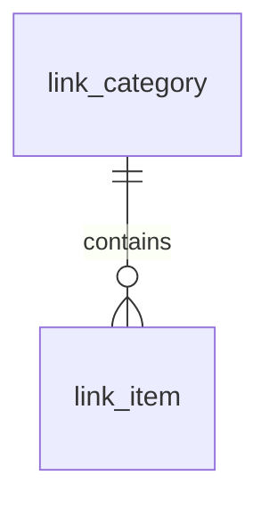
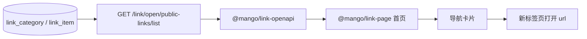

# link-page 业务首页详细设计

文档状态：已确认并进入开发落地  
日期：2026-07-10  
关联设计：`mango-docs/designs/2026-06-30-url-navigation-design.md`  
原型草稿：`D:/Project/mango/.superpowers/brainstorm/link-page-v9-design-draft.html`

## 0. 设计前检查

| 项 | 结论 |
|---|---|
| AI 动作 | WRITE |
| 需求来源 | 当前会话中用户确认的 link-page 首页方向 |
| PRD 缺口 | 没有独立 PRD 文件；本设计以当前会话确认为输入，并使用本文 BO/BF/BR/PG/AC 编号追踪 |
| 是否新增主表 | 不新增，复用 `link_category` 和 `link_item` |
| 是否新增接口 | 本版不新增，优先复用 `GET /link/open/public-links/list` |
| 是否进入开发 | 文档经用户确认后再进入开发；本次只产出设计文档 |

## 1. 设计目标与范围

本次设计将 `@mango/link-page` 从通用“网址导航 + 登录 + 收藏 + 个人网址”收敛为面向保函业务人员的首页快捷入口。页面以 Chrome 新标签页的使用感为参考，核心目标是让用户打开页面后快速搜索、识别并打开业务相关网站和内置工具。

本次覆盖：

- 首页视觉与交互规则：顶部可配置文案、搜索框、分组卡片、搜索结果区。
- 卡片展示规则：只展示 logo、名称、地址、一句话介绍。
- 点击规则：整张卡片可点击，当前版本统一按外链新标签页打开。
- 搜索规则：默认按三组展示；搜索后在分组上方展示筛选结果，筛选结果不再分组。
- 数据规则：复用 `mango-link` 现有表和 Open API，内置业务相关、工具相关、其他三组数据。
- 内置数据建议：保函业务查询、风险核验、业务工具、常用知识/辅助网站。

本次不覆盖：

- 登录、退出、用户信息、个人卡片、收藏、手动新增、重复提示。
- 前台新增或编辑卡片。
- 后台管理页面改造。后台维护后续可基于现有 `LinkAdminController` 另行设计。
- 权限控制、公私区分、部门或用户可见范围。
- 接入百度联想或外部搜索引擎结果 API。
- 多级分类和卡片详情页。

## 2. 设计输入

| 输入 | 来源 | 说明 |
|---|---|---|
| 首页方向 | 用户确认 | 更像 Chrome 首页，是各种网站和工具的快捷入口 |
| 页面布局 | 用户确认 | 双列大卡片方向，最终定为所有工具按分组列出 |
| 分组 | 用户确认 | 固定为业务相关、工具相关、其他 |
| 卡片字段 | 用户确认 | 只展示 logo、名称、地址、一句话介绍 |
| 搜索 | 用户确认 | 回车和搜索按钮均可搜索；输入框下方推荐提示取消 |
| 点击 | 用户确认 | 整张卡片点击，不单独给链接点击 |
| 打开方式 | 用户确认 | 本版默认新标签页打开，未来可配置当前标签或新标签 |
| 数据维护 | 用户确认 | 本期直接内置到数据库，后续再考虑后台维护模块 |
| 现有能力 | 当前代码 | `mango-link` 已有表、Open API、后台管理接口 |

## 3. 追踪矩阵

| 类型 | ID | 内容 | 覆盖章节 | 状态 |
|---|---|---|---|---|
| BO | BO-001 | 导航分类 | 5、6、8、14 | DONE |
| BO | BO-002 | 导航卡片 | 5、6、8、14 | DONE |
| BF | BF-001 | 默认分组浏览 | 7、9、10 | DONE |
| BF | BF-002 | 关键词搜索筛选 | 7、9、10 | DONE |
| BF | BF-003 | 点击打开卡片 | 7、9、10 | DONE |
| BR | BR-001 | 本版无权限和公私区分 | 11、14 | DONE |
| BR | BR-002 | 卡片只展示四类信息 | 9、10 | DONE |
| BR | BR-003 | 搜索结果不分组 | 7、10 | DONE |
| PG | PG-001 | link-page 首页 | 9、10、11 | DONE |
| AC | AC-001 | 用户可按三组看到内置卡片 | 17 | DONE |
| AC | AC-002 | 用户搜索后看到匹配卡片 | 17 | DONE |
| AC | AC-003 | 用户点击卡片可打开目标地址 | 17 | DONE |
| AC | AC-004 | 空、加载、失败状态有明确反馈 | 16、17 | DONE |

## 4. 影响模块与改动边界

| 模块/页面 | 路径或标识 | 改动类型 | 职责层 | 依赖方向 | 是否公共能力 | 验证责任 |
|---|---|---|---|---|---|---|
| link-page 首页 | `mango-ui/packages/link-page` | 修改 | 前端页面包 | 依赖 `@mango/link-openapi` | 是 | 页面、交互、视觉走查 |
| link-openapi | `mango-ui/packages/link-openapi` | 复用 | 前端 API client | 调用 `mango-link` Open API | 是 | 类型和接口契约检查 |
| link 后端 | `mango/mango-platform/mango-link` | 复用/新增 seed 数据 | 后端与数据 | Open API 读取数据库 | 是 | API、migration、数据验证 |
| 设计文档 | `mango-docs/designs` | 新增 | 文档 | 记录边界和验收 | 否 | 文档审阅 |

本次设计结论是不新增主表、不新增 Open API；开发阶段预计只需要：

- 调整 `@mango/link-page` 页面行为和展示。
- 新增或调整 `mango-link` 的默认导航数据 migration。
- 视现有实现情况更新 `@mango/link-page` README。

## 5. 关键对象

| 对象 | 对应业务对象 | 对象 ID 口径 | 唯一性 | 归属 | 核心属性 | 生命周期 | 关键约束 |
|---|---|---|---|---|---|---|---|
| LinkCategory | BO-001 导航分类 | `categoryId` | 同一租户、scope、owner、name 唯一 | `tenantId`，本版 `ownerUserId=0` | 名称、排序、状态 | 启用、停用 | 本版只使用业务相关、工具相关、其他三组 |
| LinkItem | BO-002 导航卡片 | `linkId` | 全局 ID 唯一 | `tenantId`，本版 `ownerUserId=0` | 名称、地址、简介、图标、标签、分类、打开方式 | 启用、停用 | 本版全部作为可见链接导航，不做个人或权限可见范围 |

## 6. 关键对象关系



| 主对象 | 从对象 | 关系类型 | 基数 | 所有权 | 创建/更新来源 | 删除/停用影响 | 一致性约束 |
|---|---|---|---|---|---|---|---|
| LinkCategory | LinkItem | 分类归属 | 1:N | LinkItem 持有分类引用 | migration 初始化；未来后台维护 | 分类停用后该组不展示 | 卡片必须归属本版三组之一 |

## 7. 关键业务流程

### 7.1 默认浏览

参与对象：LinkCategory、LinkItem。  
输入：无关键词。  
流程：

1. 页面初始化。
2. 前端调用 `GET /link/open/public-links/list`。
3. 前端按 `categoryName` 聚合为业务相关、工具相关、其他。
4. 每组按后端返回顺序或 `sortNo` 展示卡片。

输出：用户看到三组导航卡片。

### 7.2 关键词搜索筛选

参与对象：LinkItem。  
输入：用户输入关键词并按回车或点击搜索按钮。  
流程：

1. 前端读取搜索框关键词。
2. 推荐方案：调用 `GET /link/open/public-links/list?keyword=...` 获取后端匹配结果。
3. 前端对返回结果按 `id` 去重。
4. 搜索结果展示在分组列表上方，不按分类再次分组。
5. 关键词清空后恢复默认分组展示。

输出：用户看到匹配卡片；无匹配时看到空状态。

关键词匹配口径来自现有后端：名称、URL、简介、标签。

### 7.3 点击打开卡片

参与对象：LinkItem。  
输入：用户点击任意卡片区域。  
流程：

1. 前端取卡片目标地址。
2. 当前版本默认新标签页打开。
3. 目标地址优先级为 `redirectUrl || url`。

输出：浏览器打开目标网站或内置工具 URL。

本版不单独提供卡片内的链接点击区域，不在卡片上展示打开方式配置。

## 8. 状态机制

| 对象 | 状态 | 含义 | 持久化值 | 允许动作 | 禁止动作 | 用户反馈 |
|---|---|---|---|---|---|---|
| LinkCategory | 启用 | 分类可展示 | `ENABLED` | 展示、搜索归属卡片 | 无 | 分组标题和卡片展示 |
| LinkCategory | 停用 | 分类不可展示 | `DISABLED` | 后台启用 | 首页展示 | 分组不展示 |
| LinkItem | 启用 | 卡片可展示 | `ENABLED` | 展示、搜索、点击打开 | 无 | 卡片可见且可点击 |
| LinkItem | 停用 | 卡片不可展示 | `DISABLED` | 后台启用 | 首页展示、点击打开 | 卡片不展示 |

本版不新增业务状态。个人、收藏、可见范围、登录态相关状态不进入页面交互。

## 9. 数据流设计



| 流程 | 数据来源 | 输入 | 处理方式 | 写入对象 | 外部依赖 | 失败处理 | 用户可见结果 |
|---|---|---|---|---|---|---|---|
| 初始化展示 | `link_category`、`link_item` | 无 | 查询可展示卡片，前端按分类聚合 | 无 | `mango-link` Open API | 显示失败状态和重试入口 | 三组卡片 |
| 搜索筛选 | `link_item` | `keyword` | 后端按名称、URL、简介、标签匹配，前端去重 | 无 | `mango-link` Open API | 显示失败状态，不清空已有输入 | 匹配卡片或空状态 |
| 点击打开 | API 返回项 | 卡片点击 | 打开 `redirectUrl || url` | 可选访问记录由后端 jump 配置决定 | 浏览器新标签页 | URL 无效时浏览器按自身规则反馈 | 目标页面打开 |

## 10. 页面与功能映射

| PG ID | 区域 | 字段/控件 | 对应规则 | 前端交互 | 后端能力 | 异常反馈 |
|---|---|---|---|---|---|---|
| PG-001 | 顶部文案 | headline | 页面文案可配置 | 展示宿主传入文案；未传使用默认文案 | 无 | 无 |
| PG-001 | 搜索区 | 输入框 | BF-002 | 回车搜索；清空恢复默认 | `keyword` 查询 | 查询失败提示 |
| PG-001 | 搜索区 | 搜索按钮 | BF-002 | 点击搜索 | `keyword` 查询 | 查询失败提示 |
| PG-001 | 搜索结果 | 小卡片/紧凑卡片 | BR-003 | 搜索后展示匹配项，不分组 | Open API | 空结果提示 |
| PG-001 | 分组区 | 业务相关、工具相关、其他 | BF-001 | 默认按组展示 | Open API | 无数据时空状态 |
| PG-001 | 卡片 | logo、名称、地址、简介 | BR-002 | 整张卡片可点击 | Open API 返回字段 | logo 失败走文字兜底 |

卡片展示规则：

- logo：优先 `iconUrl`；为空或加载失败时，按名称取首字或前几个字母生成文字 logo。
- 名称：展示 `name`。
- 地址：展示 `url`，过长时单行省略，完整地址可通过浏览器 title 或等价方式查看。
- 一句话介绍：展示 `summary`；为空时不展示介绍文本。
- 其他字段：`tags`、`categoryName`、`recommended`、`sortNo`、`source`、`favorited`、`openMode` 不直接展示在卡片上。

## 11. 菜单、页面与权限资源设计

| 菜单/页面 | 路由 | 页面 key | 权限资源 | 默认授权 | 后端校验 | 说明 |
|---|---|---|---|---|---|---|
| link-page 首页 | 待宿主确认 | 待实现确认 | 本版不新增按钮权限 | 跟随宿主页面入口 | 本版不做卡片级权限控制 | 页面能否进入由宿主路由决定；卡片展示不再区分公私 |

用户已确认：登录以后再说，当前卡片只是链接导航，没有第二层，本版本暂时不做权限控制。

## 12. 字典与配置设计

| 名称 | 编码/字段 | 展示文案 | 默认值 | 是否可运营 | 初始化方式 | 兼容策略 |
|---|---|---|---|---|---|---|
| 首页大文案 | `headline` | 宿主传入 | 待前端实现定义 | 是 | 前端 props 或页面配置 | 未配置时使用默认文案 |
| 分类 | `link_category.name` | 业务相关、工具相关、其他 | 三组固定值 | 是 | migration 初始化 | 后续后台维护时仍复用分类 |
| 打开方式 | `link_item.open_mode` | 新标签页/当前标签 | `NEW_WINDOW` | 是 | 现有字段 | 本版不开放配置入口，未来后台维护 |
| 可见范围 | `link_item.visibility_scope` | 不展示 | `PUBLIC` | 否 | migration 初始化 | 本版统一可见，不进入页面交互 |

## 13. 前端复用判断

| 复用判断 | 使用页面 | 解决问题 | 是否新增组件 | 关键行为 | 状态与反馈 | 不新增依据 |
|---|---|---|---|---|---|---|
| 使用现有 `@mango/link-page` 页面包 | link-page 首页 | 独立导航首页 | 否 | 搜索、分组、卡片、点击 | 加载、空、失败 | 已有页面包承担独立导航页职责 |
| 使用现有 `@mango/link-openapi` | link-page 首页 | 调用 Open API | 否 | 查询列表和关键词搜索 | API 错误转页面状态 | 已有 client 包封装 `listPublicLinks` |

本版不新增跨页面复用组件；卡片、搜索区和分组区如仅服务本页面，应留在 `link-page` 包内部。

## 14. 关键技术设计

### 14.1 接口设计

| 接口 ID | 调用方 | 模块 | 方法/路径 | 请求结构 | 响应结构 | 权限/租户 | 排序 | 兼容策略 | 验证方式 |
|---|---|---|---|---|---|---|---|---|---|
| API-001 | `@mango/link-page` | `mango-link` | `GET /link/open/public-links/list` | `tenantId?`、`keyword?`、`categoryId?` | `LinkPublicItemVO[]` | 本版不做卡片级权限；数据统一 `PUBLIC` | 后端按分类、推荐、排序返回；前端可兜底按 `sortNo` | 已有接口复用 | API 调用和页面回显 |

返回字段使用口径：

| 字段 | 本版用途 |
|---|---|
| `id` | 去重、列表 key |
| `categoryId` | 分组辅助 |
| `categoryName` | 默认展示分组 |
| `name` | 卡片名称和文字 logo 兜底 |
| `url` | 卡片地址和默认打开地址 |
| `summary` | 一句话介绍 |
| `iconUrl` | logo 图片 |
| `tags` | 搜索匹配，不展示 |
| `openMode` | 未来打开方式配置，本版默认新标签页 |
| `redirectUrl` | 存在时优先作为打开地址 |

### 14.2 数据与 migration

| 表/实体 | 字段变化 | 约束 | 审计字段 | 租户字段 | 默认值 | 初始化数据 | 验证方式 |
|---|---|---|---|---|---|---|---|
| `link_category` | 无新增 | 复用现有唯一约束 | 复用 | `tenant_id` | `scope=COMPANY`、`owner_user_id=0` | 三组分类 | 查表和 API 返回 |
| `link_item` | 无新增 | 复用现有索引 | 复用 | `tenant_id` | `visibility_scope=PUBLIC`、`open_mode=NEW_WINDOW`、`owner_user_id=0` | 内置卡片 | 查表和 API 返回 |

本次 seed 数据建议使用新的 Flyway migration，不修改历史 migration。

### 14.3 预置数据草案

```json
{
  "categories": [
    {
      "name": "业务相关",
      "sortNo": 10,
      "items": [
        {
          "name": "建设银行保函查询",
          "url": "https://www2.ccb.com/tran/WCCMainPlatV5?CCB_IBSVersion=V5&SERVLET_NAME=WCCMainPlatV5&TXCODE=NBH001",
          "summary": "用于查询建设银行保函相关业务信息。",
          "tags": ["建行", "建设银行", "保函", "保函查询"],
          "sortNo": 10
        },
        {
          "name": "中信银行保函查询",
          "url": "https://corp.bank.ecitic.com/cotb/onLineLOGVerify_new.html",
          "summary": "用于查询中信银行保函真伪和业务信息。",
          "tags": ["中信", "中信银行", "保函", "保函查询"],
          "sortNo": 20
        },
        {
          "name": "邮储银行 U 函通",
          "url": "https://elgs.psbc.com/",
          "summary": "邮储银行电子保函业务查询入口。",
          "tags": ["邮储", "邮储银行", "U函通", "保函"],
          "sortNo": 30
        },
        {
          "name": "沧州银行保函查询",
          "url": "https://bankczbhcx.com/",
          "summary": "沧州银行保函业务查询入口，域名需业务侧最终确认。",
          "tags": ["沧州银行", "保函", "保函查询"],
          "sortNo": 40
        },
        {
          "name": "中国执行信息公开网",
          "url": "https://zxgk.court.gov.cn/",
          "summary": "查询被执行人、失信被执行人等公开信息。",
          "tags": ["执行信息", "法院", "失信", "风险核验"],
          "sortNo": 50
        },
        {
          "name": "全国建筑市场监管公共服务平台",
          "url": "https://jzsc.mohurd.gov.cn/home",
          "summary": "查询建筑企业、人员、项目和诚信信息。",
          "tags": ["建筑市场", "住建部", "企业资质", "项目核验"],
          "sortNo": 60
        },
        {
          "name": "国家企业信用信息公示系统",
          "url": "https://www.gsxt.gov.cn/",
          "summary": "查询企业登记、公示和经营异常等信息。",
          "tags": ["企业信用", "工商", "企业核验"],
          "sortNo": 70
        },
        {
          "name": "信用中国",
          "url": "https://www.creditchina.gov.cn/",
          "summary": "查询信用信息、行政处罚和联合惩戒信息。",
          "tags": ["信用中国", "信用", "风险核验"],
          "sortNo": 80
        },
        {
          "name": "全国公共资源交易平台",
          "url": "https://www.ggzy.gov.cn/",
          "summary": "查询公共资源交易公告和项目信息。",
          "tags": ["公共资源", "招投标", "交易平台"],
          "sortNo": 90
        },
        {
          "name": "中国政府采购网",
          "url": "https://www.ccgp.gov.cn/",
          "summary": "查询政府采购公告、中标和成交信息。",
          "tags": ["政府采购", "采购公告", "中标"],
          "sortNo": 100
        }
      ]
    },
    {
      "name": "工具相关",
      "sortNo": 20,
      "items": [
        {
          "name": "保费测算",
          "url": "/tools/premium-calculator",
          "summary": "系统内置保函保费测算工具入口。",
          "tags": ["保费", "测算", "内置工具"],
          "sortNo": 10
        },
        {
          "name": "快递 H5",
          "url": "/tools/express-h5",
          "summary": "系统内置快递 H5 工具入口。",
          "tags": ["快递", "H5", "内置工具"],
          "sortNo": 20
        },
        {
          "name": "e签宝",
          "url": "https://h5.esign.cn/usercenterFront/login/web",
          "summary": "电子签署和合同签章服务入口。",
          "tags": ["e签宝", "电子签章", "签署"],
          "sortNo": 30
        },
        {
          "name": "豆包",
          "url": "https://www.doubao.com/chat/",
          "summary": "AI 问答和内容辅助工具。",
          "tags": ["豆包", "AI", "工具"],
          "sortNo": 40
        },
        {
          "name": "百度",
          "url": "https://www.baidu.com/",
          "summary": "常用中文搜索引擎。",
          "tags": ["百度", "搜索"],
          "sortNo": 50
        }
      ]
    },
    {
      "name": "其他",
      "sortNo": 30,
      "items": [
        {
          "name": "中国法律服务网",
          "url": "https://www.12348.gov.cn/",
          "summary": "法律服务、法规和咨询辅助入口。",
          "tags": ["法律", "法规", "法律服务"],
          "sortNo": 10
        },
        {
          "name": "知乎",
          "url": "https://www.zhihu.com/",
          "summary": "知识问答和行业信息检索入口。",
          "tags": ["知乎", "知识", "问答"],
          "sortNo": 20
        }
      ]
    }
  ]
}
```

所有预置 `link_item` 建议统一：

- `visibility_scope = 'PUBLIC'`
- `owner_user_id = 0`
- `open_mode = 'NEW_WINDOW'`
- `status = 'ENABLED'`
- `icon_url = NULL`，需要明确品牌图标时再补；前端负责文字 logo 兜底。

### 14.4 权限与租户

| 能力 | 权限边界 | 租户边界 | 数据权限 | 验证方式 |
|---|---|---|---|---|
| 首页查看 | 本版不做卡片级权限 | 复用现有 `tenant_id` 查询口径 | 本版全部 `PUBLIC` | 未登录/登录访问均可获取本版内置卡片 |
| 后台维护 | 本版不实现 | 未来复用现有后台接口 | 未来另行设计 | 本文不验收 |

页面入口自身是否需要登录由宿主系统路由决定，不由 `link_item` 可见范围承担。

### 14.5 一致性、性能与兼容

| 场景 | 设计选择 | 风险 | 处理方式 | 验证方式 |
|---|---|---|---|---|
| 登录态接口返回收藏来源导致重复 | 前端按 `id` 去重 | 同一链接重复展示 | 展示前去重，忽略 `source` | 构造重复返回数据或登录态验证 |
| 数据量增长 | 优先后端 `keyword` 查询 | 每次搜索有请求 | 后续数据量大时可增加防抖；本版回车/按钮触发 | API 请求次数和结果验证 |
| 内置工具 URL 是相对路径 | 当前仍按 URL 打开 | 新标签打开相对路径可能受宿主 base 影响 | 开发时确认宿主路由形态；必要时配置完整 hash/path | 页面点击验证 |
| 图标缺失 | 前端文字 logo 兜底 | 品牌识别度弱 | 后台或 migration 可补 `icon_url` | 图标加载失败验证 |

## 15. 开发任务映射

| DEV ID | 对应 BO/BF/BR/PG/AC | 后端模块 | 前端页面 | 接口 | 数据对象 | 测试类型 | 完成标准 |
|---|---|---|---|---|---|---|---|
| DEV-001 | BO-001、BO-002、AC-001 | `mango-link-core` | 无 | 无新增 | `link_category`、`link_item` | migration/API | 三组和预置卡片可通过 Open API 查询 |
| DEV-002 | PG-001、BF-001、BF-002、AC-001、AC-002 | 无 | `@mango/link-page` | API-001 | `LinkPublicItemVO` | 组件/E2E/截图 | 默认分组和搜索结果符合设计 |
| DEV-003 | BF-003、AC-003 | 无 | `@mango/link-page` | API-001 | `LinkPublicItemVO` | E2E/手工 | 整张卡片点击，新标签页打开目标 |
| DEV-004 | AC-004 | 无 | `@mango/link-page` | API-001 | 无 | 组件/E2E | 加载、空结果、接口失败有明确反馈 |
| DEV-005 | 文档同步 | 无 | README | 无 | 无 | 静态检查 | README 说明与本设计一致 |

## 16. 异常与边界

| 场景 | 触发条件 | 系统处理 | 用户反馈 | 影响对象 | 验证方式 |
|---|---|---|---|---|---|
| 无预置数据 | API 返回空数组 | 展示空状态 | “暂无导航”类提示 | 页面 | Mock/API 空数组 |
| 搜索无结果 | `keyword` 无匹配 | 搜索结果区展示空状态，保留输入 | “没有找到相关导航”类提示 | 页面 | 输入不存在关键词 |
| API 失败 | 网络错误或 4xx/5xx | 不展示假数据 | 失败提示和重试入口 | 页面 | 拦截接口失败 |
| logo 加载失败 | `iconUrl` 为空或图片失败 | 使用文字 logo | 卡片仍完整展示 | 卡片 | 使用无效 iconUrl |
| URL 为空或非法 | 数据异常 | 卡片不可打开或点击时提示 | 不应静默失败 | 卡片 | 构造异常数据 |
| 长 URL | 地址过长 | 单行省略，保留完整 title | 卡片不撑破 | 卡片 | 使用建设银行长 URL |

## 17. 验收映射

| AC ID | 验收项 | 设计章节 | 页面/按钮 | 接口 | 数据 | 自动化判断 | 建议验证 |
|---|---|---|---|---|---|---|---|
| AC-001 | 用户打开页面后，能看到业务相关、工具相关、其他三组卡片，每张卡片只展示 logo、名称、地址、一句话介绍 | 9、10、14 | 首页 | API-001 | 三组 seed 数据 | AUTO | E2E + 截图 |
| AC-002 | 用户输入关键词并按回车或点击搜索按钮后，页面在分组上方展示匹配卡片，结果不按组拆分；无结果时展示空状态 | 7、10、16 | 搜索框、搜索按钮 | API-001 | `tags/name/url/summary` | AUTO | E2E |
| AC-003 | 用户点击卡片任意区域后，目标地址在新标签页打开 | 7、10 | 卡片 | API-001 | `url/redirectUrl` | AUTO/MANUAL | Playwright popup 或手工 |
| AC-004 | API 加载中、失败、空数据、logo 失败、长 URL 均有稳定页面反馈，不出现重叠、撑破或空白页 | 10、16 | 首页 | API-001 | 异常数据 | AUTO/MANUAL | 组件测试 + 截图 |

## 18. 交付台账候选项

| 候选项 | 类型 | 对应 ID | 验证方式 | 证据要求 |
|---|---|---|---|---|
| 内置导航数据 | 数据 | BO-001、BO-002、AC-001 | migration 后查询数据库和 Open API | SQL/API 输出摘要 |
| 首页默认展示 | 页面 | PG-001、AC-001 | E2E 和截图 | 页面截图、console/network 检查 |
| 搜索筛选 | 页面/接口 | BF-002、AC-002 | E2E | 搜索关键词、接口请求、页面结果 |
| 卡片点击打开 | 页面 | BF-003、AC-003 | E2E 或手工 | popup/新标签页目标 URL |
| 异常状态 | 页面 | AC-004 | 组件测试或 E2E 拦截 | 空、失败、长 URL、图标失败截图 |

## 19. 风险与取舍

| 风险/取舍 | 类型 | 影响范围 | 处理方式 | 是否需要用户确认 |
|---|---|---|---|---|
| 本版取消个人新增、收藏和登录交互 | 设计取舍 | 与旧 `@mango/link-page` README 描述不一致 | 开发时同步调整 README 和页面能力说明 | 已确认 |
| 预置网址准确性需要业务最终确认 | 业务风险 | 用户打开错误站点 | 开发前重点确认沧州银行等银行查询入口 | 是 |
| `PUBLIC` 可见范围意味着未登录也可通过 Open API 获取 | 设计取舍 | 卡片数据公开 | 符合“所有打开的人都能看”；敏感内部系统不应放入本版预置 | 已确认 |
| 内置工具相对路径未定 | 技术风险 | 保费测算、快递 H5 打开方式 | 开发时由宿主路由确认最终 URL | 是 |
| 不接入外部搜索联想 | 范围取舍 | 搜索丰富度有限 | 本版只搜预置数据，外部联想另行设计 | 已确认 |

## 20. AI 输出自检

| 检查项 | 结果 | 说明 |
|---|---|---|
| 关键对象、流程、规则、页面、验收项是否都有覆盖矩阵记录 | PASS | 已建立 BO/BF/BR/PG/AC |
| 每条业务规则是否映射到数据、页面反馈或异常处理 | PASS | BR-001 到 BR-003 已覆盖 |
| 关键对象关系是否有结构化表和图 | PASS | 见第 6 章 |
| 数据流是否写清来源、去向、失败处理和用户可见结果 | PASS | 见第 9 章 |
| 关键技术是否覆盖接口、数据、权限、兼容和验证方式 | PASS | 见第 14 章 |
| 每个验收项是否映射到至少一个设计交付物 | PASS | 见第 17 章 |
| 是否存在无来源的设计结论 | PASS | 均来自用户确认、现有代码或既有设计文档 |
| 最终动作 | NEXT | 可进入用户评审；开发需用户另行确认 |
