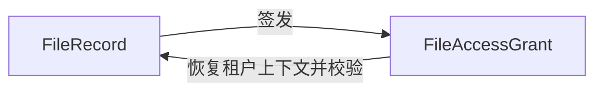
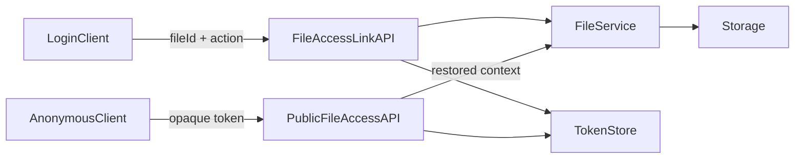

# 文件访问基线统一详细设计

> PRD：`mango-docs/designs/2026-07-11-file-access-baseline-requirements.md`

## 0. 设计前检查

| 项目 | 结论 | 依据 |
|---|---|---|
| AI 动作 | NEXT | PRD 为 READY，用户授权采用行业最佳实践 |
| PRD 缺口 | 无 | BO/BF/BR/PG/AC 完整 |
| 待确认设计问题 | 无 | 归档按危险操作处理；匿名访问按短期 token 处理 |

### 来源证据

| 设计结论 | 来源类型 | 来源路径/ID | 是否推断 | 依据 | 是否阻断 |
|---|---|---|---|---|---|
| 匿名只消费短期 token | 用户确认/当前代码 | PRD BR-001；`FilePreviewServiceImpl` | 否 | 现有预览 token 已保存租户上下文和过期时间 | 否 |
| 登录用户基础能力不检查角色权限 | 用户确认 | PRD BR-002 | 否 | 用户明确要求有无其他角色均可使用 | 否 |
| 归档和删除继续受控 | 用户确认/当前代码 | PRD BR-003；`FileServiceImpl#archive/delete` | 否 | 归档会使记录不可见并可能触发物理清理 | 否 |
| 文件管理列表不对普通用户开放 | 当前规范/安全推断 | `FileController#page`、后端安全规范 | 是 | 列表会暴露机构内全部文件，不属于单文件能力 | 否 |

## 1. 设计目标与范围

建立唯一、可执行的文件访问矩阵，消除后端注解、API 资源、菜单权限和前端按钮之间的漂移。覆盖 `mango-file`、`mango-file-preview`、`@mango/file` 与文件菜单资源；不改变文件预览弹窗样式，不改变存储配置和目录管理业务。

## 2. 方案选择

| 方案 | 结论 | 原因 |
|---|---|---|
| 裸文件 ID 匿名公开 | 否决 | 无租户上下文，易被枚举并跨租户泄露 |
| 仅在前端移除或增加 `v-auth` | 否决 | 不能形成后端安全边界，且不同业务入口会再次漂移 |
| 短期能力 token + 后端访问模式 + 前端语义一致 | 采用 | token 可携带签发时上下文；后端是事实源；前端只表达真实可用状态 |

## 3. PRD 覆盖矩阵

| PRD 项 | 内容 | 设计章节 | 状态 |
|---|---|---|---|
| BO-001/BO-002 | 文件与短期访问链接 | 5、6、8、9 | DONE |
| BF-001 | 匿名预览/下载 | 7.1、9、14 | DONE |
| BF-002 | 登录基础文件能力 | 7.2、11、14 | DONE |
| BF-003 | 危险操作 | 7.3、11、16 | DONE |
| BR-001~BR-005 | token、登录、危险操作、租户、列表边界 | 7、11、14、16 | DONE |
| PG-001/PG-002 | 文件管理与业务附件 | 10、13 | DONE |
| AC-001~AC-006 | 验收项 | 17 | DONE |

## 4. 影响模块与边界

| 模块/包 | 改动 | 职责 | 公共能力 | 验证责任 |
|---|---|---|---|---|
| `mango-file-api/core/starter` | 增加通用短期访问链接签发/消费；调整基础接口访问模式 | 文件访问事实源 | 是 | 后端 UNIT/API |
| `mango-file-preview` | 复用文件访问 token，不再维护第二套租户上下文 token 语义 | 在线预览编排 | 是 | 后端 UNIT/API |
| `@mango/file` | 移除预览/下载/上传的角色权限假设 | 公共文件组件和页面 | 是 | 组件/E2E |
| 文件 `AUTH_MENU` | 删除已不再分配的基础能力权限项，保留列表、归档、删除和管理权限 | 菜单与授权声明 | 是 | 干净库资源同步/API |
| File/Preview README | 更新访问矩阵和业务接入说明 | 能力文档 | 是 | 文档门禁 |

依赖方向保持：`mango-file-preview -> mango-file-api`；不得让 `mango-file` 反向依赖预览模块。短期文件访问能力因此归属 `mango-file`。

## 5. 关键对象

| 对象 | PRD | ID/唯一性 | 租户/归属 | 核心属性 | 生命周期 | 关键约束 |
|---|---|---|---|---|---|---|
| FileRecord | BO-001 | 既有文件 ID | 既有 tenantId | 文件名、状态、对象引用、访问级别 | 既有状态机 | token 消费时重新校验当前状态 |
| FileAccessGrant | BO-002 | 256 位随机 token | 固化签发时 MangoContext | fileId、action、context、expiresAt | ACTIVE -> EXPIRED/INVALID | action 只能为 PREVIEW 或 DOWNLOAD；不持久化到业务表 |

`FileAccessGrant` 存入 `ITokenStore`，不新增关系表和 migration。

## 6. 关键对象关系

| 主对象 | 从对象 | 关系 | 所有权 | 删除/归档影响 | 一致性约束 |
|---|---|---|---|---|---|
| FileRecord | FileAccessGrant | 1:N 临时授权 | mango-file | 消费时失效，KV 到期自动清理 | 每次消费重新读取 FileRecord，不缓存文件内容 |

## 7. 关键业务流程

### 7.1 匿名访问

登录调用方按 fileId 和 action 申请短期链接；服务先按当前租户校验文件，再保存不透明 token。匿名请求只提交 token；服务读取 grant、校验 action/有效期、恢复签发上下文并再次读取文件，随后以 inline 或 attachment 返回内容。

### 7.2 登录基础能力

单文件上传、批量上传、上传会话初始化、分片签名、分片上传/登记/完成/取消、打包和合并 PDF 的 `@ApiAccess` 统一为 `LOGIN`。文件详情、预览元数据、按 ID 下载和预览内容保持 `LOGIN`，用于已登录页面。文件列表保持 `PERMISSION(file:files:list)`。

### 7.3 危险操作

归档继续使用 `file:files:archive`，删除继续使用 `file:files:delete`。存储配置、文件设置和目录管理权限不变。归档/删除后 token 消费因实时文件状态校验而失败。

## 8. 状态机

| 对象 | 当前状态 | 动作 | 目标状态 | 条件 | 副作用 | 异常 |
|---|---|---|---|---|---|---|
| FileAccessGrant | ACTIVE | 消费 | ACTIVE | 未过期且文件可用 | 返回文件流 | token 无效或文件不可用则拒绝 |
| FileAccessGrant | ACTIVE | 到期 | EXPIRED | 当前时间超过 expiresAt | KV 自动过期/惰性删除 | 返回统一 token 失效错误 |
| FileAccessGrant | ACTIVE | 文件归档/删除后消费 | INVALID | 文件实时校验失败 | 不返回内容 | 返回文件不可用 |

token 在有效期内允许重复读取，以兼容浏览器预览、重试和多段读取；不提供续期。

## 9. 数据流

| 流程 | 数据来源 | 写入 | 事务 | 失败处理 | 用户结果 |
|---|---|---|---|---|---|
| 签发链接 | 登录上下文、fileId、action | KV grant | 无关系库事务 | 文件不可见或 token 存储失败即不返回链接 | 得到 URL 和剩余有效期 |
| 匿名消费 | opaque token | 无业务数据写入 | 无 | 失效、动作不符、文件不可用统一拒绝且不泄露文件信息 | inline 预览或 attachment 下载 |

## 10. 页面与组件

| 页面/组件 | 设计 |
|---|---|
| 文件管理页 | 预览、下载不再使用 `file:files:query/download` 控制；上传不再使用 `file:files:upload` 控制；列表入口本身仍要求 list 权限；归档/删除保持权限按钮 |
| FilePreviewPanel | 删除默认 `downloadPermission` 角色假设；下载始终对已加载文件显示；匿名链接由 API 返回而非组件拼接 |
| MUpload | 不读取宿主 store、不硬编码角色权限；登录态由宿主请求层和后端保证。组件保留 `readonly` 作为业务状态输入，不把角色权限混入公共组件 |
| 业务附件页 | 已登录即可上传、预览和下载；未登录请求由后端拒绝并显示统一登录失效反馈 |

## 11. 权限与资源矩阵

| 能力 | 后端模式 | 权限码 | 匿名入口 | 租户/数据边界 |
|---|---|---|---|---|
| 签发预览/下载链接 | LOGIN | 无 | 无 | 签发时校验当前租户文件 |
| 消费预览/下载链接 | PUBLIC | 无 | opaque token | token 恢复签发上下文，消费时再校验 |
| 详情/预览元数据/按 ID 读内容 | LOGIN | 无 | 不允许 | 当前租户、文件可用状态 |
| 上传/批量/秒传/分片/取消 | LOGIN | 无 | 不允许 | 当前租户、上传配置、目录可见性 |
| package/merge-pdf | LOGIN | 无 | 不允许 | 输入文件当前租户可见，输出写当前租户 |
| 文件列表 | PERMISSION | `file:files:list` | 不允许 | 当前租户列表 |
| 归档 | PERMISSION | `file:files:archive` | 不允许 | 当前租户文件 |
| 删除 | PERMISSION | `file:files:delete` | 不允许 | 当前租户文件 |
| 目录/存储/策略管理 | 既有 PERMISSION | 既有权限码 | 不允许 | 不变 |

从 `AUTH_MENU` 删除 `file:files:query`、`file:files:download`、`file:files:upload` 的可分配项；不通过 Flyway 修改授权数据。资源同步应禁用过期 API permission 记录并生成 LOGIN/PUBLIC 记录。

## 12. 配置与兼容

- 复用文件访问有效期配置；默认值不在代码新增第二份。
- 既有按 ID 下载/预览 URL 对已登录调用方保持兼容。
- 既有预览入口 token 可在迁移期兼容读取；新签发统一走 mango-file grant。
- 旧角色即使仍持有 query/download/upload 权限也不影响结果；这些权限不再作为基础能力判定依据。

## 13. 前端复用判断

不新增组件。复用并修正 `MUpload`、`FilePreviewPanel` 和文件管理页。公共组件继续通过 props、emits 和 API 包工作，不依赖宿主权限 store。

## 14. 接口设计

| 接口 | 方法/路径 | 模式 | 请求 | 响应 | 说明 |
|---|---|---|---|---|---|
| 创建访问链接 | `POST /file/files/access-links` | LOGIN | `CreateFileAccessLinkCommand(fileId, action)` | `FileAccessLinkVO(url, action, expireSeconds)` | action 仅 PREVIEW/DOWNLOAD |
| 消费访问链接 | `GET /file/files/access?token=...` | PUBLIC | 非空 token | 文件流 | Content-Disposition 由 grant action 决定 |
| 既有基础文件接口 | 既有路径 | LOGIN | 不变 | 不变 | 上传、打包、合并及按 ID 读取统一登录基线 |

新增 Command/VO 放 `mango-file-api`；Controller 使用 Bean Validation。token 不进入日志，不返回 tenantId/userId 等上下文。

## 15. 开发任务

| DEV | 范围 | 测试 | 完成标准 |
|---|---|---|---|
| DEV-001 | mango-file grant 与匿名流接口 | UNIT/API | token 动作、到期、上下文恢复、归档失效通过 |
| DEV-002 | FileController 访问模式统一 | UNIT/API | LOGIN/PUBLIC/PERMISSION 矩阵与运行 API 资源一致 |
| DEV-003 | file-preview 复用访问 grant | UNIT/API | 预览入口无第二套权限语义，既有预览可用 |
| DEV-004 | AUTH_MENU 与 README | 资源同步/文档检查 | 过期权限不再声明，干净库同步正确 |
| DEV-005 | @mango/file 页面和组件 | 组件/E2E | 普通登录用户可读写，危险按钮仍受控 |
| DEV-006 | 权限租户真实链路 | API/E2E | 匿名 token、普通用户、管理员、跨租户和失效场景有证据 |

## 16. 异常与边界

| 场景 | 处理 | 用户反馈 |
|---|---|---|
| token 缺失、篡改或过期 | 不恢复上下文，不查询文件内容 | 链接无效或已过期 |
| token action 与访问动作不符 | 拒绝，不降级为另一动作 | 链接用途不匹配 |
| 文件已归档/删除 | 实时文件校验失败 | 文件不存在或不可访问 |
| 匿名使用裸 fileId | API 资源拒绝 | 需要登录或有效链接 |
| 登录用户跨租户 fileId | 租户查询无结果 | 文件不存在或不可访问 |
| 普通用户归档/删除 | 后端权限拒绝 | 无权限执行该操作 |
| token store 不可用 | 签发/消费失败，不返回固定成功 | 文件链接暂不可用 |

## 17. 验收与测试映射

| AC | 用例 | 优先级/层级 | 自动化 | 稳定契约 | 证据 |
|---|---|---|---|---|---|
| AC-001 | TC-FILE-ACCESS-001 匿名有效 token 预览/下载 | P0 API/E2E | AUTO | 真实文件、无 Authorization | API 报告、截图 |
| AC-002 | TC-FILE-ACCESS-002 token 过期/篡改/动作错配 | P0 UNIT/API | AUTO | 可控时钟、真实 TokenStore | 测试输出 |
| AC-003 | TC-FILE-ACCESS-003 无文件角色用户单个/批量/秒传/分片 | P0 API/E2E | AUTO | 专用普通账号、专用租户数据 | API/E2E 报告 |
| AC-004 | TC-FILE-ACCESS-004 普通用户预览/下载/package/merge | P0 API/E2E | AUTO | 真实文件链路 | API/E2E 报告 |
| AC-005 | TC-FILE-ACCESS-005 普通用户归档/删除被拒绝 | P0 API/组件 | AUTO | 无危险权限账号 | API/组件输出 |
| AC-006 | TC-FILE-ACCESS-006 管理员归档后旧 token 失效 | P1 API | AUTO | 独立文件并清理 | API 报告 |
| AC-001~006 | TC-FILE-ACCESS-007 跨租户 token/fileId 不泄露 | P0 API | AUTO | 两租户真实数据 | API 报告 |

禁止使用 Mango 自有 API mock 作为上述权限结论。测试数据使用 `TC_FILE_ACCESS_` 前缀并在用例后清理。

## 18. 交付台账候选

| 候选项 | 类型 | 验证 |
|---|---|---|
| 匿名短期预览/下载 | 接口/权限 | 真实无登录 API + E2E |
| 登录基础文件能力 | 接口/权限 | 普通账号 API/E2E |
| 归档删除保护 | 权限/状态 | 普通账号拒绝 + 管理员成功 |
| 租户与 token 安全 | 安全/异常 | 跨租户、过期、篡改、动作错配 |
| 公共组件一致性 | 前端 | 组件测试 + 文件页面 E2E |
| Resource Registry | 初始化 | 干净库资源同步与 `/auth/info` |

## 19. 风险与取舍

| 风险 | 处理 | 需确认 |
|---|---|---|
| token 在有效期内可被转发 | 使用高熵 opaque token、短有效期、单动作、消费时实时校验 | 否，用户已授权最佳实践 |
| 旧权限码仍存在历史授权数据 | 停止声明和使用，不以破坏性 SQL 删除；由资源同步禁用旧 API 记录 | 否 |
| 公共组件不能读取宿主权限 store | 不在组件内实现角色判断；后端保证登录基线，业务状态继续用 readonly | 否 |

## 20. 自检

| 检查项 | 结果 | 说明 |
|---|---|---|
| PRD 对象、流程、规则、页面、验收覆盖 | PASS | 章节 3、17 完整映射 |
| 对象关系和状态完整 | PASS | 章节 6、8 |
| 数据流和失败处理完整 | PASS | 章节 9、16 |
| 接口、权限、租户、文件、兼容和迁移完整 | PASS | 章节 11、12、14 |
| 结论均可追溯 | PASS | 用户确认、当前代码和 PMO 规则均已登记 |

最终动作：`NEXT`。
