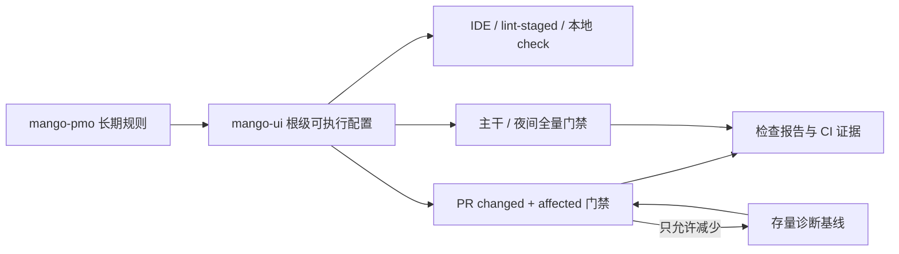
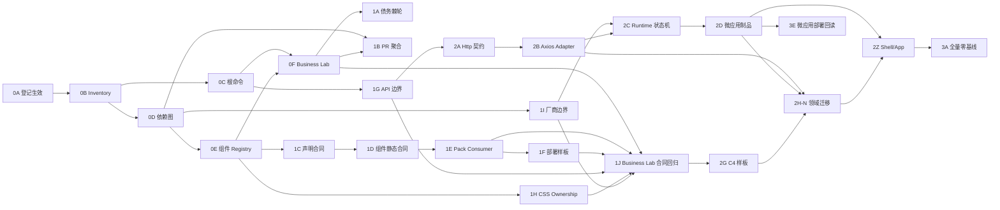

# Mango 前端代码与组件规范落地方案及执行计划

> 历史基线说明：本文保留最初的完整设计与阶段拆分。前端规范的采用边界和完成定义已由 [前端规范采用与发布边界决定](./2026-07-19-frontend-standards-adoption-boundary.md) 修订；本文涉及部署 registry、生产灰度、故障注入和生产回滚的内容仅是可选的独立业务部署/运维扩展，不属于前端代码规范毕业门禁，也不触发 `mango-release`。

**状态**：IMPLEMENTED_PRODUCTION_CANDIDATE（本地候选；未发布、未部署）
**日期**：2026-07-18
**交付模式**：STANDARD
**风险结论**：需求影响 L1、方案风险 L2、最终 L2
**工作区决策**：M01=CREATE，`docs/frontend-standards-plan`
**适用保障**：M07 治理决策、M09 静态验证、M14 专家复核

## 1. 明确目的

本预案的唯一目的，是把 Mango 已有的 Vue 3、Element Plus、TypeScript、测试和 Monorepo 书面规范转换为可执行、可渐进、可审计的工程闭环，使开发者和 Agent 能从同一入口回答四个问题：

1. 新代码必须满足哪些规则。
2. 代码应放在哪一层、允许依赖谁。
3. 本次改动必须执行哪些检查，以及检查失败代表什么。
4. 存量债务如何只减不增，并最终进入全量硬门禁。

预案完成后，不能再出现“规范要求执行 `pnpm lint`，但命令本身不可用”“Vite build 通过，却没有执行 Vue 类型检查”“目录边界写在文档中，但跨层依赖无人阻断”这三类断裂。

本设计不直接修改长期规则。长期规则仍只维护在：

- [Vue 代码规范](../../mango-pmo/rules/frontend/01-vue-code.md)
- [Element Plus UI 规范](../../mango-pmo/rules/frontend/02-element-plus-ui.md)
- [前端组件开发规范](../../mango-pmo/rules/frontend/03-component-development.md)
- [前端测试规范](../../mango-pmo/rules/frontend/04-test.md)
- [前端开发流程](../../mango-pmo/rules/frontend/05-dev-flow.md)
- [前端 Monorepo 架构规范](../../mango-pmo/rules/frontend/06-monorepo-architecture.md)
- [Admin UI 通用规范](../../mango-pmo/rules/frontend/07-admin-ui-common.md)

### 1.1 单拥有者治理模式

本方案采用单拥有者模式，唯一责任角色为 `Frontend Standards Owner`。该 Owner 对范围、架构决定、实施顺序、例外、回滚和最终结果承担责任；其它 Tech Lead、工具链、Runtime、组件、QA、Release、PMO 角色只作为执行者或证据提供者，不拥有第二票否决权，也不形成会签链。package/component registry 中的 `ownerRole` 仅表示日常维护执行归属，不是方案 Owner，也不产生批准权限。

方案状态由版本化事实和机器门禁推进：设计文档完整、专家阻断项为零、静态一致性检查通过后从 `draft` 自动进入 `ready`。仓库保持 single-owner、`requiredApprovingReviewCount=0`，不需要独立 reviewer、会签或批准票；唯一 Owner 在 required checks 成功且对话已解决后合并受保护 PR，PR 合并记录使方案正式进入 `effective`。这一步是单拥有者的外部写操作授权和可追溯登记，不是第二人审核。后续 PR 同样在前置依赖、required checks、验证证据和回滚入口满足后进入 ready，由同一 Owner 合并推进；失败仍由该 Owner 收口。真实 UI 语义检查可以由浏览器自动化或 Owner/Agent 走查完成，它是质量证据，不是人工审批。

单拥有者模式不扩大外部写操作权限。提交、push、创建/合并 PR、发布、推广、生产部署和恢复仍分别遵循对应授权边界；这些操作授权不是方案审核，也不改变唯一技术责任归属。

## 2. 范围与非目标

### 2.1 本次预案覆盖

- `mango-ui` 根工具链和所有 `apps/*`、`packages/*` 的统一命令契约。
- Vue SFC、TypeScript、ESLint、Prettier、Stylelint、Vitest、Playwright 的职责边界。
- `apps`、公共包、契约包和业务域包的目录职责与依赖方向。
- 页面私有组件、领域复用组件、Mango 仓内公共组件和业务项目公共组件的分级、晋级、降级与公开契约。
- 单体、微前端和 npm 独立消费下的组件样式、资源、副作用、provider 和兼容性验证。
- 业务 package 的 typed API、service/composable 分工、HttpClient/provider 注入，以及页面、组件与 CSS 的明确放置位置。
- 当前腾讯 Wujie 微前端与 Axios 请求层的事实确认、厂商隔离、默认技术栈和默认 UI 组件目录。
- FE4 微应用的厂商无关生命周期、多实例、独立构建制品和宿主兼容合同；部署、灰度和生产回滚另属独立业务部署/运维扩展。
- PR、主干定时、夜间和发布前的分层检查。
- 存量 ESLint 和 TypeScript 债务的基线、棘轮、清理和退出条件。
- Mango CLI 生成项目与 Mango 自身 Monorepo 的规范一致性。
- 机器检查与真实 UI/架构语义验证的明确边界。

### 2.2 本次不做

- 不在预案文档中新增第二套长期前端规范。
- PR-0A 方案登记不直接升级 Vue、Vite、Element Plus、TypeScript 或 pnpm 主版本；工具链统一只在专门的 PR-0C 执行，不与业务迁移混改。
- 不在一个 PR 中格式化全仓并修复全部存量类型债务。
- 不引入 SonarQube、独立质量服务器或新的生产运行时依赖。
- 不用静态检查代替真实接口、权限、租户、单体和微前端 UI 验收。
- 不要求所有改动机械执行完整 E2E；验证继续按真实观察面选择 M09-M16。

## 3. 当前事实基线

基线来自 2026-07-18 在 `main@6b222187a` 的只读诊断。

| 事实 | 当前结果 | 影响 |
|---|---|---|
| Vue SFC | 257 个 `.vue` 文件，256 个使用 `script setup` | 代码习惯已基本迁移，可把新代码要求升级为硬门禁 |
| 根 lint | `pnpm lint` 失败：37 个被选 workspace 均无 `lint` 脚本 | 规范中的提交前 lint 当前不可执行 |
| 根 test | `pnpm test` 不存在 | 规范命令与工程入口不一致 |
| ESLint 统一诊断 | `apps + packages` 共扫描 725 个 `.ts/.vue` 文件：95 errors、12724 warnings，其中 5 个 fatal | 不能直接把存量全量升为零 warning，必须先拆格式与缺陷规则 |
| `mango-admin` typecheck | `vue-tsc --noEmit` 失败，包含 API 模型、字符串 ID、路由、i18n、测试导出等问题 | `vite build` 不能作为类型正确证据 |
| `packages/common` typecheck | Vite/Vitest 配置类型入口冲突 | 包构建和类型门禁职责混合 |
| workspace typecheck | 32 个直接使用 `vue-tsc` 的 tsconfig 中仅 1 个通过 | 必须先解决冷 checkout 下 workspace 声明可解析，再区分配置错误与源码错误 |
| 单元测试入口 | 现有 `common` 测试有失败；部分 package/app 有测试资产但没有统一 `test:unit` 脚本 | 禁止用 `--if-present` 把缺脚本伪装为通过 |
| E2E 资产 | 63 个 spec 中多数缺少 P0-P3 标识，并存在 `nth`、固定等待、`force` 和 `.el-*` 等脆弱定位 | 需要按 case 建 inventory，并迁移到语义锚点，不能把现有数量直接当覆盖证据 |
| CI | 现有 GitHub Actions 未执行前端 lint、typecheck、unit 或 workspace build | 本地错误没有 PR 级阻断 |
| 发布检查 | 已有 exports、样式聚合和独立 consumer typecheck | 发布治理能力应保留并接入统一门禁 |
| 运行时依赖图 | 已存在 `admin-pages -> system -> file -> admin-pages` 的 manifest 强连通环 | 仅补目录示例无法形成有效边界，必须先定义层级并拆分组装职责 |
| 工具版本来源 | 根与 package 的 TypeScript、Vite、Vue 编译器和格式工具版本不一致 | 应先统一版本来源，再分别验证升级，不直接追逐最新版本 |

### 3.1 当前组件事实

初始目录样本按 `apps/**/components/**/*.vue`、`packages/**/components/**/*.vue` 的实际文件计算；它用于描述现状，不作为完整资产全集：

| 事实 | 当前结果 | 结论 |
|---|---|---|
| `components/` 样本 | 97 个 Vue 组件文件 | 已形成可观的组件资产，但目录名不能代表完整 inventory |
| 主要分布 | `common` 33 个、`admin-shell` 16 个、`payment` 8 个，其余 40 个分布在其它领域 package 和 app | 公共基础、宿主示例和领域组件混在同一统计口径，需按消费者而非按目录名判断等级 |
| 页面私有组件 | 28 个位于 `views/**/components` | 目录方向基本正确，但尚未证明都没有被跨包深导入 |
| package/app 级候选 | 69 个 | “位于共享目录”不等于已具备稳定公共契约，需要逐个分类 C2-C4 |
| 命名导出 | 约 59 条组件导出语句 | 当前导出只能证明可见性，不能证明面向谁、稳定到什么程度 |
| API 类型 | 77 个使用类型化 `defineProps`，58 个使用类型化 `defineEmits`，23 个使用 `defineExpose` | Vue API 基础较好，但公开 props/emits/slots/expose 仍需声明态与消费态证据 |
| 样式 | 83 个组件含样式，81 个使用 scoped；20 个 package 导出 `./style.css` | 样式随包发布已有基础，仍需校验隔离容器、资源路径和未 scoped 例外 |
| 文档 | 仅 3 个组件目录 README | 文档覆盖明显不足，不能把根导出自动视为业务项目稳定 API |
| 测试 | 19 个组件相关测试文件 | 覆盖集中在少数 package，尚未按组件等级关联必需场景 |
| 大型组件 | 多个组件超过 500 行，最高超过 2000 行 | 行数不是拆分门禁，但提示职责、测试和 owner 风险，应按实际复用与变更频率治理 |

目录样本之外，当前还存在至少 8 个 `src/widgets/**/*.vue`，其中若干已通过 package subpath 公开；layout、runtime、registrar 间接引用的 SFC 也可能具备组件属性。因此正式 inventory 从全部 `.vue/.tsx` 出发，结合 package/source export graph、registrar 和 widget metadata 发现候选，并区分页面、布局、运行时入口和组件；当前仓库 `.tsx` 为 0。所有公开导出的 Vue 组件必须进入分类，最终总数由机器报告动态给出，不能把 97 固定成全集。

现状中已有可复用基础：组件主要位于 packages、样式普遍提供 package 入口、部分组件已经采用 props/event/slot 和完整 API 文档。主要缺口是“导出可见性”和“公共稳定性”混为一谈；尤其 `packages/common` 同时承载页面骨架、组件、请求、会话、菜单、权限、主题、实时能力及工具函数，它是 Mango 管理端基础包，不是天然的通用网站组件库，不能把其根入口导出的全部对象直接认定为对外稳定组件。

### 3.2 当前微前端与 HTTP 技术事实

| 项目 | 当前事实 | 结论 |
|---|---|---|
| 微前端框架 | `@mango/app-runtime` 依赖 `wujie@^1.0.29`，lock 解析为 `1.0.29` | 当前采用腾讯开源的 Wujie（无界），不是 qiankun |
| 主应用适配 | runtime 动态调用 `startApp/preloadApp/destroyApp`，使用 `alive/fiber/props/lifecycle` | Wujie 已由 runtime adapter 封装，具备继续治理的基础 |
| 子应用适配 | `createMangoWujieVueApp()` 同时支持独立启动和 Wujie 生命周期，微前端态使用 memory router | 已有“可单可微”基础；目标改为 vendor-neutral bootstrap，global 只留在 child bridge |
| 运行配置 | `monolith/hybrid/micro` profile，模块可选 `local/micro`，entry 有 origin/host allowlist | 开发与部署切换已具备运行时配置入口，不应在业务代码再分叉 |
| HTTP 底层 | `common/utils/request.ts` 使用 Axios；声明范围 `^1.3.3`，当前 lock 为 `axios@1.15.0` | Axios 是当前事实标准，可保留为默认 transport adapter |
| HTTP 耦合 | 当前单例同时读取 Session、弹 UI 消息、处理跳转，并通过 `window.$wujie` 解析 base URL | 属于待迁移债务；不能作为未来业务 package 直接依赖标准 |

方案不在本次直接切换微前端框架或 HTTP 库。先固定 vendor adapter 和公开契约，补齐验证后再决定是否需要替换；没有可量化缺口和迁移收益时不启动框架迁移。

现有 `scripts/generate-package-types.mjs` 使用 `transpileDeclaration`，并把 Vue 组件生成为宽泛的 `DefineComponent<Record<string, unknown>, ...>`。该脚本能生成发布占位声明，但不具备完整程序类型检查和公开组件 props/emits 类型证明能力，不能替代 `vue-tsc`。

本次 ESLint 口径可由安装依赖后的 `pnpm --filter mango-admin exec eslint ../../apps ../../packages --ext .ts,.vue --format json` 复现；lint 返回非零是已知基线结果。typecheck、unit 和 E2E 的临时盘点命令存在入口分散问题，Phase 0 必须把动态 workspace/test inventory 固化为 root raw 命令和机器报告，禁止继续依赖人工循环得到 N/N。

## 4. 外部实践输入

本预案只吸收公开仓库可验证的工程模式，不把无法验证的企业内部流程写成事实：

- Vue 官方推荐 SFC + Composition API 使用 `script setup`，并用 `vue-tsc` 做命令行类型检查。
- Vite 官方明确只转译 TypeScript，不执行类型检查，静态检查应与 transform 分离。
- Element Plus 官方同时支持全量和按需导入；按需自动导入适合应用，但 Mango 可发布包还必须保证脱离宿主 Vite 插件后可独立消费。
- 腾讯 TDesign Vue Next 使用独立 `lint`/`lint:fix`、`tsc --noEmit`、`--max-warnings 0`、Husky 和 lint-staged。
- 阿里 `f2e-spec` 使用统一 ESLint/Prettier、lint-staged、commitlint 和 Vitest。
- Element Plus 自身使用根级 lint、分目标 typecheck、Vitest、提交钩子和零 warning。
- 字节 Arco Design Vue 的公开工程体现 ESLint、Prettier、Stylelint、Monorepo 和提交检查组合；只参考门禁结构，不复制其历史版本。
- 腾讯 Wujie 官方采用 Web Components + iframe，实现 CSS/JS 原生隔离，并公开保活、预加载、多应用、生命周期、插件和 Vite 支持；与 Mango 当前实现一致。
- 阿里 qiankun 公开实践强调子应用独立开发/部署、HTML entry、样式隔离、JS sandbox 和预取；本方案吸收独立交付与宿主边界，不因此替换现有 Wujie。
- 字节 Garfish 公开实践强调独立开发/测试/部署、Loader/Router/Sandbox/Store 和插件扩展；用于复核 adapter、观测和多实例边界。
- 京东 MicroApp 公开实践强调 WebComponent 化接入、低侵入、沙箱、样式隔离、预加载和通信；用于复核业务接入成本与隔离验证。
- Axios 官方提供实例、interceptor、transform 和 AbortController 取消能力；Mango 采用其作为 FE1 transport 实现，但对业务 package 只公开自有 HttpClient 契约。

版本选择遵循“先统一来源、后单独升级和兼容验证”，不以 registry latest 直接替换 Mango 已认证版本。

公开依据见文末“参考资料”；大厂公开仓库只能证明其开源工程实践，本文不把不可见的内部流程包装为事实。

## 5. 方案比较

| 方案 | 做法 | 优点 | 主要问题 |
|---|---|---|---|
| A. 一次性全仓清零 | 先修完所有 lint/typecheck，再启用 CI | 最终状态简单 | PR 巨大、业务回归面不可控、无法快速建立新增债务阻断 |
| B. 仅检查 changed files | 只 lint/typecheck Git 改动文件 | 上线快、成本低 | TypeScript 错误可能出现在未改消费者；不能证明 package 公共契约 |
| C. 分层门禁 + 债务棘轮 | 新代码零 warning；存量按稳定诊断基线只减不增；干净 package 升级全量门禁 | 能立即阻断新增问题，又允许可审计迁移 | 需要实现诊断基线和 affected-scope 编排 |

采用方案 C。方案 B 只作为第一阶段的局部加速手段，不能单独作为最终类型门禁。

## 6. 目标治理架构



### 6.1 唯一责任

| 层次 | 唯一责任 | 禁止承载 |
|---|---|---|
| `mango-pmo/rules/frontend/*` | 长期语义、边界、禁止项和验收原则 | 工具私有配置、诊断基线、生成产物 |
| `mango-ui` 根配置 | ESLint、Prettier、Stylelint、TS、测试和命令实现 | 重复书写 PMO 规则正文 |
| package 配置 | package 特有入口、构建、测试和公开契约 | 各自复制一套 lint/format 规则 |
| CI 流水线 | 调用统一命令、选择范围、上传报告 | 在 YAML 内重新实现规则 |
| `mango-docs` | 本次方案、取舍、迁移和评审记录 | 长期强制规范 |

### 6.2 建议的工具归属

第一阶段采用根级共享配置，复用实现放在仓库内部 tooling/scripts，避免过早发布内部配置包：

```text
mango-ui/
├── eslint.config.mjs
├── prettier.config.mjs
├── stylelint.config.mjs
├── tsconfig.base.json
├── vitest.workspace.ts
├── quality-gates.json
├── tooling/                # 配置实现、fixture 与测试，不进入运行时依赖层级
└── scripts/quality/
    ├── check-affected.mjs
    ├── check-boundaries.mjs
    ├── check-diagnostic-baseline.mjs
    └── verify-command-contract.mjs
```

只有业务项目也需要直接安装和复用这些配置时，再把稳定配置发布为 `@mango/eslint-config` 或 `@mango/frontend-tooling`。在此之前不增加发布包和版本联动成本。

## 7. 目录与依赖预案

框架不强制唯一业务目录名，也不要求每个 package 机械创建空目录；Mango 强制的是职责、公开入口和依赖方向。目标结构为：

```text
mango-ui/
├── apps/<deploy-unit>/
│   └── src/
│       ├── bootstrap/       # 应用创建、插件和全局初始化
│       ├── layouts/         # 宿主布局
│       ├── router/          # 路由聚合
│       ├── stores/          # 仅宿主状态
│       └── runtime/         # 单体/微前端运行时装配
└── packages/
    ├── api-schema/          # 跨包 API 契约、ApiId
    ├── common/              # 无业务域公共能力
    └── <domain>/
        ├── package.json
        ├── style.css        # 仅发布运行样式的页面/组件包需要
        └── src/
            ├── api/         # DTO 与请求函数
            ├── services/    # 可选：多 endpoint 业务用例编排
            ├── types/       # 领域类型
            ├── views/<feature>/
            │   ├── index.vue
            │   └── components/  # 页面私有组件
            ├── components/  # 域内复用组件
            ├── composables/ # useXxx
            ├── registrars/  # 页面/能力注册
            ├── utils/       # 纯函数
            ├── __tests__/
            └── index.ts     # 公共入口
```

### 7.1 Package 分层矩阵

| 层级 | 类型 | 典型职责 | 允许依赖 |
|---|---|---|---|
| FE0 | Contract | `api-schema`、跨包 DTO、`ApiId`、纯类型契约 | 无内部依赖或其它 FE0 |
| FE1 | Foundation | `common`、app runtime、扩展 SDK、无领域语义基础能力 | FE0 |
| FE2 | Domain/Capability | `auth`、`rbac`、`system`、`file`、`link` 等业务能力 | FE0、FE1；经登记的稳定领域入口 |
| FE3 | Composition/Shell | 页面注册组装、admin shell、聚合入口 | FE0-FE2 |
| FE4 | App | 可部署单体、微前端入口 | FE0-FE3 |

`FE0-FE4` 仅表示前端运行时架构层，机器字段固定为 `architectureLayer`，不得与 PMO 风险 `L0-L3` 混用。依赖只能由高层指向低层。同层跨领域依赖默认禁止；确有业务必要时，例外必须记录 `from/to/reason/ownerRole/adr/decisionEvidence/expiresAt`，命中真实 `exports`，并证明不形成循环。tooling 使用独立 `TOOLING` 层，不进入运行时五层。

### 7.2 机器边界

1. `apps/*` 可以依赖公开的 `packages/*`，`packages/*` 禁止依赖 `apps/*`。
2. `apps/*` 必须 `private: true`，只负责启动、布局壳、路由聚合、权限拦截、全局初始化、微前端装配和部署配置。
3. `common` 只依赖 FE0、明确 peer 和登记的无业务域运行依赖；禁止依赖业务域包、宿主 router/store/i18n。新 package 禁止 wildcard exports。
4. FE0 契约包禁止包含页面、状态、请求实例和 Element Plus 实现；DTO 默认留在领域，存在多个稳定消费者时才上移。
5. 跨 package import 只能使用 package `exports`；禁止引用另一个 package 的 `src`、仓库别名或相对源码路径。
6. 页面私有组件不得从 package 公共入口导出；域内复用组件才进入 `src/components`。
7. package 内允许相对 import，但禁止相对路径逃出 package 根；跨包依赖必须在 `package.json` 声明。
8. source import graph 与 manifest graph 都禁止新增强连通环；checker 对解析失败、输入为零和未知 package 角色 fail-closed。
9. source mode alias 必须从 package manifest 的源码入口映射生成；本地源码模式通过不能替代 package mode 的 pack + consumer 验证。
10. `packages/common` 当前无统一 `src` 是兼容边界；先由 checker 识别，再作为独立迁移任务规范化，禁止为统一目录一次性改写全部公开路径。

app 可以保留部署单元专属、明确不可复用的登录回调、错误页和运行态诊断页；checker 依据 package 角色与依赖边判断，不因存在 `views` 目录机械拒绝。

### 7.3 机器数据源与图语义

- 每个 workspace 的 `package.json#mangoArchitecture` 是 package 角色的唯一机器源，必填 `architectureLayer`、`role`、`domain`、`ownerRole`、`sourceExports`、`nonCodeExports`。`architectureLayer` 枚举为 `FE0/FE1/FE2/FE3/FE4/TOOLING`，`role` 枚举为 `contract/foundation/domain/composition/app/tooling`，且 `role=tooling` 必须对应 `TOOLING`。`domain` 是显式稳定 slug，同一领域多包使用相同值，checker 禁止从包名推断。FE0/FE1 使用 `platform` 或由 Frontend Standards Owner 登记的基础能力 slug，FE2/FE3 使用业务域 slug，FE4 使用装配目标 slug；修改 layer/role/domain 触发全图机器校验和 Owner 决策记录。
- `sourceExports` 形如 `{".": {"source": "./src/index.ts", "kind": "code"}}`，以 `package.json#exports` 的代码 subpath 为 key；`nonCodeExports` 形如 `{"./style.css": {"source": "./style.css", "dist": "./dist/style.css", "generation": "static"}}`。两者 key 不相交、并集完整覆盖 exports；source target 必须存在且位于本 package。source alias 与 build input 只从该映射生成，删除现有独立 `BASE_PACKAGE_ENTRIES` 清单。
- 存量 wildcard export 仍以相同 wildcard key 登记 `sourcePattern` 和 `expiresAt`，checker 展开并验证实际文件；新 package 禁止 wildcard。非代码样式入口必须在 cold checkout 可解析，或声明可复现的生成前置命令；package mode 继续验证 dist 与 tarball。
- 根 `mango-ui/architecture-exceptions.json` 只保存跨域依赖例外和历史 SCC 债务，不保存长期规则。schema 固定包含 `schemaVersion`、`exceptions[]`、`legacySccs[]`；例外字段为 `from/to/reason/ownerRole/adr/decisionEvidence/expiresAt`。
- `legacySccs[]` item 固定为 `id/graphKind/members/edges/ownerRole/adr/targetPhase`；`graphKind` 枚举为 `manifest/source-runtime/contract/combined`，`members` 字典序排序，`edges` 使用排序后的 `{from,to,kind}`。checker 对 canonical JSON 计算稳定 hash：SCC 拆分、成员或边减少允许在专门清债 PR 写回；SCC 合并、新成员、新规范化边或全新 SCC 失败。
- 普通 PR 不得新增例外。确需新增时，使用独立架构治理 PR，关联 Owner 生效的 ADR/决策证据并由 checker 校验有效期；过期、无决策记录、数量增加但无本次机器可读证据均失败。
- manifest runtime graph 包含内部 package 的 `dependencies`、`optionalDependencies`、`peerDependencies`；`devDependencies` 进入 tooling graph，不作为运行时边，但仍检查声明和层级。
- FE0-FE4 package 禁止在 runtime dependencies/源码运行时 import 中依赖 TOOLING，只能在 `devDependencies` 或构建脚本使用；TOOLING 之间及其对公开 runtime 契约的依赖进入独立 tooling allowlist/graph，同样禁止循环、源码深导入和未声明依赖。该规则可判定现有 CLI/PMO 工具关系而不污染运行时层级。
- source runtime graph 包含静态 value import/export、字符串字面量动态 import/require 和 CSS `@import`；type-only import/export 进入 contract graph。runtime、contract 及其合并 package graph 都执行层级与 exports 检查，合并图禁止新增 SCC。
- 无法静态解析的内部动态 import fail-closed，必须改为 manifest 驱动注册或登记限时例外。当前 SCC 写入 `legacySccs`，任何新增成员、边或新 SCC 均失败；减少只在专门清债 PR 写回。

### 7.4 当前循环的迁移决定

当前 `@mango/admin-pages` 同时承担扩展契约、默认页面组装、功能开关和开发示例，已经形成 `admin-pages -> system -> file -> admin-pages`。采用新增低层扩展 SDK、保留高层组装包的兼容路线：

1. 新建 FE1 `@mango/admin-extension`，承接 `core/features/notice` 等无业务实现的扩展契约；`notice` 现用的 realtime 类型先上移 FE0 或改为 SDK 自有最小契约，禁止为抽包新增未登记的 FE1 同层依赖。
2. 先把 `file` 等 FE2 registrar 依赖从 `@mango/admin-pages/*` 迁到 `@mango/admin-extension/*`，每迁一包即断言合并图 SCC 只减不增。
3. `@mango/admin-pages` 保持 FE3，继续拥有 `defaults` 和具体页面组装；它可以依赖 FE2 业务 registrar 和 FE1 扩展 SDK，但 FE2 禁止反向依赖它。
4. 旧 `@mango/admin-pages/core|features|notice` 仅在 FE3 包内向下 re-export FE1 SDK，供仓外消费者兼容；Mango 仓内 FE2 import 迁移后由 checker 禁止再使用旧入口。
5. 兼容入口保留一个 minor release 窗口并标记 deprecated；窗口结束后由独立发布影响验证和 Owner 决策记录决定移除。`admin-pages -> system -> file -> admin-pages` 在 `file` 迁移批次必须清零，否则该批次不得合并。

### 7.5 组件采用 C0-C4 分级

组件等级与 FE0-FE4 package 架构层是两套不同维度：FE 表示 package 在运行时依赖图中的位置，C 表示单个组件的消费范围和契约强度。

| 等级 | 定位 | 默认目录与公开方式 | 目标门禁 |
|---|---|---|---|
| C0 | Element Plus 或第三方基础控件直接使用 | 不创建 Mango 包装组件 | 不是仓内组件等级；现有无意义 wrapper 被识别后登记替换/删除批次 |
| C1 | 页面私有组件 | `views/<feature>/components`；不得从 package 入口导出 | package 内可访问，跨 package 深导入失败 |
| C2 | 单 package 内复用组件 | `<package>/src/components`；仅供本 package 内页面和能力使用 | 允许本 package 的领域 API/契约依赖，不从公共 exports 暴露 |
| C3 | Mango 仓内公共组件 | 仅从 `private:true` workspace package 显式导出，并登记 workspace-public 契约 | 跨 package 消费者、类型、样式和受影响验证完整；不得进入发布 tarball |
| C4 | 业务项目公共组件 | 稳定 npm export、公开文档和版本契约 | 独立安装、构建、类型、运行、单体及微前端验证 |

晋级以真实消费者证据触发，而不是按复用次数机械判定：

- C1 → C2：至少两个同领域真实用例，语义一致且不是为未来猜测提前抽象。
- C2 → C3：存在实际跨 package 消费者，依赖方向合法，组件不再携带单一页面或对象的私有语义；即使两个 package 属于同一 domain 也必须晋级。
- C3 → C4：存在业务项目消费者、明确 owner、稳定 API、文档、示例、测试、样式入口、独立 tarball consumer 和弃用策略。
- 发现公共组件只有单一消费者、持续携带宿主语义或 API 无法稳定时，可以在兼容迁移后降级；降级不能直接删除既有 C4 契约。

C1/C2 被其它 package 使用时不允许临时深导入，必须先完成对应晋级。C0 不进入组件 registry；inventory 发现现有无意义 wrapper 时必须给出替换消费者、删除文件和退出日期，不允许长期用 C0 标签保留。C3 修改需要验证所有受影响仓内消费者；C4 的破坏性变化进入 semver、弃用窗口和迁移说明流程。

C3 只能存在于 `private:true` 且明确排除发布的 workspace package；发布包不得在 runtime dependencies 中依赖 C3 私有包。`private:false` package 的真实公开 export 一旦可跨 package 消费，即按 C4 承担仓外契约；尚未稳定的能力可以标记 `stability=experimental`，但仍需文档、版本和弃用责任。现有可发布根 export 在完成分类前进入精确 legacy 基线，不能因历史可见性被虚标为 C3，也不能逃避后续 C4 迁移。

### 7.6 组件与部署采用正交多轴

“开发在哪里”和“部署到哪里”分开建模，避免为了单体、微前端或本地联调复制组件：

| 轴 | 可选值 | 说明 |
|---|---|---|
| 消费等级 | C0-C4 | 决定目录、公开 API、稳定性和验证强度 |
| host profile | `host-agnostic` / `mango-runtime` / `admin-shell` | 决定组件允许依赖的宿主契约 |
| environment profile | `universal` / `browser-only` | 决定环境能力和生命周期验证 |
| distribution | `workspace` / `npm` | 决定分发与制品合同 |
| deployment modes | `monolith` / `microfrontend` | 决定运行拓扑验证，不决定源码位置 |

- `host-agnostic` 只通过 props、emits、slots 和显式 provider 工作，适合作为 C4 默认目标。
- `mango-runtime` 可以依赖公开的 Mango runtime/provider 契约，但不能依赖某个 app 私有 store、router、菜单或环境变量。
- `admin-shell` 只适用于明确属于宿主壳的组件，不得包装为业务项目通用组件。
- `browser-only` 用于确实依赖 DOM、WebSocket、SSE、预览器、worker 等浏览器能力的组件；需要声明 SSR/非浏览器不适用，并验证副作用释放。

C3/C4 的 `deploymentModes` 不得为空；C4 的 `distribution` 必须包含 `npm`，且 `hostProfile` 不得为 `admin-shell`；C3 至少包含 `workspace`。一个组件可以同时是 `host-agnostic + browser-only + npm + monolith/microfrontend`，从而准确表达“同一 npm 制品在两种拓扑中运行”。

API base、鉴权/租户上下文、导航、字典和远程数据通过 host/provider/config 注入。组件源码不编码后端是本地单体还是远程微服务；开发态和部署态使用同一公共契约，只更换运行配置。微前端不是新的组件等级，也不产生第二份组件实现。

### 7.7 组件合同机器源

不再把组件信息散落在 README、目录和 `index.ts` 中。实施时为含 C3/C4 或 legacy public export 的 package 建立 `component-contracts.json`，只登记组件治理事实；源码和非代码导出仍由 `package.json#mangoArchitecture` 作为唯一映射源，避免重复维护路径：

```json
{
  "schemaVersion": 1,
  "components": [
    {
      "name": "MangoGridLayout",
      "exportKey": ".",
      "exportName": "MangoGridLayout",
      "styleExportKeys": ["./style.css"],
      "level": "C4",
      "hostProfile": "host-agnostic",
      "environmentProfile": "browser-only",
      "distribution": ["workspace", "npm"],
      "deploymentModes": ["monolith", "microfrontend"],
      "stability": "stable",
      "ownerRole": "Mango 前端组件维护者",
      "docs": {
        "path": "README.md",
        "requiredSections": ["when-to-use", "examples", "api", "providers", "styles", "compatibility"]
      },
      "testEvidence": ["src/components/__tests__/MangoGridLayout.spec.ts"]
    }
  ]
}
```

checker 用 `exportKey + exportName` 关联 `mangoArchitecture.sourceExports` 和真实具名导出，用 `styleExportKeys` 关联 `nonCodeExports`，验证源文件、类型、样式和 tarball 产物，不在 registry 重复保存 source/dist。无运行样式统一表达为 `styleExportKeys: []`，并额外填写 `styleNotApplicableReason`，不再使用第二种 `notApplicable` 值。只有 C3/C4 强制登记；C1/C2 由目录 inventory 发现，并检查未被越级导出或深导入。registry 缺 owner、文档、稳定性、四轴范围或实际导出时失败；扫描输入为零时失败。

为避免现有根导出被冻结或被虚假提升，schema 同时提供临时 `legacyComponentExports[]`，每项固定记录 `exportKey/exportName/ownerRole/targetPhase/exitCriteria`。checker 对精确存量 identity 允许保持不变，对新增未分类导出直接失败；专门清理 PR 只能删除 legacy identity，禁止新增、改名转移或延后目标阶段。PR-1D 的 report-only 只覆盖这里精确登记的存量项，新导出和已进入 C3/C4 的组件始终硬阻断。

### 7.8 公共组件契约

C3/C4 的契约面包括而不限于：

- 类型化 props、emits、slots、标准 `v-model`、必要的 expose 和错误语义；公开类型从根入口或明确 subpath 导出。
- loading、empty、error、disabled/readonly 和远程数据失败由 API 可控制，不依赖宿主私有状态。
- class 前缀、CSS 变量、Element Plus/Mango token 和包内资源路径；有运行样式时使用唯一 `./style.css` 入口，无运行样式时登记 `styleExportKeys=[] + styleNotApplicableReason`，并由 consumer 证明不需要额外 CSS。
- import 阶段零请求、零全局注册、零隐式路由跳转；定时器、监听器、observer、socket 和外部实例在卸载时释放。
- Vue、Element Plus 和适用 Mango 基础契约按 peer/external 处理；不得依赖未声明的 transitive dependency。
- 文档说明适用/不适用场景、基础与边界示例、API、样式变量、provider、环境要求和迁移方式。

文档门禁机器校验 registry 声明的 required sections 存在且非空、API 表与公开声明一致、示例只引用公开入口；内容是否准确仍由组件专家角色和 consumer 证据验证，不能用“README 锚点存在”冒充语义完整。C4 API diff 首选上一已发布版本的声明/registry snapshot；首次发布使用已生效 main snapshot。两种基准都缺失时 fail-closed，不允许自行假定“无破坏变化”。

组件行数、出现次数和是否放在 `common` 都不是公共等级的充分条件。大组件优先检查职责、可测试边界和 owner；只有拆分能降低真实变更耦合且不破坏公共 API 时才进入重构批次。

### 7.9 组件验证矩阵

| 级别 | 静态/类型 | 组件测试 | package/消费者 | 浏览器与部署 |
|---|---|---|---|---|
| C1 | 所属 package lint/typecheck | 按交互风险选择 | 不适用 | 随页面验收 |
| C2 | 所属领域 lint/typecheck、禁止跨包深导入 | 复用逻辑和输入输出 | 领域 build | 随受影响领域入口验收 |
| C3 | registry、exports、公开类型、affected consumers | 输入输出、加载/空/错和副作用 | workspace consumer typecheck/build | 涉及共享 UI 时验证受影响宿主 |
| C4 | C3 全部 + semver/弃用检查 | 公共 API 与兼容场景 | pack + 冷环境独立 consumer | 只执行 registry `deploymentModes` 声明的单体/微前端隔离样式与运行验证 |

C4 微前端样式验证读取隔离容器内关键元素的 computed style；只检查宿主 document 中存在 CSS 文本不算通过。浏览器验证只在组件行为或可见结果变化时启用，不把每次文档或类型修改机械升级为完整 E2E。

### 7.10 当前组件迁移优先级

1. 先从全部 `.vue/.tsx`、export graph、registrar 和 widget metadata 生成只读 inventory；97 个 `components/` 文件与 8 个已知 widget 只是对账样本。确认所有候选的 C1/C2/C3/C4、owner、export 和实际消费者，不在盘点 PR 中改公共 API。
2. 优先为已有明确仓外消费意图且文档较完整的布局、文件等组件建立 C4 样板；样板通过后再批量迁移，避免 69 个候选一次性贴 C4 标签。
3. 对 `common` 先逐项分类，再按消费者证据拆分职责；不执行大爆炸重命名或整包拆分，现有根 export 在兼容窗口内保持。
4. 对 payment、file、system 等含浏览器副作用或超大组件的 package，先补 host/environment/distribution/deployment 四轴、provider/baseUrl、cleanup 和测试证据，再决定拆分，不用行数触发自动重构。
5. app 内的两个组件先判断是否为宿主专属；宿主专属保留 `admin-shell` profile，具备复用证据时再迁入 package，禁止复制。

### 7.11 业务 package API 归属与契约

当前初步盘点发现 15 个 package 存在 `src/api`，共 36 个 TypeScript 文件；约 29 个文件复用统一 request client，未发现 API 文件直接读取环境变量，但仍有个别文件直接使用 `fetch`。现状方向基本正确，缺口是目录职责、client 注入和公共 export 尚未形成统一机器合同。

目标调用链固定为：

```text
Vue page / C1-C2 component
        ↓
composable（Vue 状态、加载与取消）或 service（业务用例编排）
        ↓
package src/api（DTO、相对 endpoint、typed request function）
        ↓
host 注入的 HttpClient / runtime provider
        ↓
单体后端、网关或远程微服务
```

目录责任如下：

- `src/api/` 只放请求/响应 DTO、相对 endpoint 和 typed transport function；不放 Vue ref、页面状态、ElMessage、router、store 或 DOM 行为。
- `src/services/` 只在一个用户动作需要组合多个 endpoint、做领域转换或形成可复用用例时创建；简单 CRUD 不机械包一层 service。
- `src/composables/` 承担 Vue 响应式状态、加载/错误/取消和生命周期；不重新定义 HTTP DTO。
- `views/**/*.vue` 和组件模板不直接出现 `fetch/axios/request`、服务地址、网关路径或鉴权 header；页面调用 composable/service，简单场景可以调用同 package 的 typed API function。
- C3/C4 远程组件通过显式 `loader/provider/client` 契约取得数据；不得在组件内部绑定某个业务环境或宿主私有 request instance。

API contract 采用以下决定：

1. HttpClient 的纯类型接口归属 FE0 契约，默认 runtime/provider 实现归属 FE1；host 负责实例化并注入 base URL、鉴权、租户、trace、超时和统一错误适配。业务 package 只声明相对 endpoint，不自建 provider、不读取 `import.meta.env`，不写死 origin、服务名或单体路径。
2. 单体、后端微服务和远程联调只更换 host/provider 配置，不修改页面、组件或业务 API 源码；开发代理属于 app/Vite 配置，不进入 package。
3. 请求/响应类型显式导出，ID 使用 `ApiId` 字符串语义；分页、日期、金额、空值和错误码按后端契约建模，不在页面二次猜测。
4. transport 层返回数据或规范化错误，不直接弹 UI 消息、不跳路由；业务可见文案和交互由 page/composable 决定。可取消请求直接接受标准 `AbortSignal`，不再自造同义取消类型。
5. package 对外 API 使用显式根入口或 `./api` subpath；禁止跨 package 深导入 `src/api`。可发布 API 的破坏性变化同样执行 API diff、semver、弃用和迁移说明。
6. unit test 可以替换 transport 来证明参数、转换、错误和取消；真实接口、权限、租户与网关路径由按事实启用的集成/API/UI 验证证明，mock 不冒充联调。

### 7.12 文件、API 与 CSS 放置判定

目录有要求，但要求的是唯一责任和依赖方向，不是每个 package 创建同一批空目录：

| 内容 | 放置位置 | 不应放置 |
|---|---|---|
| 页面与路由入口 | `src/views/<feature>`、registrar/公开页面入口 | `common`、组件目录、API 文件 |
| 页面私有组件 | `views/<feature>/components` | package 根 export、其它 package 深路径 |
| 单 package 复用组件 | `src/components`（C2） | app 私有目录、可发布 public export |
| 仓内公共组件 | `private:true` workspace package（C3） | 可发布 package 的 public exports |
| 业务项目公共组件 | 可发布 package 的显式 exports（C4） | app 私有路径、仓库 alias、未发布源码 |
| HTTP DTO 与请求函数 | `src/api` | `.vue`、store、样式或 router 文件 |
| 多接口业务编排 | 按需 `src/services` | 基础 request client、页面模板 |
| Vue 请求状态与生命周期 | `src/composables` | transport DTO、全局单例副作用 |
| 页面私有 CSS | 对应 SFC 的 `<style scoped>` 或页面同目录 style module | package 全局样式、宿主 shell |
| 组件运行 CSS | 组件同目录；有运行样式的 package 由唯一 `./style.css` 聚合发布 | 示例中心、宿主兜底、其它 package |
| 主题 token/设计变量 | FE1 主题/基础包 | 业务页面裸色值、组件私有全局变量 |
| app/shell CSS | app 布局、reset 和 package 样式生成式聚合 | 复制 package 私有样式、向微前端穿透 |

CSS 的边界是“谁运行，谁拥有”：页面私有样式随页面，组件运行样式随组件 package，主题变量随主题基础包，宿主只拥有壳层样式。微前端入口显式引入自己依赖的 package `./style.css`；单体宿主可以使用生成式聚合，但不能成为唯一样式来源。无运行样式的 package 不创建空 style export；业务页面不得通过全局 `.el-*` 覆盖修复局部问题。

### 7.13 默认技术栈与默认组件目录

默认技术选型以“一个类别一个主实现”为原则。版本由 workspace 根的 pnpm catalog/override、`packageManager` 和 lockfile 形成唯一认证来源；Wujie、Axios 等基础实现从根 catalog 取得精确认证版本，package peer 仍可声明经 checker 验证兼容的范围，合法 peer range 不算第二版本源。Phase 0 先消除当前 Vite、TypeScript、Pinia 等多版本来源，不在本方案中直接追逐 registry latest。

| 类别 | Mango 默认 | 使用边界 | 不作为默认 |
|---|---|---|---|
| UI 框架 | Vue 3 + TypeScript + `script setup` | 所有新页面与组件 | Options API 新实现、第二套前端框架 |
| 构建 | Vite | app/package build，typecheck 独立执行 | 用 Vite build 冒充类型检查 |
| 管理端 UI | Element Plus 2 + Element Plus Icons | 基础控件优先直接使用 | 再引入 Ant Design Vue/Naive UI；Tailwind/DaisyUI 不作为 Admin 默认体系 |
| 微前端 | Wujie 1，由 `@mango/app-runtime` 封装 | vendor API/global 只出现在 Wujie adapter/child bridge 实现；子应用 entry 只调用 Mango bootstrap | 业务 package/entry 直接读 `$wujie`；并行引入 qiankun/Garfish/MicroApp |
| HTTP | Axios 1，作为 FE1 `@mango/http-client` 的 transport adapter | FE0 在 `@mango/api-schema` 只定义 HttpClient/错误/进度类型；业务包使用自有契约 | 页面直接 `axios/fetch`、公共 API 暴露 Axios 类型、第二套通用 HTTP client |
| 路由 | Vue Router 4 | host 聚合；独立子应用 browser/hash history，微前端态由 runtime 提供 memory router | 公共组件直接跳宿主路由 |
| 状态 | Pinia 2 | app/领域 store；跨应用状态走 runtime contract | C3/C4 直接依赖宿主 store、全局 mutable singleton |
| 通信 | `MangoRuntimeEventBus` | 跨应用只传版本化事件/最小数据；`mitt` 可作为内部实现 | 业务代码直接调用 Wujie bus 或共享可变 store |
| 组合式工具 | VueUse（已有且能避免重复实现时） | 浏览器能力需封装 lifecycle；简单逻辑优先原生 Vue | 为一个调用引入新的 utility 库 |
| 时间/序列化 | 原生 `Intl/URLSearchParams` 优先；复杂 query 统一 adapter 可使用 `qs` | 统一在 API/format 层 | 页面各自选择日期/序列化库 |
| 实时/流式 | runtime/domain adapter 封装 SSE、WebSocket、fetch-event-source | browser-only、可释放、可观测 | 在页面直接创建连接并长期存活 |
| 单元/组件测试 | Vitest + Vue Test Utils；HTTP fixture 使用 MSW 或 transport fake | mock 只证明本层，不冒充真实联调 | 每个 package 自选测试框架 |
| UI/E2E | Playwright | 业务语义锚点、按部署模式执行 | `.el-*`/nth/固定等待作为用例主定位 |

Axios 结论是“保留底层实现、替换暴露方式”：新增 FE1 factory `createMangoHttpClient(options)`，每个 host/runtime 创建实例并注入 token、tenant、base URL、trace、refresh 和 unauthorized callback；业务 package 导出 `createXxxApi(client)` 或等价 typed factory。`common/utils/request.ts` 当前单例在迁移期兼容 re-export，逐步移除 Session、UI message、hash 跳转和 `$wujie` 读取；业务代码不得新增对该单例的依赖。上传进度等公共 API 使用 Mango 自有 `HttpProgress`，不暴露 `AxiosProgressEvent`。

默认 UI 组件按页面语义确定：

| 场景 | 默认组件/组合 | 说明 |
|---|---|---|
| 基础按钮、输入、选择、日期、表格、Tag | Element Plus 原生组件 | 没有稳定 Mango 语义时不包装 |
| 标准列表 | `MangoListPage + MangoSearchPanel + MangoListPanel + Pagination` | 搜索、操作、表格、分页骨架 |
| 标准详情 | `MangoDetailPage + MangoPageSection + ElDescriptions` | 按业务判断路径分组 |
| 标准表单 | `MangoFormPage + MangoPageSection + ElForm` | 页面级返回栏、分组和底部操作区 |
| 短表单/确认 | `MangoDialog`；字段多时 `ElDrawer` 或独立页 | 不把复杂页面塞进小弹框 |
| 字典与状态 | `DictSelect + DictTag` | 数据来自字典/API，不在页面硬编码映射 |
| 组织/用户选择 | `OrgSelector + UserSelector` | 远程检索、单多选和 ID 字符串契约 |
| 图标选择 | `IconSelector` + Element Plus Icons | 禁止 emoji/临时 SVG 作为统一图标 |
| 文件上传/预览 | `@mango/file` 的 `MUpload + FilePreviewPanel` | 表单保存文件 ID，不保存访问 URL |
| 验证码、富文本、图表、聊天、SSE/WebSocket、表单设计器 | 对应专业组件，按需使用 | 不是所有业务项目默认安装；分别完成 C4/profile/资源验证后公开 |

上述“默认”先决定新业务代码的选型顺序，不自动把现有根 export 宣称为 C4。starter 只生成已经完成 C4 门禁的 Mango 默认组件；尚未毕业时回退 Element Plus 原生组件/普通组合或不生成该可选能力。组件完成 PR-1C～1F 和 C4 样板门禁后才获得业务项目稳定公共契约；未完成前按精确 legacy 或 Mango 仓内兼容入口管理。

### 7.14 厂商无关的微应用运行合同

Wujie 是当前 adapter 实现，不进入业务 runtime contract。目标公共接口为：

```ts
interface MangoMicroAppAdapter {
  prefetchArtifact(descriptor: MangoMicroAppDescriptor): Promise<void>;
  createInstance(options: MangoMicroAppInstanceOptions): Promise<MangoMicroAppInstanceId>;
  preload(instanceId: MangoMicroAppInstanceId): Promise<void>;
  activate(instanceId: MangoMicroAppInstanceId): Promise<void>;
  deactivate(instanceId: MangoMicroAppInstanceId): Promise<void>;
  updateRuntime(instanceId: MangoMicroAppInstanceId, runtime: MangoAppRuntimePatch): Promise<void>;
  destroy(instanceId: MangoMicroAppInstanceId): Promise<void>;
}
```

`MangoMicroAppInstanceId` 使用品牌类型，不能与 `appCode` 互换。所有非法状态转换返回稳定的 Mango 错误码、当前状态和允许动作，业务调用方不得解析 Wujie 错误文本。

Vue 子应用统一调用 `createMangoMicroVueApp()`，只感知 Mango lifecycle/runtime context；Wujie host adapter 和 child bridge 是唯一允许 import `wujie` 或读取 Wujie global 的实现文件。使用 fake adapter 运行同一 conformance suite，证明 adapter 合同可替换，不以 import checker 代替行为证明。PR-1I 先冻结该接口的最小 schema 和禁止新增耦合规则，PR-2C 再实现完整 runtime 行为。

`MangoMicroAppDescriptor` 是 host create/preload/activate 的唯一不可变配置源。先执行 `createInstance({descriptor,...})` 获得 `instanceId`，再执行实例级 `preload(instanceId)`；`wujieName = appCode + instanceId`，preload/start 均从 `descriptor + instanceId` 的同一 pure builder 生成 `name/replace/fetch/alive/exec/fiber/degrade/credentials`。`prefetchArtifact(descriptor)` 只做与实例无关的静态制品预热，不调用 Wujie preload，也不执行应用代码。Wujie 1.x 认证基线默认 `sync=false`、`exec=false`、`fiber=true`、`degrade=false`；关闭 fiber、启用 exec/degrade 或自定义 replace 必须按 app 登记证据。即使 Owner 决定启用 `exec=true`，模块初始化也必须无业务请求、订阅和路由副作用。`startApp` 返回的 destroy handle 只存入 instance registry，只能由 `destroy` 状态转换消费。entry/version/descriptor hash 变化先清 preload/alive cache。Vue/Vite child bridge 必须用当前认证 Wujie 版本的真实异步入口/握手 fixture 验证，不能只检查全局函数名称。

身份模型拆分为：

- `appCode`：微应用类型和部署单元，不作为运行实例 key。
- `instanceId`：一次运行实例的全局唯一标识，Wujie `name` 和 destroyer/cache 都由它映射。
- `containerId/routeScope/eventScope/runtimeContextId`：容器、路由、事件和 HTTP/tenant 上下文隔离 key。
- 同一 `appCode` 可以创建两个实例；不同应用和同应用双实例都必须独立激活、停用和销毁。

生命周期状态机固定为：

```text
registered --------------------------> activating -> active -> deactivating -> deactivated
     |                                     ^                                      |
     +-> preloaded ------------------------+--------------------------------------+

registered/preloaded/deactivated -> destroying -> destroyed
activating/deactivating/active/failed -> destroying -> destroyed
preload/activate/deactivate failure -> failed
```

- `preload` 只缓存 HTML/静态资源，不启动业务请求、不订阅事件、不创建 router/store/socket。
- `activate` 可从 `registered/preloaded/deactivated` 创建或恢复 UI，绑定实例级 runtime；成功后才能产生业务副作用，因此 create 后既可先 preload，也可 cold activate。
- `deactivate` 成功后的唯一终态是 `deactivated`。`alive=true` 可保留允许的内存视图/路由状态，但必须暂停 timer、observer、socket、事件订阅和请求；`alive=false` 也先完成同一后置条件，再由 host 显式调用 `destroy`，不能让一个方法隐式产生两个终态。
- `updateRuntime` 只更新主题、权限等可热更新上下文；tenant、登录主体、runtime contract 或 artifact version 变化时强制 destroy/recreate。
- `destroy` 清理 DOM、router、store、event subscription、timer、observer、socket、pending request、interceptor 和缓存，状态不可恢复。
- `failed` 只允许读取诊断信息或执行 `destroy`；preload/activate/deactivate 的失败路径必须保留稳定错误码并最终由 host 显式销毁。
- entry/version/hash 变化使 preload 与 alive cache 失效；公开合同不再使用含糊的 `unmount` 同时表示停用和销毁。

`createMangoMicroVueApp()` 明确提供 `onActivate(runtime)、onDeactivate(reason)、onDestroy()`，并为每个实例创建 `runtime.scope`：

- `registerPausable({pause,resume,dispose})` 管理 timer、observer、event、SSE/WebSocket 等可保活资源。
- `registerDisposable(dispose)` 管理只需销毁的外部实例。
- `activationSignal` 在 deactivate 时 abort、下一次 activate 重新创建；`destroySignal` 只在 destroy 时 abort。
- HttpClient、runtime event bus、timer/observer helper 和实时连接 adapter 必须自动注册 scope，业务代码不得绕开 scope 创建长期副作用。
- deactivate 等待 pause/abort 完成后才进入 `deactivated`；失败或超时进入 `failed`，host 记录错误后显式调用 destroy。destroy 逆序 dispose，重复调用保持幂等。

微前端态由 host route 作为外部 URL 与菜单权威，Wujie `sync` 固定为 false。每个实例创建时登记 `routeRole=primary|secondary`；一个宿主 route slot 同时只能有一个 primary。host 通过至少包含 `appCode/instanceId/routeScope/routeRole/navigationId/version/path/query` 的 runtime snapshot 驱动 child memory router；child 导航发送带同一实例身份和期望版本的 typed `navigate` intent，由 host 校验并更新 URL，再回传新 snapshot，避免双向循环。同 app 双实例中只有 primary 拥有浏览器 URL，secondary 只维护其 routeScope 内部路由，不能争抢 history。浏览器前进/后退、深链接和刷新先由 host 以 `appCode + child route` 解析或恢复 primary，再绑定唯一 `instanceId + routeScope`；后续导航一律按实例身份归属。runtime snapshot 是不可变版本值，child bootstrap 维护响应式引用；alive 再激活应用最新 snapshot 后才恢复业务事件。deactivated 实例不接收业务事件，只保留最后一份允许的 runtime update。

隔离矩阵覆盖 CSS、DOM、global、router、event、auth/tenant、storage 和 HTTP。实例可变状态使用 scoped provider/storage，不直接共享 localStorage key；一个实例超时、加载失败或运行异常不得影响其它实例。每个 lifecycle 事件记录 `schemaVersion/occurredAt/appCode/instanceId/artifactVersion/descriptorHash/artifactIdentity/entryOriginPath/mode/stateFrom/stateTo/phase/duration/outcome/errorCode/traceId`；禁止记录 query token、签名 URL、原始凭证和未脱敏 error detail。`instanceId` 仅用于日志/trace，不作为 metrics label；metrics 的 app/version/errorCode 等 label 使用登记枚举并限制基数。资源基线测试 manifest 固定最少 `N=10` 次 activate/deactivate 和 `N=3` 次 create/destroy，最后一次动作后等待两个 animation frame、所有已登记 abort/dispose Promise 完成且连续 500ms 采样稳定；listener、timer、observer、socket 和 pending request 回到测试前基线，容差必须逐资源登记，默认零增长。

生产资源信任边界使用精确 `https://origin[:port]`，禁止 username/password、非 HTTP(S) scheme 和 hostname 任意端口放大；相对 entry 只允许同源。安全 resource fetch 校验 HTML entry、脚本、CSS、字体、worker 及重定向后的最终 origin，并按资源类型执行 allowlist、CORS、credentials 和 hash 策略；默认 credentials 为 same-origin，跨域 include 必须由 Frontend Standards Owner 写入显式安全策略和期限。拒绝 entry、子资源、redirect 和 credential 越界必须在真实浏览器矩阵中失败。

每个 runtime instance 创建独立 HttpClient。refresh single-flight 只在同一 auth/runtime context 内共享；plugin 顺序固定为 trace/context、auth/tenant、serialization、dispatch、refresh、error normalization/unauthorized。自动重试只用于 GET/HEAD/OPTIONS 或带有效 idempotency key 的请求，并设上限；deactivate 取消 pending request，destroy 同时 eject interceptor/subscription。`HttpError/HttpProgress/cancel` 在运行时也不得携带 Axios 对象。目标 runtime 向子应用提供 request capability 和最小身份信息，refresh token 永不下发，裸 access token 进入弃用路径。

### 7.15 微应用独立部署制品合同（业务部署扩展，不属于规范毕业）

独立启动不等于独立部署。每个 FE4 微应用 build 生成不可变 `mango-micro-app.manifest.json`：

```json
{
  "schemaVersion": 1,
  "appCode": "example-app",
  "artifactVersion": "1.2.3",
  "artifactSha256": "<sha256>",
  "entryPath": "index.html",
  "publicBase": "./",
  "runtimeContract": { "min": 1, "max": 1 },
  "capabilities": ["theme", "request", "events"],
  "assetManifest": "assets-manifest.json"
}
```

环境 deployment registry 只映射 `appCode -> manifestUrl/manifestSha256/artifactVersion/artifactSha256/rollout/fallbackVersion/allowedOrigin/resourcePolicyId/resourceOrigins`，不改变构建产物。`manifestSha256` 是已部署 `mango-micro-app.manifest.json` 原始规范化字节的 SHA-256；入口只能由已校验 manifest 的 `manifestUrl + publicBase + entryPath` 推导，registry 不再保存第二份 `entryUrl` 权威。宿主先校验 manifest hash，再校验 asset hash、精确资源 origin、runtime contract 和 capabilities，最后调用 adapter；不兼容、hash 不符、入口越界、资源策略缺失或字段缺失均 fail-closed。

`assets-manifest.json` 按路径字典序记录每个静态文件的 path/size/SHA-256，明确排除 `assets-manifest.json` 自身和 `mango-micro-app.manifest.json`；`artifactSha256` 是 canonical `assets-manifest.json` 字节的 SHA-256。`manifestSha256 + artifactSha256` 共同绑定 manifest 元数据与全部静态资产，避免自引用同时阻止 `runtimeContract/capabilities/entryPath/publicBase/appCode` 被无痕改写。制品部署到不可变版本目录，registry 只引用 manifest，不覆盖同版本文件。

微应用拥有独立 build/test/publish pipeline。HTML entry、异步 chunk、worker/font/style 的 public base、CORS 和缓存头都从已构建静态制品验证：带 hash 的资产长期缓存，HTML/manifest 使用可回读更新策略。相同 artifact hash 分别通过 standalone 静态服务和 Wujie 宿主运行矩阵，不能用源码 dev server 代替制品验收。

以下灰度与回滚设计仅供具体业务应用采用，是独立业务部署/运维合同，不计入前端代码规范完成状态。灰度只修改 deployment registry 的 rollout/version 指向，不重建宿主或子应用；bucket key 固定为 `tenantId + subjectId + appCode` 的不可逆摘要，匿名场景使用受控设备标识，同一主体的同 app 多实例必须命中同一版本。分桶算法和 salt 版本化；sticky TTL 至少覆盖一次发布观察窗，fallback/紧急回滚可立即覆盖 sticky 结果。失败时把 registry 切回 `fallbackVersion` 并回读宿主实际加载的 version、`manifestSha256` 和 `artifactSha256`。发布、推广和回滚仍需独立授权，其证据链由对应业务部署流程维护。

## 8. 代码与 UI 检查边界

### 8.1 成熟工具链与职责

Mango 不采用单一“全能检测器”，而使用各工具最成熟的责任面。当前 lock 实际解析为 ESLint 8.57.1、Prettier 2.8.4、TypeScript 5.9.3、`vue-tsc` 3.3.5、Vite 4.5.14/5.4.21、Vitest 1.6.1 和 Playwright 1.59.1；根 lint 无法覆盖全部 workspace、Prettier 仅个别 app 使用、Stylelint 尚未落地，多个 manifest 的版本声明也不一致。ESLint 8 已 EOL，ESLint 9 将于 2026-08-06 EOL，因此新认证基线直接采用 ESLint 10，不再落入短期过渡版本。

PR-0C 是唯一工具链迁移批次：同时建立根级唯一版本源、命令合同和下表精确认证矩阵，并在这些最终版本上生成诊断基线；禁止先用旧版本建基线再升级。版本事实于 2026-07-18 从官方 release/support 页面和 npm registry 核对：

| 能力 | 认证版本 | 配套约束与决定 |
|---|---:|---|
| Node.js | `22.23.1` | 与当前 CI Node 22 路线一致；`.node-version`、CI 和 `engines` 同源 |
| pnpm | `11.14.0` | 根 `packageManager` 精确锁定；禁止依赖全局浮动版本 |
| ESLint / `@eslint/js` | `10.7.0` / `10.0.1` | Flat Config；不再新增 eslintrc 兼容配置 |
| `typescript-eslint` / parser | `8.64.0` | 支持 ESLint 10；TypeScript peer 为 `<6.1` |
| `eslint-plugin-vue` / `vue-eslint-parser` | `10.9.2` / `10.3.0` | Vue 3 SFC 解析和规则；与 ESLint 10 配套 |
| `eslint-config-prettier` / Prettier | `10.1.8` / `3.9.5` | ESLint 不负责排版，Prettier 是唯一 formatter |
| Stylelint / standard / standard-scss | `17.14.0` / `40.0.0` / `17.0.0` | Vue SFC 使用 `stylelint-config-recommended-vue@1.6.1 + postcss-html@1.8.1` |
| TypeScript / `vue-tsc` | `5.9.3` / `3.3.7` | 不采用 TypeScript 7；当前 typescript-eslint 尚不支持 TS 7 |
| `@types/node` / Sass / PostCSS | `22.20.1` / `1.101.0` / `8.5.19` | 与 Node 22 和 Vite 7 peer 对齐，替换当前 Sass 1.58 存量 |
| Vite / `@vitejs/plugin-vue` | `7.3.6` / `6.0.8` | Vite 5 及更早版本已不受支持；先落 Vite 7，Vite 8/Rolldown 另做构建迁移 |
| Vitest / VTU / happy-dom | `4.1.10` / `2.4.11` / `20.10.6` | 所有 `@vitest/*` 与 Vitest 精确同版；默认 DOM adapter 只保留一套 |
| Playwright | `1.61.1` | package 与浏览器版本随根锁定统一安装，禁止 manifest range 漂移 |

运行时依赖不混入 PR-0C：Vue `3.5.13 -> 3.5.40` 与 `@vue/compiler-sfc` 同版、Element Plus `2.14.1 -> 2.14.3` 可在独立 patch 批次验证；Axios `1.15.0 -> 1.18.1` 放入 PR-2B HttpClient adapter 批次。Wujie `1.0.29 -> 2.1.0`、Pinia 2 -> 4、Vue Router 4 -> 5 都是主版本迁移，当前不升级，必须另立 runtime 兼容方案和浏览器矩阵。

| 责任面 | 默认成熟工具 | Mango 使用方式 | 不承担 |
|---|---|---|---|
| JS/TS/Vue 缺陷 | ESLint 10 Flat Config、`eslint-plugin-vue`、`typescript-eslint` | `lint` 只读、`lint:fix` 写入；typed lint 与快速 lint 分层；strict 范围 `--max-warnings 0` | 排版、Vue 完整程序类型、业务 UI 语义 |
| Vue/TS 类型 | `vue-tsc --noEmit`；Node/Vite 配置用 `tsc --noEmit` | 每个 app/package 独立执行，共享 strict tsconfig，禁止依赖历史 dist | 代码格式、浏览器行为 |
| 统一格式 | Prettier 3 + `.editorconfig` | 格式化 Vue、TS/JS、CSS/SCSS、JSON、Markdown、YAML；`format` 写入，`format:check` 只读 | 未使用变量、危险 Promise、架构边界 |
| CSS/SCSS 缺陷 | Stylelint 17、standard/SCSS 配置和 Vue SFC custom syntax | 检查语法、无效声明、局部稳定规则；`stylelint`/`stylelint:fix` 分离 | 颜色业务语义、宿主穿透和样式 owner 完整性 |
| 单元与组件 | Vitest + Vue Test Utils | composable、组件 props/events/slots、错误和 cleanup | 真实浏览器、真实部署制品 |
| 浏览器与部署 | Playwright | 用户语义锚点、单体/微前端、computed style、静态制品和资源策略 | 代替类型检查或接口契约测试 |
| 包发布合同 | Mango exports/style/tarball consumer checker；`publint` 可作辅助诊断 | 验证 exports、types、peer、样式和冷安装 consumer | 仅凭 package.json 静态字段宣称可消费 |
| 目录与架构 | Mango AST/export/dependency graph checker | FE0-FE4、C0-C4、跨包源码、SCC、API/CSS owner 和例外到期 | 用通用 lint 正则近似架构事实 |
| 本地提交体验 | `lint-staged` 可选 | 只加速改动文件反馈；配置必须复用根命令 | 代替 CI required checks |

Biome、Oxlint 和 SonarQube 不在首轮并行引入。它们只有在根合同稳定后，以独立试验证明能减少总耗时且不丢 Vue、类型、架构和制品证据时，才由 Frontend Standards Owner 决定是否替换某一层；禁止形成第二套重叠规则源。

### 8.2 机器硬门禁

- 新增或修改的 Vue SFC 使用 `<script setup lang="ts">`，仅允许由 Frontend Standards Owner 登记决策证据和期限的兼容文件白名单。
- ESLint 与 formatter 分工；格式规则不再以数千条 ESLint warning 表达。
- strict 范围的 ESLint 使用 `--max-warnings 0`；全仓过渡扫描使用诊断棘轮，不能把存量 warning 静默当作全量零 warning。`lint` 只读，修复仅由 `lint:fix` 执行。
- 新增/修改代码禁止显式 `any`、未使用变量、未处理 Promise、危险类型断言和无理由禁用规则。
- 关闭规则必须带规则名和紧邻原因；禁止文件级 `eslint-disable` 作为普通解决方案。
- TypeScript 使用共享 strict 基线；app/package 通过各自 `vue-tsc --noEmit`，Node 配置使用独立 `tsc` 项目。
- ID 字符串、文件 ID、禁止直连 URL、禁止跨包宿主依赖等 Mango 规则通过 ESLint/checker/类型契约中能稳定判断的部分自动化。
- CSS/SCSS 由 Stylelint 检查语法、无效声明和可稳定判定的局部规则；业务页面全局 `.el-*` 覆盖、package 样式入口和生成聚合一致性由专用 AST/checker 处理。颜色业务语义仍由浏览器证据和 Owner/Agent 语义走查验证，不用正则伪造结论。
- 公共 package 必须执行 build、exports、类型声明和独立 consumer typecheck。

### 8.3 必须保留真实语义或浏览器验证

以下内容不能用文本 lint 宣称通过：

- 表单是否按业务判断路径分组、联动字段是否相邻。
- 列表、详情、表单、弹框和抽屉是否选择了正确页面骨架。
- 加载、空、错误、无权限、窄屏、溢出和遮挡是否真实可用。
- 单体与微前端隔离容器中的 computed style 是否一致。
- 主操作、危险操作、状态色和业务文案是否符合语义。

这些目标按 [前端测试规范](../../mango-pmo/rules/frontend/04-test.md) 使用定向截图、Playwright 或 Owner/Agent 语义走查。走查结果必须形成可回读证据，但不产生人工审核门禁。无 UI 变化的 lint/配置任务不得机械追加 UI 验证。

### 8.4 Element Plus 导入策略

- app 可以使用 Element Plus 官方 resolver 做按需自动导入，但生成类型文件必须稳定且纳入检查。
- 可发布 package 默认显式 import 使用到的 Element Plus API，Vue/Element Plus 保持 peer/external，不能要求消费方安装 Mango 私有 Vite 插件。
- 发布运行样式的页面/组件 package 通过唯一 `./style.css` 公开；纯类型、API 或无样式 runtime package 不虚构样式入口。微前端显式引入自身页面依赖的 package 样式。

### 8.5 三条类型证据链

1. 源码态：每个含 Vue/TS 源码的 app/package 执行 `vue-tsc --noEmit --incremental false`；Node 配置使用独立 `tsc` 项目。源码解析不能依赖预先生成的 workspace `dist`，所有缓存只能进入被忽略的 `.runtime`，检查后工作区必须无新增 `tsbuildinfo`。
2. 声明态：可发布包使用支持 Vue SFC 的声明生成链，验证公开 props、emits 和 subpath 类型；宽泛占位声明只能作为迁移兼容，不能作为 PASS。
3. 消费态：现有 tarball/exports consumer typecheck 在冷环境验证发布文件、peer、types、subpath 和样式入口。

三者分别证明源码程序、发布声明和真实消费契约，必须分开报告，不能互相替代。

### 8.6 Mango 真实代码 A/B 效果测试

PR-0C 不允许只拿人工编写的小 fixture 宣称工具升级成功。以同一 base SHA 的 Mango 自身代码作为固定语料，把一次只读 archive 分别展开到 `.runtime/projects/mango-toolchain-base` 和 `.runtime/projects/mango-toolchain-candidate`，冻结全部 `.js/.mjs/.cjs/.ts/.tsx/.vue/.css/.scss`、静态资产、workspace 和公开 export inventory。runner 对排序后的每个语料文件记录 `path/size/sha256`，生成 `corpus-manifest.json` 和聚合 `corpusSha256`；两侧 manifest 不完全相同或任何产品源码、公开 export、运行时依赖发生差异时，benchmark 直接无效。

旧/新工具链的差异只允许通过独立注入的控制面文件表达：根/package manifest 中的工具脚本与 devDependency、lockfile、ESLint/Prettier/Stylelint/TS/Vitest/Playwright 配置和 quality runner。允许路径、文件 SHA 和语义 diff 写入 `control-manifest.json`；新增运行依赖、产品源文件差异或未登记控制文件均失败。两侧不共享 cache、生成声明或 dist，不自动修复源码，因此比较的是同一份 Mango 代码在两套工具链下的结果，不是 base 与当前工作区的源码差异。

`mango-ui/scripts/quality/run-toolchain-benchmark.mjs` 输出同 schema 的 base/candidate 报告到 `.runtime/frontend-quality/benchmark/`，至少记录：

- tool/Node/pnpm 精确版本、base/head SHA、配置 hash、文件和 package 数，输入为零直接失败；
- ESLint parse/fatal/error/warning、rule 分布、typed/untyped 耗时和 peak RSS；
- Prettier 不一致文件、hunk identity 和预计改动行数，但不在 benchmark 中执行 `--write`；
- Stylelint 语法/规则问题、Vue SFC 与独立样式文件覆盖数；
- `vue-tsc/tsc` 的 package 通过数、诊断 identity、是否依赖历史 dist；
- Vitest case 数、首轮结果、耗时；Playwright inventory 与适用 P0 结果；
- Vite workspace build 成功数、artifact 列表、体积和耗时；构建器变化导致 hash 不同不直接判失败，但缺产物、公共 export 或行为回归必须失败。

比较结论只允许使用同一文件 inventory、相同 CPU 并发和 cold/warm 标记。旧工具无法运行根命令时，使用锁定旧版本的 raw adapter 对同一文件集扫描，并在报告中标记 `legacy-command-unavailable`，禁止把“旧命令失败”计算成新工具性能提升。只有 candidate 无新增 fatal、fixture 正反例通过、所有新增诊断均进入精确 identity 基线、受影响 build/test 通过后，PR-0C 才能退出。

### 8.7 Phase 0 封闭业务开发环境基础

PR-0F 创建 `Mango Business Lab`，生成目录固定为仓库忽略的 `.runtime/projects/frontend-standards-business-lab`，不把生成项目、依赖缓存、数据库、日志或密钥提交到 Git。环境必须由本次 pack 的 `@mango/cli` 使用 full preset 生成，而不是复制 `mango-ui` 目录；前端依赖使用本次本地 tarball 或受控 candidate registry，不允许 `workspace:*`、源码 alias 或主仓 `node_modules` 透传。

封闭流程固定为：

1. 在联网准备阶段 pack CLI、starter 和受影响前端 package，生成项目并执行 `pnpm fetch`；记录 tarball SHA-256、lockfile 和 registry 坐标。
2. 执行项目内 `pnpm exec mango workspace init`，取得独立 slot、端口和 `mango_dev_*` 数据库名；敏感连接信息只写 `.mango/dev-workspace.env`。
3. 严格封闭层必须运行在 deny-all 网络 sandbox 中：阻断外部 DNS 和出站 TCP/UDP，只允许 loopback；移除代理/registry 凭据并记录连接审计。runner 必须主动尝试一次外部 DNS 和 HTTPS canary，两者均被拒绝才可继续，再使用独立 `.runtime/package-store` 执行 `pnpm install --offline --frozen-lockfile`。单独使用 `pnpm --offline` 不构成断网证据；任何外连成功、未缓存依赖、远程源码、workspace alias 或绝对主仓路径都必须失败。Linux CI 使用隔离 network namespace/container 取证，本地 macOS 通过同类容器执行，不修改宿主机全局防火墙。
4. 在生成项目中执行当前已经存在的、与 Mango 主仓同名的 `format:check/lint/stylelint/typecheck/test:unit/build/check`；尚未由 Phase 1 实现的 API、CSS、C4 或部署合同不得在 PR-0F 中伪造 PASS。
5. 使用项目内 CLI 启动独立 workspace，证明 full preset、脚手架、制品安装、根命令和最小 shell 能在零源码透传条件下工作；环境不可用时标记 BLOCKED，不得用复制主仓目录或 transport fake 替代。

PR-0F 的毕业条件是：cold/offline install 成功；外部 DNS/HTTP canary 被网络层拒绝且审计中不存在成功外连；零 workspace/source 泄漏；生成项目既有 format/lint/style/type 合同零诊断；unit/build 通过；项目内 CLI 与最小 shell 启动成功。它只证明业务环境基础可信，不提前证明尚未落地的业务分层、C4、微前端或真实后端合同。

### 8.8 Phase 1 Business Lab 合同回归

PR-1J 在 PR-1C～1I 的声明、组件、pack、部署、业务 API、CSS ownership 和厂商边界均可执行后，复用 PR-0F 的封闭环境生成一个有界业务模块，覆盖 `src/api`、`src/services`、`src/composables`、页面私有组件、由 PR-1E 提供的实验 C4 tarball fixture 和 package `./style.css`。实验 fixture 只用于证明合同正反例，不冒充已毕业生产 C4；生产 C4 仍由 PR-2G 完成。

合同回归分为三层，报告不得互相替代：

1. 严格离线层复用 §8.7 deny-all sandbox，完成 cold install、全部根命令、边界 checker、unit 和 build，继续证明零 workspace/source 泄漏。
2. 真实集成层使用 `mango dev start` 启动独立后端、数据库和前端，通过真实测试租户/API 验证列表、详情、表单、空态、错误态和权限不足。该层只允许 loopback 或报告中声明的专用测试服务 IP/端口，所有允许与拒绝连接均审计；环境不可用时标记 BLOCKED，transport fake 只能保留为静态证据。
3. 部署层让同一业务前端源码分别使用 monolith 和 microservice runtime config 构建；适用时由 Wujie 测试宿主验证微前端形态、computed style、资源 404、console/network 与卸载后的 listener/timer/request。运行配置可变，源码和 tarball hash 不得因环境改变。

PR-1J 毕业后，新的业务 API/CSS/C4/部署合同才允许向 starter 和业务项目推广；任何层失败或 BLOCKED 都不得以其它层的 PASS 覆盖。

### 8.9 预期效果与判定方式

下表是实施前预测，不是验收结果。`现在可测` 指 PR-0C/0F/1J 能从 §8.6～8.8 报告直接回填；`延后观测` 只登记目标、计算公式、最早判定阶段和后续证据入口，不允许预填 actual。每个现在可测值由 `sourceReportHash + metricId` 自动提取，delta checker 重新计算预测偏差，人工只能补充原因：

| 指标 | 可测性 | 当前事实 | 预测区间 | 置信度与解释 |
|---|---|---|---|---|
| ESLint fatal | 现在可测：PR-0C | 当前统一扫描有 5 个 fatal | 降到 0 | 高；Flat Config、parser 和文件选择统一后应消除配置型失败 |
| ESLint warning | 现在可测：PR-0C | 当前约 12,724 warnings，混有大量排版规则 | 减少 70%～95% | 中；排版移交 Prettier，但缺陷规则可能新增诊断 |
| ESLint error | 现在可测：PR-0C | 当前约 95 errors | 首轮可能为当前的 1～4 倍 | 中低；typed lint 和新版推荐规则会暴露真实问题，使用 identity 棘轮而非压低数量 |
| typecheck 首轮 | 现在可测：PR-0C | 当前动态样本约 1/32 通过 | PR-0C 预计 1～8/32 | 低；工具统一只能消除配置问题，不能自动修复源码类型债务 |
| typecheck 清债 | 延后观测：Phase 2 各批次 | 当前动态样本约 1/32 通过 | 逐包单调提升至 N/N | 中；按 package 通过数/动态 inventory 计算，在每个领域批次证据中回读 |
| 新业务项目 | 现在可测：PR-0F/1J | 当前模板没有统一质量合同证据 | 根合同与业务边界 0 诊断，unit/build 100% 通过 | 高；PR-0F 测环境基础，PR-1J 测业务合同，不满足即不推广 |
| Vite build | 现在可测：PR-0C/1J | 当前 Vite 4/5 多源 | 统一 Vite 7 后全部受影响 workspace 构建；耗时变化预计 -10%～+20% | 低；本轮不采用 Vite 8/Rolldown，不承诺数量级加速 |
| PR 反馈 | 延后观测：§11 稳定窗口 | 当前无稳定前端 required check | affected fast path 目标 2～5 分钟；full p95 不超过 15 分钟 | 中低；按 check-run 样本窗计算，不以单机一次运行宣称达标 |
| 误报率 | 延后观测：§11 稳定窗口 | 当前无统一统计 | 稳定窗口低于 1% | 中；按规定分子/分母和 Issue 证据计算，样本不足只报告实际值 |

预期的主要收益不是“错误数量立即归零”，而是：格式噪声从 ESLint 中移除、fatal 配置失败清零、每条新增债务能归属到 package/文件/rule、Mango 自身与外部业务项目使用相同命令、独立安装能发现 workspace 泄漏。首轮 error/typecheck 数量上升属于可预期的事实暴露，只要没有新增债务且基线可单调收紧，就不视为方案失败。

## 9. 统一命令契约

根级命令固定语义，规范和 CI 只引用这些名称：

| 命令 | 语义 | 写入边界 |
|---|---|---|
| `pnpm format` | 格式化受支持文件 | 修改受控源文件 |
| `pnpm format:check` | 全仓格式诊断棘轮；基线清零后等价于全量零差异 | 无 |
| `pnpm format:strict [paths...]` | 对新文件、已清零文件/package 执行零格式差异 | 无 |
| `pnpm lint` | 全仓 ESLint 诊断棘轮；扫描全部文件并阻断新增债务 | 无 |
| `pnpm lint:raw` | 产出完整 ESLint 机器报告，不应用基线结论 | 仅忽略的 `.runtime` 报告目录 |
| `pnpm lint:strict [paths...]` | 只对新文件和已清零文件/package 执行整文件零 warning | 无 |
| `pnpm lint:fix` | ESLint 自动修复 | 修改受控源文件 |
| `pnpm stylelint` | CSS/SCSS 静态检查 | 无 |
| `pnpm stylelint:fix` | Stylelint 自动修复可安全处理的 CSS/SCSS 问题 | 修改受控样式文件 |
| `pnpm typecheck` | 扫描全部 app/package，并通过诊断棘轮阻断新增类型债务 | 无 |
| `pnpm typecheck:raw` | 产出全部 app/package 原始类型诊断，不应用基线结论 | 仅忽略的 `.runtime` 报告/缓存目录 |
| `pnpm test:unit` | 递归执行 Vitest 单元/组件测试 | 仅忽略的报告/缓存目录 |
| `pnpm test:e2e:p0` | 执行 P0 Playwright case | 仅忽略的报告/截图/视频目录 |
| `pnpm test:e2e:p1` | 执行 P1 Playwright case | 仅忽略的报告/截图/视频目录 |
| `pnpm test:e2e:p2` | 执行 P2 Playwright case；优先级不与实施阶段混用 | 仅忽略的报告/截图/视频目录 |
| `pnpm build` | 构建全部或选择的 workspace 产物，不替代 typecheck | 仅忽略的 dist/构建目录 |
| `pnpm check:boundaries` | 目录、依赖、exports、循环检查 | 无 |
| `pnpm check:affected --base=<ref>` | PR 受影响范围组合门禁 | 仅忽略的报告/构建目录 |
| `pnpm check:packages` | 发布包 styles、exports、pack、consumer 契约 | 仅忽略的临时 pack/consumer/构建目录 |
| `pnpm quality:benchmark --base=<ref>` | 对同一 Mango 代码 inventory 运行旧/新工具链 A/B，输出 §8.6 报告 | 仅 `.runtime/frontend-quality/benchmark` |
| `pnpm test:business-lab` | pack CLI/package，生成并封闭验证 §8.7 业务开发环境 | 仅 `.runtime/projects`、`.runtime/package-store` 和忽略的报告目录 |
| `pnpm test:business-lab:contracts` | 在 PR-1J 对 §8.8 API/CSS/C4/部署合同做离线、真实集成和适用微前端回归 | 同上；数据库、日志和浏览器证据均在忽略目录 |
| `pnpm check:full` | 全 workspace 静态、类型、单元、构建、边界和包契约 | 仅忽略的报告/构建目录 |
| `pnpm check` | 稳定 required-check 聚合入口；按环境调用 affected 或 full，范围未知时 full | 仅忽略的报告/构建目录 |

每个含 TS/Vue 源码的 app/package 必须提供 `typecheck`。存在单元或组件测试时提供 `test:unit`；没有测试目标时由命令契约 manifest 显式声明 `notApplicable`，不使用缺脚本冒充跳过。

`pnpm check` 的调度输入可审计：CI 从事件 payload 和受信任 base SHA 取得 base/head，本地必须显式传 `--base` 或执行 full；不得依赖调用者可伪造的普通环境变量决定缩小范围。每次报告写出 base/head、选择 affected/full 的理由、选中 package/组件/消费者、扫描数量和工具版本；来源缺失、base 不存在或解析失败一律 full/fail-closed。

交付流水线按 `typecheck -> build` 排序；`build` 自身只证明产物构建，不要求每个 package 在 build 内重复执行 typecheck。禁止继续用单独 `vite build` 的 PASS 代替类型检查。

过渡期不谎称 `pnpm lint` 或 `pnpm typecheck` 已经全量清零：二者调用 raw 扫描并按基线失败新增诊断；strict lint 才使用 `--max-warnings 0`。Phase 3 删除 lint/format/type 基线后，同名主命令自然收敛为全量零债务，命令名和只读语义不变。

`check:affected` dispatcher 先读取 `quality-gates.json`：新文件和 `required` 范围交给 strict；`baseline` legacy 文件只比较新增诊断 identity，不再交给整文件 strict。两条路径互斥，避免同一 legacy 文件被旧 warning 冻结。

## 10. 存量债务棘轮

### 10.1 基线格式

`mango-ui/quality-gates.json` 记录 package 的门禁成熟度和临时债务状态，不记录规则正文：

```json
{
  "packages": {
    "mango-admin": {
      "format": "baseline",
      "lint": "baseline",
      "typecheck": "baseline",
      "unit": "notApplicable",
      "build": "required",
      "ownerRole": "Mango 前端维护者",
      "exitPhase": 2
    }
  }
}
```

诊断 instance 不依赖绝对路径和裸行号，统一使用 `package + 相对文件 + rule/diagnosticCode + 规范化消息 + 语法 owner + 局部 token 指纹`。语法 owner 是最近的 SFC block、具名导出、函数/类/变量或模板节点路径；局部 token 指纹来自诊断跨度附近的规范化 token，不使用整文件 hash。Vue 虚拟文件诊断通过 source map 回到 SFC block。无法稳定定位的诊断组只在该文件规范化语义 token 流完全未变时允许按组保持；文件发生语义修改时必须清零该组、修复定位器，或通过独立治理 PR 登记带 owner/evidence/expiresAt 的精确例外，否则 fail-closed。空白和注释变化不算语义修改，不能只用总数放行同码替换。

PR 同时计算受信任 merge-base 的实际诊断集合和已生效基线，candidate 必须同时不高于两者；因此主干已经修掉的债务不能作为“剩余额度”被重新消费。工具或规则配置变化使用 base checker 对 base/candidate 做完整双跑，并在独立治理 PR 记录 Frontend Standards Owner 的差异决定，禁止由 candidate 配置自行屏蔽诊断。

格式基线记录规范化 diff hunk 指纹和每个指纹次数，不只记录文件集合；同一 legacy 文件新增或替换格式债务也会产生新 identity。例外和基线禁止跨 package 转移，禁止由普通业务 PR 抬高；任何 PR 的债务减少立即由 merge-base 双比较生效，后续专门清债 PR 只是把已生效上限收紧到完整扫描事实，不能恢复已消失 identity。

### 10.2 棘轮规则

- 新文件和已清零文件/package 必须整文件零 ESLint warning；仍有登记债务的 legacy 文件只阻断新增诊断 identity，修改一行不强迫业务 PR 顺带清理整文件。
- 格式迁移按 package/文件批次进行；新文件和已清零范围 strict，legacy 文件按格式基线只减不增，不做一份全仓巨型格式 PR。
- `typecheck=baseline` 的 package 不允许相对已生效基线或 merge-base 实际诊断增加；减少立即成为 candidate 后续提交和后续 PR 的事实下限，执行者再用专门清债 PR 收紧持久基线并附完整差异。
- package 清零后状态只能从 `baseline` 单向升级为 `required`；降级必须由 Frontend Standards Owner 创建限时、机器可读的例外，不能依赖人工会签。
- 新 app/package 从第一天就是 `lint/typecheck/build=required`。
- 基线文件修改必须同时带 before/after 汇总；新增债务、工具异常、扫描输入为零全部失败。
- 主干定时生成全量债务报告；报告只作为事实，不建立第二套规则。

## 11. CI 分层

| 场景 | 固定门禁 | 按事实启用 |
|---|---|---|
| 本地提交 | lint-staged 对暂存文件执行 format + ESLint 修复；不得替代提交前只读检查 | 受影响 typecheck、unit |
| PR | 格式/ESLint/类型诊断棘轮、边界、命令契约、受影响 typecheck/unit/build；新文件与清零范围 strict；required check 始终产出结果 | 页面行为变化执行相关 `@p0` Chromium；发布包变化执行 exports/consumer/style |
| 主干每次合并 | 全量 lint 棘轮、typecheck 成熟包、unit、build、P0/P1 | 单体/微前端组合回归 |
| 夜间 | 全量债务盘点、P0/P1/P2、关键 Firefox/WebKit | 视觉、可访问性、性能专项 |
| 发布候选/发布后 | PR 先做本地 pack/consumer；获授权的 candidate 回读 staging；正式发布后回读 hosted/group | P2、registry 声明的部署形态、发布恢复 |

受影响范围优先使用 pnpm workspace graph 和 Git base/head，不引入新的任务编排平台。根配置、lockfile、共享 tooling、PMO 前端规则、CI 流水线、任一 `mangoArchitecture`、`architecture-exceptions.json` 或边界 checker/schema 变化时 fail-closed 升级为全量 `check:boundaries` 和全量前端检查。

准入指标与统计口径：

- workspace 分类和命令 owner 覆盖率 100%，禁止 `--if-present` 静默跳过应有脚本。
- affected selector fixture 的应选召回率 100%；fixture 覆盖新增、删除、重命名、exports、peer dependency、lockfile、共享 tsconfig、样式入口和动态注册变化；未知 base、图解析失败或根共享配置变更升级全量。
- required aggregator 在 100% 非 draft PR 中出现；一次统计单位是 `head SHA + frontend-quality check-run` 的首轮结果，重复手工重跑不扩大分母。
- 门禁耗时从 check-run `started_at` 到 `completed_at`，不含平台排队；最近 30 个自然日且至少 30 个首轮 check-run 计算 p95，目标不超过 15 分钟。
- flaky 分子是同一 head、代码与配置不变时，测试 case 首次失败且唯一一次自动重试通过的 case attempt；分母是所有允许重试的首轮 case attempt。最近 30 日且至少 200 个 case attempt 计算，目标低于 2%，首轮失败仍单独保留证据。
- 误报分子是由 Frontend Standards Owner 通过关联 Issue/证据记录确认为 checker/tool 缺陷、且无需业务代码修复即可消失的首轮失败 check-run；分母是全部首轮 check-run。最近 60 日且至少 100 个样本计算，目标低于 1%；基础设施故障单列，不冒充误报。
- 低流量仓库在最长 60 个自然日仍不足样本时只报告实际分子/分母，不宣称达到百分比；Phase 2 清债可并行，affected 优化和新增重型 required 门禁保持 pilot/full 模式。确需提前毕业时由 Frontend Standards Owner 建立独立机器可读例外，记录实际样本、依据、到期时间和 full-mode 兜底，过期自动恢复 full，不得口头放行。
- E2E inventory 中长期用例 100% 具备 case 级 module 与 P0/P1/P2 优先级；未分类用例不参与“覆盖率已达标”结论。
- 发布目标在 PR 阶段 100% 完成本地 tarball exports/styles/types/consumer；取得发布授权后，candidate 阶段回读 staging；正式发布后回读 Nexus hosted/group 坐标。
- 所有门禁记录实际扫描文件数、package 数、缓存命中和耗时；输入为零不得返回假 PASS。

性能目标是实施验收阈值，不允许为达标跳过本次受影响消费者或关闭规则。

## 12. 执行计划、批次与退出条件

实施采用“小 PR、单一治理目的、可独立回滚”的顺序。下表是设计级计划；每个 PR 开始前仍需基于实际 diff 重新执行 preflight、风险分级和验证选择。前序批次未满足退出条件时，不开启依赖其机器合同的后序硬门禁。

### Phase 0：建立事实和可信入口

| 批次 | 目的与主要路径 | 交付物 | 验证与退出条件 | 回滚边界 |
|---|---|---|---|---|
| PR-0A 方案登记 | 本文件 | `Frontend Standards Owner` 唯一身份、设计决定、范围、执行顺序和机器门禁状态 | 文档完整、M14 阻断项为零、静态检查通过后标记 `ready`；无需 approving review，由唯一 Owner 在 required checks 成功、对话已解决后合并，合并记录标记 `effective` | 仅文档，无工程行为变化 |
| PR-0B 只读 inventory | `mango-ui/scripts/quality/**`、忽略的报告目录 | workspace/命令/测试/依赖清单；从 `.vue/.tsx + export graph + registrar/widget metadata` 动态发现组件候选，97+8 仅用于对账 | cold checkout 可重复；fixture 覆盖具名/异步组件、`import.meta.glob`、registrar 和生成式 widget metadata；扫描输入非零；受控文件零 diff；公开 Vue export 覆盖 100% | 删除 inventory 工具，不影响 build/runtime |
| PR-0C 根工具链与命令合同 | 根 `package.json`、`.node-version`、pnpm catalog/override、lockfile、ESLint/Prettier/Stylelint/TS/Vitest/Playwright 配置、benchmark runner | §8.1 精确版本矩阵和 §9 raw/strict/root 命令；同一 Mango inventory 的旧/新工具链报告 | cold install 后版本 inventory 唯一；每条命令有正反 fixture；A/B 报告可回读；最终版本生成基线；无新增 fatal；typecheck 不依赖旧 dist；无未忽略 `tsbuildinfo` | 配置、catalog/override 和 lockfile 整体回退到上一认证版本，禁止只回退规则不回退依赖 |
| PR-0D 依赖图 metadata | 各 package manifest、`architecture-exceptions.json`、依赖 checker fixture | FE0-FE4/TOOLING 机器分类、当前 SCC 与例外基线 | package inventory 100%；未知角色、零输入、坏 export、反向依赖均失败 | 架构 metadata 与 checker 一起回退；不涉及组件合同 |
| PR-0E 组件 registry | `component-contracts.json` schema、legacy export 基线、registry fixture | C3/C4 四轴 schema、具名/样式 export 关联、存量未分类 identity 单调递减合同 | 所有公开 Vue export 被 registry 或精确 legacy identity 覆盖；新增未分类失败 | 仅回退 registry/checker；不改声明生成和公共 API |
| PR-0F Mango Business Lab 基础 | CLI/starter local pack、`.runtime/projects/frontend-standards-business-lab`、网络 sandbox runner 和证据 schema | full preset 独立业务项目、offline store、独立 workspace、项目内 CLI 与最小 shell | tarball SHA 可追溯；网络层拒绝外部 DNS/HTTPS canary；offline frozen install；零 workspace/source 泄漏；既有 format/lint/style/type 零诊断且 unit/build 通过 | 删除 `.runtime` 项目并释放 workspace；不修改业务源或发布物；runner 可独立回退 |

Phase 0 不混入全仓格式化、组件 API 改名、package 拆分或 CI required 状态切换。退出条件是根命令可真实执行，全部工具只有一个认证解析版本，诊断基线由最终工具版本生成，Mango A/B 报告和封闭业务环境基础结果可回读，workspace 和全部动态组件候选均可枚举，冷 checkout 无历史产物依赖，所有失败码和扫描数量可回读。

### Phase 1：阻断新增债务和公共契约回退

| 批次 | 目的与主要路径 | 交付物 | 验证与退出条件 | 回滚边界 |
|---|---|---|---|---|
| PR-1A 债务棘轮 | `quality-gates.json`、诊断基线、baseline checker | AST/token instance identity；candidate 同时不高于已生效基线和 merge-base 实际集合 | 修旧错再造同码新错、legacy 文件无关修改、新格式 hunk、`any` 和新 TS 诊断反例均正确判定；债务减少不可回补 | 回退 checker，不抬高基线、不降级已清零 package |
| PR-1B PR 聚合门禁 | `.github/workflows/**`、affected selector | 稳定 `frontend-quality` required aggregator；未知范围转 full | 所有路径均产生 check；selector fixture 召回 100%；受影响消费者不漏选 | 关闭 affected 优化并转 full，保留 aggregator required 身份 |
| PR-1C Vue 声明合同 | Vue SFC 声明生成与声明断言 fixture | 替换宽泛占位声明，保留公开 props/emits/slots/expose 类型 | 注入公开类型变化可被声明 diff 识别；源码态与声明态分别报告 | 回退声明工具链；C3/C4 硬门禁尚不启用 |
| PR-1D 组件静态合同 | registry checker、结构化文档 schema、API diff/semver fixture | 等级、四轴、具名导出、条件化样式、文档字段、版本/弃用门禁 | C1/C2 深导入失败；C3 仅 private workspace；可发布 export 按 C4/legacy 处理；基准缺失 fail-closed | 仅精确 legacy 项可 report-only；新 C3/C4 硬阻断 |
| PR-1E pack consumer | 本地 pack、空目录 consumer fixture | C4 安装、peer、exports、类型、条件化样式和资源验证 | consumer 只使用 tarball 与公开入口完成 install/typecheck/build | 回退 consumer 门禁，不回退声明或 registry 合同 |
| PR-1F 部署验证样板 | 单体/微前端测试宿主、Playwright fixture | 按 `deploymentModes` 选择的运行、交互、computed style 与卸载验证 | 注入宿主样式依赖、base path 错误或副作用泄漏均失败 | 回退部署 harness，不降低静态/pack 门禁 |
| PR-1G 业务 API 边界 | API/client/provider AST checker 与 fixture | `api/service/composable/page` 依赖方向、公开 subpath、禁止 Vue 直建/导入底层 client、读取服务环境变量或声明绝对 URL | 页面仍可调用 typed API；直建 client、写死 base URL、跨包深导入和数值化 ApiId 均失败 | 回退 API checker，不修改现有 endpoint 实现 |
| PR-1H CSS ownership | 样式 owner schema、AST checker、聚合 fixture | 页面 scoped/module、组件 package、FE1 token、app shell/reset、生成式聚合和 `.el-*` 限时例外边界 | 页面全局覆盖、组件样式放宿主、微前端依赖穿透、手改聚合和无效 style export 均失败 | 回退 CSS checker，不移除已有样式入口与聚合工具 |
| PR-1I 微前端厂商边界 | vendor import/global/声明 checker、精确 legacy baseline、fake adapter contract fixture | 仅允许 Wujie adapter/child bridge 使用 vendor API；新业务/entry 耦合和公共 `.d.ts` 泄漏硬阻断 | 新增 `$wujie`/Wujie import 或公开类型失败；历史 identity 只减不增；fake adapter 能执行公共 lifecycle | 回退 checker，不改现有 runtime 实现；新增耦合继续由全量扫描阻断 |
| PR-1J Business Lab 合同回归 | PR-0F 环境、实验 C4 tarball fixture、真实业务模块与浏览器 runner | API/service/composable/page/component/style 边界；离线、真实后端、monolith/microservice 和适用 Wujie 三层报告 | 网络审计与 source leak 为零；业务边界零诊断；真实 API/UI、computed style、资源与卸载断言通过；任一必需层 BLOCKED 时不得推广 | 删除实验模块和 fixture；保留 PR-0F 基础环境及已生效 checker，不修改生产 C4 |

Phase 1 不混入领域大重构和工具主版本升级。no-new-debt 在 fixture 通过后即可 required；业务 API/CSS/C4/部署合同只有在 PR-1J 毕业后才向 starter 和业务项目推广。稳定观察期可以与 Phase 2 清债并行，只限制 affected 优化和新增重型硬门禁的毕业。指标按 §11 的 check-run/case-attempt 公式计算，不再用 20 个 PR 推导 1%/2%。

### Phase 2：按依赖方向清债和整理组件资产

| 批次 | 目的与主要路径 | 交付物 | 验证与退出条件 | 回滚边界 |
|---|---|---|---|---|
| PR-2A FE0 HttpClient 契约 | `api-schema` 的 HttpClient/HttpError/HttpProgress 纯类型；请求取消参数使用标准 `AbortSignal` | 与 Axios、Vue、宿主无关的纯类型契约 | FE0 typecheck required；正反 consumer 通过 | 只回退 FE0 新契约，不改运行实现 |
| PR-2B FE1 Axios adapter | 新 `@mango/http-client`、`common` 兼容入口 | `createMangoHttpClient`、固定插件序、auth-context single-flight、幂等重试、标准 AbortSignal 和 normalized error/progress | 双实例 token/tenant/base URL 不串扰；deactivate 取消请求，destroy eject；旧 request 兼容；运行值/声明均无 Axios 泄漏 | 保留旧 request facade，独立回退 adapter 注入 |
| PR-2C 厂商无关 runtime | `app-runtime` host adapter、child bootstrap、descriptor/state machine 与 conformance suite | `MangoMicroAppAdapter/createMangoMicroVueApp`、品牌化 instanceId、实例级 preload、resource scope、多实例 route owner 和精确 lifecycle；Wujie 只在 bridge | fake/Wujie 同套合同；cold activate 与 create→preload→activate 均通过；async handshake、alive 路由、同 app 双实例、独立失败/销毁和固定 N 次资源基线通过 | 保留 Mango runtime facade，回退 Wujie adapter 内部实现 |
| PR-2D 微应用部署合同（独立业务部署扩展） | FE4 build 插件、artifact/asset manifest、deployment registry/resource-policy checker、静态制品 fixture | manifest/artifact 双 hash、runtime compatibility/public base/CORS/cache/精确 origin/resource policy/稳定分桶/rollout/fallback 合同 | 同一构建 hash 通过 standalone+Wujie；manifest 元数据篡改及 HTML/chunk/redirect/credentials 反例失败；不兼容 fail-closed；配置灰度/回滚不重建；不作为规范毕业门禁 | 回退 manifest/registry 消费器并恢复上一 registry 版本 |
| PR-2E `common` 组件分类 | `common` registry、文档和 legacy baseline | 组件逐项 C 级/owner/消费者登记；职责拆分候选清单 | 现有公开入口兼容；legacy identity 只减不增 | 不做大爆炸拆包；只回退本批 metadata/文档 |
| PR-2F 扩展契约与 SCC 清理 | `admin-extension`、`admin-pages` 及受影响 registrar | 低层扩展 SDK、兼容 re-export、已知三包 SCC 清零 | combined graph SCC 只减不增；旧入口弃用提示和新入口消费者均通过 | 保留一个 minor 兼容入口；失败时回退单个迁移边 |
| PR-2G C4 样板 | 优先选择已有明确业务消费意图且文档基础较好的组件 package | 首批完整 C4：API 文档、示例、类型、条件化样式、测试、tarball consumer | npm 冷安装/build/typecheck；按 registry 部署模式验证 computed style；空/错/卸载场景 | 保持旧 export；新 subpath/provider 可独立回退 |
| PR-2H…N 领域批次 | 每次只处理一个 FE2 package 或一个有界组件集合 | package 类型清零、C2-C4 分类、`createXxxApi(client)`、cleanup/测试 | package + affected consumers + 适用 UI；`typecheck` 单向升 required | 不跨多个领域混改；失败只回退当前 package 批次 |
| PR-2Z Shell/App 收口 | FE3 composition/shell、FE4 apps | 单体和各微前端入口只组装公开 package；样式显式完整 | 主干 build、相关 P0/P1、样式聚合和隔离容器检查 | 保留上一稳定装配映射，禁止复制组件兜底 |

领域批次默认按“先压缩现有 SCC，再按被依赖 package 先于消费者的拓扑顺序，最后组合层与 app”推进。payment、file、system 等浏览器副作用或超大组件优先补四轴 profile、provider、cleanup 和测试，再判断是否拆分；不得把纯行数清理混入公共契约迁移。

Phase 2 退出条件：每个清零 package 单向升级为 required；机器发现的全部组件候选及全部公开 Vue export 完成分类；所有 C3/C4 有 registry、owner 和消费者证据；公开 Vue 类型不再依赖宽泛占位声明；已知 SCC 清零且无新增环。

### Phase 3：全量门禁、业务模板与发布收口

| 批次 | 目的与主要路径 | 交付物 | 验证与退出条件 | 回滚边界 |
|---|---|---|---|---|
| PR-3A 全量零基线 | 全 workspace 与 CI | 删除 format/lint/type 临时基线；全量 required | `check:full` 连续稳定，`quality-gates.json` 无 baseline | 回退最后一个 package 清零批次，不允许整体恢复高基线 |
| PR-3B CLI/starter 制品验证 | CLI 模板、业务 starter baseline、开发者说明、CI path classifier | 新业务项目带同一命令合同、目录边界、C1-C4 指引和样式消费方式 | PR 先 pack CLI/starter，从本地 tarball 在空目录生成并 cold install/check/build；模板、CLI、starter 或根合同变化持续触发 | 模板/CLI 验证入口独立回退，不影响已发布 package |
| PR-3C 发布合同收口 | release impact、exports/styles/types/pack contract | 发布批次、制品清单和本地 tarball 完整性门禁 | 目标包本地 pack/consumer 100%；不包含发布写操作 | 回退发布合同 checker，不修改已发布版本 |
| PR-3D 仓库制品回读 | staging/正式 Nexus 验证脚本与证据 schema | candidate 与 post-release 两种只读回查模式 | 获得发布授权后：candidate 从 staging 坐标安装；正式发布后从 hosted/group 坐标 smoke test，失败阻断推广或触发发布恢复 | 回退回读脚本；发布/推广/恢复仍需独立授权 |
| PR-3E 微应用部署回读（独立业务部署扩展） | 微应用静态 candidate、deployment registry 和宿主加载证据 | FE4 独立部署 candidate/推广/回滚三态回读 | 获授权后部署子应用且不重建宿主；宿主读取目标 version/hash；故障时只切 registry 恢复 fallback；不作为规范毕业门禁 | 回退 registry 指向；部署、推广与恢复均需独立授权 |

Phase 3 不自动授权发布。前端规范退出条件是全 workspace 零临时基线；模板生成项目和 Mango 主仓使用同一合同；C4 组件完成本地 tarball 独立消费验证；全量门禁达到稳定窗口。staging/正式制品回读属于发布合同，FE4 独立部署、灰度和生产回滚属于业务部署/运维合同，二者均单独授权和留证，不改变规范毕业状态。

### 12.1 每个 PR 的固定交付模板

每个实施 PR 至少记录：目的、明确不处理项、受影响 package/组件、需求影响、方案风险、最终等级、工作区决策、前置批次、公共契约变化、验证命令与结果、未验证项、回滚提交或配置。涉及官方 admin 模块、样式聚合或 CLI 模块清单时，加入：

```bash
pnpm admin:styles:check
pnpm admin:module-styles:check
```

只有真实 UI/浏览器结果变化时选择对应组件测试或 UI/E2E；只有发布物料变化时执行 pack、Nexus 回读和发布影响验证。任何批次出现新范围或新设计决定时，先由 Frontend Standards Owner 回到本文件/相应 ADR 写入版本化决定并通过适用机器检查，不在实施 PR 临时发明规则。

### 12.2 单拥有者、执行角色与依赖顺序

每个 PR 只登记一个 `Frontend Standards Owner`，身份在任务记录和机器报告中保持稳定。没有唯一 Owner、前置证据或回滚入口不得开工。执行角色可以由人或 Agent 承担并并行工作，但只提交证据和实现，不构成 reviewer、会签人或第二审批层：

| 角色 | 主责批次 | 责任边界 |
|---|---|---|
| Frontend Standards Owner（唯一拥有者） | PR-0A～PR-3E | 范围、架构决定、批次推进、例外、回滚和最终结果；机器门禁通过后自动推进 |
| 前端架构执行者 | 架构 ADR、PR-2F/2Z | 实现边界、公共契约、依赖图与迁移证据，不拥有独立否决权 |
| 工具链执行者 | PR-0B～0F、PR-1A～1E/1G～1J | 命令、checker、diagnostic、benchmark、business lab、affected/full 和版本源 |
| 微前端 Runtime 执行者 | PR-1F/1I、PR-2C/2D、PR-3E | adapter、状态机、多实例、部署 manifest、资源信任和回滚 |
| HTTP Runtime 执行者 | PR-1G、PR-2A/2B | FE0 HttpClient、Axios adapter、auth/tenant/refresh/error/cancel |
| 组件治理执行者 | PR-1C～1F/1H、PR-2E/2G | registry、声明、文档、默认组件、样式和 C4 consumer |
| 领域 package 执行者 | PR-2H…N | 本领域 API、组件分类、清债和消费者验证 |
| QA/自动化执行者 | PR-0C/0F/1J、各批次适用验证、PR-2C/2D、PR-3B～3E | A/B benchmark、封闭环境、fixture、Playwright、制品矩阵、flaky 和证据有效性 |
| Release/PMO 执行者 | PR-3C～3E、长期规则改动 | 在独立外部授权范围内执行发布；维护规范唯一源和治理证据 |

关键依赖如下；互不依赖的 checker/fixture 可并行，但 required 状态只在前置合同完成后开启：



PR-0F 是 Phase 1 required 门禁的环境前置：Mango 自身 A/B 或封闭业务环境基础未完成时，允许继续修复 PR-0C/0F，但不得把新 lint/type/style/build 合同推广到 starter 或业务项目。PR-0F 不等待尚未实现的业务合同；PR-1J 在 PR-1C～1I 完成后承担 API/CSS/C4/部署的最终推广门禁。真实后端因环境阻塞时，离线结果可以保留为部分证据，但 PR-1J 状态必须是 BLOCKED，不能以 transport fake 自动毕业。

Phase 2 的领域迁移 required 门禁只有在 PR-2B、PR-2C、PR-2D 和 PR-2G 的对应合同证据均可回读后才能启用；不使用微前端部署的纯 FE2 批次也必须等待 PR-2C 的实例级 HttpClient/resource scope 合同，但可由 Frontend Standards Owner 以依赖图证据明确标记 PR-2D 为不适用。Shell/App 收口始终等待 PR-2D 与领域迁移完成。

建议 Wave 0（Phase 0）用一个迭代建立事实，Wave 1（Phase 1）用一至两个迭代建立门禁，Wave 2 按 package 持续清理，Wave 3 在零基线后收口。该节是容量估算顺序，不是日期承诺；Frontend Standards Owner 根据机器 inventory 和可用执行容量直接登记起止日期与并行上限，无需人工会签。

## 13. ADR 摘要

### ADR-FE-001：PMO 规则与工程配置分层

**状态**：提议。
**决定**：长期规则只在 `mango-pmo`；可执行配置只在 `mango-ui` 根维护。
**替代方案**：在各 package 复制配置，或把工具配置写进 PMO。
**取舍**：根配置是单点变更，影响面大，因此配置变更必须全量验证；换取规则一致和升级可控。

### ADR-FE-002：采用债务棘轮而非一次性清零

**状态**：提议。
**决定**：新代码立即严格，存量诊断只减不增，package 清零后单向升级。
**替代方案**：一次性修复或永久 report-only。
**取舍**：需要基线工具和过渡治理；换取小批次、可审计和立即阻断新增债务。

### ADR-FE-003：apps 只组装，业务能力归属 domain package

**状态**：提议。
**决定**：apps 承担部署、布局、路由、宿主状态和运行时；可复用页面、API、组件归属 package。
**替代方案**：按 app 复制实现，或全部放入 common。
**取舍**：package 公共入口和发布管理成本增加；换取单体/微前端复用和清晰所有权。

### ADR-FE-004：ESLint 检缺陷，formatter 管排版

**状态**：提议。
**决定**：关闭与 formatter 冲突的 ESLint 排版规则，CI 对剩余 lint 零 warning。
**替代方案**：继续使用 Vue ESLint 风格规则表达所有换行。
**取舍**：格式 diff 由单独命令呈现；换取低噪声和每条 lint 都可阻断。

### ADR-FE-005：五层 package 模型与依赖例外

**状态**：提议。
**决定**：采用 FE0 Contract 至 FE4 App 的单向依赖矩阵；同层跨域默认禁止，例外必须有唯一 Frontend Standards Owner、ADR、决策证据、期限和无环证明。
**替代方案**：只规定 `apps -> packages`，或维护无限期 allowlist。
**取舍**：需要 package inventory 和元数据迁移；换取可判定的边界与受影响图。

### ADR-FE-006：拆分扩展契约与具体组装

**状态**：提议。
**决定**：新增 FE1 `admin-extension` 承载扩展 SDK，`admin-pages` 保持 FE3 具体组装；旧 SDK subpath 由 FE3 向下兼容 re-export 一个 minor window。
**替代方案**：让 `admin-pages` 直接降层并破坏性删除 defaults，或继续允许业务包依赖聚合包。
**取舍**：增加一个内部包和弃用窗口；避免兼容 re-export 反向依赖，同时可逐包清除循环。

### ADR-FE-007：公开入口与 source/package 双模式等价

**状态**：提议。
**决定**：跨包只走显式 exports，新包禁 wildcard exports；以 `package.json#mangoArchitecture.sourceExports` 建立代码 export 与源码入口一一映射，发布变更必须经 tarball consumer 验证。
**替代方案**：允许 Vite alias 指向任意源码。
**取舍**：公共 subpath 设计成本上升；换取本地与 npm 消费行为一致。

### ADR-FE-008：组件采用 C0-C4 渐进分级

**状态**：提议。
**决定**：组件从第三方直用、页面私有、领域复用、仓内公共到业务项目公共分五级；晋级以真实消费者和契约证据触发，目录或导出本身不自动升级。
**替代方案**：只区分“业务组件/公共组件”，或把所有根导出都认定为稳定公共组件。
**取舍**：增加 inventory 与晋级流程；换取内部重构自由和外部兼容责任的清晰边界。

### ADR-FE-009：消费等级与部署形态正交

**状态**：提议。
**决定**：C 等级管理消费契约；host profile、environment profile、distribution 和 deployment modes 分别管理宿主耦合、执行环境、分发渠道和运行拓扑；单体、微前端和 npm 消费不复制组件实现。
**替代方案**：为每种部署形态维护组件变体，或让公共组件读取宿主全局状态。
**取舍**：需要 provider/config 设计和多形态样板；换取开发/部署分离与同源交付。

### ADR-FE-010：C3/C4 使用独立组件合同 registry

**状态**：提议。
**决定**：`component-contracts.json` 记录等级、四轴、稳定性、owner、具名/样式 export key 和证据；源码/样式路径继续由 `mangoArchitecture` 唯一维护，checker 通过 key 关联；精确 legacy export 基线只减不增。
**替代方案**：把所有元数据塞入 package.json，或只从 README/目录推断。
**取舍**：每个公共组件 package 多一个机器文件；换取可判定契约且不重复源码路径。

### ADR-FE-011：`common` 渐进治理，不整体重建组件库

**状态**：提议。
**决定**：承认 `common` 是 Mango 管理端基础包；先按组件和消费者分类，再以兼容入口小批迁移，不做一次性拆包或把所有能力重新命名。
**替代方案**：继续无限扩张，或一次性拆成纯组件库和多个工具包。
**取舍**：收敛周期更长；换取现有业务消费者的兼容性与可回滚性。

### ADR-FE-012：业务 package API 与 Vue 页面分离

**状态**：提议。
**决定**：typed DTO/endpoint/request function 归属 `src/api`，业务用例编排按需进入 `src/services`，Vue 状态和生命周期进入 `src/composables`；页面和 C3/C4 组件不创建 HTTP client，运行配置由 host/provider 注入。
**替代方案**：在 Vue 页面直接请求，或让每个 package 自行读取环境变量和创建 client。
**取舍**：增加公开 client/provider 契约；换取单体、微服务后端、微前端和业务项目使用同一业务源码。

### ADR-FE-013：CSS 随运行责任归属

**状态**：提议。
**决定**：页面私有 CSS 随页面，组件运行 CSS 随 package，主题 token 随主题基础包，app 只拥有 shell/reset 和生成式聚合；无运行样式不虚构 style export。
**替代方案**：把业务样式集中到宿主或示例中心，或让微前端依赖宿主样式穿透。
**取舍**：消费 package 时需要显式样式入口；换取独立发布和隔离容器一致性。

### ADR-FE-014：保留 Wujie，并通过 runtime adapter 隔离厂商

**状态**：提议。
**决定**：Mango 当前微前端继续使用腾讯 Wujie；`wujie/$wujie` 只能存在于 `@mango/app-runtime` 的 Wujie adapter/child bridge 实现，子应用 entry 和业务 package 只依赖 Mango runtime contract。
**替代方案**：迁移 qiankun、Garfish、MicroApp，或让业务包直接调用 Wujie API。
**取舍**：继续承担 Wujie 升级与 iframe/WebComponent 调试成本；避免无收益迁移。未来替换厂商时业务 package/API 可保持稳定，但 runtime adapter、child bridge、生命周期映射和兼容矩阵仍需专项迁移，不能宣称零成本替换。

### ADR-FE-015：Axios 是默认 transport，不是业务公共 API

**状态**：提议。
**决定**：FE1 `@mango/http-client` 使用 Axios 1 实现 `createMangoHttpClient`；FE0 公开 Mango 自有 HttpClient/错误/进度/取消契约，页面、组件和业务 package 不暴露 Axios 类型。
**替代方案**：业务包直接使用 Axios/fetch，或立即切换其它通用 HTTP client。
**取舍**：需要兼容迁移现有 request singleton；换取可测试、可注入、可单可微和 transport 可替换性。

### ADR-FE-016：固定默认组件目录而非继续自由选型

**状态**：提议。
**决定**：基础控件直用 Element Plus；列表、详情、表单、Dialog、字典、选择器、图标和文件场景使用 §7.13 指定的 Mango 组合，专业组件按需安装。
**替代方案**：每个业务团队自行封装，或把全部已有组件默认安装。
**取舍**：默认目录需要持续维护和 C4 验证；换取业务项目一致性并控制依赖体积。

### ADR-FE-017：方案治理采用单拥有者自动流转

**状态**：已决定，待 PR-0A 合并登记。
**决定**：`Frontend Standards Owner` 是方案唯一拥有者；专家角色和领域执行者只提供实现与证据。文档、前置依赖、required checks、验证和回滚条件满足后自动进入 `ready`，不设置 approving reviewer、会签或签字门禁；唯一 Owner 的受保护 PR 合并动作是正式生效和推进记录。
**替代方案**：Tech Lead/质量/Runtime/PMO 多角色会签，或完全无 Owner 的纯机器流转。
**取舍**：决策集中，要求 Owner identity、决策记录、机器证据和例外期限完整；换取责任唯一、流转快速且不把评审会议当作质量保证。

### ADR-FE-018：认证兼容矩阵优先于机械 latest

**状态**：已决定，待 PR-0A 合并登记。
**决定**：PR-0C 采用 §8.1 精确矩阵：ESLint 10、Prettier 3、Stylelint 17、TypeScript 5.9、Vite 7、Vitest 4 和 Playwright 1.61；版本必须同时满足 Node、peer、插件和 Mango 构建事实。TypeScript 7、Vite 8 和其它 runtime 主版本不因 registry latest 自动进入。
**替代方案**：保持 ESLint 8/旧工具，或所有依赖一次性升级到 latest。
**取舍**：需要持续维护认证矩阵和升级证据；避免使用 EOL 工具，也避免把互不兼容或构建器变更混入同一基线。

### ADR-FE-019：工具链先通过 Mango corpus 与封闭业务环境

**状态**：已决定，待 PR-0A 合并登记。
**决定**：工具选择必须先以 Mango 同一源码 hash manifest 做旧/新 A/B，再由本地 pack 的 CLI/starter 在 `.runtime/projects` 创建独立业务项目。PR-0F 通过网络层 deny-all、offline install、真实 workspace 和根命令验证环境基础；PR-1J 在业务合同实现后再验证 API/CSS/C4、真实后端和适用 UI。对应批次未毕业前不得推广其所证明的合同。
**替代方案**：只跑规则小 fixture，或直接在真实业务仓试错。
**取舍**：Phase 0 增加一次封闭环境成本，Phase 1 增加真实后端与部署回归成本；换取主仓存量、发布制品和业务开发体验三类证据，同时避免让 Phase 0 等待尚未实现的 Phase 1 checker。

## 14. 风险与失败处理

| 风险 | 预防 | 失败处理 |
|---|---|---|
| 全仓格式化污染业务 diff | 格式迁移独立 PR，业务 PR 只格式化改动文件 | 回退格式 PR，不关闭质量规则 |
| typecheck 存量阻断所有开发 | 诊断棘轮和 package 单向升级 | 保持已清零 package required；修复基线工具，不降级干净包 |
| changed-only 漏掉消费者 | 结合 workspace graph 执行 affected package/consumer | base/head 或 graph 解析失败时全量检查 |
| common 继续膨胀 | 依赖白名单、公共入口、owner 和域内优先 | 新增能力退回所属 domain package 设计 |
| 把导出组件误标为 C4 | C4 必须有业务消费者、owner、文档、测试和 tarball 证据 | 维持 C2/C3，不用等级冒充成熟度 |
| 微前端依赖宿主样式或路由 | 显式 style 入口、provider/navigation 事件和隔离容器验证 | 阻断该部署范围；不得复制样式或组件兜底 |
| deactivate 与 destroy 混用使 alive 失效 | 厂商无关状态机和 Wujie conformance suite | 回退 adapter，销毁问题实例；不得把 destroy 改名伪装 deactivate |
| 多实例 token/tenant/route/event 串扰 | instanceId/scoped provider 和双实例故障矩阵 | 阻断 runtime 发布，销毁全部受影响实例并回退上一 adapter |
| preload/start 配置或制品版本不一致 | 唯一 descriptor hash 和 artifact manifest | 清缓存并拒绝 activate，回退到已验证 descriptor/version |
| 远程 entry/子资源供应链越界 | 精确 HTTPS origin、resource fetch policy、hash/CORS/redirect 验证 | fail-closed，不降级 allowlist；回退 deployment registry |
| 微应用独立发布与宿主不兼容 | runtime contract handshake、candidate 和 fallbackVersion | 阻断灰度/推广，只切 registry 回到上一兼容制品 |
| registry 与 exports 漂移 | checker 以 export key 关联唯一机器源 | 未分类或悬空条目失败；回退错误 metadata |
| 超大组件拆分引入兼容回归 | 先补 owner/profile/测试，以职责和消费者证据决定拆分 | 保持现有公开 facade，分步迁移内部实现 |
| 自动导入导致发布包依赖宿主插件 | 发布 package 显式 import + peer/external + consumer test | consumer typecheck/build 失败即阻断发布 |
| 依赖例外成为永久豁免 | 例外包含唯一 Owner、ADR、决策证据、到期时间并限制数量 | 过期或无本次决策证据的数量增加立即失败；必要时回滚新增依赖边 |
| 单拥有者成为无证据的任意决策 | Owner identity 固定，决定版本化，机器门禁 fail-closed，例外自动过期 | 回退未满足门禁的批次；不增加第二审批层，补齐决定或证据后重跑 |
| required check 因路径过滤不出现 | 永远运行聚合 check，在内部计算 affected scope | scope 未知时全量，不使用 `continue-on-error` |
| flaky 重跑掩盖失败 | 重跑结果单独计数，记录首轮状态 | 超过阈值时隔离具体 case 并建立修复任务，不把重跑绿当首轮 PASS |
| CI 时间过长 | pnpm affected、缓存、并行和分层 E2E | 保留证明范围，优化缓存；禁止直接跳过门禁 |
| 静态规则误判 UI 质量 | UI 语义继续用截图、E2E 和 Owner/Agent 走查证据 | 删除不稳定文本规则，保留可观察验收 |
| 工具升级制造大规模债务 | 固定版本来源，独立升级 PR 重建报告 | 回退升级或完成兼容修复，不静默改基线 |
| 旧/新 benchmark 输入或 cache 不一致 | 同一 archive 双展开，逐文件 SHA-256 与聚合 corpus hash 必须相同；控制面差异单独 allowlist | 任一源码 hash 或未登记控制文件不同即判比较无效并重跑 |
| `pnpm --offline` 被误当作断网 | deny-all 网络 sandbox 同时阻断外部 DNS/出站连接，运行 DNS/HTTPS canary 并记录审计 | 任一外连成功立即阻断 PR-0F/1J，修复 sandbox 后从 cold install 重跑 |
| 封闭业务项目意外消费 workspace 源码 | 只允许本地 tarball/candidate registry，offline frozen install，扫描 symlink/alias/绝对路径 | 阻断 PR-0F，删除环境后从 pack 阶段重建 |
| Phase 0 伪造尚未实现的业务合同 PASS | PR-0F 只验证环境基础；API/CSS/C4/部署统一在 PR-1J 回归 | 删除伪造结论；等待对应 checker 完成后执行 PR-1J |
| transport fake 被误当真实业务验收 | 离线层与真实后端层分开报告，真实层必须独立数据库、测试租户和浏览器证据 | PR-1J 标记 BLOCKED，不宣称可向业务项目推广 |
| 预测值被当作实际收益 | 指标区分现在可测/延后观测；actual 仅从 source report hash 自动提取 | 删除人工填充 actual；延后指标保持目标、公式和最早证据入口 |

### 14.1 回滚触发与责任

| 触发条件 | 即时动作 | Owner 角色与恢复目标 |
|---|---|---|
| 发现任一受影响 package/消费者漏选 | 聚合 check 立即切换 `check:full`，不取消 required 状态 | 前端质量维护者；1 个工作日内修复 selector fixture |
| 按 §11 有效样本窗口计算的 flaky 达到 2% 或误报达到 1% | 暂停 affected/新增重型门禁毕业，回退最后一组相关 CI/config 到上一稳定版本，保留聚合 check 与 full 模式 | 前端质量维护者；4 个工作小时内恢复稳定门禁 |
| 工具/lockfile 升级产生非预期大规模诊断或 cold checkout 失败 | 回退对应 lockfile 与配置提交，不重建更高基线 | 前端工具链维护者；当日恢复上一认证版本 |
| checker 异常、输入为零、未知 base 或报告缺失 | 本次检查失败；可确定范围时转 full | checker Owner；4 个工作小时内恢复，否则保持 full/fail-closed，不得降为 report-only |
| 清零 package 在新配置下重新出现债务 | 阻断合并并修复代码或配置误报 | package Owner 与规则 Owner；不得把 package 降回 baseline |

回滚顺序固定为“恢复上一稳定 CI/config -> 保持 required aggregator -> 重跑 full inventory -> 再恢复 affected 优化”。任何回滚都不得抬高诊断基线、删除失败证据或使用 `continue-on-error` 绕过门禁。

## 15. 验收口径

| ID | 验收目标 | 证明方式 |
|---|---|---|
| AC-FE-001 | 根 `format:check/lint/typecheck/test:unit/test:e2e:p0/p1/p2/build/check:full/check` 合同均存在，且不修改受控源码 | 命令契约 checker + 工作区 diff |
| AC-FE-002 | `lint` 与 `lint:fix` 分离；strict 范围零 warning，全仓债务不新增 | 正反 fixture + CI 退出码 + 完整诊断差异 |
| AC-FE-003 | Vite build 不再冒充类型检查 | 注入 Vue template/props 类型错误，typecheck 失败 |
| AC-FE-004 | package 反向依赖 app、跨 package 源码 import 和循环依赖被阻断，所有 app 均为 `private:true` | checker 正反 fixture + package inventory |
| AC-FE-005 | 新诊断失败，存量诊断只能减少 | 基线多重集正反测试 |
| AC-FE-006 | 干净 package 不得降回 baseline | manifest 状态机测试 |
| AC-FE-007 | package 独立消费保留公开类型与样式 | pack + consumer typecheck/build |
| AC-FE-008 | UI 变化按真实入口验证，无 UI 任务不机械执行 E2E | PR 分类正例/非触发测试 |
| AC-FE-009 | 单体/微前端共享页面样式在隔离容器真实生效 | Playwright computed style + 截图 |
| AC-FE-010 | CLI 生成项目与 Mango 自身命令契约一致 | 生成项目 cold install + check + build |
| AC-FE-011 | checker 工具异常、未知 base、零输入不返回 PASS | 失败注入测试 |
| AC-FE-012 | PR 门禁按定义样本满足 p95/flaky/误报目标且不漏消费者 | §11 公式化 check-run/case-attempt 报告 |
| AC-FE-013 | workspace 分类、命令 owner 和测试入口覆盖率均为 100% | 动态 inventory + 缺项反例 |
| AC-FE-014 | affected selector 对 fixture 应选集合召回率 100%，未知范围升级全量 | 图测试 + base/解析失败注入 |
| AC-FE-015 | 长期 E2E case 具备 module/priority，脆弱定位存量只减不增 | case inventory + lint/checker 报告 |
| AC-FE-016 | 动态发现的 TS/Vue workspace typecheck 最终 N/N 通过，检查不依赖历史 dist | clean checkout raw/full report + dirty-tree check |
| AC-FE-017 | required aggregator 在 100% 非 draft PR 出现 | §11 首轮 `head SHA + check-run` 报告 + 路径反例 |
| AC-FE-018 | 全部 `.vue/.tsx` 候选和全部公开 Vue export 完成分类，97+8 对账样本与机器 inventory 一致 | export/registrar/widget graph + 新增/删除/未分类反例 |
| AC-FE-019 | C1/C2 不跨 package；C3 只在 private workspace；可发布公开组件为 C4 或精确 legacy | boundary/registry/release checker 正反 fixture |
| AC-FE-020 | C4 公开 props/emits/slots/expose、类型、条件化样式、结构化文档和兼容策略完整 | 声明检查 + required-sections 文档合同 + pack consumer |
| AC-FE-021 | C4 在冷环境只安装公开 npm 包和 peer 即可 build/typecheck/run | tarball consumer，不允许 workspace alias/源码路径 |
| AC-FE-022 | 标记 monolith/microfrontend 的组件在相应容器中功能和样式可用 | Playwright 用户断言 + computed style + 截图 |
| AC-FE-023 | `environmentProfile=browser-only` 组件不在 import 阶段产生副作用，卸载后无遗留监听、定时器或连接 | 组件生命周期测试 + 浏览器资源观察 |
| AC-FE-024 | 公共组件不编码 app 私有 router/store/baseUrl/环境变量，开发与部署仅替换 provider/config | 依赖 checker + 单体/远程配置 fixture |
| AC-FE-025 | C4 破坏性变化不能无主版本、弃用窗口或迁移说明直接通过；比较基准缺失失败 | 上一发布版本/已生效 main snapshot API diff + 反例 |
| AC-FE-026 | CLI/starter 打包制品生成的新项目使用同一目录、命令、组件等级和样式契约，相关路径变化持续触发 | local tarball generated-project cold install/check/build |
| AC-FE-027 | Vue 页面和组件不直接创建 HTTP client、读取服务环境变量或写死 base URL | AST/boundary checker + 正反 fixture |
| AC-FE-028 | 业务 package API 的 DTO、ID、错误和取消契约可从公开入口消费 | API typecheck + unit/consumer fixture |
| AC-FE-029 | 同一业务 package 在单体后端、网关和远程微服务间只替换 host/provider 配置 | 同一 package/tarball hash 的配置矩阵 fixture，不修改业务源码 |
| AC-FE-030 | CSS 按页面/组件 package/主题/app 责任归属，微前端不依赖宿主穿透 | style ownership checker + computed style |
| AC-FE-031 | PR 本地 tarball、授权后的 staging candidate、正式发布后三个验证阶段彼此区分且可回读 | local pack、staging install、Nexus hosted/group smoke evidence |
| AC-FE-032 | Wujie vendor API/global 只存在于 app-runtime adapter/child bridge，entry 和公开声明不感知厂商 | import/global/declaration checker + fake/Wujie conformance |
| AC-FE-033 | cold activate、preloaded activate、deactivate 与显式 destroy 的合法转换和 alive 保留/暂停/释放后置条件唯一可判定；非法转换返回稳定错误码 | lifecycle state-machine component/integration tests |
| AC-FE-034 | Axios 只作为 FE1 transport，业务公开声明不含 Axios 类型且页面不直接依赖 | declaration scan + API consumer + AST checker |
| AC-FE-035 | 根对基础实现给出唯一精确认证版本，package peer 兼容范围合法且不产生第二解析版本 | dependency inventory + peer/lock/catalog checker |
| AC-FE-036 | starter 只引用已毕业 C4 默认组件，专业/未毕业组件不被默认安装 | starter fixture + effective component catalog inventory；页面形态另做浏览器或 Owner/Agent 语义验证 |
| AC-FE-037 | 同 app 双实例和不同 app 并发时 container/router/event/storage/auth/tenant/HTTP 独立 | instanceId 隔离矩阵 + 独立 destroy 反例 |
| AC-FE-038 | `prefetchArtifact` 与实例级 `createInstance -> preload(instanceId)` 职责可区分；preload 无业务副作用，preload/start 关键配置同源，entry/version/hash 变化使缓存失效 | descriptor hash checker + preload resource/runtime observation |
| AC-FE-039 | 单实例异常不影响其它实例；最少 10 次 activate/deactivate、3 次 create/destroy 后，按稳定等待和登记容差判定资源回到基线 | fault injection + listener/timer/observer/socket/request inventory |
| AC-FE-040 | 微应用 lifecycle 观测字段完整，耗时、结果和错误可按 app/instance/version/trace 查询 | telemetry schema checker + report fixture |
| AC-FE-041 | 每个 runtime 的 Axios client 独立，refresh/retry/unauthorized/abort/eject 无串扰或循环 | 双实例 adapter integration matrix |
| AC-FE-042 | 每个 FE4 制品生成 version/entry/base/runtime/capability/asset manifest，registry 以 manifest/artifact 双 hash 完整绑定元数据和资产 | artifact contract checker + 元数据篡改/缺字段/坏 hash 反例 |
| AC-FE-043 | 宿主从已校验 manifest 唯一推导入口，只加载 runtime contract、manifest/artifact hash 和资源策略均合法的微应用，不兼容 fail-closed | host compatibility matrix |
| AC-FE-044 | 同一已构建 artifact hash 同时通过 standalone 与 Wujie，不使用源码 dev server 冒充 | static artifact Playwright matrix |
| AC-FE-045（业务部署扩展） | 微应用可独立部署/灰度/回滚，宿主和子应用无需重建且实际 version/hash 可回读；不作为规范毕业条件 | candidate registry switch + fallback recovery evidence |
| AC-FE-046 | host route 是 micro 外部导航权威；snapshot/intent 含 instanceId、routeScope、routeRole、navigationId、version，同 app 多实例只有 primary 占有 URL，alive 再激活、前进后退、深链和刷新一致 | versioned route snapshot/navigationId browser matrix |
| AC-FE-047 | HTML 与所有子资源/redirect/credentials 遵守精确 HTTPS origin 和资源策略 | real-browser resource allowlist/CORS/cache negative matrix |
| AC-FE-048 | Node/pnpm/ESLint/TS/Vite/Vitest/Playwright 等解析为 §8.1 唯一认证版本，ESLint 10 与 TS 5.9 peer 合法 | cold install version inventory + catalog/lock/peer checker |
| AC-FE-049 | 旧/新工具链消费同一只读 archive，`corpus-manifest.json` 的逐文件 path/size/SHA-256 与聚合 hash 完全相同；控制面差异只来自已登记 allowlist，旧命令失败不冒充提升 | corpus/control manifest checker + base/candidate machine report |
| AC-FE-050 | CLI full preset 在 `.runtime/projects` 生成独立业务项目，只用 tarball/candidate 制品完成 offline frozen install；网络层实际拒绝外部 DNS/HTTPS 且无成功外连 | tarball SHA/lock/store evidence + DNS/HTTPS canary + connection audit + workspace/source leak negative scan |
| AC-FE-051 | PR-1J 业务模块使用 api/service/composable/page/component/style 边界与实验 C4 tarball，format/lint/style/type 零诊断且 unit/build 通过；PR-0F 不提前声明该合同 PASS | generated-project `check` + boundary positive/negative fixture + pack/build report |
| AC-FE-052 | PR-1J 真实业务层使用独立 workspace/端口/数据库、测试租户和真实 API，并完成 monolith/microservice 与适用 Wujie 验证；环境不可用时为 BLOCKED，transport fake 不可升级结论 | `mango workspace status/dev doctor` + allowlist network audit + API/UI/deployment evidence + negative assertion |
| AC-FE-053 | §8.9 现在可测指标由 `sourceReportHash + metricId` 自动写入 actual 并重算 delta；延后观测指标只保存目标、公式、最早判定阶段和后续证据入口，不伪造 actual | prediction schema + source-report integrity/delta checker + deferred-field negative fixture |

## 16. 专家评审组织

本方案采用基础治理复核和厂商/大厂视角复核。后者是基于对应开源项目、公开工程实践和 Mango 代码证据的 AI 专家角色，不冒充相关公司真实在职员工或官方背书：

1. 前端工程专家：审查 Vue、TypeScript、Element Plus、样式、组件与真实 UI 语义验证边界。
2. 前端平台架构专家：审查 apps/packages 分层、公共入口、依赖图、ADR 和迁移顺序。
3. 前端质量与 CI 专家：审查命令契约、债务棘轮、changed/affected 范围、测试层级和性能阈值。
4. 腾讯 Wujie 专家视角：审查 WebComponent + iframe 隔离、生命周期、保活、预加载、路由、通信、资源与版本治理。
5. 阿里 P8 级前端平台视角：参考 qiankun 和大型中后台平台实践，审查独立开发/部署、公共 API、默认组件目录和渐进迁移。
6. 字节 Garfish 与京东 MicroApp 交叉视角：审查 adapter 可替换性、多实例、观测、低侵入接入、样式隔离和自动化矩阵。

第一轮专家在未读取预案结论前独立给出审查基线；第二轮对本文件逐项检查。专家意见只作为 M14 质量证据，不构成人工审批或第二决策层。

评审目的不是为既定方案背书，而是分别证明：前端规则能在 Vue/Element Plus/发布包中落地；目录与依赖设计能清除真实循环；质量门禁在存量债务下不会冻结开发或产生假 PASS；继续使用 Wujie 与 Axios 是基于当前适配和可验证边界，而不是惯性选型。

### 16.1 评审结论与处置

| 专家角色 | 首轮主要意见 | 处置 | 最终结论 |
|---|---|---|---|
| 前端工程 | 动态 inventory、C0-C4、四轴合同、API/CSS 所有权、Element Plus 使用和默认组件边界 | 补齐公开 export/样式/文档/consumer 证据，starter 只消费已毕业 C4 | PASS |
| 前端平台架构 | FE0-FE4/TOOLING 分层、registry、legacy baseline、SCC、渐进顺序与公共入口 | 固定依赖方向、拆出契约/transport/runtime 层，按 PR DAG 单向迁移 | PASS |
| 前端质量与 CI | 双基线 identity、声明顺序、PR 原子性、指标、affected/full、制品闭环与 AC 可判定性 | 建立 no-new-debt、稳定 aggregator、正反 fixture、浏览器/制品证据和失败关闭 | PASS |
| 腾讯 Wujie 视角 | artifact/instance preload、cold activate、alive 资源释放、manifest 完整性、多实例路由与资源信任 | 采用品牌 instanceId、resource scope、显式状态机、双 hash、唯一入口和 primary/secondary route owner | PASS |
| 阿里 P8 级平台视角 | 独立开发/部署、默认栈/组件、业务 API、目录边界、渐进迁移和 starter | 保留 Vue/Element Plus/Wujie/Axios 主实现，以 Mango contract 隔离，实现可单可微和独立部署 | PASS |
| 字节/京东交叉视角 | adapter 可替换、多实例、低侵入、隔离、观测、HTTP 实例、灰度回滚和测试退出条件 | fake/Wujie conformance、实例级 scope/client、稳定分桶、固定资源基线和 AC-FE-032～047 闭环 | PASS |

M14 结论：六个专家视角、单拥有者状态机、ESLint 10/Stylelint 17 精确矩阵、Mango 同源 hash A/B benchmark、PR-0F 网络封闭环境基础、PR-1J 业务合同回归和预测口径均已完成非审批证据复核，结论 PASS、阻断项为零，方案状态为 `ready`。唯一 Owner 在 required checks 成功、对话已解决后合并 PR-0A，合并记录使方案正式 `effective`。专家 PASS 不自动授权提交、合并、发布或部署。

## 17. 后续实施资产

方案已按单拥有者模式进入 `ready`。Frontend Standards Owner 合并 PR-0A 登记生效后，按 PR-0B 至 PR-3E 拆分独立 PR，并在每个批次重新执行 PMO preflight、重新判定 L0-L3 和 SIMPLE/STANDARD/FULL。涉及 PMO 自身、required check 或治理 checker 的批次按治理系统自修改规则评估，不能预先承诺 STANDARD；纯 `mango-ui` 工具配置批次也按实际影响判定。预期影响路径：

- `mango-pmo/rules/frontend/01-vue-code.md`
- `mango-pmo/rules/frontend/03-component-development.md`
- `mango-pmo/rules/frontend/04-test.md`
- `mango-pmo/rules/frontend/05-dev-flow.md`
- `mango-pmo/rules/frontend/06-monorepo-architecture.md`
- `mango-pmo/rules/index.json`
- `mango-ui/package.json`
- `mango-ui/pnpm-workspace.yaml`
- `mango-ui/eslint.config.mjs`
- `mango-ui/tsconfig.base.json`
- `mango-ui/scripts/quality/**`
- `mango-ui/packages/*/component-contracts.json`
- `mango-ui/packages/api-schema/**`
- `mango-ui/packages/http-client/**`
- `mango-ui/packages/app-runtime/**`
- `.github/workflows/**`
- `mango-ui/packages/mango-cli/templates/**`

每个阶段只承接本设计已决定的内容；实施计划不得新增工具选型、目录边界或债务策略。

## 18. 参考资料

以下页面于 2026-07-18 核对，只用于支持工具能力和公开工程模式：

- [Vue `<script setup>`](https://vuejs.org/api/sfc-script-setup.html) 与 [Vue TypeScript 概览](https://vuejs.org/guide/typescript/overview.html)
- [Vite TypeScript：仅转译、不执行类型检查](https://vite.dev/guide/features.html#typescript)
- [Element Plus 按需导入](https://element-plus.org/en-US/guide/quickstart.html#on-demand-import)
- [ESLint Flat Configuration](https://eslint.org/docs/latest/use/configure/configuration-files)、[版本支持状态](https://eslint.org/version-support/) 与 [v10 迁移指南](https://eslint.org/docs/latest/use/migrate-to-10.0.0)
- [typescript-eslint typed linting](https://typescript-eslint.io/getting-started/typed-linting/)
- [Prettier CLI 与 `--check`](https://prettier.io/docs/cli)
- [Stylelint Getting Started](https://stylelint.io/user-guide/get-started/)
- [Vitest Guide](https://vitest.dev/guide/) 与 [Playwright Introduction](https://playwright.dev/docs/intro)
- [Vite 支持版本](https://vite.dev/releases) 与 [Vite 8/Rolldown 迁移说明](https://vite.dev/blog/announcing-vite8)
- [腾讯 TDesign Vue Next `package.json`](https://github.com/Tencent/tdesign-vue-next/blob/develop/package.json)
- [阿里 f2e-spec `package.json`](https://github.com/alibaba/f2e-spec/blob/main/package.json)
- [Element Plus `package.json`](https://github.com/element-plus/element-plus/blob/dev/package.json)
- [字节 Arco Design Vue `package.json`](https://github.com/arco-design/arco-design-vue/blob/main/package.json)
- [腾讯 Wujie 官方仓库](https://github.com/Tencent/wujie) 与 [官方文档](https://wujie-micro.github.io/doc/)
- [阿里 qiankun 官方仓库](https://github.com/umijs/qiankun)
- [字节 Garfish 官方仓库](https://github.com/bytedance/garfish)
- [京东 MicroApp 官方仓库](https://github.com/jd-opensource/micro-app)
- [Axios 官方仓库与使用文档](https://github.com/axios/axios)
