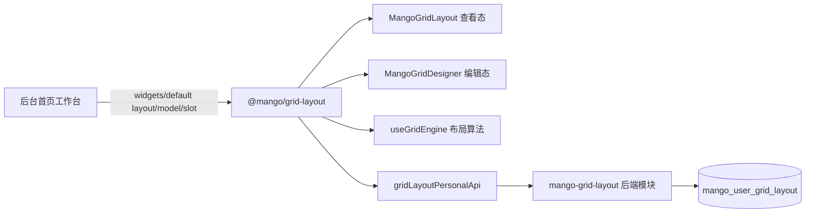

# 工作台自定义布局与 @mango/grid-layout 设计方案

## 1. 背景

后台首页工作台需要支持用户个性化布局。用户可以从系统提供的小组件库中添加内容卡片，并通过拖拽排序、调整宽高、删除、保存、取消和恢复默认完成个人工作台配置。

前期草稿验证了工作台查看态和编辑态的主要交互。本次正式实现将布局能力抽成通用前端包 `@mango/grid-layout`，并配套新增后端个人布局模块 `mango-grid-layout`，后台首页作为第一个消费场景接入。

## 2. 目标

- 支持工作台查看态和编辑态。
- 支持从组件库搜索、点击或拖拽添加小组件。
- 支持 12 栅格布局、拖拽排序、宽度调整、高度调整、删除和碰撞整理。
- 支持用户手动保存个人布局，刷新后按个人布局展示。
- 支持取消编辑时丢弃本次未保存改动。
- 支持恢复默认布局。
- 将布局编辑能力沉淀为可复用 npm 包。
- 将个人布局保存接口沉淀为独立后端模块。

## 3. 不做范围

- 不支持终端用户在运行态自行开发、上传或编辑小组件代码。
- 不支持用户自定义卡片标题。
- 不把默认布局保存到后端。
- 不在第一版处理复杂多端冲突合并，以最后一次保存成功结果为准。
- 不做移动端拖拽编辑；屏幕较窄时以可展示为主。
- 不把工作台业务接口写入 `@mango/grid-layout`。
- 不在 `@mango/grid-layout` 内处理权限过滤。

## 4. 总体架构



核心分工：

- 工作台页面负责业务接入：页面编码、默认布局、小组件列表、小组件内容和错误提示。
- `@mango/grid-layout` 负责布局展示、编辑交互、布局算法、公开类型和个人布局 API 封装。
- 后端 `mango-grid-layout` 负责保存当前登录人在指定页面的布局 JSON。
- 小组件自己负责内部页面内容和响应式展示。

## 5. 前端设计

### 5.1 包归属

新增独立前端包：

```txt
mango-ui/packages/grid-layout
```

包名：

```txt
@mango/grid-layout
```

选择独立包的原因：

- 该能力不是 `admin-shell` 私有能力。
- 该能力比 `@mango/common` 中的轻量公共组件更完整，包含布局算法、编辑交互、类型、样式和接口封装。
- 作为独立包更适合后续按 npm 能力发布、升级和复用。

### 5.2 包内模块

```txt
@mango/grid-layout
├── MangoGridLayout
├── MangoGridDesigner
├── useGridEngine
├── gridLayoutPersonalApi
├── types
└── style.css
```

### 5.3 公开数据结构

```ts
export interface GridLayoutValue {
  schemaVersion: 1;
  pageCode: string;
  items: GridLayoutItem[];
}

export interface GridLayoutItem {
  id: string;
  widgetType: string;
  layout: GridLayoutRect;
  title?: string;
  props?: Record<string, unknown>;
  showTitle?: boolean;
  padding?: boolean;
  locked?: boolean;
}

export interface GridLayoutRect {
  x: number;
  y: number;
  w: number;
  h: number;
  minW?: number;
  minH?: number;
  maxW?: number;
  maxH?: number;
}

export interface GridWidgetDefinition {
  type: string;
  title: string;
  description?: string;
  category?: string;
  icon?: Component;
  component?: Component;
  defaultLayout?: Partial<GridLayoutRect>;
  defaultProps?: Record<string, unknown>;
  showTitle?: boolean;
  padding?: boolean;
  disabled?: boolean;
  tags?: string[];
}
```

字段说明：

| 字段 | 含义 |
| --- | --- |
| `schemaVersion` | 布局 JSON 结构版本，第一版固定为 `1` |
| `pageCode` | 页面编码，用于区分不同页面的个人布局 |
| `items` | 当前页面已添加的小组件实例列表 |
| `id` | 卡片实例唯一 ID，同一个 `widgetType` 可以重复添加 |
| `widgetType` | 小组件类型，用于匹配组件库中的业务组件 |
| `layout.x` | 横向位置，基于 12 栅格，从 0 开始 |
| `layout.y` | 纵向位置，从 0 开始 |
| `layout.w` | 当前宽度，占用多少列 |
| `layout.h` | 当前高度，占用多少行 |
| `minW/minH` | 当前卡片最小宽高 |
| `maxW/maxH` | 当前卡片最大宽高 |
| `title` | 当前卡片标题；第一版由页面或小组件定义固定传入 |
| `props` | 传给小组件的默认属性 |
| `showTitle` | 是否显示标题行 |
| `padding` | 是否使用卡片默认内边距 |
| `locked` | 是否锁定，锁定后不参与拖拽编辑 |

### 5.4 默认值策略

第一版默认值：

```ts
{
  columns: 12,
  rowHeight: 15,
  gap: 15,
  defaultWidth: 3,
  defaultHeight: 10,
}
```

当前实现中，高度不是固定像素值，而是通过栅格行数换算：

- `rowHeight` 表示单个高度栅格单位，单位为 `px`。
- `defaultHeight` 表示默认卡片占用的高度栅格行数。
- 默认卡片视觉高度由 `defaultHeight * rowHeight` 和纵向间距共同决定。
- 工作台当前落地使用 `defaultWidth=3`、`defaultHeight=10`、`rowHeight=15`、`gap=15`，默认新增卡片约为 3 列宽、10 行高。
- `verticalGapRows` 由 `gap / rowHeight` 换算，用于碰撞整理时表达纵向间距，避免向上拖拽时误挤开上方卡片。

默认值来源优先级：

```txt
@mango/grid-layout 内部默认值
< 使用组件时传入的 defaultWidth/defaultHeight/columns/rowHeight/gap
< 小组件 defaultLayout/defaultProps/showTitle/padding
< 后端返回的当前登录人个人布局
```

### 5.5 交互规则

- 查看态使用 `MangoGridLayout`。
- 编辑态使用 `MangoGridDesigner`。
- 组件库支持搜索、点击添加、拖拽添加。
- 默认新增卡片尺寸为 `3` 列宽、`10` 行高。
- 拖拽组件进入布局区域后才展示新增占位。
- 拖拽已有卡片时，鼠标移动超过阈值后才进入移动状态。
- 拖拽已有卡片时，卡片上方展示透明度 `0.3` 的蒙层。
- 拖拽到已有内容位置时，后续卡片主动向右向下整理，宽高不变。
- 宽度通过卡片右侧拖拽调整。
- 高度通过卡片底部拖拽调整。
- 删除入口放在卡片右上角。
- 卡片标题固定在顶部，内容区单独滚动。
- `padding` 默认开启；小组件可通过元数据关闭默认内边距。
- `showTitle` 默认开启；小组件可通过元数据关闭标题行。
- 所有布局变更只更新前端草稿，手动保存成功后才入库。

### 5.6 使用示例

```vue
<template>
  <MangoGridDesigner
    v-if="editing"
    v-model="draftItems"
    :widgets="widgets"
    :default-width="3"
    :default-height="10"
    :row-height="15"
    :gap="15"
  />
  <MangoGridLayout
    v-else
    :items="layoutItems"
    :widgets="widgets"
    :row-height="15"
    :gap="15"
  />
</template>
```

个人布局接口封装：

```ts
gridLayoutPersonalApi.getPersonal('admin-home-workbench');
gridLayoutPersonalApi.savePersonal({ pageCode, layoutJson });
gridLayoutPersonalApi.resetPersonal('admin-home-workbench');
```

### 5.7 小组件创建与组合设计

`@mango/grid-layout` 只识别最终传入的 `GridWidgetDefinition[]`，不关心小组件来自系统模块、业务模块还是宿主页面。这样可以保证布局组件保持通用，不引入业务接口、菜单、路由、权限或特定模块依赖。

小组件创建分为两层：

1. 小组件内容组件：由系统模块或业务模块开发，负责自己的展示、数据加载、响应式和内部交互。
2. 小组件定义元数据：用 `GridWidgetDefinition` 描述 `type`、`title`、`description`、`category`、`component`、`defaultLayout`、`defaultProps`、`showTitle`、`padding` 等信息。

系统小组件和业务小组件可以分别维护并导出：

```ts
export const systemWorkbenchWidgets: GridWidgetDefinition[] = [
  // 平台、权限、文件、流程等系统小组件
];

export const businessWorkbenchWidgets: GridWidgetDefinition[] = [
  // 项目、订单、客户、合同等业务小组件
];
```

宿主页面或业务接入层负责把多个来源的小组件合并成一个组件库，再传给 `MangoGridDesigner` 和 `MangoGridLayout`。当前系统小组件注册与聚合能力已经沉淀到 `@mango/grid-widgets`，工作台通过该包获得系统预制小组件并生成最终 `widgets`：

```ts
import { mergeGridWidgets, systemQuickEntryWidgets } from '@mango/grid-widgets';

const widgets = mergeGridWidgets({
  systemWidgets: systemQuickEntryWidgets,
  businessWidgets: businessWorkbenchWidgets,
});
```

当前工作台落地采用页面侧聚合方式，`admin-shell` 通过 `workbenchWidgets` 向布局组件传入可用小组件。`@mango/grid-widgets` 负责系统小组件导出、合并、排序和去重；业务系统仍然可以在本地维护业务小组件数组，并在页面或业务接入层调用聚合工具生成最终 `GridWidgetDefinition[]`。第一版不做小组件权限过滤，后续如果需要按角色过滤，应在传入 `@mango/grid-layout` 前完成。

组件库组合边界：

- `@mango/grid-layout` 负责展示组件库、搜索、拖拽添加和布局编辑。
- 系统模块负责导出系统小组件定义。
- 业务模块负责导出业务小组件定义。
- 宿主或业务接入层负责组合小组件库，并在传入前完成权限过滤。
- 小组件 `type` 作为稳定标识，需要在同一页面组件库中保持唯一；历史布局通过 `widgetType` 找不到组件时，由布局组件展示兜底状态。

## 6. 后端设计

### 6.1 模块边界

新增独立平台模块：

```txt
mango/mango-platform/mango-grid-layout
├── mango-grid-layout-api
├── mango-grid-layout-core
└── mango-grid-layout-starter
```

后端负责：

- 按登录态识别当前用户。
- 按租户上下文隔离数据。
- 按 `pageCode` 查询、保存、删除个人布局。
- 校验布局 JSON 基础结构。
- 保存最后一次成功提交的个人布局。

后端不负责：

- 默认布局维护。
- 小组件权限判断。
- 小组件业务数据查询。
- 小组件内部配置解释。
- 前端拖拽碰撞算法。
- 多端冲突合并。

### 6.2 HTTP 接口

查询个人布局：

```txt
GET /grid-layout/personal?pageCode=admin-home-workbench
```

保存个人布局：

```txt
PUT /grid-layout/personal
```

请求体：

```json
{
  "pageCode": "admin-home-workbench",
  "layoutJson": "{\"schemaVersion\":1,\"pageCode\":\"admin-home-workbench\",\"items\":[]}"
}
```

恢复默认布局：

```txt
DELETE /grid-layout/personal?pageCode=admin-home-workbench
```

接口使用登录访问模式，前端不传 `userId` 和 `tenantId`。

### 6.3 数据库

新增表：

```txt
mango_user_grid_layout
```

字段：

| 字段 | 类型 | 说明 |
| --- | --- | --- |
| `id` | bigint | 主键 |
| `tenant_id` | varchar(64) | 租户 ID |
| `user_id` | bigint | 用户 ID |
| `page_code` | varchar(100) | 页面编码 |
| `schema_version` | int | 布局结构版本 |
| `layout_json` | longtext | 完整布局 JSON |
| `created_by` | bigint | 创建人 ID |
| `created_at` | datetime | 创建时间 |
| `updated_by` | bigint | 更新人 ID |
| `updated_at` | datetime | 更新时间 |

唯一约束：

```txt
tenant_id + user_id + page_code
```

### 6.4 后端校验

- `pageCode` 非空，最长 100，只允许字母、数字、点、下划线、冒号和短横线。
- `layoutJson` 非空。
- `schemaVersion` 第一版为 `1`。
- `layoutJson.pageCode` 必须与请求 `pageCode` 一致。
- `items` 必须是数组，最多 100 个。
- 每个 item 必须包含 `id`、`widgetType` 和 `layout`。
- `x/y/w/h/minW/minH/maxW/maxH` 必须在合法范围内。
- 宽度按 12 栅格校验。
- 高度允许到 1000 行，避免用户纵向拉高后保存失败。

## 7. 工作台接入

后台首页 `mango-ui/packages/admin-shell/src/views/home/index.vue` 作为首个消费场景：

- 页面编码：`admin-home-workbench`
- 顶部展示“工作台”和欢迎语。
- 查看态展示当前生效布局。
- 编辑态展示组件库和布局编辑区域。
- 保存后写入后端个人布局。
- 取消后丢弃当前草稿。
- 恢复默认后删除后端个人布局并回到前端默认布局。

第一版默认小组件收敛为 `system.quick-entry` 快捷入口，用于验证系统小组件从 `@mango/grid-widgets` 注入工作台的链路。

快捷入口展示内容：

- 系统设置
- 菜单管理
- 文件中心
- 工作日历

原工作台本地验证小组件已删除，不再作为默认组件库内容保留。

## 8. 验证范围

- `@mango/grid-layout` 包可构建。
- `@mango/grid-layout/style.css` 可通过样式聚合生成。
- `@mango/admin-shell` 可构建。
- `@mango/admin` 可构建。
- 后端 `mango-grid-layout` 模块可编译。
- 后端 service 单测覆盖新增、更新、删除、非法宽度、跨页面编码和超 12 行高度。
- 本地启动后验证工作台查看态、编辑态、添加、拖拽、改宽高、删除、保存、刷新回显和恢复默认。

## 9. 风险与应对

| 风险 | 说明 | 应对 |
| --- | --- | --- |
| 拖拽体验复杂 | 碰撞、占位、松手整理容易影响体验 | 将算法放入 `useGridEngine`，便于后续局部优化 |
| 历史布局兼容 | 后续结构升级可能影响旧数据 | 使用 `schemaVersion` 保留升级入口 |
| 小组件下线 | 用户历史布局可能存在旧 `widgetType` | 组件不存在时展示兜底空状态 |
| 默认布局升级 | 新增小组件后旧用户个人布局不会自动出现 | 只更新组件库，用户需要时自行添加 |
| 多端同时编辑 | 多个浏览器保存可能互相覆盖 | 第一版以最后一次保存成功为准 |

## 10. 结论

本方案将工作台自定义布局拆为通用前端包 `@mango/grid-layout`、独立后端模块 `mango-grid-layout` 和工作台首个消费场景三层。这样既能满足当前后台首页个性化配置，也能为后续看板、驾驶舱等页面复用保留清晰边界。
