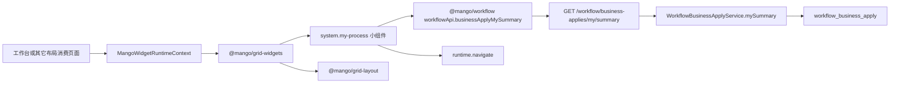

# Mango 我的申请小组件设计方案

## 1. 背景

后台工作台已经通过 `@mango/grid-layout` 承载可拖拽布局，通过 `@mango/grid-widgets` 聚合系统小组件和业务小组件。本次新增系统预制小组件“我的申请”，用于展示当前登录人发起的工作流申请概览，并跳转到已有“我的申请”页面。

本次采用“后端统计接口 + 小组件内部消费”的方案。统计数据来自工作流业务申请记录，避免前端小组件通过分页列表自行聚合，也避免把 `SUBMITTED + IN_APPROVAL` 这类状态组合泄漏到消费页面。

## 2. 目标

- 在 `@mango/grid-widgets` 中新增 `system.my-process` 系统小组件。
- 小组件展示标题“我的申请”、右侧“查看全部”和 2x2 四个统计块。
- 四个统计项为：审核中、已完成、已驳回、已撤回。
- 新增后端统计接口，返回当前登录人的申请状态数量。
- “我的申请”列表页改用业务申请分页数据，支持小组件带状态跳转后的筛选。
- 不修改 `@mango/grid-layout`，不让工作台页面承载工作流统计逻辑。

## 3. 不做范围

- 不新增数据库表。
- 不新增菜单、角色、按钮权限配置。
- 不改变工作流发起、审批、撤回、驳回和回调主流程。
- 不做小组件级权限过滤，数据权限继续由后端接口控制。
- 不新增“我的申请”详情弹框，点击后仍跳转既有页面。

## 4. 数据口径

统计来源为 `workflow_business_apply`。

| 展示项 | 后端状态口径 | 说明 |
| --- | --- | --- |
| 审核中 | `SUBMITTED` + `IN_APPROVAL` | 已提交但尚未形成终态的申请 |
| 已完成 | `APPROVED` | 审批通过的申请 |
| 已驳回 | `REJECTED` | 审批驳回的申请 |
| 已撤回 | `WITHDRAWN` | 申请人主动撤回的申请 |

统计范围限定为当前登录人的 `applicantId`。没有登录上下文时返回 0，避免小组件异常影响整个工作台。

## 5. 总体架构



边界说明：

- `@mango/grid-layout` 只负责布局、拖拽、尺寸和渲染容器。
- `@mango/grid-widgets` 负责系统小组件定义、样式和小组件内部交互。
- `@mango/workflow` 负责工作流 API 类型和请求封装。
- `mango-workflow` 后端负责当前登录人的申请统计口径。
- 工作台页面只提供 `runtime`、`widgets` 和默认布局。

## 6. 前端设计

新增目录：

```text
mango-ui/packages/grid-widgets/src/system/my-process/
├── MyProcessWidget.vue
├── index.ts
└── my-process.ts
```

职责：

- `MyProcessWidget.vue`：展示卡片、加载统计、错误重试和跳转。
- `my-process.ts`：注册 `system.my-process` 的 `MangoGridWidgetDefinition`。
- `index.ts`：提供独立子路径导出。

公共类型：

- `MyProcessWidgetProps.runtime`：小组件运行时上下文。
- `MyProcessWidgetProps.processPath`：默认 `/workflow/task/initiated`。

默认注册：

```ts
{
  type: 'system.my-process',
  title: '我的申请',
  category: '系统组件',
  source: 'mango',
  moduleCode: 'workflow',
  defaultLayout: { w: 3, h: 10, minW: 3, minH: 8 },
  showTitle: false,
  padding: false,
}
```

点击行为：

| 点击区域 | 跳转目标 |
| --- | --- |
| 查看全部 | `/workflow/task/initiated` |
| 审核中 | `/workflow/task/initiated?statuses=SUBMITTED&statuses=IN_APPROVAL` |
| 已完成 | `/workflow/task/initiated?statuses=APPROVED` |
| 已驳回 | `/workflow/task/initiated?statuses=REJECTED` |
| 已撤回 | `/workflow/task/initiated?statuses=WITHDRAWN` |

小组件不直接依赖 `router`，只通过 `runtime.navigate` 通知宿主跳转。

## 7. 后端设计

新增接口：

```http
GET /workflow/business-applies/my/summary
```

权限：

```java
@ApiAccess(mode = ApiResourceAccessMode.PERMISSION, permission = "workflow:task:list")
```

响应：

```java
public class WorkflowBusinessApplySummaryVO {
    private Long inReview;
    private Long completed;
    private Long rejected;
    private Long withdrawn;
}
```

服务实现：

- 在 `WorkflowBusinessApplyApi` 增加 `mySummary()`。
- 在 `WorkflowBusinessApplyServiceImpl` 按当前登录人 `MangoContextHolder.userId()` 和申请状态计数。
- 在 `WorkflowBusinessApplyController` 暴露 `/my/summary`。

## 8. 页面联动

`/workflow/task/initiated` 原先读取流程实例列表。由于流程实例状态无法覆盖“已撤回”，本次将该页面的数据源调整为业务申请分页 `workflowApi.businessAppliesPage()`。

影响限制：

- 只影响 `taskMode === 'initiated'`。
- 待办、已办、抄送列表仍使用原有任务接口。
- 详情跳转仍优先携带 `processInstanceId`，没有流程实例的申请会停留在列表可见状态。

## 9. 验证计划

- 后端单测覆盖当前用户四类统计和无登录上下文返回 0。
- 前端任务列表测试覆盖 `statuses` 跳转参数转换。
- 构建 `@mango/workflow`。
- 构建 `@mango/grid-widgets`。
- 构建 `@mango/admin-shell` 或至少执行相关类型/构建检查。
- 执行 `git diff --check`。
- 提交前执行 PMO 文档检查。

## 10. 风险与处理

| 风险 | 说明 | 处理 |
| --- | --- | --- |
| 已撤回只能来自业务申请表 | 流程实例没有 `WITHDRAWN` 状态 | 统计和我的申请列表统一切到业务申请数据链路 |
| 旧申请没有 `applicantId` | 历史数据如果缺失申请人 ID 可能不计入 | 本次按现有创建逻辑使用 `applicantId`，不做历史数据修复 |
| 列表字段和任务列表字段不同 | 业务申请没有任务名、流程 key 等完全相同字段 | 前端映射为现有表格字段，保持页面结构不大改 |
| 小组件接口无权限 | 当前用户无 `workflow:task:list` 时接口可能 403 | 小组件显示局部错误，不影响工作台其它卡片 |
