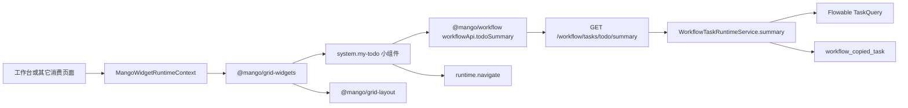

# Mango 我的待办小组件设计方案

## 1. 背景

后台工作台已经接入 `@mango/grid-layout` 和 `@mango/grid-widgets`，系统预制小组件可以和业务小组件合并后交给布局组件展示。现在需要新增一个系统预制小组件“我的待办”，用于在工作台卡片中展示当前登录人的工作流待办概览，并支持跳转到已有“我的待办”页面。

本次采用方案 B：由后端新增工作流待办统计接口，前端小组件负责调用接口、展示统计和处理跳转。这样可以避免小组件通过多次分页接口拼统计，也能让接口权限、租户边界和数据权限继续落在后端。

## 2. 目标

- 在 `@mango/grid-widgets` 中新增 `system.my-todo` 系统小组件。
- 小组件按已确认设计稿展示标题“我的待办”、右侧“查看全部”和 2x2 统计块。
- 新增后端工作流待办统计接口，返回当前登录人的四类待办数量。
- 小组件内部自己处理数据加载、空状态、错误状态和跳转，不把工作流统计逻辑散落到工作台页面。
- 保持 `@mango/grid-layout` 纯布局定位，不修改布局组件。
- 保持消费页面只传运行时上下文，例如当前用户、菜单、跳转方法和部署模式。

## 3. 不做范围

- 不修改 `@mango/grid-layout` 的拖拽、保存、布局算法和 API。
- 不新增工作台个性化布局接口。
- 不新增数据库表。
- 不新增菜单、角色、按钮权限配置。
- 不做小组件级权限过滤；第一版所有注册进组件库的小组件都允许选择，数据权限由接口控制。
- 不做“我的待办”详情弹框；点击“查看全部”或统计块跳转已有页面。
- 不在工作台页面重复实现待办统计、菜单过滤或工作流接口适配。

## 4. 设计输入

- 现有系统小组件位于 `mango-ui/packages/grid-widgets/src/system`，已有 `quick-entry` 和 `user-profile` 目录模式。
- 现有小组件聚合入口为 `mango-ui/packages/grid-widgets/src/system/index.ts`。
- 现有小组件运行时上下文类型在 `mango-ui/packages/grid-widgets/src/types.ts`，包含 `MangoWidgetRuntimeContext.navigate`。
- 现有工作流前端 API 位于 `mango-ui/packages/workflow/src/api/workflow.ts`。
- 现有工作流后端任务接口位于 `mango/mango-platform/mango-workflow/mango-workflow-starter/src/main/java/io/mango/workflow/starter/controller/WorkflowTaskController.java`。
- 现有工作流任务服务位于 `mango/mango-platform/mango-workflow/mango-workflow-core/src/main/java/io/mango/workflow/core/service/impl/WorkflowTaskRuntimeServiceImpl.java`。
- 现有待办分页接口为 `GET /workflow/tasks/todo`，支持 `todoType=ASSIGNED | CLAIMABLE | ALL`。
- 现有抄送表 `WorkflowCopiedTask` 包含 `readFlag`，可统计未读抄送。

## 5. 总体架构



边界说明：

- `@mango/grid-layout` 只负责布局、拖拽、尺寸和渲染容器。
- `@mango/grid-widgets` 负责提供系统小组件定义、样式和小组件内部交互。
- `@mango/workflow` 负责工作流 API 类型与请求封装。
- `mango-workflow` 后端负责统计当前登录人的待办数据。
- 工作台页面只负责把 runtime 和 widgets 交给布局组件。

## 6. 前端设计

### 6.1 小组件目录

新增目录：

```text
mango-ui/packages/grid-widgets/src/system/my-todo/
├── MyTodoWidget.vue
├── index.ts
└── my-todo.ts
```

职责：

- `MyTodoWidget.vue`：展示卡片、加载统计、错误/空状态、点击跳转。
- `my-todo.ts`：定义 `system.my-todo` 的 `MangoGridWidgetDefinition`。
- `index.ts`：导出组件和定义数组。

同步修改：

- `mango-ui/packages/grid-widgets/src/system/index.ts` 聚合 `systemMyTodoWidgets`。
- `mango-ui/packages/grid-widgets/src/index.ts` 对外导出。
- `mango-ui/packages/grid-widgets/package.json` 增加 `./my-todo` 子路径导出。
- `mango-ui/packages/grid-widgets/src/style.css` 或小组件样式入口补充样式。
- `mango-ui/packages/grid-widgets/README.md` 补充小组件说明。

### 6.2 小组件定义

建议定义：

```ts
export const myTodoWidget: MangoGridWidgetDefinition = {
  type: 'system.my-todo',
  title: '我的待办',
  category: '系统组件',
  source: 'mango',
  moduleCode: 'workflow',
  component: MyTodoWidget,
  order: 30,
  defaultLayout: { w: 3, h: 10, minW: 3, minH: 8 },
  defaultProps: {
    showTitle: false,
    padding: false,
  },
};
```

说明：

- `showTitle: false`、`padding: false` 用于让小组件内部渲染标题和内容区，保证样式和已确认草图一致。
- 默认尺寸先按 3 列宽、10 行高设计，适配工作台小卡片。
- `moduleCode: 'workflow'` 只用于组件库分组和识别，不作为第一版权限判断依据。

### 6.3 UI 与交互

展示结构：

- 顶部标题区：左侧“我的待办”，右侧“查看全部”。
- 内容区：2x2 统计块。
- 四个统计项：`待审批`、`待处理`、`待确认`、`已超时`。
- 不展示标题左侧图标。
- “查看全部”右侧不展示箭头。
- 内部四个小卡片保持紧凑，避免撑满导致拥挤。

点击行为：

- 点击“查看全部”：跳转 `/workflow/task/todo`。
- 点击“待审批”：跳转 `/workflow/task/todo?todoType=ASSIGNED`。
- 点击“待处理”：跳转 `/workflow/task/todo?todoType=CLAIMABLE`。
- 点击“待确认”：跳转 `/workflow/task/copied` 并携带 `raw.query.unread=true`，统计口径按未读抄送落地。
- 点击“已超时”：跳转 `/workflow/task/todo` 并携带 `raw.query.overdue=true`，任务列表按超时待办筛选。

跳转方式：

```ts
runtime?.navigate?.({
  path: '/workflow/task/todo',
  raw: { query: { todoType: 'ASSIGNED' } },
});
```

小组件不直接依赖 `router`，以兼容单体部署、微前端宿主和微前端子应用。

### 6.4 状态处理

- `loading`：显示骨架或轻量 loading，不阻塞整个工作台。
- `success`：展示统计数字。
- `empty`：四项均为 0 时显示数字 0，不额外占用大面积空态。
- `error`：保留卡片结构，在内容区显示“待办加载失败”并提供刷新入口。
- `no navigate`：数据仍展示，点击入口禁用或忽略，并避免控制台报错。

### 6.5 包依赖决策

为了让“我的待办”能力收口到小组件内部，本次建议 `@mango/grid-widgets` 增加对 `@mango/workflow` 的依赖，由小组件内部调用 `workflowApi.todoSummary()`。

取舍：

| 方案 | 说明 | 结论 |
| --- | --- | --- |
| 小组件内部依赖 `@mango/workflow` | 能力内聚，工作台页面不写待办接口逻辑 | 推荐 |
| 页面通过 props/provider 注入统计接口 | 包依赖更轻，但每个消费页都要知道待办数据来源 | 不采用 |
| 后端把统计塞进布局接口 | 破坏布局组件纯布局边界 | 不采用 |

风险：

- `@mango/grid-widgets` 会从纯展示小组件包变成依赖工作流 API 包的系统小组件包。
- 如果后续业务系统不安装工作流能力，需要通过按需子路径导出和构建检查确认不会强制使用“我的待办”。
- 若包构建无法接受 `@mango/workflow` 依赖，需要回退为 `fetchTodoSummary` 可选注入方式，但默认仍由小组件内置适配。

## 7. 后端设计

### 7.1 接口

新增接口：

```http
GET /workflow/tasks/todo/summary
```

权限：

```java
@ApiAccess(mode = ApiResourceAccessMode.PERMISSION, permission = "workflow:task:list")
```

说明：

- 和待办分页列表共用 `workflow:task:list` 接口权限。
- 接口只返回当前登录人可见数据。
- 不接收分页参数。

### 7.2 响应结构

新增 VO：

```java
public class WorkflowTaskSummaryVO {
    private Long pendingApproval;
    private Long pendingHandle;
    private Long pendingConfirm;
    private Long overdue;
}
```

建议前端类型：

```ts
export interface WorkflowTaskSummary {
  pendingApproval: number;
  pendingHandle: number;
  pendingConfirm: number;
  overdue: number;
}
```

字段口径：

| 字段 | 页面文案 | 统计口径 |
| --- | --- | --- |
| `pendingApproval` | 待审批 | 当前用户已分配的待办任务，等价 `todoType=ASSIGNED` |
| `pendingHandle` | 待处理 | 当前用户可认领或可处理的候选任务，等价 `todoType=CLAIMABLE` |
| `pendingConfirm` | 待确认 | 当前用户未读抄送数量，基于 `workflow_copied_task.read_flag = false` |
| `overdue` | 已超时 | 当前用户相关待办中 `dueDate < now` 的任务数量 |

### 7.3 服务实现

接口层：

- `WorkflowTaskController` 新增 `summary()`。

API 契约：

- `mango-workflow-api` 新增 `WorkflowTaskSummaryVO`。

服务接口：

- `IWorkflowTaskRuntimeService` 新增 `R<WorkflowTaskSummaryVO> summary()`。

服务实现：

- 复用现有 `applyTodoTypeFilter()` 统计 `ASSIGNED` 和 `CLAIMABLE`。
- 抽取或复用候选组解析 `candidateGroupProvider.currentCandidateGroups()`。
- `pendingConfirm` 使用 `WorkflowCopiedTaskMapper` 按当前用户和未读状态统计。
- `overdue` 使用 Flowable `TaskQuery` 的到期时间能力统计；如果当前 Flowable 查询 API 不能直接表达，则先查询当前用户相关待办后在内存中过滤 `task.getDueDate()`。

伪代码：

```java
public R<WorkflowTaskSummaryVO> summary() {
    List<String> candidateGroups = candidateGroupProvider.currentCandidateGroups();
    long pendingApproval = countTodo("ASSIGNED", candidateGroups);
    long pendingHandle = countTodo("CLAIMABLE", candidateGroups);
    long pendingConfirm = countUnreadCopied();
    long overdue = countOverdue(candidateGroups);
    return R.ok(new WorkflowTaskSummaryVO(pendingApproval, pendingHandle, pendingConfirm, overdue));
}
```

注意事项：

- `pendingApproval` 和 `pendingHandle` 可能存在业务上互斥，保持与现有 `todoType` 口径一致。
- `overdue` 依赖流程任务是否设置到期时间。如果没有配置 due date，统计会稳定返回 0。
- 统计接口不暴露 Entity，不返回分页对象。

## 8. 前端 API 设计

在 `mango-ui/packages/workflow/src/api/workflow.ts` 增加：

```ts
export interface WorkflowTaskSummary {
  pendingApproval: number;
  pendingHandle: number;
  pendingConfirm: number;
  overdue: number;
}

export const workflowApi = {
  todoSummary: () => get<WorkflowTaskSummary>('/workflow/tasks/todo/summary')
    .then(normalizeTaskSummary),
};
```

`normalizeTaskSummary` 需要把空值兜底为 0，避免后端字段缺失导致 UI 显示异常。

## 9. 工作台接入

工作台页面原则上只需要继续使用 `systemGridWidgets` 或聚合后的 widgets。新增小组件进入 `systemGridWidgets` 后，组件库可选择“我的待办”。

如果需要默认布局展示，则在工作台默认布局中追加：

```ts
{
  id: 'default-my-todo',
  widgetType: 'system.my-todo',
  x: 0,
  y: 0,
  w: 3,
  h: 10,
}
```

默认布局是否加入本次落地需要开发前再次确认。如果不加入默认布局，用户仍可从组件库手动添加。

## 10. 权限与安全

- 小组件是否出现在组件库中，第一版不做前端权限过滤。
- 统计接口由后端 `@ApiAccess` 控制接口访问权限。
- 数据范围由工作流服务基于当前登录人、候选组、租户上下文和已有数据权限实现。
- 前端收到无权限或请求失败时，只显示错误状态，不绕过接口权限。
- 小组件跳转到已有页面，页面自身继续使用已有菜单和接口权限。

## 11. 单体与微前端兼容

- 单体部署：消费页面传入本地 `router.push` 包装后的 `runtime.navigate`。
- 微前端宿主：宿主传入可处理主应用和子应用菜单的 `runtime.navigate`。
- 微前端子应用：子应用传入自身菜单和跳转方法，小组件只消费标准上下文。
- npm 独立消费：业务系统安装 `@mango/grid-widgets`、`@mango/workflow` 和样式后，可按需引入小组件。

## 12. 影响范围

前端：

- `mango-ui/packages/grid-widgets`
- `mango-ui/packages/workflow`
- 可能涉及工作台默认布局文件
- 可能涉及能力 README 和能力地图

后端：

- `mango/mango-platform/mango-workflow/mango-workflow-api`
- `mango/mango-platform/mango-workflow/mango-workflow-core`
- `mango/mango-platform/mango-workflow/mango-workflow-starter`
- `mango/mango-platform/mango-workflow/README.md`

文档：

- `mango-docs/designs/mango-grid-widgets-my-todo-design.md`
- 后续开发完成后需补交付记录或 PR 说明。

## 13. 验证计划

设计阶段：

- `git diff --check`
- PMO preflight 已执行并读取必读文件。

前端开发阶段：

- 构建 `@mango/workflow`。
- 构建 `@mango/grid-widgets`。
- 构建或启动 admin 工作台验证小组件展示。
- 验证 loading、成功、接口失败、无跳转方法场景。
- 验证点击“查看全部”和统计块的跳转参数。
- 验证样式在小尺寸卡片中不溢出。

后端开发阶段：

- 编译 `mango-workflow-api`、`mango-workflow-core`、`mango-workflow-starter`。
- 验证 `GET /workflow/tasks/todo/summary` 正常返回。
- 验证普通用户、候选任务、未读抄送和无数据场景。
- 执行项目要求的 `mvn mango:check -Drule=all` 或按 preflight 输出的检查命令。

提交前：

- 执行 PMO 文档和能力文档检查。
- 准备中文 PR 描述，说明 PMO、Scope、Capability Docs、Validation、PMO Exceptions。

## 14. 风险与处理

| 风险 | 说明 | 处理 |
| --- | --- | --- |
| `pendingConfirm` 口径可能和业务理解不一致 | 当前代码中没有“待确认”任务字段，最接近的是未读抄送 | 第一版按未读抄送实现，并在 README 中写清楚 |
| `overdue` 可能长期为 0 | Flowable 任务需要设置 due date 才能统计超时 | 实现时按 due date 统计，没有 due date 返回 0 |
| `@mango/grid-widgets` 依赖变重 | 新增 `@mango/workflow` 依赖 | 通过子路径导出和构建验证控制影响，必要时再拆 provider |
| 跳转筛选与统计口径不一致 | 统计块可传 `raw`，但列表页需要同步消费筛选条件 | 本次已支持 `todoType`、`unread` 和 `overdue` 查询参数 |
| 小组件错误影响工作台观感 | 接口失败时可能显示错误 | 卡片内局部错误，不影响其它小组件 |

## 15. 结论

本次采用“后端统计接口 + 系统小组件内部消费”的方案。它符合小组件能力内聚原则，也把权限和数据口径保留在工作流后端。开发时不修改布局组件，不让工作台页面承担待办统计逻辑，只在 `@mango/grid-widgets` 增加一个可复用的系统小组件，并在 `mango-workflow` 增加稳定统计接口。
