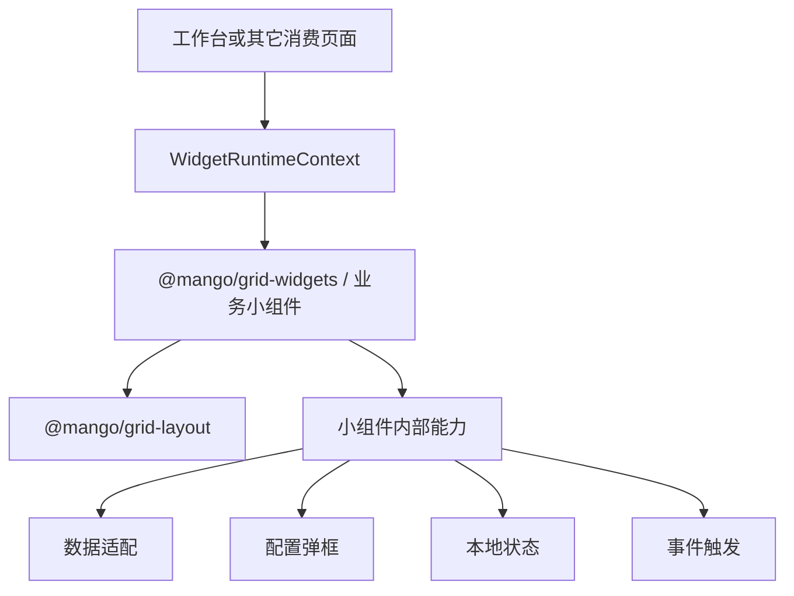

# Mango 小组件注册与聚合设计方案

## 1. 背景

`@mango/grid-layout` 已经提供自定义栅格布局、组件库添加、拖拽排序、宽高调整、个人布局保存和恢复默认能力。布局组件只消费最终的 `GridWidgetDefinition[]`，不应该关心小组件来自 Mango 系统预制能力、业务系统，还是页面本地。

后续业务系统会同时使用两类小组件：

- Mango 系统预制小组件：在 Mango 主项目中开发和维护，作为系统能力对外发布。
- 业务系统小组件：在业务系统中开发和维护，按业务系统自己的需求组合。

本次新增小组件注册聚合包，先跑通“系统小组件 + 业务小组件合并后注入 `@mango/grid-layout`”的链路，并用一个“快捷入口”系统小组件接入后台工作台验证。

## 2. 目标

- 保持 `@mango/grid-layout` 现有布局组件不变。
- 新增 `@mango/grid-widgets`，沉淀 Mango 系统小组件定义、类型扩展和聚合工具。
- 支持业务系统把 Mango 系统小组件与本地业务小组件合并成最终 `widgets`。
- 第一版只落地“快捷入口”系统小组件用于验证。
- 第一版不做小组件权限过滤，所有传入的小组件都可以进入组件库。
- 数据权限交给各小组件内部调用的业务接口控制。
- 为后续小组件可见性、授权模型和分组扩展预留字段，但本次不启用。

## 3. 不做范围

- 不修改 `@mango/grid-layout` 的布局算法、拖拽交互和保存协议。
- 不在第一版实现小组件权限过滤。
- 不在第一版设计小组件授权后台和角色绑定关系。
- 不把接口权限、按钮展示规则或页面 `menuCode` 作为小组件可见性的第一版判断依据。
- 不让小组件工具包主动读取登录态、store、router、菜单或权限接口。
- 不把业务系统私有小组件放进 Mango 主项目。
- 不通过后端动态下发前端组件代码。

## 4. 总体架构


核心分工：

- `@mango/grid-layout` 只消费最终 `GridWidgetDefinition[]`，不关心小组件来源。
- `@mango/grid-widgets` 提供系统预制小组件、Mango 小组件类型和合并工具。
- 业务系统负责引入系统小组件、声明业务小组件，并组合成最终 `widgets`。
- 小组件自己负责内部展示、数据加载、空状态、错误状态和接口数据权限响应。

### 4.1 能力边界原则

本次补充设计后的统一边界如下：

- `@mango/grid-layout` 保持纯布局组件，不新增菜单、用户、权限、跳转、微前端或小组件业务逻辑。
- 工作台或其它消费页面只写页面个性化代码，例如 `pageCode`、当前用户、当前租户、当前菜单数据、当前跳转方法和本页面额外业务小组件。
- 小组件自身需要的数据适配、资源处理、配置弹框、本地状态和交互能力，优先回收到小组件内部或 `@mango/grid-widgets` 内部工具中。
- 系统小组件同时考虑单体部署、微前端宿主、微前端子应用和 npm 独立消费，不直接依赖 `admin-shell` 私有 store、router、菜单装配或启动逻辑。

也就是说，页面提供运行上下文，小组件消化运行上下文，布局组件只负责摆放。



## 5. 包定位

新增前端包：

```text
mango-ui/packages/grid-widgets
```

包名：

```text
@mango/grid-widgets
```

定位：

- 不是布局编辑器，不承载拖拽、碰撞和布局保存能力。
- 不是业务系统实现包，不维护业务项目私有小组件。
- 是 Mango 系统小组件与小组件聚合工具包。
- 与 `@mango/grid-layout` 平级，通过类型和数据协作。

不放入 `@mango/grid-layout` 的原因：

- 布局组件应保持纯布局能力。
- 小组件来源、模块化导出和业务组合属于注册聚合层。
- 避免业务小组件、系统小组件和布局编辑器形成强耦合。

## 6. 包内模块

第一版实际落地结构：

```text
@mango/grid-widgets
├── index
├── types
├── registry
├── system
│   ├── index
│   └── quick-entry
└── style.css
```

说明：

- `types`：导出 Mango 小组件扩展类型。
- `registry`：导出合并、去重、排序等纯工具函数。
- `system/quick-entry`：导出快捷入口系统小组件。
- `style.css`：承载系统预制小组件运行所需样式。

## 7. 小组件数据结构

`@mango/grid-widgets` 复用 `@mango/grid-layout` 的 `GridWidgetDefinition`，并扩展 Mango 小组件元数据。

```ts
import type { GridWidgetDefinition } from '@mango/grid-layout';

export type MangoGridWidgetSource = 'mango' | 'business';
export type MangoGridWidgetVisibilityMode = 'any' | 'all';

export interface GridWidgetVisibility {
  mode?: MangoGridWidgetVisibilityMode;
  widgetPermissionCodes?: string[];
}

export interface MangoGridWidgetDefinition extends GridWidgetDefinition {
  source?: MangoGridWidgetSource;
  moduleCode?: string;
  order?: number;
  visibility?: GridWidgetVisibility;
}
```

字段说明：

| 字段 | 含义 | 第一版是否生效 |
| --- | --- | --- |
| `source` | 小组件来源，区分 Mango 预制和业务系统自定义 | 是 |
| `moduleCode` | 小组件所属模块，用于分组、按模块引入或后续模块启停 | 是 |
| `order` | 组件库排序值 | 是 |
| `visibility` | 小组件可见性预留配置 | 否 |
| `widgetPermissionCodes` | 小组件独立权限标识预留字段 | 否 |

第一版中，`visibility` 只作为类型和数据预留，不参与过滤。

### 7.1 小组件运行上下文

为避免工作台页面或其它消费页面重复编写小组件专属装配逻辑，`@mango/grid-widgets` 增加统一的小组件运行上下文类型。运行上下文只承载宿主显式传入的数据和行为，不在包内主动读取宿主 store、router 或全局运行态。

```ts
export type MangoWidgetRuntimeMode = 'host' | 'sub-app' | 'standalone';

export interface MangoWidgetRuntimeUser {
  userId?: string | number;
  username?: string;
  nickname?: string;
}

export interface MangoWidgetRuntimeTenant {
  tenantId?: string | number;
}

export interface MangoWidgetNavigateTarget {
  path?: string;
  name?: string;
  url?: string;
  pageType?: string;
  raw?: unknown;
}

export interface MangoWidgetRuntimeContext {
  pageCode: string;
  mode?: MangoWidgetRuntimeMode;
  user?: MangoWidgetRuntimeUser;
  tenant?: MangoWidgetRuntimeTenant;
  menus?: unknown[];
  navigate?: (target: MangoWidgetNavigateTarget) => void | Promise<void>;
}
```

字段说明：

| 字段 | 含义 |
| --- | --- |
| `pageCode` | 当前消费页面编码，用于小组件内部生成本地缓存 key 或区分页面实例 |
| `mode` | 当前部署形态，支持微前端宿主、微前端子应用和单体部署 |
| `user` | 当前登录人基础信息，只用于前端展示或本地缓存维度 |
| `tenant` | 当前租户基础信息，只用于前端展示或本地缓存维度 |
| `menus` | 宿主显式传入的原始菜单或路由数据，由小组件内部适配 |
| `navigate` | 宿主显式传入的跳转方法，小组件不直接操作全局路由；快捷入口会传入 `path`、`url`、`pageType` 和原始菜单数据 |

消费页面可以只传当前页面实际需要的字段。小组件必须对缺失字段有降级处理，例如无菜单时展示空状态，无 `navigate` 时禁用或忽略跳转动作。

### 7.2 小组件 Props 合并策略

系统小组件默认配置、页面注入配置和用户布局实例配置按以下优先级合并：

```txt
小组件定义 defaultProps
< 页面注入 runtime 或小组件默认 props
< 个人布局 item.props
```

其中 `runtime` 是通用上下文，`item.props` 是某个小组件实例的个性化配置。这样可以保证：

- 页面不复制小组件内部转换逻辑。
- 同一个小组件可以被多个页面复用。
- 用户个性化配置仍然能覆盖页面默认值。
- 业务系统特殊菜单结构或跳转能力可以通过适配函数覆盖。

## 8. 注册与聚合 API

### 8.1 快捷入口小组件

第一版只提供快捷入口系统小组件：

```ts
import { systemQuickEntryWidgets } from '@mango/grid-widgets/quick-entry';
```

也可以从主入口引入：

```ts
import { systemQuickEntryWidgets } from '@mango/grid-widgets';
```

### 8.2 合并工具

```ts
import { mergeGridWidgets, systemQuickEntryWidgets } from '@mango/grid-widgets';

const widgets = mergeGridWidgets({
  systemWidgets: systemQuickEntryWidgets,
  businessWidgets: businessWidgets,
});
```

合并规则：

- 按 `type` 去重。
- `type` 冲突时保留先注册的小组件。
- 冲突时通过 `onDuplicate` 回调把保留项和忽略项交给调用方处理。
- 按 `order`、`category`、`title` 形成稳定排序。
- 不修改传入的小组件对象。
- 不做权限过滤。

### 8.3 业务系统接入示例

```ts
import { mergeGridWidgets, systemQuickEntryWidgets } from '@mango/grid-widgets';
import { businessProjectWidgets } from './grid-widgets/project';

const widgets = mergeGridWidgets({
  systemWidgets: systemQuickEntryWidgets,
  businessWidgets: businessProjectWidgets,
});
```

注入布局组件：

```vue
<MangoGridDesigner v-model="draftItems" :widgets="widgets" />
<MangoGridLayout :items="layoutItems" :widgets="widgets" />
```

## 9. 第一版权限策略

第一版不在小组件注册聚合层做权限过滤。

具体策略：

- 所有注册到 `widgets` 的小组件都在组件库展示。
- 用户可以任意添加、拖拽、排序、调整宽高和删除小组件。
- 小组件内部数据接口继续由后端做登录态、租户、角色、数据权限和接口权限控制。
- 接口返回无权限、无数据或错误时，小组件内部展示对应空状态、无权限状态或错误状态。
- `visibility` 和 `widgetPermissionCodes` 作为后续扩展口，第一版不参与判断。

这样处理的原因：

- 当前 `menuCode` 已经服务页面与按钮展示规则，不适合作为聚合小组件的主权限字段。
- 小组件可能来自多个模块，或不对应任何单一页面。
- 先把注册、组合、模块化引入和注入链路跑通，避免第一版被权限模型拖复杂。

## 10. 数据权限与接口安全

小组件能否看到数据，不由前端组件库过滤保证。

每个小组件调用的业务接口需要自行保证：

- 当前登录态有效。
- 租户边界正确。
- 接口权限校验正确。
- 数据权限范围正确。
- 无权限时返回明确错误或空结果。

前端小组件只负责根据接口结果展示：

- 正常数据。
- 空状态。
- 无权限提示。
- 错误状态。
- 加载状态。

## 11. 快捷入口验证小组件

第一版新增 `system.quick-entry` 小组件。

定义策略：

- `type`：`system.quick-entry`
- `title`：`快捷入口`
- `category`：`系统组件`
- `source`：`mango`
- `moduleCode`：`quick-entry`
- 默认布局：`3` 列宽、`10` 行高
- 关闭布局卡片自带标题和内边距，由快捷入口小组件内部渲染标题、设置按钮和内容内边距

能力边界：

- 快捷入口小组件内部负责从 `runtime.menus` 解析可选入口。
- 快捷入口小组件内部过滤目录、按钮、隐藏菜单和不可跳转项。
- 快捷入口小组件内部负责设置弹框、搜索、选择、清空、保存和空状态。
- 快捷入口小组件内部负责基于 `pageCode + tenant + user` 生成默认本地缓存维度。
- 点击快捷入口时调用 `runtime.navigate`，并传出 `path`、`url`、`pageType` 和原始菜单数据，不直接依赖宿主 `router` 或微前端运行时。

快捷入口默认解析 Mango 标准菜单结构，同时允许后续通过 `resolveMenus` 一类适配函数覆盖特殊业务系统菜单结构。这样可以同时支持：

- admin-shell 微前端宿主：宿主传入聚合后的宿主与子系统菜单。
- 微前端子应用：子应用传入自身可见菜单。
- 单体部署：单体应用传入本地动态路由或菜单树。

第一版快捷入口不入库，不跟个人布局保存接口合并，用户选择的快捷入口先保存在浏览器 `localStorage`。

### 11.1 快捷入口消费示例

消费页面只保留个性化上下文：

```ts
const runtime = computed(() => ({
  pageCode: 'admin-home-workbench',
  mode: 'host',
  user: {
    userId: userInfo.userInfos.userId,
    username: userInfo.userInfos.username,
    nickname: userInfo.userInfos.nickname,
  },
  tenant: {
    tenantId: userInfo.userInfos.tenantId,
  },
  menus: routesList.value,
  navigate: target => router.push(target.path || ''),
}));
```

小组件定义由 `@mango/grid-widgets` 的聚合工具注入运行上下文后再交给布局组件：

```ts
const widgets = mergeGridWidgets({
  runtime: runtime.value,
  systemWidgets: systemQuickEntryWidgets,
  businessWidgets: [],
});
```

最终工作台页面不再维护快捷入口专属的菜单过滤、图标解析和本地缓存 key 生成逻辑。

## 12. 样式与发布

`@mango/grid-widgets` 提供样式入口：

```text
@mango/grid-widgets/style.css
```

样式边界：

- 系统小组件运行样式跟随 `@mango/grid-widgets` 发布。
- 业务小组件样式归属业务系统自己的包或页面。
- 业务系统使用 Mango 系统小组件时，需要按包公开入口引入样式。
- `@mango/grid-layout` 不为系统小组件或业务小组件兜底样式。

后台单体入口通过 `packages/admin/admin-modules.json` 声明 `@mango/grid-widgets/style.css`，再由样式生成脚本生成聚合文件。

## 13. 影响范围

本次落地影响：

- 新增 `mango-ui/packages/grid-widgets` 前端包。
- 新增 `system.quick-entry` 系统小组件。
- 工作台页面的小组件来源从页面本地数组调整为 `@mango/grid-widgets` 聚合结果。
- 删除工作台页面里原本用于验证的本地小组件定义。
- `@mango/admin` 和 `@mango/admin-shell` 增加 `@mango/grid-widgets` 依赖声明。
- `@mango/admin` 样式聚合新增 `@mango/grid-widgets/style.css`。

本次不影响：

- `@mango/grid-layout` 现有 API。
- 个人布局后端接口。
- `mango_user_grid_layout` 表结构。
- 已保存布局 JSON 的 `widgetType + layout` 结构。
- 按钮展示规则。
- 接口权限控制。

## 14. 风险与应对

| 风险 | 说明 | 应对 |
| --- | --- | --- |
| 权限模型暂不完整 | 第一版不按用户过滤组件库 | 明确数据权限由接口控制，预留 `visibility` 扩展口 |
| `type` 冲突 | 系统和业务小组件可能使用相同类型 | 约定 `system.*`、`business.*` 命名空间，合并时去重并回调冲突 |
| 样式遗漏 | 系统小组件迁移后可能缺样式 | 样式随 `@mango/grid-widgets/style.css` 发布并纳入样式聚合 |
| 包边界污染 | 工具包可能误依赖宿主 store 或 router | 工具包只接收数据，不主动读取宿主运行态 |
| 历史布局找不到组件 | 小组件下线或重命名后，已保存布局仍引用旧 `widgetType` | 保持 `type` 稳定，布局组件显示兜底不可用状态 |
| 单体和微前端差异 | 不同部署形态的菜单和跳转能力不同 | 通过 `WidgetRuntimeContext` 注入数据和行为，小组件内部只消费标准上下文 |
| 页面逻辑膨胀 | 每个消费页面重复写小组件过滤和转换逻辑 | 将小组件专属适配逻辑回收到小组件或 `@mango/grid-widgets` 工具层 |

## 15. 验证范围

本次实现至少验证：

- `@mango/grid-widgets` 包可构建并导出类型。
- `systemQuickEntryWidgets` 可被工作台引入。
- `mergeGridWidgets` 可合并系统小组件和业务小组件数组。
- 重复 `type` 能稳定去重并触发 `onDuplicate`。
- 工作台可以使用合并后的 `widgets` 正常展示快捷入口。
- 工作台页面只保留运行上下文和页面个性化逻辑，不再维护快捷入口专属菜单过滤逻辑。
- 快捷入口在 Mango 标准菜单结构下能过滤目录、按钮、隐藏菜单和不可跳转项。
- 快捷入口通过注入的 `navigate` 完成跳转，组件内部不直接依赖宿主 router。
- 快捷入口在缺少菜单或缺少跳转方法时能降级展示。
- 系统小组件样式在 admin 单体模式中生效。
- admin 样式聚合生成和检查通过。

## 16. 结论

第一版小组件注册聚合能力解决“系统小组件和业务小组件如何组合并注入布局组件”的问题，并进一步明确小组件运行上下文边界。`@mango/grid-layout` 保持纯布局能力；`@mango/grid-widgets` 沉淀 Mango 系统小组件、聚合工具和小组件运行上下文类型；消费页面只传页面个性化上下文；小组件把自身需要的数据适配、配置弹框、本地状态和交互能力尽可能收回到组件内部。
