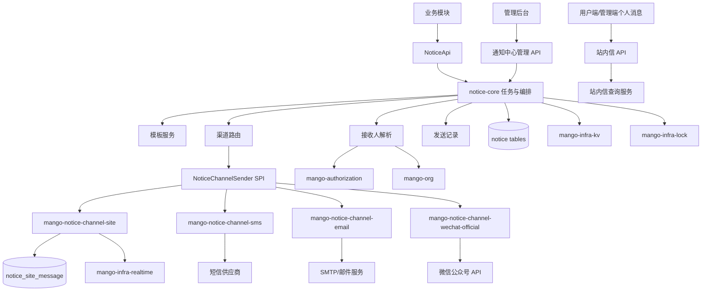
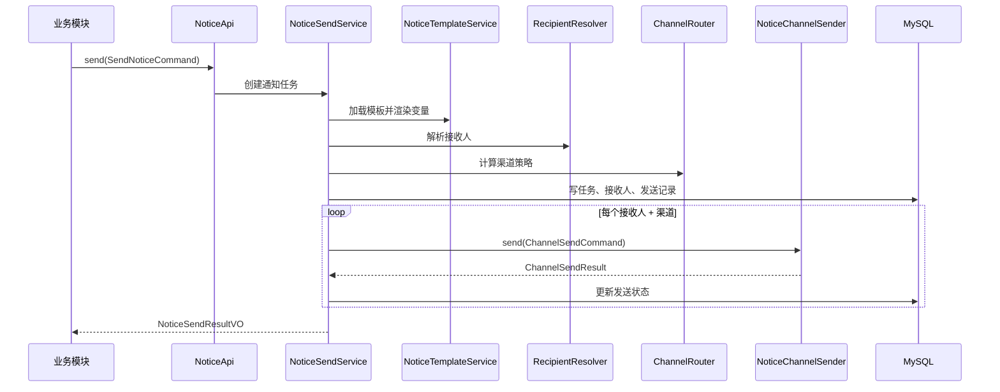
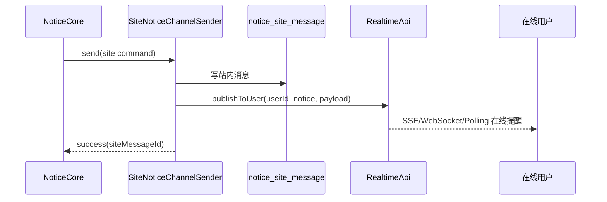

# mango-notice 多渠道通知中心设计说明书

## 1. 目标

建设 `mango-notice` 多渠道通知中心，用于统一承接站内信、短信、邮件、微信公众号、企业微信、钉钉等通知能力。系统通过通知任务、通知模板、接收人规则、渠道配置、渠道适配、发送记录和站内消息状态，为业务模块提供标准化通知创建、投递、查询、重试和审计能力。

本设计将现有 `mango-biz-notification` 定位为 `mango-notice` 的站内信雏形，并规划更名与模块重构。重构后，`mango-notice` 负责通知业务编排，`mango-notice-channel-*` 负责单渠道发送适配，`mango-infra-realtime` 继续只承担在线实时协议投递。

系统不承载短信、邮件、微信等三方平台的账号体系，不替代营销系统，不做客户画像，不做复杂活动编排，不做 IM 聊天，不做可靠消息队列，不把基础通信协议实现写回业务通知域。

## 2. 设计范围

### 2.1 本期支持

| 分类 | 范围 |
|---|---|
| 模块重命名 | `mango-biz-notification` 更名为 `mango-notice`，包名从 `io.mango.biz.notification` 收敛到 `io.mango.notice` |
| 站内信 | 保留并升级现有消息中心能力，支持站内消息创建、列表、详情、未读数、已读、批量已读、删除、实时在线提醒 |
| 多渠道模型 | 建立通知任务、模板、渠道、接收人、发送记录、渠道结果、重试记录模型 |
| 渠道 SPI | 建立 `NoticeChannelSender` 扩展点，渠道模块通过 SPI 注册发送能力 |
| 渠道模块 | 规划 `mango-notice-channel-site`、`mango-notice-channel-sms`、`mango-notice-channel-email`、`mango-notice-channel-wechat-official` |
| 管理后台 | 规划通知概览、通知任务、通知模板、渠道配置、发送记录、站内信、接收人规则、通知设置 |
| API | 提供业务侧发通知 API、管理侧任务/模板/配置/记录 API、用户侧站内信 API |
| 数据库 | 使用 Flyway 新增 `notice` 模块 migration，按通知域建表 |
| 验证 | 设计 service、channel SPI、发送状态机、站内信链路、前端页面和 E2E 验证范围 |

### 2.2 本期不支持

| 场景 | 说明 |
|---|---|
| 复杂营销编排 | 不做活动、人群画像、A/B 测试、触达旅程 |
| IM 聊天 | 不做双向会话、群聊、历史聊天、在线状态业务模型 |
| 可靠 MQ 平台 | 不建设通用消息队列，通知任务可使用 DB 状态机和后续 MQ 扩展 |
| 三方平台账号体系 | 不管理微信公众号粉丝、邮箱账号、短信平台子账号的完整生命周期 |
| 内容风控平台 | 不做敏感词审核、反垃圾策略、内容审批流；只预留审批/审核状态 |
| 供应商全量接入 | 短信、邮件、微信先定义渠道抽象和配置模型，具体供应商按 Sprint 接入 |
| 财务计费 | 不做短信余额、邮件费用、通道账单和费用结算 |
| 设计规范复制 | 本文只记录本系统设计，不复制 `mango-pmo` 长期规范 |

## 3. 现状判断

现有模块：`mango/mango-platform/mango-biz-notification`。

| 项 | 当前状态 |
|---|---|
| 模块结构 | 已有 `api`、`core`、`starter`，无 `starter-remote` |
| API 路径 | 当前 Controller 使用 `/message` |
| 业务能力 | 单用户发送、广播、用户列表、详情、未读数、标记已读、批量已读、删除 |
| 数据表 | `sys_notification` 存储站内消息标题、内容、接收用户、优先级、已读状态 |
| 实时能力 | `NotificationServiceImpl` 依赖 `RealtimeApi`，发送时 `publishToUser`，广播时 `broadcast` |
| 前端 | `mango-ui/apps/mango-admin/src/api/admin/message.ts` 已有 API 封装，完整页面需要补齐 |
| 测试 | `NotificationServiceImplTest` 覆盖发送、广播、列表、已读、删除用户限定等基础行为 |
| 命名债务 | `SysNotificationPo`、`SysNotification`、`message` 命名与新规范不一致，需要迁移 |

现状结论：当前模块可作为站内信能力的基础，但不能直接承载短信、邮件、微信公众号等多渠道通知。需要先建立 `mango-notice` 统一业务域，再把站内信实现收敛为 `site` 渠道。

## 4. 能力定位

### 4.1 `mango-notice` 负责

| 能力 | 说明 |
|---|---|
| 通知任务 | 接收业务通知请求，生成任务，维护任务状态、发送策略和触发时间 |
| 通知模板 | 管理模板编码、模板变量、渠道内容、版本、启停状态 |
| 接收人解析 | 支持按用户 ID、部门、角色、岗位、标签或外部接收人标识圈选接收人 |
| 渠道编排 | 根据任务、模板、接收人和渠道策略生成每个接收人的每个渠道发送记录 |
| 渠道调用 | 调用 `NoticeChannelSender` 执行单渠道发送 |
| 发送记录 | 记录每次发送状态、请求摘要、响应摘要、失败原因、重试次数 |
| 站内信状态 | 管理站内消息已读、未读、删除、详情、未读数 |
| 管理后台 | 提供任务、模板、渠道配置、发送记录、站内信和设置管理 |
| 审计 | 记录人工重试、取消、撤回、配置变更等操作 |

### 4.2 `mango-notice-channel-*` 负责

| 模块 | 责任 | 不负责 |
|---|---|---|
| `mango-notice-channel-site` | 写入站内信、触发实时在线提醒 | 通知任务编排、接收人策略 |
| `mango-notice-channel-sms` | 调用短信供应商发送短信，解析供应商结果 | 模板选择、业务状态推进 |
| `mango-notice-channel-email` | 调用 SMTP 或邮件服务发送邮件 | 附件文件长期存储、业务权限 |
| `mango-notice-channel-wechat-official` | 调用微信公众号模板消息或订阅消息接口 | 粉丝全生命周期管理、公众号运营 |
| `mango-notice-channel-wecom` | 调用企业微信工作通知或机器人接口 | 组织架构主数据维护 |
| `mango-notice-channel-dingtalk` | 调用钉钉工作通知或机器人接口 | 钉钉通讯录主数据维护 |

### 4.3 其它模块负责

| 模块 | 责任 |
|---|---|
| `mango-infra-realtime` | SSE/WebSocket/HTTP Polling 在线协议投递，只传输在线消息 |
| `mango-infra-kv` | token、限流、幂等、临时缓存、微信 access_token 缓存等 KV 能力 |
| `mango-infra-lock` | 分布式重试、任务扫描、发送抢占的锁能力 |
| `mango-file` | 通知附件的文件 ID、预览和下载能力 |
| `mango-authorization` | 当前用户、权限码、角色、部门等安全上下文 |
| `mango-org` | 接收人规则需要组织、部门、岗位时提供组织事实 |

## 5. 命名与模块结构

### 5.1 后端模块结构

```text
mango/mango-platform/mango-notice/
├── mango-notice-api
├── mango-notice-core
├── mango-notice-support
├── mango-notice-starter
├── mango-notice-starter-remote
├── mango-notice-channel-site
├── mango-notice-channel-sms
├── mango-notice-channel-email
├── mango-notice-channel-wechat-official
├── mango-notice-channel-wecom
└── mango-notice-channel-dingtalk
```

| 子模块 | 职责 |
|---|---|
| `mango-notice-api` | 对业务模块暴露通知任务、模板渲染、发送请求、站内信查询等契约 |
| `mango-notice-core` | 通知任务、模板、接收人、发送记录、状态机、重试和查询实现 |
| `mango-notice-support` | 本域内部 SPI、模板渲染、渠道上下文、签名工具、渠道结果模型 |
| `mango-notice-starter` | 本地 Controller、自动配置、模块信息声明 |
| `mango-notice-starter-remote` | Feign 远程适配，继承 `NoticeApi` |
| `mango-notice-channel-site` | 站内信渠道实现，依赖 realtime API |
| `mango-notice-channel-sms` | 短信渠道实现 |
| `mango-notice-channel-email` | 邮件渠道实现 |
| `mango-notice-channel-wechat-official` | 微信公众号渠道实现 |
| `mango-notice-channel-wecom` | 企业微信渠道实现 |
| `mango-notice-channel-dingtalk` | 钉钉渠道实现 |

### 5.2 命名决策

| 决策 | 说明 |
|---|---|
| 主模块使用 `mango-notice` | 通知中心业务域更短、更清晰，避免 `biz` 前缀扩大历史命名债务 |
| 渠道模块使用 `mango-notice-channel-*` | 明确渠道是通知域内部扩展，不是独立业务域 |
| 站内信渠道使用 `site` | `sys` 表示系统类型，不表示渠道；站内信是渠道，应使用 `site` |
| 微信公众号使用 `wechat-official` | 与企业微信、微信小程序、微信支付区分 |
| API 使用 `NoticeApi` | 对外表达通知能力，不使用 `NotificationManager`、`Dispatcher` 等内部词 |
| 入参使用 `Command` | 新增 API 不再使用 `PO` 命名 |
| 返回使用 `VO` | Controller 和 API 不返回 Entity |

### 5.3 从旧模块迁移

| 旧资产 | 新资产 | 处理方式 |
|---|---|---|
| `mango-biz-notification` | `mango-notice` | 模块更名，不长期保留旧模块 |
| `io.mango.biz.notification` | `io.mango.notice` | 包名迁移 |
| `/message/*` | `/notice/*`、`/notice/site/*` | 新接口使用新路径；如需兼容，另行确认兼容期限 |
| `sys_notification` | `notice_site_message` | 站内信表迁移为通知域表 |
| `SysNotificationPo` | `CreateNoticeCommand` / `SendNoticeCommand` | 按用途拆分 Command |
| `NotificationApi` | `NoticeApi` | 对外通知能力契约 |
| `NotificationController` | `NoticeController`、`NoticeSiteMessageController` | 管理/API 与站内信用户侧接口拆开 |
| `NotificationServiceImpl` | `NoticeTaskService`、`NoticeSendService`、`SiteNoticeChannelSender` | 编排与渠道发送拆分 |

## 6. 总体架构



## 7. 依赖方向

### 7.1 后端依赖

```text
mango-app
  -> mango-notice-starter 或 mango-notice-starter-remote

mango-notice-starter
  -> mango-notice-api
  -> mango-notice-core
  -> mango-infra-web-starter

mango-notice-core
  -> mango-notice-api
  -> mango-notice-support
  -> mango-authorization-api
  -> mango-org-api
  -> mango-file-api（可选）
  -> mango-infra-kv-api（可选）
  -> mango-infra-lock-api（可选）

mango-notice-channel-site
  -> mango-notice-support
  -> mango-infra-realtime-api

mango-notice-channel-sms/email/wechat-official
  -> mango-notice-support
  -> 外部 SDK 或 HTTP Client
```

禁止依赖：

1. `channel-*` 反向依赖 `mango-notice-core`。
2. `mango-notice-api` 依赖 `core`、`starter`、`channel-*`。
3. `mango-notice-core` 直接依赖短信、邮件、微信具体 SDK。
4. `mango-infra-realtime` 依赖 `mango-notice`。
5. Mapper 跨域 join 组织、用户、权限等其它模块表。

### 7.2 前端依赖

```text
apps/mango-admin
  -> packages/notice
  -> packages/common
  -> packages/api-schema

packages/notice
  -> packages/common
  -> packages/api-schema
```

前端建议新增 `mango-ui/packages/notice`，承载通知中心页面、API 封装、路由注册和领域类型。`apps/mango-admin` 只负责菜单聚合和宿主装配，不长期保留通知中心页面第二实现。

## 8. 管理平台菜单规划

一级菜单：`通知中心`。

| 一级菜单 | 二级菜单 | 页面类型 | 说明 | 权限码建议 |
|---|---|---|---|---|
| 通知中心 | 通知概览 | 汇总页 | 展示发送量、成功率、失败数、渠道分布、近期异常 | `notice:overview:view` |
| 通知中心 | 通知任务 | 列表页 + 详情页 | 创建、查询、取消、重试通知任务 | `notice:task:view/create/cancel/retry` |
| 通知中心 | 通知模板 | 列表页 + 编辑页 + 版本页 | 管理模板编码、变量、渠道内容、启停和版本 | `notice:template:view/create/edit/delete/publish` |
| 通知中心 | 渠道配置 | 列表页 + 编辑页 | 管理站内信、短信、邮件、微信公众号等渠道账号与启停 | `notice:channel:view/create/edit/enable` |
| 通知中心 | 发送记录 | 列表页 + 详情页 | 查询接收人维度、渠道维度发送结果和失败原因 | `notice:record:view/retry` |
| 通知中心 | 站内信 | 列表页 + 详情页 | 管理站内消息、公告、置顶、撤回、已读未读统计 | `notice:site:view/create/revoke/delete` |
| 通知中心 | 接收人规则 | 列表页 + 编辑页 | 管理按用户、部门、角色、岗位、标签圈选规则 | `notice:recipient:view/create/edit/delete` |
| 通知中心 | 通知设置 | 表单页 | 管理默认渠道、频控、重试、保留周期、免打扰策略 | `notice:setting:view/edit` |

菜单边界：

1. 不把“短信 / 邮件 / 微信公众号 / 站内信”都做成一级菜单。
2. 渠道是配置和发送维度，业务操作入口是任务、模板、记录。
3. 站内信单独成二级菜单，因为它兼具渠道和用户消息中心状态管理。
4. 后台菜单应由后端菜单数据登记，前端消费后端菜单并映射页面组件。

## 9. 业务流程

### 9.1 业务模块发送通知



### 9.2 站内信发送



### 9.3 失败重试

1. 首次发送失败时，发送记录进入 `FAILED` 或 `RETRY_WAITING`。
2. 重试任务扫描可重试记录，按 `next_retry_time` 和 `retry_count` 抢占执行。
3. 每次重试写入 `notice_retry_log`。
4. 超过最大重试次数后进入 `FINAL_FAILED`。
5. 管理后台允许对失败记录人工重试，但必须记录操作者和原因。

## 10. 领域模型

### 10.1 核心对象

| 对象 | 说明 |
|---|---|
| `NoticeTask` | 一次业务通知请求或后台创建通知任务 |
| `NoticeTemplate` | 通知模板主信息，包含模板编码、名称、业务类型、状态 |
| `NoticeTemplateChannel` | 模板在不同渠道下的标题、内容、三方模板 ID、变量映射 |
| `NoticeRecipient` | 任务接收人，记录用户 ID、手机号、邮箱、openid、外部联系方式快照 |
| `NoticeSendRecord` | 某个接收人在某个渠道的一次发送记录 |
| `NoticeChannelConfig` | 渠道账号配置、供应商、签名、启停、限流参数 |
| `NoticeSiteMessage` | 站内信消息实体，支持已读、删除、撤回、置顶 |
| `NoticeRetryLog` | 发送失败重试记录 |
| `NoticeCallbackLog` | 三方渠道异步回调记录 |
| `NoticeRecipientRule` | 接收人圈选规则 |
| `NoticeSetting` | 默认渠道、重试、保留周期、免打扰等设置 |

### 10.2 状态枚举

| 枚举 | 值 |
|---|---|
| `NoticeTaskStatus` | `DRAFT`、`WAITING`、`SENDING`、`PARTIAL_SUCCESS`、`SUCCESS`、`FAILED`、`CANCELED` |
| `NoticeSendStatus` | `PENDING`、`SENDING`、`SUCCESS`、`FAILED`、`RETRY_WAITING`、`FINAL_FAILED`、`CANCELED` |
| `NoticeChannelType` | `SITE`、`SMS`、`EMAIL`、`WECHAT_OFFICIAL`、`WECOM`、`DINGTALK` |
| `NoticeTemplateStatus` | `DRAFT`、`ENABLED`、`DISABLED`、`ARCHIVED` |
| `NoticeReadStatus` | `UNREAD`、`READ` |
| `NoticeDeleteStatus` | `NORMAL`、`DELETED` |
| `NoticePriority` | `LOW`、`NORMAL`、`HIGH`、`URGENT` |

## 11. 数据库设计

Migration 路径：`mango-notice-core/src/main/resources/db/migration/notice/V1__init_notice.sql`。

### 11.1 `notice_task`

| 字段 | 类型 | 说明 |
|---|---|---|
| `id` | bigint | 主键 |
| `task_code` | varchar(64) | 任务编码，唯一 |
| `biz_type` | varchar(64) | 业务类型 |
| `biz_id` | varchar(128) | 业务对象 ID |
| `idempotent_key` | varchar(128) | 幂等键 |
| `template_code` | varchar(128) | 模板编码 |
| `title` | varchar(200) | 通知标题快照 |
| `content_summary` | varchar(500) | 内容摘要 |
| `channel_types` | varchar(255) | 渠道集合快照 |
| `send_mode` | varchar(32) | `IMMEDIATE` / `SCHEDULED` |
| `scheduled_time` | datetime | 定时发送时间 |
| `status` | varchar(32) | 任务状态 |
| `total_count` | int | 总发送数 |
| `success_count` | int | 成功数 |
| `fail_count` | int | 失败数 |
| `created_by` | bigint | 创建人 |
| `created_at` | datetime | 创建时间 |
| `updated_by` | bigint | 更新人 |
| `updated_at` | datetime | 更新时间 |
| `tenant_id` | varchar(64) | 租户标识 |

索引：

- `uk_notice_task_code(task_code)`
- `uk_notice_task_idempotent(tenant_id, idempotent_key)`
- `idx_notice_task_biz(tenant_id, biz_type, biz_id)`
- `idx_notice_task_status(tenant_id, status, scheduled_time)`

### 11.2 `notice_template`

| 字段 | 类型 | 说明 |
|---|---|---|
| `id` | bigint | 主键 |
| `template_code` | varchar(128) | 模板编码 |
| `template_name` | varchar(128) | 模板名称 |
| `biz_type` | varchar(64) | 业务类型 |
| `version` | int | 版本号 |
| `status` | varchar(32) | 状态 |
| `variables_schema` | text | 变量定义 JSON |
| `remark` | varchar(500) | 备注 |
| `created_by` / `created_at` / `updated_by` / `updated_at` | - | 审计字段 |
| `tenant_id` | varchar(64) | 租户标识 |

索引：

- `uk_notice_template_version(tenant_id, template_code, version)`
- `idx_notice_template_status(tenant_id, status)`

### 11.3 `notice_template_channel`

| 字段 | 类型 | 说明 |
|---|---|---|
| `id` | bigint | 主键 |
| `template_id` | bigint | 模板 ID |
| `channel_type` | varchar(32) | 渠道类型 |
| `channel_template_id` | varchar(128) | 三方模板 ID |
| `title_template` | varchar(200) | 标题模板 |
| `content_template` | text | 内容模板 |
| `variable_mapping` | text | 渠道变量映射 JSON |
| `enabled` | tinyint | 是否启用 |
| `created_at` / `updated_at` | - | 审计字段 |
| `tenant_id` | varchar(64) | 租户标识 |

索引：

- `uk_notice_template_channel(tenant_id, template_id, channel_type)`

### 11.4 `notice_recipient`

| 字段 | 类型 | 说明 |
|---|---|---|
| `id` | bigint | 主键 |
| `task_id` | bigint | 任务 ID |
| `user_id` | bigint | 用户 ID |
| `recipient_name` | varchar(128) | 接收人名称快照 |
| `mobile` | varchar(32) | 手机号快照 |
| `email` | varchar(128) | 邮箱快照 |
| `wechat_openid` | varchar(128) | 微信 openid 快照 |
| `external_id` | varchar(128) | 外部联系人标识 |
| `created_at` | datetime | 创建时间 |
| `tenant_id` | varchar(64) | 租户标识 |

索引：

- `idx_notice_recipient_task(task_id)`
- `idx_notice_recipient_user(tenant_id, user_id)`

### 11.5 `notice_send_record`

| 字段 | 类型 | 说明 |
|---|---|---|
| `id` | bigint | 主键 |
| `task_id` | bigint | 任务 ID |
| `recipient_id` | bigint | 接收人 ID |
| `channel_type` | varchar(32) | 渠道类型 |
| `channel_config_id` | bigint | 渠道配置 ID |
| `request_id` | varchar(128) | 请求流水号 |
| `provider_message_id` | varchar(128) | 供应商消息 ID |
| `status` | varchar(32) | 发送状态 |
| `title` | varchar(200) | 渲染后标题 |
| `content_snapshot` | text | 渲染后内容快照 |
| `request_snapshot` | text | 请求摘要 JSON，不存密钥 |
| `response_snapshot` | text | 响应摘要 JSON，不存敏感信息 |
| `fail_code` | varchar(64) | 失败码 |
| `fail_reason` | varchar(500) | 失败原因 |
| `retry_count` | int | 已重试次数 |
| `next_retry_time` | datetime | 下次重试时间 |
| `sent_at` | datetime | 发送时间 |
| `created_at` / `updated_at` | - | 审计字段 |
| `tenant_id` | varchar(64) | 租户标识 |

索引：

- `uk_notice_send_request(tenant_id, request_id)`
- `idx_notice_send_task(task_id)`
- `idx_notice_send_status(tenant_id, status, next_retry_time)`
- `idx_notice_send_recipient(tenant_id, recipient_id, channel_type)`

### 11.6 `notice_channel_config`

| 字段 | 类型 | 说明 |
|---|---|---|
| `id` | bigint | 主键 |
| `channel_type` | varchar(32) | 渠道类型 |
| `provider_code` | varchar(64) | 供应商编码 |
| `config_name` | varchar(128) | 配置名称 |
| `config_json` | text | 加密后的配置 JSON 或密文引用 |
| `enabled` | tinyint | 是否启用 |
| `priority` | int | 优先级 |
| `rate_limit_config` | text | 频控配置 JSON |
| `created_by` / `created_at` / `updated_by` / `updated_at` | - | 审计字段 |
| `tenant_id` | varchar(64) | 租户标识 |

约束：敏感配置不得明文保存；日志不得输出密钥、token、证书、密码。

### 11.7 `notice_site_message`

| 字段 | 类型 | 说明 |
|---|---|---|
| `id` | bigint | 主键 |
| `task_id` | bigint | 来源任务 ID |
| `send_record_id` | bigint | 来源发送记录 ID |
| `user_id` | bigint | 接收用户 ID |
| `title` | varchar(200) | 标题 |
| `content` | text | 内容 |
| `priority` | varchar(32) | 优先级 |
| `read_status` | varchar(32) | 已读状态 |
| `read_time` | datetime | 阅读时间 |
| `delete_status` | varchar(32) | 删除状态 |
| `revoke_status` | tinyint | 是否撤回 |
| `top_status` | tinyint | 是否置顶 |
| `biz_type` | varchar(64) | 业务类型 |
| `biz_id` | varchar(128) | 业务对象 ID |
| `created_at` / `updated_at` | - | 审计字段 |
| `tenant_id` | varchar(64) | 租户标识 |

索引：

- `idx_notice_site_user(tenant_id, user_id, delete_status, created_at)`
- `idx_notice_site_unread(tenant_id, user_id, read_status)`
- `idx_notice_site_task(task_id)`

### 11.8 其它表

| 表 | 用途 |
|---|---|
| `notice_retry_log` | 记录每次自动或人工重试 |
| `notice_callback_log` | 记录供应商异步回调 |
| `notice_recipient_rule` | 管理接收人规则 |
| `notice_setting` | 管理通知中心设置 |
| `notice_audit_log` | 记录人工操作审计 |

## 12. API 设计

### 12.1 对业务模块 API

`mango-notice-api` 暴露 `NoticeApi`。

| 方法 | 入参 | 返回 | 说明 |
|---|---|---|---|
| `send` | `SendNoticeCommand` | `R<NoticeSendResultVO>` | 按模板或直接内容发送通知 |
| `createTask` | `CreateNoticeTaskCommand` | `R<NoticeTaskVO>` | 创建通知任务，可定时发送 |
| `cancelTask` | `CancelNoticeTaskCommand` | `R<Boolean>` | 取消未发送任务 |
| `getTask` | `Long taskId` | `R<NoticeTaskVO>` | 查询任务详情 |
| `listSiteMessages` | `NoticeSiteMessagePageQuery` | `R<PageResult<NoticeSiteMessageVO>>` | 查询当前用户站内信 |
| `unreadCount` | `NoticeUnreadCountQuery` | `R<NoticeUnreadCountVO>` | 查询未读数 |
| `markSiteMessageRead` | `MarkNoticeReadCommand` | `R<Boolean>` | 标记已读 |

`SendNoticeCommand` 核心字段：

| 字段 | 说明 |
|---|---|
| `idempotentKey` | 幂等键 |
| `bizType` | 业务类型 |
| `bizId` | 业务对象 ID |
| `templateCode` | 模板编码 |
| `templateVariables` | 模板变量 |
| `channelTypes` | 目标渠道；为空时按模板默认渠道 |
| `recipients` | 直接接收人列表 |
| `recipientRuleCode` | 接收人规则编码 |
| `sendMode` | 立即或定时 |
| `scheduledTime` | 定时发送时间 |
| `priority` | 优先级 |

### 12.2 管理后台 HTTP API

根路径建议：`/notice`。

| 路径 | 方法 | 说明 |
|---|---|---|
| `/notice/overview` | GET | 通知概览 |
| `/notice/tasks` | GET | 分页查询通知任务 |
| `/notice/tasks` | POST | 创建通知任务 |
| `/notice/tasks/{id}` | GET | 任务详情 |
| `/notice/tasks/{id}/cancel` | POST | 取消任务 |
| `/notice/tasks/{id}/retry` | POST | 重试任务失败记录 |
| `/notice/templates` | GET | 查询模板 |
| `/notice/templates` | POST | 创建模板 |
| `/notice/templates/{id}` | PUT | 更新模板 |
| `/notice/templates/{id}/enable` | POST | 启用模板 |
| `/notice/templates/{id}/disable` | POST | 停用模板 |
| `/notice/channels` | GET | 查询渠道配置 |
| `/notice/channels` | POST | 新增渠道配置 |
| `/notice/channels/{id}` | PUT | 更新渠道配置 |
| `/notice/records` | GET | 查询发送记录 |
| `/notice/records/{id}` | GET | 发送记录详情 |
| `/notice/records/{id}/retry` | POST | 重试单条发送记录 |
| `/notice/site/messages` | GET | 管理端查询站内信 |
| `/notice/site/messages` | POST | 创建站内信/公告 |
| `/notice/site/messages/{id}/revoke` | POST | 撤回站内信 |
| `/notice/recipient-rules` | GET/POST/PUT/DELETE | 接收人规则管理 |
| `/notice/settings` | GET/PUT | 通知设置 |

### 12.3 用户侧站内信 API

| 路径 | 方法 | 说明 |
|---|---|---|
| `/notice/site/my/messages` | GET | 当前用户站内信分页 |
| `/notice/site/my/messages/{id}` | GET | 当前用户站内信详情 |
| `/notice/site/my/unread-count` | GET | 当前用户未读数 |
| `/notice/site/my/messages/{id}/read` | POST | 标记单条已读 |
| `/notice/site/my/messages/read-batch` | POST | 批量已读 |
| `/notice/site/my/messages/{id}/delete` | POST | 删除单条 |

用户侧接口必须用当前安全上下文限定 `user_id`，禁止通过请求参数传入用户 ID 后直接操作他人消息。

## 13. 渠道 SPI 设计

### 13.1 扩展点

```java
public interface NoticeChannelSender {
    NoticeChannelType channelType();

    ChannelSendResult send(ChannelSendCommand command);
}
```

`ChannelSendCommand` 包含：

| 字段 | 说明 |
|---|---|
| `taskId` | 任务 ID |
| `sendRecordId` | 发送记录 ID |
| `recipient` | 接收人快照 |
| `title` | 渲染后标题 |
| `content` | 渲染后内容 |
| `template` | 渠道模板信息 |
| `channelConfig` | 渠道配置摘要或解密后的运行时配置 |
| `variables` | 变量 |
| `attachments` | 附件文件 ID 列表 |

`ChannelSendResult` 包含：

| 字段 | 说明 |
|---|---|
| `success` | 是否成功 |
| `providerMessageId` | 供应商消息 ID |
| `failCode` | 失败码 |
| `failReason` | 失败原因 |
| `retryable` | 是否可重试 |
| `responseSnapshot` | 响应摘要 |

### 13.2 渠道实现要求

| 要求 | 说明 |
|---|---|
| 单一职责 | 每个 sender 只负责一个渠道发送 |
| 不编排任务 | 不创建任务、不解析接收人、不决定渠道策略 |
| 不吞异常 | 明确异常转成失败结果或继续抛出 |
| 不记录敏感信息 | 请求/响应摘要必须脱敏 |
| 幂等 | 同一 `sendRecordId` 重试应可识别重复请求 |
| 可禁用 | 渠道配置停用后不得发送 |

## 14. 技术栈

### 14.1 后端基础栈

| 类型 | 技术 |
|---|---|
| 语言 | Java 17+ |
| 框架 | Spring Boot 3.x |
| Web | Spring MVC |
| ORM | MyBatis-Plus |
| Migration | Flyway |
| 数据库 | MySQL |
| JSON | Jackson |
| 校验 | Jakarta Validation |
| API 文档 | Springdoc OpenAPI |
| 测试 | JUnit 5、Mockito、Spring Boot Test |

### 14.2 Mango 内部依赖

| 能力 | 依赖 |
|---|---|
| 实时站内信提醒 | `mango-infra-realtime-api` |
| Web 基础设施 | `mango-infra-web-starter` |
| 当前用户 | `mango-authorization-api` |
| 接收人组织事实 | `mango-org-api` |
| 文件附件 | `mango-file-api` |
| KV 缓存与频控 | `mango-infra-kv` |
| 分布式锁 | `mango-infra-lock` |
| 远程适配 | `mango-infra-feign-starter` |

### 14.3 渠道依赖

| 渠道 | 依赖建议 |
|---|---|
| 站内信 | `mango-infra-realtime-api` |
| 短信 | HTTP Client 或供应商 SDK；供应商实现不得进入 core |
| 邮件 | Spring Mail / Jakarta Mail |
| 微信公众号 | 微信公众号 HTTP API，access_token 用 KV 缓存 |
| 企业微信 | 企业微信 API，access_token 用 KV 缓存 |
| 钉钉 | 钉钉 API 或机器人 webhook |

### 14.4 前端技术栈

| 类型 | 技术 |
|---|---|
| 框架 | Vue 3 |
| 语言 | TypeScript |
| 构建 | Vite |
| UI | Element Plus |
| 请求 | `@mango/common` request |
| 包归属 | `mango-ui/packages/notice` |
| E2E | Playwright |

## 14.5 异步、削峰与调度技术选型

### 14.5.1 决策

`mango-notice` 的异步发送、削峰、失败重试和定时触发统一优先使用 `mango-infra-kv` 的 Outbox 能力承载，不在第一阶段直接绑定 PowerJob、XXL-Job、Kafka 或 RabbitMQ。

原因：

1. Outbox 已支持 `memory / redis / jdbc` 三种 store。
2. `memory` 适合单机开发和轻量部署。
3. `redis` 或 `jdbc` 适合集群和分布式部署。
4. `IOutboxStore` 已提供 `enqueue / claim / ack / nack` 生命周期，满足通知发送 worker 的抢占、确认和失败重试。
5. `nack` 支持 `nextAttemptAt`，可直接表达延迟重试和定时发送的下一次可处理时间。

### 14.5.2 notice 使用方式

| 场景 | Outbox 用法 |
|---|---|
| 立即发送 | 写 `notice_task` 后发布 `OutboxMessage(eventType=notice.send.requested)`，`nextAttemptAt=now` |
| 定时发送 | 写 `notice_task` 后发布 outbox，`nextAttemptAt=scheduledTime` |
| 削峰 | worker 每次 `claim(batchSize)`，按配置批量处理 |
| 失败重试 | 发送失败时 `nack(messageId, workerId, error, nextRetryTime, now)` |
| 最终失败 | 超过最大重试次数后 ack outbox，并把 `notice_send_record` 标记为 `FINAL_FAILED` |
| 人工重试 | 管理后台重新发布 outbox，关联原发送记录 |

Outbox 消息建议：

| 字段 | 值 |
|---|---|
| `eventType` | `notice.task.dispatch` / `notice.record.send` |
| `businessType` | 通知业务类型，例如 `SYSTEM_NOTICE`、`ORDER_REMINDER` |
| `businessKey` | `taskCode` 或 `sendRecordId` |
| `aggregateId` | `notice_task.id` |
| `payload` | 只放 `taskId`、`sendRecordId`、`channelType` 等最小处理信息 |
| `headers` | 租户、操作者、链路 ID、来源模块 |

### 14.5.3 部署模式

| 部署模式 | KV store | worker 方式 | 说明 |
|---|---|---|---|
| 单机开发 | `memory` | 本进程定时 polling | 无外部依赖，进程重启会丢失未处理 outbox，只用于开发 |
| 单机生产轻量版 | `jdbc` | 本进程定时 polling | 依赖数据库持久化，部署简单 |
| 集群生产 | `redis` 或 `jdbc` | 多实例 worker 竞争 `claim` | 通过 Outbox claim 避免重复处理 |
| 高吞吐扩展 | MQ 适配 | Outbox 到 MQ bridge | 后续扩展，不作为第一阶段必需项 |

### 14.5.4 与 PowerJob / XXL-Job 的关系

第一阶段不直接集成 PowerJob。Mango 当前已有 `mango-infra-job` 的 XXL-Job 依赖引入，因此如需外部调度平台，优先通过 `mango-infra-job` 抽象接入，而不是让 `mango-notice-core` 直接依赖 PowerJob 或 XXL-Job。

调度分层：

| 层次 | 责任 |
|---|---|
| `mango-notice-core` | 只表达任务状态、发送记录、重试策略和 worker 处理逻辑 |
| `mango-infra-kv outbox` | 承载待处理消息、延迟处理、claim、ack、nack |
| `mango-notice-starter` | 装配轻量 polling worker，支持单机和集群 |
| `mango-infra-job` | 未来如需平台化调度，提供 XXL-Job 等调度触发适配 |

结论：通知中心默认使用 Outbox + 轻量 worker；PowerJob 不作为默认依赖。若未来确认需要统一分布式调度平台，应先完善 `mango-infra-job` 的抽象，再由 `notice-starter` 可选接入。

## 15. 安全与权限

| 场景 | 决策 |
|---|---|
| 管理后台 | 每个菜单和操作配置权限码 |
| 用户站内信 | 只能操作当前用户消息 |
| 渠道配置 | 密钥、token、证书、密码必须加密或引用密文，不明文入库 |
| 日志 | 不输出手机号全量、邮箱全量、openid、token、密钥、证书 |
| 发送记录 | 请求/响应只存脱敏摘要 |
| 接收人 | 手机号、邮箱、openid 按最小必要存快照 |
| 回调 | 三方回调必须验签或校验来源 |
| 幂等 | 业务请求必须支持 `idempotentKey` |
| 租户 | 任务、模板、配置、记录、站内信表都带 `tenant_id` |

## 16. 失败模式与补偿

| 失败模式 | 处理 |
|---|---|
| 模板不存在 | 任务创建失败，返回明确业务错误 |
| 模板变量缺失 | 任务创建失败或模板渲染失败，记录失败原因 |
| 接收人为空 | 任务进入失败或取消，不生成发送记录 |
| 渠道未配置 | 对应渠道记录失败，可由管理后台补配置后重试 |
| 三方发送超时 | 记录 `RETRY_WAITING`，按策略重试 |
| 三方返回明确失败 | 按 `retryable` 判断是否重试 |
| 站内信写库成功但 realtime 失败 | 站内信发送视为成功，实时提醒失败只记录告警，不影响离线消息 |
| 重复请求 | 按 `tenant_id + idempotent_key` 返回原任务结果 |
| 定时任务并发扫描 | 使用状态抢占或分布式锁防止重复发送 |
| 回调重复 | 按供应商消息 ID 和状态机幂等处理 |

## 17. 前端页面设计

### 17.1 页面归属

新增 `mango-ui/packages/notice`：

```text
packages/notice/
├── api
├── routes
├── views
│   ├── overview
│   ├── task
│   ├── template
│   ├── channel
│   ├── record
│   ├── site-message
│   ├── recipient-rule
│   └── setting
├── components
└── types
```

### 17.2 页面能力

| 页面 | 主要能力 |
|---|---|
| 通知概览 | 指标卡、趋势、渠道分布、失败 TOP、近期异常 |
| 通知任务 | 列表、创建、详情、取消、重试、按状态筛选 |
| 通知模板 | 列表、创建、编辑、渠道内容编辑、变量配置、启停、版本查看 |
| 渠道配置 | 列表、创建、编辑、启停、测试发送、敏感字段脱敏展示 |
| 发送记录 | 列表、详情、失败原因、请求/响应摘要、人工重试 |
| 站内信 | 列表、详情、公告创建、撤回、置顶、删除、已读统计 |
| 接收人规则 | 规则列表、创建、编辑、预览接收人数 |
| 通知设置 | 默认渠道、重试、频控、保留周期、免打扰 |

## 18. 实施计划

### Sprint 01：模块更名与站内信收口

| 项 | 内容 |
|---|---|
| 目标 | 将 `mango-biz-notification` 重构为 `mango-notice`，站内信能力收敛到 `channel-site` |
| 后端 | 新建模块结构、迁移包名、迁移 API 命名、建 `notice_site_message` |
| 前端 | 新建通知中心菜单、站内信列表/详情/未读数页面 |
| 测试 | 站内信发送、列表、详情、已读、删除、实时提醒 mock 协作者测试 |
| 完成标准 | 老命名不再作为长期实现；站内信主链路可用 |

### Sprint 02：通知任务、模板、发送记录

| 项 | 内容 |
|---|---|
| 目标 | 建立通知中心业务编排能力 |
| 后端 | `notice_task`、`notice_template`、`notice_template_channel`、`notice_recipient`、`notice_send_record` |
| 前端 | 通知任务、通知模板、发送记录页面 |
| 测试 | 模板渲染、任务创建、接收人展开、发送记录状态机、幂等 |
| 完成标准 | 业务模块可通过 `NoticeApi.send` 生成任务和记录 |

### Sprint 03：渠道 SPI 与站内信渠道实现

| 项 | 内容 |
|---|---|
| 目标 | 建立 `NoticeChannelSender` SPI 并完成 site 渠道 |
| 后端 | `mango-notice-support`、`mango-notice-channel-site`、渠道路由 |
| 前端 | 渠道配置页面支持站内信配置 |
| 测试 | SPI 注册、渠道禁用、站内信 sender、realtime 失败降级 |
| 完成标准 | core 不直接依赖 realtime，站内信通过渠道 SPI 完成 |

### Sprint 04：短信 / 邮件 / 微信公众号渠道

| 项 | 内容 |
|---|---|
| 目标 | 接入外部渠道的最小可用发送能力 |
| 后端 | sms、email、wechat-official channel 模块和配置模型 |
| 前端 | 渠道配置表单、测试发送、发送结果展示 |
| 测试 | 各渠道 sender 单测、配置校验、失败重试、脱敏检查 |
| 完成标准 | 三类外部渠道可按配置发送，失败可追踪 |

### Sprint 05：可靠性、重试、统计和治理

| 项 | 内容 |
|---|---|
| 目标 | 补齐生产可用能力 |
| 后端 | 自动重试、回调记录、审计日志、概览统计、保留周期清理 |
| 前端 | 概览、设置、审计、失败记录处理 |
| 测试 | 并发扫描、重试幂等、权限、E2E |
| 完成标准 | 通知中心具备可观测、可补偿、可运维能力 |

## 19. 交付台账

| ID | 来源 | 要求 | 设计决策 | 交付物 | 验收方式 | 状态 | 证据文件 |
|---|---|---|---|---|---|---|---|
| NOTICE-DES-001 | 用户要求 | 设计多渠道通知中心 | 主模块命名 `mango-notice` | 本设计文档 | 文档审阅 | DONE | 本文 |
| NOTICE-DES-002 | 用户要求 | 从 `mango-biz-notification` 更名 | 旧模块迁移到 `mango-notice`，不长期双实现 | 迁移设计 | 文档审阅 | DONE | 第 5.3 节 |
| NOTICE-DES-003 | 用户要求 | 支持站内信、短信、微信、邮件等渠道 | 渠道统一 `mango-notice-channel-*` | 渠道规划 | 文档审阅 | DONE | 第 4.2、5.1 节 |
| NOTICE-DES-004 | 用户要求 | 管理平台菜单规划 | 一级菜单“通知中心”，二级菜单按业务入口组织 | 菜单表 | 文档审阅 | DONE | 第 8 节 |
| NOTICE-DES-005 | 用户要求 | 明确依赖技术栈 | 按后端、Mango 内部、渠道、前端分层 | 技术栈表 | 文档审阅 | DONE | 第 14 节 |
| NOTICE-DES-006 | PMO 设计要求 | 明确模块边界 | `core` 编排，`channel-*` 发送，infra 只做协议 | 边界说明 | 文档审阅 | DONE | 第 4、7 节 |
| NOTICE-DES-007 | PMO 设计要求 | 明确接口变化 | 新增 `NoticeApi` 和 `/notice/*` API | API 设计 | 文档审阅 | DONE | 第 12 节 |
| NOTICE-DES-008 | PMO 设计要求 | 明确数据变化 | 新增 notice 系列表，旧 `sys_notification` 迁移 | 数据库设计 | 文档审阅 | DONE | 第 11 节 |
| NOTICE-DES-009 | PMO 设计要求 | 明确测试范围 | 按 service、SPI、channel、前端、E2E 分层验证 | 测试策略 | 文档审阅 | DONE | 第 20 节 |
| NOTICE-DES-010 | 架构设计要求 | 输出 ADR | 记录命名、渠道 SPI、站内信边界、Outbox 调度等决策 | ADR | 文档审阅 | DONE | 第 21 节 |
| NOTICE-DES-011 | 用户补充 | 异步发送、削峰、定时发送简单高效，支持单机/集群/分布式 | 默认使用 `mango-infra-kv` Outbox + 轻量 worker，不直接绑定 PowerJob | 异步调度设计 | 文档审阅 | DONE | 第 14.5、21 节 |

## 20. 测试策略

### 20.1 后端测试

| 层次 | 范围 |
|---|---|
| 单元测试 | 模板渲染、渠道路由、状态机、重试策略、脱敏工具 |
| 集成测试 | 任务创建、接收人展开、发送记录写入、站内信写库、用户限定查询 |
| 渠道测试 | 每个 `NoticeChannelSender` 覆盖成功、失败、可重试、不可重试、配置缺失 |
| API 测试 | 管理端权限、用户侧站内信只能访问当前用户、参数校验 |
| 数据测试 | migration 可执行、唯一索引、幂等、状态查询索引 |

### 20.2 前端测试

| 层次 | 范围 |
|---|---|
| 单元测试 | API mapping、表单校验、状态枚举转换 |
| 组件测试 | 模板编辑器、渠道配置表单、发送记录详情 |
| E2E | 创建模板、创建任务、查看发送记录、站内信已读、失败记录重试 |
| 边界 | 空列表、加载失败、权限不足、敏感字段脱敏 |

### 20.3 验证命令

后端按改动范围执行：

```bash
cd mango
mvn -pl mango-platform/mango-notice -am test
mvn -pl mango-platform/mango-notice -am verify
mvn mango:check -Drule=all
```

前端按改动范围执行：

```bash
cd mango-ui
pnpm test
pnpm build
cd apps/mango-admin
pnpm playwright test
```

设计文档交付检查：

```bash
node mango-pmo/tools/delivery-contract-check.mjs \
  --design mango-docs/designs/mango-notice多渠道通知中心设计说明书.md \
  --ledger mango-docs/designs/mango-notice多渠道通知中心设计说明书.md \
  --mode verify
```

## 21. ADR

### ADR-001：主模块命名为 `mango-notice`

#### Status

Accepted

#### Context

现有 `mango-biz-notification` 名称较长，且当前实现只覆盖站内信。新需求需要承载站内信、短信、邮件、微信公众号等多渠道通知中心。

#### Decision

将主模块命名为 `mango-notice`，作为通知业务域统一入口。

#### Alternatives Considered

- `mango-biz-notification`：保留历史名称，但过长且继续扩大旧命名债务。
- `mango-message`：容易与 MQ、IM、聊天消息混淆。
- `mango-notification`：语义准确但较长，和旧模块差异不明显。

#### Consequences

- Positive：名称短，适合菜单、包名、模块名统一表达。
- Negative：需要迁移旧路径、包名、表名和前端 API。

#### Trade-offs

优先选择长期领域语义和可维护性，接受一次性迁移成本。

### ADR-002：渠道模块统一命名为 `mango-notice-channel-*`

#### Status

Accepted

#### Context

通知中心需要支持站内信、短信、邮件、微信公众号等多渠道。渠道实现需要独立扩展，但不能成为独立业务编排中心。

#### Decision

渠道模块统一使用 `mango-notice-channel-site/sms/email/wechat-official/...`。

#### Alternatives Considered

- `mango-notice-sms`：短，但无法明确这是渠道实现。
- `mango-sms`：会变成独立短信平台，边界过大。
- `mango-notice-channel-sys`：`sys` 是通知类型，不是渠道。

#### Consequences

- Positive：渠道边界清晰，扩展一致。
- Negative：模块数量会增加，需要 starter 聚合管理。

#### Trade-offs

优先选择扩展边界清晰，接受多模块管理成本。

### ADR-003：站内信渠道命名为 `site`

#### Status

Accepted

#### Context

站内信兼具渠道和消息中心状态管理。曾考虑 `sys`，但系统通知只是通知类型，不代表渠道。

#### Decision

使用 `mango-notice-channel-site` 表示站内信渠道。

#### Alternatives Considered

- `sys`：误导为系统通知类型。
- `inbox`：偏用户收件箱，不能表达后台公告和实时提醒。
- `message-center`：模块名过长。

#### Consequences

- Positive：短，表达站内渠道，和 SMS/Email 并列。
- Negative：需要在文档和 UI 中解释“站内信 = site channel”。

#### Trade-offs

优先保持模块名简洁稳定。

### ADR-004：通知编排放 `core`，渠道发送放 `channel-*`

#### Status

Accepted

#### Context

如果在 core 直接接入短信、邮件、微信 SDK，会导致核心业务域被供应商细节污染，后续扩展困难。

#### Decision

`mango-notice-core` 只负责任务、模板、接收人、状态机和记录；渠道发送通过 `NoticeChannelSender` SPI 扩展。

#### Alternatives Considered

- core 直接调用所有渠道 SDK：实现快，但耦合高。
- 每个渠道独立完整业务模块：扩展清晰，但编排重复。

#### Consequences

- Positive：核心稳定，渠道可插拔。
- Negative：需要设计 SPI 和渠道注册机制。

#### Trade-offs

优先选择长期可扩展性，接受 SPI 设计成本。

### ADR-005：`mango-infra-realtime` 不承载站内信业务

#### Status

Accepted

#### Context

现有实时基础设施负责 SSE/WebSocket/Polling 在线投递。站内信需要持久化、已读未读、删除和业务状态。

#### Decision

站内信模型放 `mango-notice-channel-site` / `mango-notice-core`，`mango-infra-realtime` 只做在线协议投递。

#### Alternatives Considered

- 把站内信放 realtime：短期方便，但 infra 会承载业务状态。
- 不使用 realtime：站内信可用但缺少在线提醒。

#### Consequences

- Positive：infra 和业务通知边界清晰。
- Negative：站内信发送需要同时处理持久化和实时提醒两个结果。

#### Trade-offs

站内信写库成功是业务成功，实时提醒失败只作为在线提醒失败记录。

### ADR-006：异步发送、削峰和定时触发默认使用 `mango-infra-kv` Outbox

#### Status

Accepted

#### Context

通知中心需要同时支持简单单机部署、集群部署、定时发送、失败重试和批量削峰。项目已有 `mango-infra-kv` Outbox，支持 `memory / redis / jdbc` store，并提供 `enqueue / claim / ack / nack` 生命周期。仓内已有 `mango-infra-job` 对 XXL-Job 的依赖引入，但通知中心不应直接绑定某个调度平台。

#### Decision

默认使用 `mango-infra-kv` Outbox + `notice-starter` 轻量 worker 承载异步发送、削峰、失败重试和定时触发。第一阶段不直接依赖 PowerJob，也不在 `notice-core` 直接依赖 XXL-Job。未来如需平台化调度，通过 `mango-infra-job` 抽象接入。

#### Alternatives Considered

- 直接接入 PowerJob：分布式调度能力完整，但新增平台依赖和运维成本。
- 直接使用 XXL-Job：项目已有依赖基础，但会让通知业务绑定具体调度实现。
- 直接引入 MQ：吞吐和削峰能力强，但第一阶段运维复杂度高。
- 纯同步发送：最简单，但无法支撑批量通知、失败重试和定时发送。

#### Consequences

- Positive：单机用 memory，轻量生产用 jdbc，集群用 redis/jdbc，部署弹性好。
- Positive：Outbox `claim` 支持多 worker 竞争处理，适合简单集群。
- Positive：Outbox `nack(nextAttemptAt)` 可表达失败重试和延迟发送。
- Negative：极高吞吐场景不如专用 MQ，需要后续 bridge 扩展。
- Negative：memory store 不适合生产可靠投递。

#### Trade-offs

优先选择简单、高效、可单机也可集群的内建能力；把 PowerJob、XXL-Job、MQ 作为可选扩展而不是通知中心默认前置依赖。

## 22. 风险与限制

| 风险 | 影响 | 缓解 |
|---|---|---|
| 旧接口路径迁移影响前端 | 消息中心功能短期不可用 | Sprint 01 同步前后端路径，必要兼容需用户确认期限 |
| 外部渠道供应商差异大 | 配置和结果模型复杂 | 用 `provider_code` + SPI 隔离供应商差异 |
| 敏感配置泄露 | 安全风险 | 配置加密、日志脱敏、权限限制 |
| 批量发送压力 | DB、Outbox store 和三方 API 压力 | Outbox batch claim、频控、分批、redis/jdbc store、后续 MQ bridge 扩展 |
| 微信 access_token 失效 | 微信渠道发送失败 | KV 缓存 + 过期刷新 + 失败重试 |
| 站内信实时提醒失败 | 在线用户收不到即时提醒 | 持久化站内信成功即保底，实时失败记录告警 |
| 接收人规则跨模块复杂 | 依赖组织和权限事实 | 通过 API 获取，不跨域 join |
| 模板变量错误 | 发送失败 | 模板发布前校验变量 schema，发送前校验必填变量 |

## 23. 验收标准

1. 文档明确 `mango-notice` 的目标、范围、不做范围和现状迁移策略。
2. 文档明确 `mango-notice` 与 `mango-notice-channel-*`、`mango-infra-realtime`、`mango-infra-kv`、`mango-authorization` 的边界。
3. 文档明确管理平台菜单和权限码规划。
4. 文档明确后端模块结构、前端包归属、API 路径、数据表、状态枚举和 SPI。
5. 文档明确从 `mango-biz-notification` 到 `mango-notice` 的迁移映射。
6. 文档明确分 Sprint 实施计划，不用 MVP 替代完整范围。
7. 文档明确异步发送、削峰、定时发送默认使用 `mango-infra-kv` Outbox，支持单机、轻量生产和集群部署。
8. 文档包含 ADR、风险、测试策略和交付台账。

## 24. PMO 加载记录

本设计实际加载：

- `mango-pmo/rules/00-dev-flow.md`
- `mango-pmo/rules/01-delivery-contract.md`
- `mango-pmo/agents/02-tech-lead-agent.md`
- `mango-pmo/rules/backend/10-dev-flow.md`
- `mango-pmo/rules/backend/01-code.md`
- `mango-pmo/rules/backend/02-naming.md`
- `mango-pmo/rules/backend/05-module.md`
- `mango-pmo/rules/backend/03-api.md`
- `mango-pmo/rules/backend/04-db.md`
- `mango-pmo/rules/backend/08-test.md`
- `mango-pmo/rules/frontend/05-dev-flow.md`
- `mango-pmo/rules/frontend/01-vue-code.md`
- `mango-pmo/rules/frontend/06-monorepo-architecture.md`
- `mango-pmo/rules/frontend/04-test.md`
- `mango-pmo/agents/01-pm-agent.md`
- `mango-pmo/rules/product/01-prd-template.md`
- `mango-pmo/rules/product/02-sprint.md`
