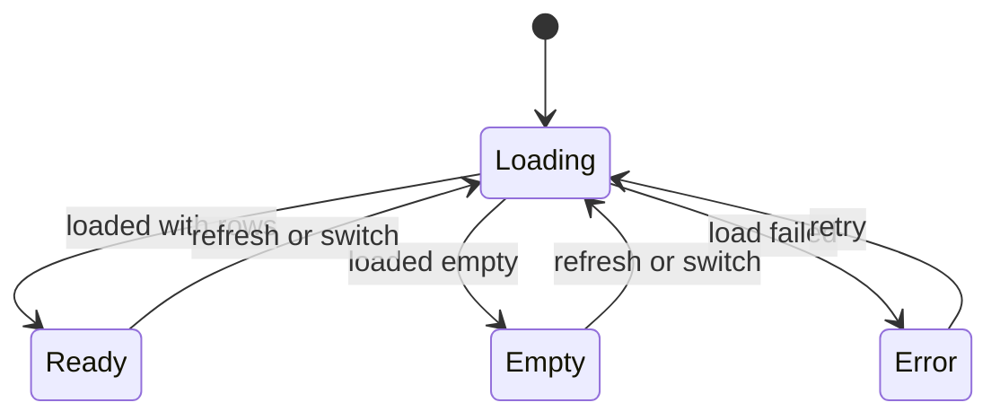

# 系统配置控制面板详细设计

> 适用规范：`mango-pmo/rules/product/03-detailed-design-template.md`。
> 本文承接 [系统配置控制面板 PRD](./system-config-control-panel-prd.md)，说明 Issue #217 的可开发、可验证实现路径。

## 0. 设计前检查

### 0.1 AI 动作判定

| 动作 | 当前结论 | 依据 |
|---|---|---|
| WRITE | PRD 已覆盖目标用户、不处理范围、业务术语、BO/BF/BR/PG/AC、页面原型、展示项和验收项 | `system-config-control-panel-prd.md` 第 1 至 16 章 |
| NEXT | 本设计补齐影响模块、接口变化、数据变化、组件契约、权限边界、异常边界和验证方式后进入开发 | 用户已明确“撰写完整需求文档，然后开始制作” |

### 0.2 PRD 缺口清单

| 缺口 | PRD 章节 | 影响范围 | 处理方式 | 是否阻断 |
|---|---|---|---|---|
| 无阻断缺口 | 全文 | 无 | 按 PRD 进入详细设计 | 否 |

### 0.3 待确认设计问题

| 问题 | 来源 | 影响范围 | 待确认人 | 是否阻断 |
|---|---|---|---|---|
| 敏感配置是否需要脱敏或只写不回显 | PRD 风险与限制 | 敏感配置展示与编辑 | 产品负责人 | 否，本次不纳入一期类型 |

### 0.4 来源证据

| 设计结论 | 来源类型 | 来源路径/ID | 是否推断 | 推断依据 | 是否阻断 |
|---|---|---|---|---|---|
| 系统配置和参数配置合并为一个系统配置入口 | 用户确认/PRD | PRD 第 1、13 章，AC-015 | 否 | 用户明确确认 | 否 |
| 新增可复用配置面板组件，接收多个业务域 | 用户确认/PRD | PRD BO-004、PG-002、AC-002 | 否 | 用户明确给出 `domainCodes` 示例 | 否 |
| 后端沿用 `/system/config`，追加面板元数据字段 | 当前代码/PRD | `SysConfigController`、`SysConfigPo`、BO-001/BO-003 | 是 | 现有配置接口已承载配置 CRUD，追加可空字段兼容旧调用方 | 否 |
| 多选和日期区间配置值按 JSON 字符串数组保存 | PRD/当前代码 | BR-003、AC-009、`config_value` 字符串字段 | 是 | 现有配置值为字符串，一期不引入复杂结构表 | 否 |

## 1. 设计目标与范围

本次设计落地 Issue #217 的“系统参数升级为业务控制面板能力”：

- 统一系统配置入口，不再在系统配置页展示“系统参数 / 系统配置”两个重复 Tab。
- 扩展系统配置项元数据，使配置项可以声明展示类型、选项、默认值、分组、可编辑状态和不可编辑原因。
- 新增 `SystemConfigPanel` 前端通用组件，调用方通过 `domainCodes` 传入一个或多个业务域，组件按业务域 Tab 渲染配置卡片。
- 支持开关、文本、数字、单选、下拉、多选、日期、日期区间的卡片直接编辑，并提供详情弹窗承载完整信息和复杂配置入口。
- 保持旧的 `SysConfigApi.getValue(configKey)`、`/system/config/list` 和 `/system/config/value` 调用兼容。

不落地 PRD 已明确排除的敏感配置脱敏、配置审计审批、灰度发布、租户差异化配置、JSON/日期时间等高级类型。

## 2. 设计输入

| 输入 | 来源 | 说明 |
|---|---|---|
| PRD | `mango-docs/designs/system-config-control-panel/system-config-control-panel-prd.md` | 需求范围、关键对象、流程、页面和 AC |
| 用户确认 | 当前会话 | 合并“系统配置/参数配置”；组件入参 `domainCodes: ['cms','workflow','notice']`；一期追加日期/日期区间 |
| 现有后端 | `mango/mango-platform/mango-system/**` | 已有系统配置表、API、Controller、资源声明同步 |
| 现有前端 | `mango-ui/packages/system/**` | 已有系统配置页、`configApi`、`paramApi` 和业务域组件 |

## 3. PRD 覆盖矩阵

| PRD 项类型 | PRD ID/章节 | PRD 内容 | 设计章节 | 覆盖状态 | 例外说明 |
|---|---|---|---|---|---|
| BO | BO-001 | 系统配置项 | 5、6、8、14 | DONE | 追加元数据字段 |
| BO | BO-002 | 业务域配置分组 | 5、6、7、10 | DONE | 由 `domainCodes` 驱动 |
| BO | BO-003 | 配置展示类型 | 8、12、14 | DONE | 一期八种类型 |
| BO | BO-004 | 配置面板组件 | 10、13、14 | DONE | 新增前端公共组件 |
| BF | BF-001 | 按业务域查看系统配置 | 7、9、10 | DONE | 接口按 domainCode 查询 |
| BF | BF-002 | 编辑简单配置 | 7、8、14、16 | DONE | 卡片直接编辑，失败回滚 |
| BF | BF-003 | 查看和编辑配置详情 | 7、10、13 | DONE | 详情弹窗展示完整信息 |
| BR | BR-001 | 业务域范围规则 | 7、10、13 | DONE | 组件只加载传入业务域 |
| BR | BR-002 | 业务域空态规则 | 10、16 | DONE | 空态和重试 |
| BR | BR-003 | 展示类型编辑规则 | 8、12、13 | DONE | 开关/文本/数字/单选/日期/日期区间 |
| BR | BR-004 | 配置值保存反馈规则 | 7、14、16 | DONE | 成功刷新，失败保留原值 |
| BR | BR-005 | 不可编辑配置规则 | 8、10、16 | DONE | 控件只读，详情显示原因 |
| BR | BR-006 | 详情完整性规则 | 10、13 | DONE | 弹窗完整展示 |
| PG | PG-001 | 系统配置管理页 | 10、11 | DONE | 替换重复 Tab |
| PG | PG-002 | 业务域配置面板组件 | 10、13 | DONE | 公开导出 |
| AC | AC-001 至 AC-015 | 验收标准 | 17、18 | DONE | 逐项映射 |

## 4. 影响模块与改动边界

| 模块/包/页面 | 路径或标识 | 改动类型 | 职责层 | 依赖方向 | 是否公共能力 | 对应 PRD ID | 验证责任 |
|---|---|---|---|---|---|---|---|
| 系统配置 API 契约 | `mango-system-api` | 修改 | 后端 | starter/core 依赖 api | 是 | BO-001/BO-003 | 后端测试 |
| 系统配置核心服务 | `mango-system-core` | 修改 | 后端 | service 依赖 mapper/entity | 是 | BF-001/BF-002 | 后端测试 |
| 系统配置资源声明 | `SystemConfigResourceHandler` | 修改 | 配置 | resource handler 写 sys_config | 是 | BO-001/BO-003 | 集成测试 |
| 系统配置 Flyway | `db/migration/system` | 新增 | 数据 | migration 管理表结构 | 是 | BO-001/BO-003 | migration review |
| 系统配置前端 API | `mango-ui/packages/system/src/api/config.ts` | 修改 | 前端 | 组件/页面依赖 API | 是 | BF-001/BF-002 | 包构建 |
| 通用配置面板组件 | `mango-ui/packages/system/src/components/SystemConfigPanel` | 新增 | 前端 | 业务页面依赖组件 | 是 | BO-004/PG-002 | 包构建/页面走查 |
| 系统配置页 | `mango-ui/packages/system/src/views/config/index.vue` | 修改 | 前端 | 页面复用组件/API | 否 | PG-001/AC-015 | 页面走查 |
| 组件文档 | `mango-ui/packages/system/src/components/README.md` | 修改 | 文档 | 说明公共组件 | 是 | PG-002 | 文档检查 |

## 5. 关键对象

| 对象 | 对应 PRD 对象 | 对象ID口径 | 唯一性 | 租户/归属 | 核心属性 | 关联对象 | 生命周期 | 审计/历史策略 | 关键约束 |
|---|---|---|---|---|---|---|---|---|---|
| 系统配置实体 | BO-001 | `id`/`configKey` | `configKey` 全局唯一 | `domainCode` 归属业务域 | key、value、name、type、domain、valueType、options、editable、status | 展示类型、业务域 | 启用/禁用/不可编辑 | 沿用现有 create/update 字段，不新增历史表 | 旧字段继续可用 |
| 业务域分组 | BO-002 | `domainCode` | 单组件内唯一 | 调用方传入 | code、label、配置列表 | 系统配置实体 | 加载/空/失败 | 无持久化 | 未传入不展示 |
| 展示类型 | BO-003 | `valueType` | 枚举唯一 | 配置项元数据 | BOOLEAN、STRING、NUMBER、RADIO、SELECT、MULTI_SELECT、DATE、DATE_RANGE | 系统配置实体 | 随配置项存在 | 无审计 | 未知值按 STRING 兼容 |
| 配置面板组件 | BO-004 | 组件实例 | 页面内由调用方控制 | 嵌入页面 | domainCodes、activeDomain、cards、loading、error | 业务域分组、系统配置实体 | 加载/正常/空/失败 | 无持久化 | 不依赖宿主 store/router |

## 6. 关键对象关系

| 主对象 | 从对象 | 关系类型 | 基数 | 所有权 | 创建/更新来源 | 删除/停用/归档影响 | 历史保留 | 一致性约束 |
|---|---|---|---|---|---|---|---|---|
| 业务域分组 | 系统配置实体 | 归属 | 1:N | 系统配置实体归属业务域 | 配置 CRUD 或资源声明同步 | 业务域未传入时组件不加载；配置禁用时按状态展示 | 无新增历史 | `domainCode` 精确匹配 |
| 系统配置实体 | 展示类型 | 声明 | N:1 | 配置实体保存展示类型 | 配置 CRUD 或资源声明同步 | 未知展示类型不阻断读取，前端按文本兼容 | 无 | valueType 为空默认 STRING |
| 配置面板组件 | 业务域分组 | 展示 | 1:N | 调用方控制 | `domainCodes` prop | 切换业务域只影响当前组件实例 | 无 | 只展示传入业务域 |


## 7. 关键业务流程

### 7.1 流程：按业务域查看系统配置

| 项 | 内容 |
|---|---|
| 对应 PRD 流程 | BF-001 |
| 参与对象 | BO-001、BO-002、BO-004 |
| 前置条件 | 页面或组件已传入业务域；用户有页面访问权限 |
| 输入 | `domainCodes` 或系统配置页当前业务域筛选 |
| 输出 | 当前业务域配置卡片列表、空态或失败态 |
| 事务范围 | 只读，无事务 |

| PRD 规则 | 设计处理 | 影响对象 | 状态变化 | 异常反馈 |
|---|---|---|---|---|
| BR-001 | 组件逐个按 `domainCode` 调用配置列表接口，只缓存传入业务域 | BO-002/BO-004 | 加载到正常/空/失败 | 加载失败显示重试 |
| BR-002 | 当前业务域列表为空时显示空态 | BO-004 | 正常到空态 | 无配置不显示错误 |

### 7.2 流程：编辑简单配置

| 项 | 内容 |
|---|---|
| 对应 PRD 流程 | BF-002 |
| 参与对象 | BO-001、BO-003、BO-004 |
| 输入 | 配置 ID、编辑后的字符串值 |
| 输出 | 保存结果和刷新后的卡片 |
| 事务范围 | 单条配置值更新 |

| PRD 规则 | 设计处理 | 影响对象 | 状态变化 | 异常反馈 |
|---|---|---|---|---|
| BR-003 | 前端按 `valueType` 渲染开关、输入框、数字输入、单选、下拉、多选、日期、日期区间 | BO-003/BO-004 | 无 | 类型不识别按文本和详情处理 |
| BR-004 | 调用 `/system/config/value` 保存；成功刷新当前项，失败恢复原值 | BO-001/BO-004 | 值更新或保留原值 | Element Plus 消息提示失败原因 |
| BR-005 | `editable=false` 或 `status=0` 时控件只读 | BO-001 | 可编辑到不可编辑 | 显示不可编辑原因 |

### 7.3 流程：查看和编辑配置详情

| 项 | 内容 |
|---|---|
| 对应 PRD 流程 | BF-003 |
| 参与对象 | BO-001、BO-003、BO-004 |
| 输入 | 配置卡片 |
| 输出 | 配置详情弹窗 |
| 事务范围 | 打开详情只读；保存时复用配置值更新事务 |

| PRD 规则 | 设计处理 | 影响对象 | 状态变化 | 异常反馈 |
|---|---|---|---|---|
| BR-006 | 弹窗展示名称、key、domain、type、valueType、value、介绍、状态、可编辑状态 | BO-001/BO-004 | 详情打开/关闭 | 保存失败不关闭成功态 |

## 8. 状态机设计

### 8.1 状态定义表

| 对象 | 状态 | 状态含义 | 初始/中间/终态 | 是否可逆 | 技术编码 | 持久化值 | 允许动作 | 禁止动作 | 进入条件 | 退出条件 | 对应 PRD ID |
|---|---|---|---|---|---|---|---|---|---|---|---|
| 系统配置实体 | 启用 | 可作为有效配置展示和读取 | 初始/中间 | 是 | `status` | `1` | 查看、编辑可编辑项 | 无权限编辑 | status=1 | status=0 | BO-001 |
| 系统配置实体 | 禁用 | 不作为可用配置 | 中间 | 是 | `status` | `0` | 查看详情、启用 | 作为有效配置使用 | status=0 | status=1 | BO-001 |
| 系统配置实体 | 不可编辑 | 可见但不可修改 | 中间 | 是 | `editable` | `0` | 查看详情 | 保存配置值 | editable=false | editable=true | BR-005 |
| 配置面板组件 | 正常 | 当前业务域有配置 | 中间 | 是 | 前端状态 | `ready` | 切换、编辑、详情 | 无 | 加载成功且有数据 | 切换/刷新 | BO-004 |
| 配置面板组件 | 空态 | 当前业务域无配置 | 中间 | 是 | 前端状态 | `empty` | 切换、刷新 | 编辑不存在配置 | 加载成功且无数据 | 切换/刷新 | AC-005 |
| 配置面板组件 | 失败态 | 配置加载失败 | 中间 | 是 | 前端状态 | `error` | 重试、切换 | 编辑配置 | 接口失败 | 重试成功 | AC-006 |

### 8.2 状态流转表

| 对象 | 当前状态 | 触发动作 | 目标状态 | 条件 | 副作用 | 用户反馈 | 异常处理 | 对应 PRD 状态/规则 |
|---|---|---|---|---|---|---|---|---|
| 配置面板组件 | 加载中 | 加载成功 | 正常 | 列表非空 | 缓存当前业务域配置 | 展示卡片 | 无 | BF-001/BR-001 |
| 配置面板组件 | 加载中 | 加载成功 | 空态 | 列表为空 | 清空卡片 | 展示空态 | 无 | BF-001/BR-002 |
| 配置面板组件 | 加载中 | 加载失败 | 失败态 | 接口异常 | 记录错误 | 展示重试 | 重试重新加载 | AC-006 |
| 系统配置实体 | 启用 | 保存值成功 | 启用 | editable=true | 更新 configValue | 保存成功 | 无 | BR-004 |
| 系统配置实体 | 启用 | 保存值失败 | 启用 | 服务失败 | 保留原值 | 保存失败 | 恢复本地值 | BR-004/AC-011 |



## 9. 数据流设计

```mermaid
flowchart LR
  Page[系统配置页或业务页] --> Panel[SystemConfigPanel]
  Panel --> Api[configApi]
  Api --> Controller[/system/config]
  Controller --> Service[SysConfigService]
  Service --> DB[(sys_config)]
```

| 流程 | 数据来源 | 输入 | 处理方 | 写入对象 | 流水/历史 | 事务边界 | 外部依赖 | 失败处理 | 用户可见结果 |
|---|---|---|---|---|---|---|---|---|---|
| BF-001 | `sys_config` | domainCode、type | ConfigPanel/configApi/SysConfigService | 无 | 无 | 只读 | 无 | 显示错误态 | 卡片/空态/失败态 |
| BF-002 | 用户输入 | id、value | ConfigPanel/configApi/SysConfigService | `sys_config.config_value` | 无 | 单条 update | 无 | 恢复旧值并提示 | 保存成功或失败 |
| BF-003 | 组件已加载配置 | config row | ConfigPanel | 可选写 `config_value` | 无 | 保存时同 BF-002 | 无 | 详情保留并提示 | 弹窗详情 |

特殊数据流：本次不涉及文件、富文本、外部系统、异步任务或回调。

## 10. 页面与功能映射

| PRD 页面 | 页面能力 | 关键对象 | 关键流程 | 功能设计 | 验收项 |
|---|---|---|---|---|---|
| PG-001 | 系统配置统一入口 | BO-001/BO-002/BO-003 | BF-001/BF-002/BF-003 | 页面使用 `SystemConfigPanel`，顶部保留筛选和新增配置入口 | AC-001/AC-003/AC-015 |
| PG-002 | 业务域配置面板组件 | BO-001/BO-002/BO-004 | BF-001/BF-002/BF-003 | props 接收 `domainCodes`，内部渲染 Tab、卡片、详情弹窗 | AC-002/AC-004/AC-013 |

| PG ID | 区域 | 按钮/字段/列表列/详情块 | 对应 BF/BR/AC | 前端交互 | 后端能力 | 权限/状态条件 | 异常反馈 |
|---|---|---|---|---|---|---|---|
| PG-001 | 搜索 | 关键词、业务域、展示类型 | BF-001/AC-001 | 过滤当前面板数据 | `/system/config/list` | 页面访问权限 | 加载失败提示 |
| PG-001 | 按钮 | 新增配置 | AC-015 | 打开新增配置表单 | `POST /system/config` | `system:config:add` | 表单错误提示 |
| PG-002 | Tab | 业务域 Tab | BR-001/AC-002 | 切换后加载对应 domainCode | `GET /system/config/list` | 调用方传入范围 | 失败态重试 |
| PG-002 | 卡片 | 名称、值、介绍、操作控件 | BR-003/AC-003 | 按 valueType 渲染直接编辑控件 | `PUT /system/config/value` | editable/status | 保存失败恢复 |
| PG-002 | 详情 | 完整配置详情 | BR-006/AC-013 | 打开弹窗查看和编辑 | `GET /system/config/detail` 可复用已加载数据 | 配置存在 | 保存失败不关闭 |

## 11. 菜单、页面与权限资源设计

| 菜单/页面/按钮 | PRD 页面/按钮 | 路由 | 页面 key/组件 key | 权限资源码 | 默认授权 | 后端校验入口 | 租户/数据权限断言 | 无权限反馈 |
|---|---|---|---|---|---|---|---|---|
| 系统配置页 | PG-001 | 沿用现有系统配置路由 | `ConfigView` | 沿用现有菜单权限 | 沿用现状 | `/system/config/*` | 沿用现有系统模块权限与租户上下文 | 宿主权限拦截 |
| 查询配置 | PG-001/PG-002 | 无新增路由 | `SystemConfigPanel` | `system:config:list` | 沿用现状 | `SysConfigController.list` | 后端按现有权限拦截 | 组件失败态 |
| 修改配置值 | 保存 | 无新增路由 | `SystemConfigPanel` | `system:config:edit` | 沿用现状 | `SysConfigController.updateValue` | 后端按现有权限拦截 | 保存失败提示 |

## 12. 字典与配置设计

| 名称 | PRD 展示项 | 编码 | 展示文案 | 默认值 | 是否可运营 | 初始化方式 | 兼容策略 |
|---|---|---|---|---|---|---|---|
| 配置展示类型 | 开关、文本、数字、单选、下拉、多选、日期、日期区间 | BOOLEAN/STRING/NUMBER/RADIO/SELECT/MULTI_SELECT/DATE/DATE_RANGE | 开关/文本/数字/单选/下拉/多选/日期/日期区间 | STRING | 是 | 后端枚举 + 前端类型映射 | 空或未知按 STRING |
| 配置状态 | 启用、禁用 | 1/0 | 启用/禁用 | 1 | 是 | 现有字段 | 沿用现有 |
| 可编辑状态 | 可编辑、不可编辑 | 1/0 | 可编辑/不可编辑 | 1 | 是 | 新增字段 | 空按可编辑 |
| 选项列表 | 单选、下拉、多选选项 | JSON 字符串或字典绑定 | label/value | 空 | 是 | 配置 CRUD 或资源声明 | 解析失败或字典为空时显示缺少选项 |

## 13. 前端复用判断

| 复用判断 | 使用页面 | 解决问题 | 是否新增组件 | 关键行为 | 状态与反馈 | 复用边界 | 不新增依据 |
|---|---|---|---|---|---|---|---|
| 新增 `SystemConfigPanel` | PG-001、PG-002、业务模块设置页 | 多业务域配置统一卡片化管理 | 是 | domain Tab、卡片编辑、详情弹窗、刷新 | 加载/正常/空/失败/只读 | 只负责系统配置展示和编辑，不承载业务专属规则 | 不适用，用户明确要求通用组件 |

组件公开契约：

| API | 类型 | 说明 |
|---|---|---|
| `domainCodes` | `string[]` | 必填，组件展示的业务域编码列表 |
| `domainLabels` | `Record<string,string>` | 可选，业务域 Tab 展示名 |
| `readonly` | `boolean` | 可选，整体只读 |
| `showRefresh` | `boolean` | 可选，是否显示刷新按钮 |
| `typeFilter` | `ConfigValueType[]` | 可选，筛选展示类型 |
| `update` event | `(config: SysConfig) => void` | 保存成功后通知调用方 |
| `loaded` event | `(domainCode: string, configs: SysConfig[]) => void` | 当前业务域加载成功 |

## 14. 关键技术

### 14.1 技术点总览

| 技术点 | 是否适用 | 不适用依据 | 设计选择 | 理由 | 影响范围 | 风险 | 验证方式 |
|---|---|---|---|---|---|---|---|
| 接口 | 是 |  | 复用 `/system/config` 并扩展返回字段 | 保持兼容 | 后端/前端 API | 旧调用方字段忽略 | 后端测试/前端构建 |
| 数据 | 是 |  | `sys_config` 追加 nullable 元数据列 | 不破坏历史数据 | migration/entity/api | 历史数据元数据为空 | migration review/测试 |
| 权限 | 是 |  | 沿用现有 `system:config:*` | 不新增权限模型 | Controller/页面 | 业务域细粒度权限未覆盖 | 手工验收 |
| 租户 | 是 |  | 沿用现有系统模块租户上下文 | PRD 不新增租户差异化 | Service | 不处理跨租户差异配置 | 记录例外 |
| 文件/富文本/外部依赖 | 否 | 本次不涉及 | 无 | 无 | 无 | 无 | 无 |
| 事务 | 是 |  | 单条配置值 update | 配置值原子更新 | Service | 并发最后写入生效 | 后端测试 |
| 并发 | 是 |  | 不新增版本锁 | 现有系统未提供配置版本 | 编辑同一配置 | 后写覆盖先写 | 风险说明 |
| 兼容 | 是 |  | 保留旧字段和旧接口 | 业务读取不受影响 | API/DB | 元数据为空影响体验 | 前端兼容默认值 |
| 迁移 | 是 |  | 新增 Flyway V6 | 不改历史 migration | DB | 低 | migration 文件检查 |

### 14.2 接口设计

| 接口ID | 对应 PRD BF/BR/AC | 调用方 | 模块 | 方法/路径或既有入口 | 请求结构 | 响应结构 | 校验规则 | 权限/租户/数据权限 | 幂等/分页/排序 | 错误码 | 兼容策略 | 验证方式 |
|---|---|---|---|---|---|---|---|---|---|---|---|---|
| API-001 | BF-001/AC-001/AC-002 | ConfigPanel/ConfigView | mango-system | `GET /system/config/list` | `type?`、`domainCode?` | `SysConfigPo[]` 增加元数据字段 | domainCode 可空 | `system:config:list` | 按 sort 升序 | 沿用 `R.fail` | 旧字段保持 | 后端测试/前端构建 |
| API-002 | BF-002/AC-010/AC-011 | ConfigPanel | mango-system | `PUT /system/config/value` | `id`、`value` | `Boolean` | id 必填；不可编辑/禁用返回失败 | `system:config:edit` | 单条更新 | 配置不存在/不可编辑 | 保留 query 参数形式 | 后端测试 |
| API-003 | BF-003/AC-013 | ConfigPanel/ConfigView | mango-system | `GET /system/config/detail` | `id` | `SysConfigPo` | id 必填 | `system:config:query` | 无 | 配置不存在 | 旧字段保持 | 后端测试 |
| API-004 | BO-003/BR-003 | ConfigView | mango-system | `GET /system/config/value-types` | 无 | `String[]` | 无 | `system:config:list` | 无 | 无 | 新增接口，不影响旧调用方 | 后端测试 |

### 14.3 数据与 Migration

| 表/实体 | 对应对象/规则 | 字段变化 | 约束 | 索引 | 审计字段 | 租户字段 | 默认值 | 初始化数据 | 迁移/回填 | 回滚/补偿 | 验证方式 |
|---|---|---|---|---|---|---|---|---|---|---|---|
| `sys_config`/`SysConfig` | BO-001/BO-003 | 新增 `value_type`、`group_code`、`group_name`、`default_value`、`options`、`option_source`、`dict_type`、`editable`、`editable_reason` | nullable；editable 默认 1 | 不新增 | 沿用 | 沿用现有 | valueType 为空按 STRING，optionSource 为空按 CUSTOM | 默认系统配置通过 `mango-resource` 注入，业务配置由各业务模块声明资源 | Flyway V6/V7 add column | 回滚需 drop 新列，旧功能不受影响 | migration 文件/测试 |

### 14.4 权限与租户

| 能力 | 权限边界 | 租户边界 | 数据权限 | 验证方式 |
|---|---|---|---|---|
| 查看配置面板 | `system:config:list` | 沿用现有请求上下文 | 组件按传入 domainCodes 限制展示范围，后端不新增业务域权限 | 手工页面验收 |
| 编辑配置值 | `system:config:edit` | 沿用现有请求上下文 | 禁用/不可编辑配置后端兜底拒绝 | 后端测试 |

### 14.5 文件、富文本与外部依赖

| 能力 | 依赖对象 | 存储/引用方式 | 失败处理 | 验证方式 |
|---|---|---|---|---|
| 本次不涉及 | 无 | 无 | 无 | 无 |

### 14.6 一致性、并发、性能与迁移

| 场景 | 设计选择 | 风险 | 处理方式 | 验证方式 |
|---|---|---|---|---|
| 同一配置并发编辑 | 后写覆盖先写，沿用现有行为 | 用户可能覆盖他人修改 | 保存后刷新卡片展示最终值 | 手工验收 |
| 多业务域加载 | 组件按 Tab 懒加载当前业务域 | 首次切换有加载等待 | loading 状态和缓存 | 前端走查 |
| 历史配置缺元数据 | 默认 STRING、editable=true、说明取 remark | 卡片体验不完整 | 前端兼容展示 | 前端构建/走查 |

## 15. 开发任务映射

| DEV ID | 对应 BO/BF/BR/PG/AC | 后端模块 | 前端包/页面 | 接口 | 数据对象 | 测试类型 | 完成标准 |
|---|---|---|---|---|---|---|---|
| DEV-001 | BO-001/BO-003/BR-003 | mango-system-api/core |  | API-001/API-004 | sys_config | 单元/集成 | API、entity、resource handler 支持元数据 |
| DEV-002 | BF-002/BR-004/BR-005 | mango-system-core/starter |  | API-002 | sys_config | 单元 | 禁用/不可编辑配置拒绝更新 |
| DEV-003 | BO-004/PG-002/AC-002 |  | `@mango/system` | API-001/API-002 | SysConfig | 包构建/手工 | 新组件导出并支持多 domainCodes |
| DEV-004 | PG-001/AC-015 |  | `views/config/index.vue` | API-001/API-002/API-003 | SysConfig | 包构建/手工 | 系统配置页不再展示重复 Tab |
| DEV-005 | AC-001 至 AC-015 | mango-system/core | `@mango/system` | 全部 | 全部 | 验证 | 交付台账全部 DONE 或 EXCEPTION |

## 16. 异常与边界

| 场景 | 触发条件 | 系统处理 | 用户反馈 | 影响对象 | 验收方式 |
|---|---|---|---|---|---|
| 无业务域配置 | 当前 domainCode 返回空列表 | 组件展示空态 | “当前业务域暂无系统配置” | BO-004 | AC-005 |
| 配置加载失败 | 列表接口失败 | 组件进入失败态 | 失败提示和重试 | BO-004 | AC-006 |
| 不可编辑配置保存 | editable=false | 后端返回失败，前端控件禁用 | “此配置不可编辑” | BO-001 | AC-012 |
| 禁用配置保存 | status=0 | 后端返回失败，前端控件禁用 | “配置已禁用” | BO-001 | 后端测试 |
| 日期区间非法 | 结束日期早于开始日期 | 前端阻止保存 | 输入不符合要求 | BO-003 | AC-009 |
| 选项型配置无选项 | RADIO/SELECT/MULTI_SELECT options 为空、解析失败或绑定字典为空 | 控件禁用 | 缺少可选项 | BO-003 | 手工验收 |
| 保存失败 | 后端或网络失败 | 恢复卡片原值 | 保存失败提示 | BO-004 | AC-011 |

## 17. 验收映射

| PRD AC ID | PRD 验收项 | 设计章节 | 页面/按钮 | 接口 | 数据 | 权限/状态 | 异常/边界 | 自动验证命令 | 手工验收步骤 | 测试数据 | 证据类型 | 不可自动验证原因 | 风险/例外 |
|---|---|---|---|---|---|---|---|---|---|---|---|---|---|
| AC-001 | 系统配置页按业务域展示 | 10 | PG-001 Tab/卡片 | API-001 | domainCode | list 权限 | 空/失败 | pnpm build | 进入系统配置页 | COMMON/CMS | 截图/构建输出 | UI 需人工 | 无 |
| AC-002 | 通用组件支持多个业务域 | 13 | PG-002 Tab | API-001 | domainCodes | 调用方范围 | 空/失败 | pnpm build | 传入多个 domainCodes | cms/workflow/notice | 构建输出/截图 | UI 需人工 | 无 |
| AC-003 | 配置卡片显示核心信息 | 10 | 配置卡片 | API-001 | SysConfigPo | status/editable | 缺说明 | pnpm build | 查看卡片 | 任意配置 | 截图 | UI 需人工 | 无 |
| AC-004 | 配置面板正常态可用 | 8/10 | 配置卡片 | API-001/API-002 | sys_config | editable | 保存失败 | pnpm build | 打开有配置业务域 | COMMON | 截图 | UI 需人工 | 无 |
| AC-005 | 业务域无配置展示空态 | 16 | 空态 | API-001 | 无数据 | 无 | 空态 | pnpm build | 切换无配置业务域 | empty domain | 截图 | UI 需人工 | 无 |
| AC-006 | 加载失败可重试 | 16 | 重试按钮 | API-001 | 无 | 无 | 失败态 | pnpm build | 断网或接口失败 | N/A | 截图 | 需运行态 | 无 |
| AC-007 | 开关配置可直接操作 | 12/13 | switch | API-002 | BOOLEAN | editable | 保存失败 | 后端测试/pnpm build | 修改开关 | true/false | 测试输出/截图 | UI 需人工 | 无 |
| AC-008 | 日期配置可直接操作 | 12/13 | date picker | API-002 | DATE | editable | 保存失败 | pnpm build | 修改日期 | 2026-06-23 | 截图 | UI 需人工 | 无 |
| AC-009 | 日期区间配置可直接操作 | 12/16 | daterange | API-002 | DATE_RANGE JSON | editable | 非法区间 | pnpm build | 修改日期区间 | `["2026-06-01","2026-06-23"]` | 截图 | UI 需人工 | 无 |
| AC-010 | 保存成功刷新卡片 | 7/16 | 保存 | API-002 | configValue | editable | 无 | 后端测试/pnpm build | 保存配置 | 任意配置 | 测试输出/截图 | UI 需人工 | 无 |
| AC-011 | 保存失败保留原值 | 7/16 | 保存 | API-002 | configValue | editable | 保存失败 | 后端测试/pnpm build | 触发保存失败 | 不存在 ID | 测试输出/截图 | UI 需人工 | 无 |
| AC-012 | 不可编辑配置只读 | 8/16 | 禁用控件 | API-002 | editable=0 | 不可编辑 | 拒绝保存 | 后端测试/pnpm build | 查看不可编辑配置 | editable=false | 测试输出/截图 | UI 需人工 | 无 |
| AC-013 | 配置详情展示完整信息 | 10/13 | 详情弹窗 | API-003/已加载数据 | SysConfigPo | status/editable | 无 | pnpm build | 点击详情 | 任意配置 | 截图 | UI 需人工 | 无 |
| AC-014 | 取消详情不影响配置 | 7/10 | 详情取消 | API-002 未调用 | configValue | 无 | 取消 | pnpm build | 修改后取消 | 任意配置 | 截图 | UI 需人工 | 无 |
| AC-015 | 系统配置统一入口 | 10/11 | PG-001 | API-001 | sys_config | 页面权限 | 无 | pnpm build | 进入页面确认无重复 Tab | N/A | 截图 | UI 需人工 | 无 |

## 18. 交付台账候选项

| 候选项 | 类型 | 对应 PRD ID | 对应设计章节 | 验证方式 | 证据要求 |
|---|---|---|---|---|---|
| 配置元数据字段和 migration | 数据 | BO-001/BO-003 | 14.3 | 后端测试/代码检查 | 测试输出 |
| 配置列表和详情返回元数据 | 接口 | BF-001/BF-003 | 14.2 | 后端测试 | 测试输出 |
| 配置值更新校验不可编辑/禁用 | 接口/异常 | BR-004/BR-005 | 16 | 后端测试 | 测试输出 |
| `SystemConfigPanel` 组件 | 页面/组件 | PG-002/AC-002 | 13 | 前端构建/手工 | 构建输出/截图 |
| 系统配置统一页面 | 页面 | PG-001/AC-015 | 10 | 前端构建/手工 | 构建输出/截图 |

## 19. 风险与取舍

| 风险/取舍 | 类型 | 影响范围 | 处理方式 | 是否需要用户确认 |
|---|---|---|---|---|
| 选项列表用 JSON 字符串或字典绑定保存 | 设计取舍 | RADIO/SELECT/MULTI_SELECT 配置 | 保持单表兼容，前端容错解析；公共选项优先绑定字典 | 否 |
| 多选和日期区间用 JSON 字符串数组保存 | 设计取舍 | MULTI_SELECT/DATE_RANGE | 保持 `config_value` 字符串契约 | 否 |
| 不新增业务域级后端权限 | 业务例外 | 组件复用边界 | 只按调用方传入范围展示，后端沿用现有权限 | 否 |
| 不做并发版本锁 | 技术风险 | 同配置多人编辑 | 沿用现有后写覆盖，保存后刷新 | 否 |
| 敏感配置不在一期 | 业务例外 | 敏感值配置 | 按 PRD 风险记录，不实现敏感类型 | 否 |

## 20. AI 输出自检

| 检查项 | 结果 | 说明 |
|---|---|---|
| PRD 关键对象、流程、规则、页面、字典、验收项是否都有覆盖矩阵记录 | PASS | 第 3 章覆盖 |
| 每条 PRD 业务规则是否映射到状态、数据、页面反馈或异常处理 | PASS | 第 7、8、16 章覆盖 |
| 每个关键对象关系是否有结构化表和图 | PASS | 第 6 章覆盖 |
| 每个有生命周期的对象是否有状态定义表、状态流转表和状态图 | PASS | 第 8 章覆盖 |
| 数据流是否写清来源、去向、变更对象、事务边界、失败处理和用户可见结果 | PASS | 第 9 章覆盖 |
| 关键技术是否覆盖本次相关的接口、数据、权限、租户、文件、事务、并发、兼容和验证方式 | PASS | 第 14 章覆盖 |
| 每个 PRD 验收项是否映射到至少一个设计交付物 | PASS | 第 17 章覆盖 |
| 最终动作 | NEXT | 可进入开发 |
