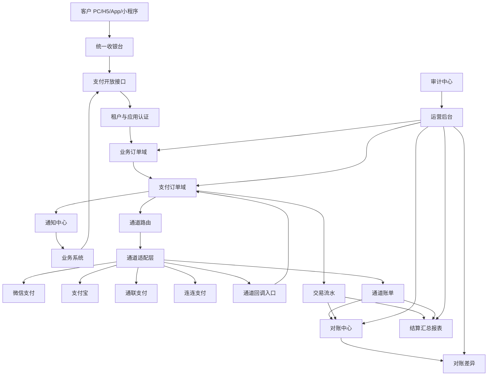
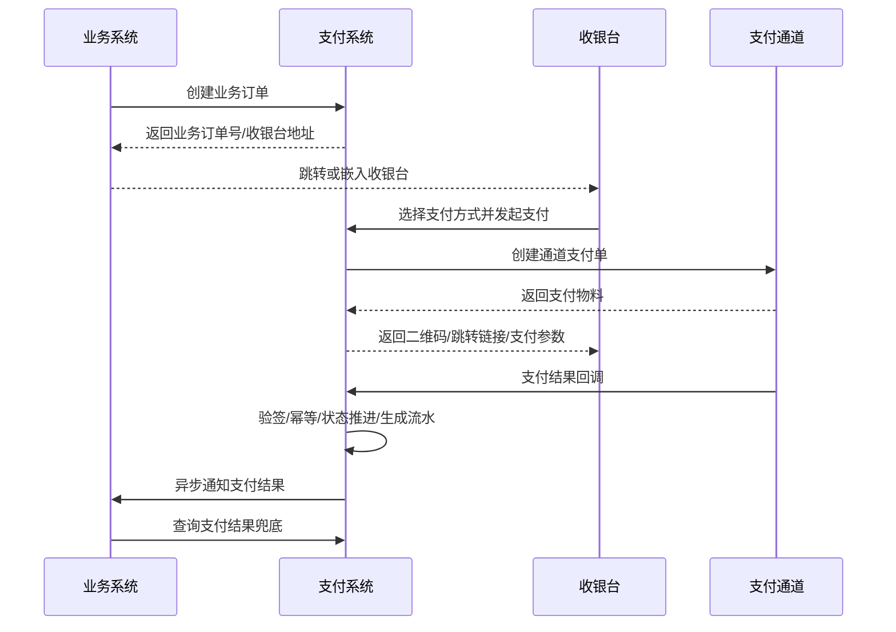

# 统一支付系统设计说明书

## 1. 目标

建设一套满足保函业务当前支付诉求的统一支付系统。系统通过接入微信、支付宝、通联支付、连连支付等外部支付通道，为业务系统提供标准化收款、退款、支付结果通知、查单、对账、资金核对和结算汇总能力。

系统只提供支付能力，不承载保函业务模型，不判断保函业务状态，不决定业务是否可退款、不决定出函流程。业务规则由业务系统负责，支付系统只负责支付域内的订单、通道、流水、退款、对账和安全控制。

系统不沉淀用户余额，不建设钱包账户，不建设财务总账，不替代财务系统，不自动付款。系统不涉及保证金/担保金业务，不提供虚拟户、监管户、保证金缴退、冻结、释放、扣划等能力。

## 2. 设计范围

### 2.1 本期支持

| 分类 | 范围 |
|---|---|
| 支付通道 | 微信支付、支付宝、通联支付、连连支付，预留后续通道扩展 |
| 支付方式 | 微信扫码、支付宝扫码/收银台、企业网银、个人网银、线下转账登记 |
| 业务接入 | 创建支付订单、获取收银台、支付结果通知、退款结果通知、订单状态查询 |
| 后台管理 | 应用、企业主体、支付通道、支付方式、收银台、订单、退款、流水、对账、差异、结算汇总、审计 |
| 多租户 | 租户级配置、应用级配置、主体级收款账户、租户数据隔离、租户维度对账和结算汇总 |
| 资金安全 | 幂等、状态机、唯一成功支付、金额校验、回调验签、主动查单、对账补偿、人工纠偏审计 |

### 2.2 本期不支持

| 场景 | 说明 |
|---|---|
| 保函业务规则 | 不判断申请、出函、拒保、撤单等业务状态 |
| 业务退款决策 | 不决定是否可退、退多少、手续费是否退，由业务系统传入退款请求 |
| 保证金/担保金业务 | 不管理保证金应收、缴纳、冻结、释放、扣划、退还等生命周期 |
| 银行虚拟户/监管户 | 不对接保证金虚拟户、监管账户、专户入账通知等银行资金监管能力 |
| 自建支付账户体系 | 不提供用户余额、商户余额、充值、提现、内部转账 |
| 持牌支付清算 | 资金清算仍由持牌支付机构、银行或通道完成 |
| 财务总账系统 | 不做借贷分录、会计科目、总账、财务凭证、自动付款 |
| 公对私、私对私转账 | 默认不支持 |
| 复杂营销支付 | 红包、优惠券、立减、组合支付不纳入本期 |
| 跨境支付 | 不纳入本期 |
| 复杂清分引擎 | 本期只做结算汇总报表，不做多级分润和自动清分付款 |

## 3. 能力定位

### 3.1 后台管理能力

后台运营能力面向平台运营、财务、风控、客服、技术支持人员。

| 能力 | 说明 |
|---|---|
| 租户管理 | 管理租户基础信息、租户状态、租户支付能力开通情况 |
| 应用管理 | 管理业务接入应用，应用拥有独立 appCode、密钥、回调地址、支付配置 |
| 企业主体管理 | 管理收款主体、统一社会信用代码、银行账户、开户行、证照资料 |
| 支付通道管理 | 管理微信、支付宝、通联、连连等通道参数、证书、密钥、商户号、启停状态 |
| 支付方式管理 | 管理支付方式展示、可用渠道、优先级、限额、租户/应用可见范围 |
| 收银台管理 | 配置不同终端、租户、应用的收银台样式、支付方式、过期时间 |
| 订单管理 | 查询业务订单、支付订单、退款订单、交易流水和状态流转记录 |
| 异常订单管理 | 处理重复支付、超时未回调、金额不一致、状态不一致、疑似风险订单 |
| 对账管理 | 下载或导入通道账单，执行自动对账，输出差异结果和处理记录 |
| 差异处理 | 对差异单进行确认、查单、补单、退款、忽略、关闭等受控处理 |
| 结算汇总管理 | 按日、租户、应用、主体、通道生成支付/退款/手续费/净收款汇总 |
| 通知管理 | 查看业务回调通知结果，支持失败重试和人工补偿推送 |
| 审计管理 | 记录所有资金相关人工操作、配置变更、审批记录和操作者信息 |

### 3.2 对业务系统提供的能力

业务系统通过支付系统完成收款和退款，但业务系统仍保留自己的业务状态和业务规则。

| 能力 | 说明 |
|---|---|
| 创建业务订单 | 业务系统提交业务单号、金额、标题、有效期、回调地址、跳转地址 |
| 获取收银台链接 | 支付系统返回可嵌入 PC/H5/小程序/App 的收银台地址或支付参数 |
| 发起支付 | 根据业务订单和支付方式生成支付订单并调用外部通道 |
| 更换支付方式 | 一个业务订单允许创建多笔支付订单，但最终只允许一笔成功 |
| 查询支付状态 | 业务系统可主动查询业务订单、支付订单、退款订单状态 |
| 接收支付通知 | 支付成功、失败、关闭、退款成功、退款失败时通知业务系统 |
| 发起退款 | 业务系统按原业务订单发起全额或部分退款 |
| 获取支付凭证 | 获取交易流水、支付渠道单号、付款时间、付款方信息等凭证信息 |
| 对账辅助 | 业务系统可按业务单号查询支付中心侧支付结果和流水 |
| 多租户隔离 | 业务请求必须带租户/应用身份，系统按租户和应用做权限与数据隔离 |

### 3.3 对客户提供的能力

客户通过业务系统进入支付系统提供的收银台完成付款。

| 能力 | 说明 |
|---|---|
| 统一收银台 | 展示订单金额、订单名称、剩余支付时间、支付方式 |
| 多支付方式 | 支持微信、支付宝、企业网银、个人网银、线下转账等 |
| 支付方式切换 | 未支付成功前可切换支付方式重新发起支付 |
| 支付倒计时 | 支付订单和业务订单按有效期自动过期 |
| 支付结果页 | 展示支付成功、支付处理中、支付失败、订单关闭等结果 |
| 退款进度 | 客户通过业务系统查看退款申请和退款结果 |
| 支付凭证 | 支持展示或下载支付凭证，便于业务系统留档 |
| 安全校验 | 所有支付入口绑定业务订单、金额、租户、应用和有效期，防止篡改 |

## 4. 业务边界

### 4.1 支付系统负责

1. 接收业务系统支付请求。
2. 校验租户、应用、签名、金额、幂等键。
3. 创建业务订单和支付订单。
4. 展示收银台并发起通道支付。
5. 接收通道回调并主动查单。
6. 推进支付订单和业务订单的支付状态。
7. 向业务系统通知支付和退款结果。
8. 接收业务系统退款请求并调用原通道退款。
9. 记录交易流水、通道账单、对账差异。
10. 生成结算汇总报表。
11. 提供后台管理、审计、告警和人工补偿能力。

### 4.2 业务系统负责

1. 判断业务是否需要支付。
2. 判断业务订单是否可关闭。
3. 判断业务是否可退款、退款金额是多少、手续费是否退。
4. 支付成功后推进业务流程。
5. 退款成功后推进业务流程。
6. 面向客户展示业务侧状态。
7. 保存业务所需的支付凭证引用。

### 4.3 支付系统不感知的业务信息

支付系统不建模保函申请、项目、出函、拒保、撤单、承保等业务对象。业务系统如需透传展示信息，只能通过 `extendInfo` 传入白名单字段，支付系统仅用于展示、通知透传、对账辅助，不参与业务判断。

### 4.4 保证金/担保金边界

保证金/担保金不属于本支付系统边界。若未来需要保证金能力，应由独立保证金或资金监管模块负责，再按普通业务订单调用支付系统完成收款、退款和状态通知。

支付系统不处理：

1. 保证金应收规则和金额计算。
2. 保证金缴纳单生命周期。
3. 保证金冻结、释放、扣划、赔付。
4. 保证金是否可退、退多少、何时退。
5. 银行虚拟户、监管户、专户入账通知。
6. 保证金利息、资金归属和监管报表。

支付系统只保留通用支付能力：收款、退款、查单、回调、对账、支付凭证和结算汇总。

## 5. 总体架构



## 6. 核心模块设计

### 6.1 租户与应用模块

| 对象 | 说明 |
|---|---|
| 租户 | 数据隔离和配置隔离单元 |
| 应用 | 业务系统下的接入应用，拥有 appCode、appSecret、回调配置 |
| 应用权限 | 控制应用可用支付方式、通道、收银台、退款权限 |

关键规则：

1. 所有开放接口必须识别 tenantId 和 appCode。
2. appSecret 只展示一次，后续只能重置。
3. 应用回调地址可配置白名单。
4. 禁用租户或应用后，不允许创建新支付订单，历史订单仍可查询、退款和对账。

### 6.2 企业主体模块

企业主体用于管理收款方、结算报表归属方和通道商户配置归属。

| 对象 | 说明 |
|---|---|
| 企业主体 | 收款主体或商户主体 |
| 银行账户 | 企业对公账户，用于网银收款、线下转账、对账 |
| 通道商户 | 微信、支付宝、通联、连连等外部商户号 |

关键规则：

1. 银行账号、证件号等敏感字段必须加密存储和脱敏展示。
2. 企业主体变更必须记录操作日志。
3. 启用中的支付通道引用企业主体时，不允许直接删除主体。

### 6.3 支付通道模块

支付通道是对外部支付机构接入能力的封装。

| 能力 | 说明 |
|---|---|
| 通道配置 | 商户号、AppId、证书、密钥、网关地址、回调地址 |
| 通道启停 | 控制通道是否可被路由使用 |
| 通道限额 | 配置单笔、单日、租户、应用维度限额 |
| 通道优先级 | 配置支付方式下多个通道的优先级 |
| 通道告警 | 失败率过高、证书即将过期、回调异常时告警 |

关键规则：

1. 通道密钥、证书必须加密存储，不允许后台明文查看。
2. 通道返回码必须映射为统一支付结果，不能直接把三方码透传为业务状态。
3. 通道适配层必须保持无业务侵入，不引用业务系统模型。
4. 第一阶段支持人工启停和优先级路由，自动降级后续增强。

### 6.4 支付通道可复用资产来源

从 `/Users/hardy/Work/Zhongshu/beer-brace-2/` 已审阅到可参考的历史支付实现。本期只复用通道接入思路、SDK 依赖和适配代码结构，不复制历史密钥、证书、环境配置和定时任务。

| 类型 | 来源 | 用途 | 风险判断 |
|---|---|---|---|
| 旧支付模块 | `/Users/hardy/Work/Zhongshu/beer-brace-2/beer-brace-payment` | 优先参考支付通道抽象、通道实现、退款、查单、回调、账单解析代码 | 可参考，需按 Mango 模块规范重写边界 |
| 云版支付模块 | `/Users/hardy/Work/Zhongshu/beer-brace-2/beer-brace-payment-cloud` | 与旧支付模块高度重复，仅作交叉核对 | 不作为主来源，避免复制两套重复实现 |
| 通道抽象 | `beer-brace-payment-biz/src/main/java/com/zszc/brace/payment/channel/PayChannelApi.java` | 参考支付、H5、App、JSAPI、退款、查单、回调、查退款、关单、账单能力定义 | 可参考方法语义，不直接复用包名和模型 |
| 通道工厂 | `.../channel/factory/PayChannelFactory.java` | 参考通道选择逻辑 | 可参考；新实现优先使用 Spring Bean/SPI 注册，避免扩大 switch |
| 通道枚举 | `.../enums/PayPlatformEnum.java` | 参考已支持通道：通联、银联商务天满、微信、支付宝、线下支付 | 可参考；连连支付未在旧代码中发现实现 |
| 微信实现 | `.../channel/impl/WechatPayChannelApi.java` | 参考微信扫码、H5、App、JSAPI、退款、查单、回调、账单能力 | 可参考；密钥和证书配置必须重新治理 |
| 支付宝实现 | `.../channel/impl/AlipayChannelApi.java` | 参考支付宝电脑网站、H5、App、退款、查单、回调、账单能力 | 可参考；历史代码疑似硬编码私钥，禁止复制密钥内容 |
| 通联实现 | `.../channel/impl/TongLianPayChannelApi.java` | 参考通联统一支付、退款、查单、签名处理 | 可参考；必须以通联官方文档复核接口和签名 |
| 银联商务天满实现 | `.../channel/impl/UmsTianmanPayChannelApi.java` | 参考银联商务天满二维码、退款、查单、回调签名 | 可参考；是否纳入本期由通道优先级确认 |
| 线下支付实现 | `.../channel/impl/OfflinePayChannelApi.java` | 参考线下认款和线下退款审核思路 | 可参考业务动作，不复制历史审核模型 |
| 对账实现 | `.../service/impl/PayBillServiceImpl.java` | 参考微信、支付宝、通联账单解析和差异核对 | 只参考解析和核对逻辑，不复用 `PayDayJob` 定时触发 |

可复用 Maven 依赖来源：

| 依赖 | 版本 | 来源 POM | 用途 | 风险判断 |
|---|---:|---|---|---|
| `com.github.javen205:IJPay-WxPay` | `2.8.0` | `beer-brace-payment-biz/pom.xml` | 微信支付辅助能力 | 可评估复用；需确认与官方 SDK 职责边界 |
| `com.github.javen205:IJPay-AliPay` | `2.8.0` | `beer-brace-payment-biz/pom.xml` | 支付宝辅助能力 | 可评估复用；避免与官方 SDK 重复封装 |
| `com.github.binarywang:weixin-java-mp` | `4.4.0` | `beer-brace-payment-biz/pom.xml` | 微信公众号/小程序能力 | 可评估复用 |
| `com.github.wechatpay-apiv3:wechatpay-java` | `0.2.17` | `beer-brace-payment-biz/pom.xml` | 微信支付 API v3 官方 Java SDK | 可复用，优先用于微信支付 |
| `com.alipay.sdk:alipay-sdk-java` | `4.34.0.ALL` | `beer-brace-payment-biz/pom.xml` | 支付宝官方 Java SDK | 可复用，优先用于支付宝 |
| `com.alibaba:easyexcel` | `3.3.2` | `beer-brace-payment-biz/pom.xml` | 账单 Excel 解析 | 可复用 |

通联支付官方对接文档来源：`https://prodoc.allinpay.com/doc/241/`。该文档覆盖统一支付、退款、查询、订单关闭、交易结果通知等能力。旧代码中的通联实现可作为参考，但最终接口字段、签名和返回码必须以官方文档为准。

明确不复用：

1. 不复用旧项目中的 `apiclient_key.pem`、JKS/PFX 证书、硬编码私钥和任何真实密钥材料。
2. 不复用 `src/main/resources` 中的证书打包方式。
3. 不复用 `PayDayJob` 或旧项目定时任务触发方案。
4. 不复用历史模块的业务实体、PO、Controller 路径和包名。

### 6.5 支付方式模块

支付方式面向用户展示，支付通道面向系统执行。

| 支付方式 | 可绑定通道 |
|---|---|
| 微信扫码 | 微信直连、通联微信、连连微信 |
| 支付宝扫码 | 支付宝直连、通联支付宝、连连支付宝 |
| 企业网银 | 银行直连、通联、连连 |
| 个人网银 | 银行、银联、连连 |
| 线下转账 | 企业账户 + 人工认款流程 |

关键规则：

1. 支付方式可按租户、应用、终端、金额配置可见性。
2. 支付方式可绑定多个通道，由通道路由决定实际使用通道。
3. 禁用支付方式后，收银台不再展示，但历史订单不受影响。

### 6.6 收银台模块

收银台负责客户支付体验，不承载资金状态判断。

| 能力 | 说明 |
|---|---|
| PC 收银台 | 支持二维码、网银跳转、线下转账信息展示 |
| H5 收银台 | 支持微信/支付宝 H5 支付 |
| App 收银台 | 支持唤起微信、支付宝等 App |
| 小程序收银台 | 支持微信小程序支付参数获取 |
| 支付结果页 | 展示支付成功、处理中、失败、关闭 |

关键规则：

1. 收银台只展示支付系统已确认的订单金额。
2. 收银台支付方式列表由应用配置、租户配置、终端类型、通道状态共同决定。
3. 收银台不得信任前端传入金额、租户、应用、支付方式可用范围。

### 6.7 业务订单模块

业务订单是业务系统和支付系统之间的支付意图，不等同于业务系统自己的业务单据。

| 字段 | 说明 |
|---|---|
| tenantId | 租户 ID |
| appCode | 应用编码 |
| bizOrderNo | 业务系统订单号，业务系统内唯一 |
| title | 支付标题 |
| amount | 应付金额，单位分 |
| paidAmount | 已支付金额，单位分 |
| refundedAmount | 已退款金额，单位分 |
| status | 待支付、支付中、已支付、已关闭、退款中、部分退款、已退款 |
| expireTime | 订单过期时间 |
| notifyUrl | 支付结果通知地址 |
| redirectUrl | 前端支付完成跳转地址 |
| extendInfo | 业务扩展信息，仅用于展示和透传 |

关键规则：

1. tenantId + appCode + bizOrderNo 必须唯一。
2. 创建业务订单必须幂等，相同业务订单重复请求返回原订单。
3. 业务订单金额创建后不可变更；确需变更时必须关闭原订单后重新创建。
4. 业务订单已支付后不允许再次变成待支付。

### 6.8 支付订单模块

支付订单是一次对外部通道的支付尝试。

| 字段 | 说明 |
|---|---|
| payOrderNo | 支付订单号 |
| bizOrderNo | 关联业务订单号 |
| payMethod | 支付方式 |
| channelCode | 实际支付通道 |
| channelMerchantNo | 通道商户号 |
| amount | 支付金额，单位分 |
| status | 已创建、支付中、支付成功、支付失败、已关闭、重复支付已退款 |
| channelTradeNo | 通道交易号 |
| successFlag | 是否为业务订单有效成功支付 |
| payTime | 支付成功时间 |
| expireTime | 支付订单过期时间 |

关键规则：

1. 一个业务订单可创建多笔支付订单，用于切换支付方式或重新支付。
2. 一个业务订单最终只允许一笔支付订单成为有效成功支付。
3. 并发回调时，通过业务订单状态 CAS、支付订单版本号、有效成功标识唯一约束保证只有一笔生效。
4. 其他重复成功支付订单必须自动退款；若自动退款失败，进入异常订单处理。
5. 支付订单状态只能由通道回调、主动查单、对账补偿或受控运营纠偏推进。

### 6.9 退款订单模块

退款订单是针对成功支付订单的一次退款尝试。

| 字段 | 说明 |
|---|---|
| refundOrderNo | 退款订单号 |
| payOrderNo | 原支付订单号 |
| bizRefundNo | 业务系统退款单号 |
| refundAmount | 退款金额，单位分 |
| reason | 退款原因 |
| status | 已创建、退款中、退款成功、退款失败、已关闭 |
| channelRefundNo | 通道退款单号 |
| refundTime | 退款成功时间 |

关键规则：

1. 一个支付订单允许多笔退款订单。
2. 累计退款金额不能超过可退金额。
3. 业务退款请求必须幂等，tenantId + appCode + bizRefundNo 唯一。
4. 并发退款时，通过支付订单版本号或行锁控制可退金额扣减。
5. 退款成功后必须通知业务系统。
6. 退款业务原因只记录，不参与支付系统决策。

### 6.10 交易流水模块

交易流水记录已确认发生的支付域资金事件，不做会计分录。

| 类型 | 说明 |
|---|---|
| PAY_SUCCESS | 支付成功收入 |
| REFUND_SUCCESS | 退款成功支出 |
| CHANNEL_FEE | 通道手续费 |
| ADJUST_NOTE | 差异处理备注，不参与自动算账 |

关键规则：

1. 通道流水号必须唯一。
2. 交易流水不得物理删除。
3. 交易流水与支付订单、退款订单可以延迟关联，但必须有差异处理记录。
4. 交易流水只表达支付域资金事件，不生成借贷分录，不替代财务凭证。

## 7. 资金核对、对账与结算汇总

### 7.1 定位

支付系统不建设财务总账，不生成会计凭证，不替代财务系统。系统只记录支付域资金事件、通道账单、对账差异和结算汇总报表，用于支付状态核验、差异处理和财务核对。

### 7.2 核心对象

| 对象 | 用途 |
|---|---|
| 支付订单 | 记录业务支付意图和支付状态 |
| 退款订单 | 记录业务退款请求和退款状态 |
| 交易流水 | 记录支付成功、退款成功、手续费等支付域资金事件 |
| 通道账单 | 记录微信、支付宝、通联、连连等通道账单数据 |
| 对账差异单 | 记录我方与通道账单不一致的数据 |
| 结算汇总报表 | 按维度汇总支付、退款、手续费和净收款金额 |

### 7.3 通道账单

每天按通道下载或导入账单，形成账单批次。

| 字段 | 说明 |
|---|---|
| billDate | 账单日期 |
| channelCode | 通道编码 |
| channelTradeNo | 通道交易号 |
| tradeType | 支付、退款、手续费 |
| amount | 金额，单位分 |
| fee | 手续费，单位分 |
| tradeTime | 通道交易时间 |
| batchNo | 账单批次号 |

关键规则：

1. 同一通道、同一账单日期、同一账单文件只能导入一次；重跑必须生成新批次并保留记录。
2. 账单导入记录导入人、导入时间、文件名、文件摘要。
3. 通道手续费以通道账单为准进入结算汇总报表。

### 7.4 对账差异

对账比较我方支付订单、退款订单、交易流水与通道账单。

| 差异类型 | 说明 | 处理动作 |
|---|---|---|
| LOCAL_SUCCESS_CHANNEL_MISSING | 我方成功，通道无单 | 主动查单，仍无结果则人工复核 |
| CHANNEL_SUCCESS_LOCAL_MISSING | 通道成功，我方无单 | 补单或挂起待认领 |
| AMOUNT_MISMATCH | 金额不一致 | 冻结结算汇总确认，人工复核 |
| STATUS_MISMATCH | 状态不一致 | 查单后按可信结果处理 |
| REFUND_MISMATCH | 退款状态或金额不一致 | 主动查退款，人工处理 |
| FEE_MISMATCH | 手续费不一致 | 以通道账单为准进入报表，保留差异记录 |

差异状态：待处理、处理中、已处理、已忽略、已关闭。

关键规则：

1. 差异未处理前，不允许确认对应日期、租户、应用、主体、通道的结算汇总。
2. 人工处理差异必须记录处理原因、处理动作、处理人、处理时间和附件。
3. 人工处理不能直接把订单改成支付成功或退款成功，必须通过查单、补单、退款、通知重推或差异关闭等受控动作完成。

### 7.5 结算汇总报表

结算汇总报表只用于财务核对，不自动付款，不生成会计凭证。

汇总维度：日期、租户、应用、企业主体、支付通道。

| 指标 | 计算方式 |
|---|---|
| 支付成功金额 | 支付成功流水求和 |
| 退款成功金额 | 退款成功流水求和 |
| 通道手续费 | 通道账单手续费求和 |
| 净收款金额 | 支付成功金额 - 退款成功金额 - 通道手续费 |
| 支付成功笔数 | 支付成功订单数 |
| 退款成功笔数 | 退款成功订单数 |
| 未处理差异金额 | 未处理差异单金额求和 |
| 确认状态 | 待确认、已确认、已作废 |

关键规则：

1. 结算汇总确认前必须完成对应范围对账。
2. 已确认汇总不允许直接覆盖；需要修正时作废后重新生成。
3. 结算汇总只输出给财务核对，不触发自动付款。

## 8. 状态机设计

### 8.1 业务订单状态

| 状态 | 说明 | 可流转到 |
|---|---|---|
| TO_PAY | 待支付 | PAYING、CLOSED |
| PAYING | 支付中 | PAID、CLOSED |
| PAID | 已支付 | REFUNDING、PARTIAL_REFUNDED、REFUNDED |
| CLOSED | 已关闭 | 终态 |
| REFUNDING | 退款中 | PARTIAL_REFUNDED、REFUNDED、PAID |
| PARTIAL_REFUNDED | 部分退款 | REFUNDING、REFUNDED |
| REFUNDED | 已全额退款 | 终态 |

### 8.2 支付订单状态

| 状态 | 说明 | 可流转到 |
|---|---|---|
| CREATED | 已创建 | PAYING、CLOSED |
| PAYING | 支付中 | SUCCESS、FAILED、CLOSED |
| SUCCESS | 支付成功 | DUPLICATE_REFUNDING、DUPLICATE_REFUNDED |
| FAILED | 支付失败 | 终态 |
| CLOSED | 已关闭 | 终态 |
| DUPLICATE_REFUNDING | 重复成功支付退款中 | DUPLICATE_REFUNDED、SUCCESS |
| DUPLICATE_REFUNDED | 重复成功支付已退款 | 终态 |

### 8.3 退款订单状态

| 状态 | 说明 | 可流转到 |
|---|---|---|
| CREATED | 已创建 | REFUNDING、CLOSED |
| REFUNDING | 退款中 | SUCCESS、FAILED |
| SUCCESS | 退款成功 | 终态 |
| FAILED | 退款失败 | REFUNDING、CLOSED |
| CLOSED | 已关闭 | 终态 |

### 8.4 状态机原则

1. 状态只能按允许路径推进。
2. 终态不可逆。
3. 支付成功、退款成功必须有通道依据、主动查单依据或对账依据。
4. 人工操作不能直接绕过状态机。
5. 所有状态变更必须记录前状态、后状态、触发来源、触发单号、操作者或系统来源。

## 9. 核心流程

### 9.1 创建业务订单并支付



### 9.2 通道回调处理

1. 校验通道签名和来源。
2. 按通道交易号或支付订单号做幂等识别。
3. 校验金额、商户号、应用、订单号。
4. 查询支付订单当前状态。
5. 状态可推进时更新为成功或失败。
6. 若业务订单已有有效成功支付，当前支付订单进入重复支付处理。
7. 记录交易流水。
8. 写入通知任务并异步通知业务系统。

### 9.3 主动查单补偿

触发场景：

1. 支付订单超过预期时间仍处于支付中。
2. 客户支付成功但未收到通道回调。
3. 业务系统查询结果与支付系统状态不一致。
4. 对账发现状态差异。

处理原则：

1. 主动查单结果可信度高于本地非终态。
2. 本地终态与通道终态冲突时进入异常差异，不自动覆盖。
3. 查单次数、间隔、最后结果必须记录。

### 9.4 退款流程

1. 业务系统提交退款申请。
2. 支付系统校验原支付订单成功、可退金额充足、业务退款单幂等。
3. 创建退款订单。
4. 调用原支付通道退款接口。
5. 接收退款回调或主动查询退款结果。
6. 更新退款订单和业务订单退款金额。
7. 记录退款成功流水。
8. 通知业务系统退款结果。

### 9.5 线下转账认款流程

若本期启用线下转账，按以下最小流程处理：

1. 收银台展示收款主体、银行账号、开户行、订单金额、转账附言。
2. 客户完成转账后可上传付款凭证。
3. 财务或运营在后台按附言、金额、付款方、银行流水进行认款。
4. 金额一致且业务订单未支付时，创建或关联交易流水并推进业务订单为已支付。
5. 多付、少付、错付、无法识别时生成异常订单或对账差异单。
6. 认款操作必须记录审计日志，不允许无凭据直接改状态。

## 10. 开放接口设计

### 10.1 接口认证

开放接口统一使用：appCode、timestamp、nonce、signature、tenantId。

签名内容包括请求路径、请求体摘要、时间戳、随机串。超过时间窗口的请求拒绝处理。nonce 在有效窗口内不可重复。

### 10.2 主要接口

| 接口 | 方法 | 说明 | 幂等规则 |
|---|---|---|---|
| `/openapi/pay/orders` | POST | 创建业务订单 | tenantId + appCode + bizOrderNo |
| `/openapi/pay/orders/{bizOrderNo}` | GET | 查询业务订单 | 读接口 |
| `/openapi/pay/orders/{bizOrderNo}/cashier` | POST | 获取收银台地址 | 同一未过期订单返回同一可用入口 |
| `/openapi/pay/orders/{bizOrderNo}/pay` | POST | 发起支付 | 每次可生成新支付订单 |
| `/openapi/pay/payment-orders/{payOrderNo}` | GET | 查询支付订单 | 读接口 |
| `/openapi/pay/refunds` | POST | 发起退款 | tenantId + appCode + bizRefundNo |
| `/openapi/pay/refunds/{bizRefundNo}` | GET | 查询退款 | 读接口 |
| `/openapi/pay/receipts/{bizOrderNo}` | GET | 获取支付凭证 | 读接口 |
| 业务方支付通知地址 | CALLBACK | 支付结果通知业务方 | notifyNo |
| 业务方退款通知地址 | CALLBACK | 退款结果通知业务方 | notifyNo |

### 10.3 创建业务订单请求示例

```json
{
  "tenantId": "tenant_001",
  "appCode": "payment_app",
  "bizOrderNo": "BIZ202605230001",
  "title": "服务费支付",
  "amount": 120000,
  "currency": "CNY",
  "expireMinutes": 30,
  "notifyUrl": "https://example.com/payment/notify",
  "redirectUrl": "https://example.com/payment/result",
  "extendInfo": {
    "displayName": "服务费支付",
    "businessRefNo": "REF202605230001"
  }
}
```

### 10.4 发起退款请求示例

```json
{
  "tenantId": "tenant_001",
  "appCode": "payment_app",
  "bizOrderNo": "BIZ202605230001",
  "bizRefundNo": "RF202605230001",
  "refundAmount": 120000,
  "reason": "业务系统申请退款"
}
```

### 10.5 回调 ACK 规则

1. 业务方收到支付或退款通知后，返回成功 ACK 表示已受理。
2. 支付系统未收到成功 ACK 时按重试策略继续通知。
3. 业务方必须按 notifyNo 或 bizOrderNo/bizRefundNo 幂等处理重复通知。
4. 通知失败达到上限后进入通知异常，支持后台人工重推。

### 10.6 错误码分类

| 分类 | 说明 |
|---|---|
| AUTH_ERROR | 签名错误、时间戳过期、nonce 重复、应用无权限 |
| PARAM_ERROR | 参数缺失、金额非法、枚举非法、订单不存在 |
| STATE_ERROR | 订单状态不允许当前操作 |
| IDEMPOTENT_CONFLICT | 幂等键相同但请求关键参数不一致 |
| CHANNEL_ERROR | 通道调用失败、通道返回未知、通道不可用 |
| RISK_REJECT | 风控或限额拒绝 |
| SYSTEM_ERROR | 系统异常 |

## 11. 数据模型

### 11.1 核心表

| 表 | 说明 |
|---|---|
| pay_tenant | 租户 |
| pay_app | 接入应用 |
| pay_subject | 企业主体 |
| pay_subject_bank_account | 主体银行账户 |
| pay_channel | 支付通道 |
| pay_channel_config | 通道配置和密钥引用 |
| pay_method | 支付方式 |
| pay_method_channel | 支付方式与通道关系 |
| pay_cashier | 收银台配置 |
| pay_biz_order | 业务订单 |
| pay_payment_order | 支付订单 |
| pay_refund_order | 退款订单 |
| pay_transaction_flow | 交易流水 |
| pay_channel_bill_batch | 通道账单批次 |
| pay_channel_bill_detail | 通道账单明细 |
| pay_reconcile_diff | 对账差异单 |
| pay_settlement_summary | 结算汇总报表 |
| pay_notify_record | 通知记录 |
| pay_operation_audit | 操作审计 |
| pay_risk_rule | 基础风控规则 |

### 11.2 关键唯一约束

| 表 | 唯一约束 |
|---|---|
| pay_biz_order | tenant_id + app_code + biz_order_no |
| pay_payment_order | pay_order_no |
| pay_payment_order | channel_code + channel_trade_no |
| pay_payment_order | biz_order_id + success_flag，success_flag 仅有效成功支付为 true |
| pay_refund_order | tenant_id + app_code + biz_refund_no |
| pay_refund_order | refund_order_no |
| pay_transaction_flow | channel_code + channel_record_no |
| pay_channel_bill_batch | channel_code + bill_date + file_digest |
| pay_notify_record | notify_no |

### 11.3 金额规则

1. 所有计算类金额使用 bigint，单位为分。
2. 所有金额计算统一使用 Money 值对象，禁止散落的元分换算。
3. 前端展示金额时由后端明确返回展示值或由统一组件处理。
4. 金额入库前必须校验非负、币种、精度和业务上限。

## 12. 多租户设计

| 维度 | 说明 |
|---|---|
| 数据隔离 | 所有核心业务表带 tenant_id |
| 配置隔离 | 租户拥有独立应用、支付方式、通道可见范围 |
| 权限隔离 | 后台用户只能访问授权租户数据 |
| 报表隔离 | 对账、差异、结算汇总按租户维度生成 |
| 通知隔离 | 每个应用独立配置通知地址和密钥 |

关键规则：

1. 后台查询默认必须带租户上下文，平台管理员例外操作必须审计。
2. 开放接口必须通过 appCode 解析租户，不信任前端传入租户名称。
3. 租户级停用后，禁止新交易，允许历史查询、退款、对账。
4. 支付通道可平台共用，也可租户独占；配置需明确归属范围。

## 13. 后台人工操作闭环

### 13.1 受控操作

| 操作 | 处理要求 |
|---|---|
| 人工关单 | 仅允许待支付/支付中且通道未成功的订单 |
| 通知重推 | 仅重推已有支付/退款结果，不改变资金状态 |
| 主动查单 | 记录查单请求、响应、处理结果 |
| 异常补单 | 必须有关联通道账单或查单成功依据 |
| 重复支付处理 | 优先自动退款，失败后进入异常订单 |
| 退款审批 | 超过阈值或后台发起退款需审批 |
| 对账差异确认 | 记录处理原因、凭据、处理人 |
| 结算汇总确认/作废 | 已确认不覆盖，修正需作废重建 |

### 13.2 禁止事项

1. 禁止后台直接把订单改成支付成功或退款成功。
2. 禁止无通道依据、查单依据、账单依据时补成功单。
3. 禁止单人完成高风险退款、补单、结算确认闭环。
4. 禁止删除资金相关历史记录。

## 14. 资金安全与风控

| 风险 | 防控措施 |
|---|---|
| 金额篡改 | 后端订单金额为准，签名校验，收银台不接收前端金额 |
| 重复支付 | 一单唯一成功约束，重复成功自动退款或异常挂起 |
| 幂等击穿 | 业务单号、支付单号、退款单号、通道流水唯一约束 |
| 回调伪造 | 通道验签、证书校验、必要时配置来源白名单 |
| 回调乱序 | 状态机单向推进，终态不可逆 |
| 返回码误判 | 通道返回码统一映射，未知状态走主动查单 |
| 人工误操作 | 审批、二次确认、操作审计、权限控制 |
| 测试通道误连生产 | 环境隔离、通道环境标识、生产操作审批 |
| 退款超额 | 累计退款金额数据库锁或乐观锁控制 |
| 对账差异遗漏 | 每日自动对账、差异告警、处理闭环 |

基础风控规则：

1. 单笔限额。
2. 单日限额。
3. 租户/应用限额。
4. 黑名单。
5. 通道禁用。
6. 异常频率告警。

复杂风控规则引擎后续增强，不纳入本期主线。

## 15. 安全与合规

1. 所有外部接口必须 HTTPS。
2. 开放接口必须签名、防重放、防篡改。
3. appSecret 只展示一次，后续只能重置。
4. 通道证书、私钥、API Key 必须加密存储，不允许明文入库或后台明文查看。
5. 通道证书需要过期提醒和轮换记录。
6. 银行账号、证件号、手机号等敏感字段加密存储、脱敏展示。
7. `extendInfo` 只允许业务白名单字段，敏感字段不得进入日志。
8. 后台资金相关操作必须最小权限控制。
9. 人工修改、补偿、退款、结算确认必须记录审计日志。
10. 支付日志不得打印完整密钥、证书、银行卡号、身份证号。

## 16. 可观测性与运维

| 能力 | 说明 |
|---|---|
| 摘要日志 | 记录订单号、状态、金额、通道、耗时、结果 |
| 链路追踪 | OpenAPI、支付订单、通道调用、回调、通知全链路追踪 |
| 指标监控 | 支付成功率、通道成功率、回调延迟、通知失败率、退款成功率 |
| 告警 | 通道异常、订单积压、对账差异、重复支付、退款失败、证书过期 |
| 任务调度 | 订单过期、主动查单、通知重试、对账批次、结算汇总生成由后台人工触发或平台统一调度能力触发，本设计不引入支付模块自建定时任务 |
| 操作审计 | 记录后台所有资金相关操作 |

最小监控指标：

1. 支付成功率。
2. 通道失败率。
3. 回调失败数。
4. 通知失败数。
5. 退款失败数。
6. 对账差异数。
7. 异常订单未处理数。
8. 证书即将过期数。

## 17. 技术选型建议

| 类型 | 建议 |
|---|---|
| 后端框架 | Spring Boot / Spring Cloud Alibaba |
| 数据库 | MySQL 8.x |
| 缓存 | Redis |
| 消息队列 | RabbitMQ |
| 调度触发 | 后台人工触发或平台统一调度能力触发，不在支付模块内自建定时任务 |
| 配置注册 | Nacos |
| 链路追踪 | SkyWalking 或 OpenTelemetry |
| 文件存储 | MinIO，用于账单、凭证、对账文件 |
| 部署 | Docker + Kubernetes/Helm |

设计原则：

1. 支付核心状态变更优先使用本地数据库事务。
2. 支付成功状态、交易流水、通知任务写入放在同一个本地事务内。
3. 跨服务通知采用消息和最终一致性。
4. 不为了分布式事务引入过高复杂度；支付主链路以状态机、幂等、补偿、对账保证最终正确。
5. 通道适配层使用 SPI 或策略模式扩展，新增通道不影响核心订单域。

## 18. 分阶段落地

### 18.1 第一阶段：支付收单闭环

交付内容：

1. 租户、应用、企业主体。
2. 支付通道、支付方式、收银台配置。
3. 业务订单、支付订单、交易流水。
4. 微信/支付宝/一个聚合通道优先接入。
5. 支付回调、主动查单、业务通知。
6. 基础后台查询和操作审计。
7. 基础通道账单导入和支付成功金额核对。

完成标准：

1. 业务系统可创建支付订单并完成支付。
2. 支付成功后可靠通知业务系统。
3. 重复回调、重复创建订单、重复通知均幂等。
4. 同一业务订单只允许一笔支付订单成功。
5. 基础支付金额可与通道账单核对。

### 18.2 第二阶段：退款与异常补偿

交付内容：

1. 业务发起退款。
2. 多次部分退款。
3. 退款回调和主动查退款。
4. 重复支付自动退款。
5. 异常订单后台。
6. 通知失败重试和人工补偿。
7. 对账差异单处理。

完成标准：

1. 退款金额不能超过可退金额。
2. 业务系统可按支付订单发起退款。
3. 重复支付可自动退款或进入异常处理。
4. 对账差异有状态、有处理动作、有审计记录。

### 18.3 第三阶段：结算汇总报表

交付内容：

1. 通道账单批次管理。
2. 手续费读取和核对。
3. 按日、租户、应用、主体、通道生成结算汇总报表。
4. 汇总确认、作废、重新生成。

完成标准：

1. 每日可生成支付、退款、手续费、净收款汇总。
2. 未处理差异不允许确认对应汇总。
3. 财务可按租户、应用、主体、通道查看和导出汇总数据。

### 18.4 后续增强

1. 自动通道路由降级。
2. KMS/HSM 密钥托管。
3. 完整 SLO 和错误预算。
4. 防篡改支付凭证。
5. 风控规则引擎。
6. 资金日历和 T+N 结算周期。

## 19. 验收标准

| 类别 | 标准 |
|---|---|
| 功能验收 | 支持业务系统创建订单、支付、通知、查询、退款 |
| 幂等验收 | 创建订单、支付回调、退款申请、业务通知重复执行结果一致 |
| 状态验收 | 非法状态流转被拒绝，终态不可逆 |
| 资损验收 | 重复支付、金额篡改、退款超额、伪造回调均被拦截或进入异常处理 |
| 对账验收 | 能识别通道成功我方无单、我方成功通道无单、金额不一致等差异 |
| 多租户验收 | 不同租户数据、配置、报表、权限隔离 |
| 后台验收 | 后台可管理租户、应用、主体、通道、支付方式、订单、退款、流水、对账差异 |
| 安全验收 | 敏感字段加密脱敏、接口签名、防重放、操作审计齐全 |
| 运维验收 | 关键指标、日志、链路、告警、补偿触发机制可用 |

## 20. 关键决策

### ADR-001：支付系统定位为支付能力中台，不自建钱包账户

| 项 | 内容 |
|---|---|
| 决策 | 系统只封装外部支付通道，不沉淀用户余额 |
| 理由 | 降低合规复杂度，避免触碰持牌支付和资金池风险 |
| 影响 | 清算由通道或银行完成，系统负责订单、流水、通道账单、对账差异和结算汇总 |

### ADR-002：不建设财务总账，只做资金核对台账和结算汇总

| 项 | 内容 |
|---|---|
| 决策 | 不做借贷分录、会计科目、总账、财务凭证和自动付款 |
| 理由 | 当前目标是支付能力复用和资金核对，不替代财务系统 |
| 影响 | 系统只输出支付域资金事件、对账差异和结算汇总报表 |

### ADR-003：业务订单与支付订单分离

| 项 | 内容 |
|---|---|
| 决策 | 业务订单表示支付意图，支付订单表示一次通道支付尝试 |
| 理由 | 支持切换支付方式、支付失败重试、多通道路由 |
| 影响 | 必须保证一个业务订单最终只认一笔成功支付订单 |

### ADR-004：状态机、幂等、补偿、对账共同保证资金正确性

| 项 | 内容 |
|---|---|
| 决策 | 不依赖单一分布式事务保证全链路一致 |
| 理由 | 支付通道是外部系统，回调、查单、对账天然异步 |
| 影响 | 需要严格状态机、唯一约束、任务补偿和差异处理后台 |

### ADR-005：通道适配层插件化

| 项 | 内容 |
|---|---|
| 决策 | 微信、支付宝、通联、连连等通过统一接口适配 |
| 理由 | 新增通道不应影响支付核心域 |
| 影响 | 需要统一支付、退款、查单、查退款、验签、账单解析接口 |

## 21. 待确认问题

1. 线下转账是否纳入第一阶段，是否需要自动认款。
2. 通联、连连、微信、支付宝的优先接入顺序。
3. 支付成功后是否需要通知业务系统触发开票，支付系统本身不处理开票。
4. 租户是公司内部事业部、外部客户，还是两者都支持。
